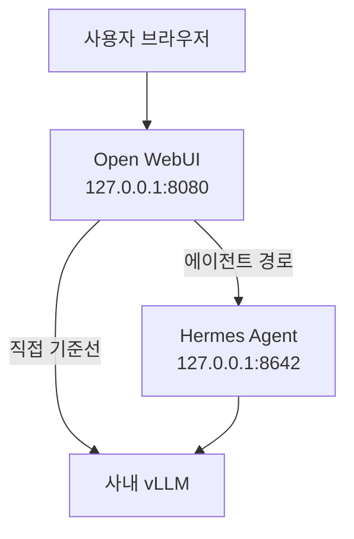

# Team Agent POC

비개발자도 웹 브라우저에서 사내 LLM과 에이전트를 쉽게 사용할 수 있는지 검증하는 POC입니다.

현재는 개인 Windows PC에서 Open WebUI를 먼저 검증하고, 이후 기존 Hermes Agent와 사내 vLLM을 순차적으로 연결합니다.

## 목표 구조



진행 순서는 다음과 같습니다.

1. Open WebUI 단독 기동
2. Open WebUI에서 사내 vLLM 직접 호출
3. Hermes API Server 기동
4. Open WebUI에서 Hermes 연결
5. 사용자 격리와 Tool 안전성 검증
6. 로컬 POC 통과 후 팀 서버에 신규 배포

## 현재 상태

기준일: 2026-09-03

| 항목 | 상태 | 비고 |
|---|---|---|
| 기존 Hermes 설치 | 검증됨 | v0.19.0, 현재 환경 유지 |
| Hermes → 사내 모델 | 검증됨 | CLI 질문·응답 사용자 확인 |
| uv | 검증됨 | v0.12.7 |
| GitHub·PyPI·Hugging Face 접근 | 검증됨 | 프록시 경유 HTTP 200 |
| 로컬 포트 8080·8642 | 검증됨 | 기존 listener 없음 |
| Open WebUI UI·관리자 계정 | 검증됨 | /health 200, 브라우저 접속·최초 계정 생성 완료 |
| Open WebUI → 사내 vLLM | 진행 중 | 승인된 Chat 모델 2종 응답·allowlist 확인, 스트리밍·문맥·반복 검증 남음 |
| Open WebUI → Hermes | 대기 | 직접 vLLM 기준선 통과 후 진행 |
| 사용자 격리 | 대기 | 서버 파일럿 전 2계정 검증 |

## POC 고정 조건

| 항목 | 값 |
|---|---|
| OS | Windows |
| Docker | 사용하지 않음 |
| Open WebUI | 0.11.3 |
| Open WebUI Python | 3.11 |
| Open WebUI 주소 | http://127.0.0.1:8080 |
| Hermes | 기존 0.19.0으로 localhost smoke test |
| 외부 공개 | 금지 |
| Memory·위험 Tool | 초기 POC에서 비활성화 후 검증 |

Open WebUI 직접 연결이 확인될 때까지 정상 동작 중인 Hermes를 재설치하거나 업그레이드하지 않습니다.

## 바로 시작하기

실제 값은 Git에 저장하지 않고 현재 PowerShell 세션에만 설정합니다.

```powershell
$env:CORP_PROXY_URL = "http://<CORPORATE_PROXY_HOST>:<PORT>"
$env:CORP_NO_PROXY = "127.0.0.1,localhost,::1"

.\scripts\start-openwebui.ps1
```

사내 vLLM 호스트를 `CORP_NO_PROXY`에 추가할지는 직접 경로와 프록시 경로를 비교한 뒤 결정합니다. 내부 주소라는 이유만으로 우회 목록에 넣지 않습니다.

다른 PowerShell에서:

```powershell
.\scripts\smoke-test.ps1
```

이미 Open WebUI를 수동으로 실행 중이라면 해당 프로세스를 그대로 유지하고 smoke test만 실행합니다.

## 문서

- [Open WebUI 설치·기동](docs/01-openwebui-install.md)
- [사내 vLLM 직접 연결](docs/02-vllm-direct-test.md)
- [Hermes 연동](docs/03-hermes-integration.md)
- [장애 분리](docs/troubleshooting.md)
- [MVP 검증표](evals/scenarios.md)
- [버전 기록](versions.md)

## 보안 원칙

Private 저장소여도 다음 정보는 커밋하지 않습니다.

- API Key, 비밀번호, 인증 토큰
- 실제 사내 프록시·vLLM 주소와 모델 경로
- 실제 .env, .webui_secret_key
- Open WebUI data 디렉터리와 DB
- 사용자 대화·Memory·첨부파일
- 사용자명·사번이 포함된 로그

문서와 예제에는 다음 placeholder만 사용합니다.

```text
<CORPORATE_PROXY_HOST>
<INTERNAL_VLLM_HOST>
<INTERNAL_VLLM_BASE_URL>
<INTERNAL_MODEL_ID>
<API_KEY>
```

## 서버 이전 원칙

개인 PC는 기능 검증에만 사용합니다. 팀 사용 단계에서는 개인 PC의 포트를 공개하지 않고 별도 서버에 새로 설치합니다. 우선 이전할 대상은 검증된 버전, 스크립트, Hermes 지침·Skill, 테스트 시나리오이며 POC 계정과 대화 데이터는 기본적으로 이전하지 않습니다.
