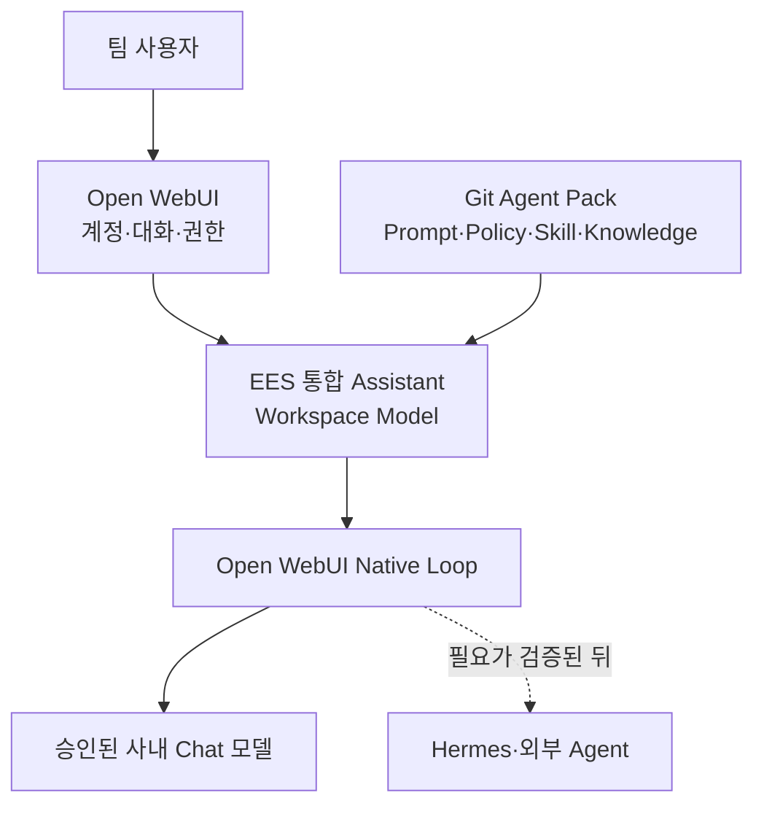
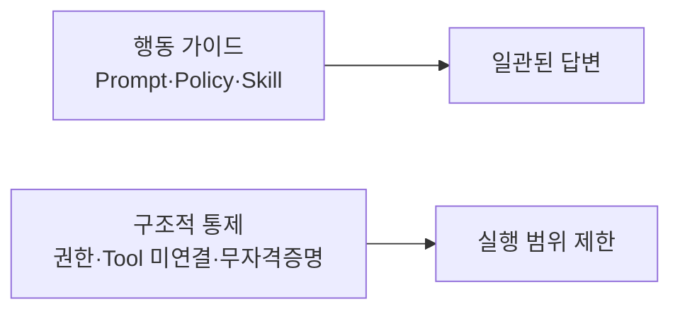

# Team Agent POC

비개발자도 웹 브라우저에서 사내 LLM을 안전하고 일관되게 사용할 수 있는지 검증하는 POC입니다.

현재 우선순위는 **Open WebUI Native 기반 `EES 통합 Assistant`**입니다. 승인된 사내 Chat 모델 위에 공통 System Prompt, Skill, Knowledge와 허용된 Builtin 기능을 묶어 먼저 검증합니다. 여기서 `통합`은 여러 Agent를 자동 라우팅한다는 뜻이 아니라, 공통 정책·업무 절차·지식을 하나의 Workspace Model에 묶는다는 뜻입니다.

Hermes는 필수 경로가 아닙니다. Native 방식으로 부족한 복잡한 다단계 작업이 실제로 확인될 때만 선택적으로 비교합니다.

## 목표 구조



`EES 통합 Assistant`는 별도 학습 모델이나 독립 Agent 서버가 아니라 Open WebUI Workspace Model preset입니다.

## Native MVP 범위

```text
EES 통합 Assistant 1개
├─ 기반 Chat 모델 1개
├─ 공통 System Prompt 1개
├─ Skill 2개
├─ 합성 Knowledge 1개
├─ Native Function Calling
├─ 필요한 최소 Builtin 기능
└─ Memory·Terminal·Code Interpreter·쓰기·DB Tool OFF
```

POC 순서는 다음과 같습니다.

1. Open WebUI 기동과 직접 모델 기준선 확인
2. 합성 Agent Pack 등록
3. `EES 통합 Assistant` 생성
4. Skill 선택·Knowledge 근거·공통 금지정책 검증
5. 재시작·사용자 격리 검증
6. 승인 절차를 마련한 뒤 실제 정책으로 교체
7. Native 한계가 관찰된 경우에만 Hermes 또는 외부 Agent 비교
8. 로컬 POC 통과 후 팀 서버에 신규 배포

Router, A2A, MCP, 자동 동기화와 실제 EMS·APC Agent 연동은 이번 단계에서 만들지 않습니다.

## 현재 상태

기준일: 2026-09-03

| 항목 | 상태 | 비고 |
|---|---|---|
| 기존 Hermes 설치 | 검증됨 | v0.19.0, 현재 환경 유지 |
| Hermes → 사내 모델 | 검증됨 | CLI 질문·응답 사용자 확인 |
| uv | 검증됨 | v0.12.7 |
| GitHub·PyPI·Hugging Face 접근 | 검증됨 | 프록시 경유 HTTP 200 |
| Open WebUI UI·관리자 계정 | 검증됨 | `/health` 200, 브라우저 접속·최초 계정 생성 완료 |
| Open WebUI → 사내 vLLM | 부분 검증 | 승인된 Chat 모델 2종 응답·allowlist 확인 |
| Native Builtin Tool | 관찰됨 | `search_chats`·`view_chat` 사용 확인 |
| Agent Pack 템플릿 | 등록됨 | Skill 2개와 `EES POC Policy` 합성 문서 첨부 확인 |
| EES 통합 Assistant | 다음 단계 | 아직 Open WebUI에 생성·평가하지 않음 |
| 사용자 격리 | 대기 | 서버 파일럿 전 2계정 검증 |
| Hermes 연결 비교 | 보류·선택 | Native 부족이 확인된 경우에만 수행 |

## POC 고정 조건

| 항목 | 값 |
|---|---|
| OS | Windows |
| Docker | 사용하지 않음 |
| Open WebUI | 0.11.3 |
| Open WebUI Python | 3.11 |
| Open WebUI 주소 | http://127.0.0.1:8080 |
| 표시 이름 | `EES Assistant (Open WebUI)` |
| 기반 모델 | 승인된 사내 Chat 모델 1개 |
| 외부 공개 | 금지 |
| 개인 Memory·위험 Tool | 초기 POC에서 비활성화 |
| 실제 사내 정책·업무 데이터 | 승인 절차 전 등록 금지 |

정상 동작 중인 Hermes를 재설치하거나 업그레이드하지 않습니다. Native MVP의 실패 사례가 생기기 전에는 Hermes 연동을 진행하지 않습니다.

## 바로 시작하기

실제 값은 Git에 저장하지 않고 현재 PowerShell 세션에만 설정합니다.

```powershell
$env:CORP_PROXY_URL = "http://<CORPORATE_PROXY_HOST>:<PORT>"
$env:CORP_NO_PROXY = "127.0.0.1,localhost,::1"

.\scripts\start-openwebui.ps1
```

사내 vLLM 호스트를 `CORP_NO_PROXY`에 추가할지는 직접 경로와 프록시 경로를 비교한 뒤 결정합니다. 내부 주소라는 이유만으로 우회 목록에 넣지 않습니다.

다른 PowerShell에서:

```powershell
.\scripts\smoke-test.ps1
```

이미 Open WebUI를 수동으로 실행 중이라면 해당 프로세스를 그대로 유지하고 smoke test만 실행합니다.

## 문서

- [Open WebUI 설치·기동](docs/01-openwebui-install.md)
- [사내 vLLM 직접 연결](docs/02-vllm-direct-test.md)
- [Open WebUI Native 통합 Assistant](docs/03-openwebui-native-agent.md)
- [Agent Pack 템플릿](agent-pack/README.md)
- [선택적 Hermes 비교](docs/03-hermes-integration.md)
- [장애 분리](docs/troubleshooting.md)
- [MVP 검증표](evals/scenarios.md)
- [버전 기록](versions.md)

## 정책 적용 원칙



System Prompt·Policy·Skill은 모델의 행동을 유도하지만 보안 경계가 아닙니다. 예를 들어 운영 DB 직접 접근 금지는 다음을 함께 적용합니다.

- 공통 Prompt와 Policy에 금지 원칙 명시
- DB Tool을 Assistant에 연결하지 않음
- 운영 DB 자격증명을 제공하지 않음
- 필요한 경우에만 중앙 승인된 읽기 전용 API 또는 Query Broker 연결
- 답변과 실제 Tool 호출 이력을 함께 평가

## 모델 선택기 원칙

POC에서는 비교를 위해 기반 모델을 계속 표시해도 됩니다. 파일럿에서 일반 사용자에게 `EES 통합 Assistant`만 보이게 하려면 기반 모델 접근권한은 유지한 채 필요하면 UI에서 숨깁니다. Workspace Model 사용자는 기반 모델에도 접근할 수 있어야 하므로 권한을 제거하면 동작하지 않을 수 있습니다. `Hide`는 UI 정리이며 보안 통제가 아닙니다.

## 보안 원칙

Private 저장소여도 다음 정보는 커밋하지 않습니다.

- API Key, 비밀번호, 인증 토큰
- 실제 사내 프록시·vLLM 주소와 모델 경로
- 실제 `.env`, `.webui_secret_key`
- Open WebUI data 디렉터리와 DB
- 사용자 대화·Memory·첨부파일
- 사용자명·사번이 포함된 로그
- 승인 전 실제 사내 정책·업무 데이터

문서와 예제에는 다음 placeholder만 사용합니다.

```text
<CORPORATE_PROXY_HOST>
<INTERNAL_VLLM_HOST>
<INTERNAL_VLLM_BASE_URL>
<APPROVED_CHAT_MODEL_ID>
<API_KEY>
```

## 서버 이전 원칙

개인 PC는 기능 검증에만 사용합니다. 팀 사용 단계에서는 개인 PC의 포트를 공개하지 않고 별도 서버에 새로 설치합니다. 우선 이전할 대상은 검증된 버전, 실행 스크립트, Prompt·Policy·Skill·Knowledge 원본과 평가 시나리오입니다. POC 계정과 대화 데이터는 기본적으로 이전하지 않습니다.