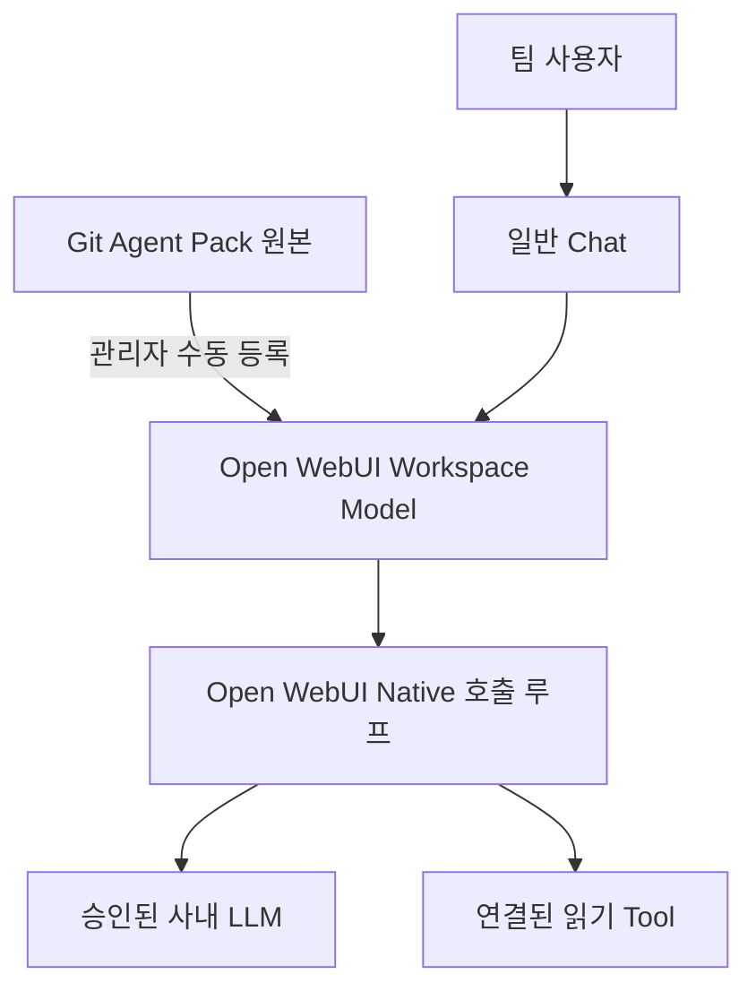

# Team Agent POC

비개발자가 EES Portal의 Chat UI에서 사내 문서와 업무 시스템을 활용하고, 관리자가 정한 공통 정책과 업무 처리 절차를 적용받는 플랫폼 POC입니다. 범용 대화·업무용 Prompt/Skill 공유를 유지하며 Open WebUI Native를 활용합니다. **공식 Open WebUI 패키지와 우리 프로젝트 래퍼** 두 구성으로 관리하며, 이 저장소는 사내 설정·Agent Pack과 Open WebUI 수정사항·빌드/적용 절차를 관리합니다. 기존 Python·호환 의존성을 재사용하고 데이터·키는 프로그램 변경과 분리합니다. [단순 유지보수 기준](docs/03-openwebui-native-agent.md#ees-wrapper-maintenance)과 실제 구현·적용 상태는 [STATUS](docs/STATUS.md)를 따릅니다.

## 프로젝트 목표

| 목표 | 사용자에게 제공할 가치 |
|---|---|
| 1. 쉬운 Chat UI | 비개발자가 브라우저에서 자연어로 질문하고 대화 맥락을 이어갈 수 있음 |
| 2. 문서 시스템 연동 | 문서 검색·본문 조회·근거 확인을 대화 안에서 수행함 |
| 3. 관리자 공통 정책 | EES Assistant 사용 시 담당자가 관리하는 공통 원칙을 적용받음 |
| 4. 관리자 워크플로 | 업무별 처리 단계·분기·확인 절차와 필요한 도구/모델 선택을 관리자가 정해 적용함 |
| 5. 레거시 시스템 연동 | EMS/APC/FDC 등의 승인된 업무 기능을 연결해 실제 데이터를 활용함 |
| 6. 레거시의 간접 UI | 연결된 기능을 조건 입력·결과 선택·필터·비교 등 대화와 업무 화면으로 쉽게 사용함 |

공통 정책의 적용 범위는 **EES Assistant를 사용하는 대화**이며 개인 모델·개인 Assistant로 확대하지 않습니다. 워크플로는 관리자가 정하는 업무 절차라는 목표이고, Hook·동적 워크플로·오케스트레이션은 필요에 따라 선택할 구현 수단입니다. 현재 Native 호출 루프나 공유 Skill만으로 관리자가 실행 순서를 제어하는 워크플로가 완성됐다고 보지 않습니다.

목표 번호는 제품의 구성 요소이며 구현 순서는 [현재 계획](docs/STATUS.md#delivery-plan)에서 관리합니다. 레거시 연결은 작은 읽기 기능부터 시작하고 해당 업무의 간접 UI를 함께 완성합니다. 필요한 기능 화면과 시각 디자인 튜닝·첫 화면/온보딩은 구분합니다. 정책·워크플로의 배치와 확장 판단은 [Native 가이드](docs/03-openwebui-native-agent.md#managed-policy-workflow)를 따릅니다.

## 어디부터 읽나

- **개발을 이어갈 GPT**: [AGENTS.md](AGENTS.md) → [현재 상태](docs/STATUS.md) → 해당 기능 파일과 테스트.
- **설치·운영할 사람**: [환경 기준](versions.md) → [설치·기동](docs/01-openwebui-install.md) → 해당 연동 가이드.
- **팀원 안내 초안**: [EES Portal 시작 안내](docs/07-team-quickstart.md) — 팀 시연용 준비본. 실제 전달 상태는 STATUS에서 확인.
- **준비·배포·검증 여부 확인**: [STATUS](docs/STATUS.md)의 요약과 연결된 [평가표](evals/scenarios.md)를 확인합니다. README에는 진행 상태를 복제하지 않습니다.

매번 시작 문구를 입력하는 대신 아래의 일회성 프로젝트 지침을 사용합니다. 현재 상태는 대화 기억이 아니라 저장소에서 확인합니다.

## GPT 프로젝트 최초 설정

1. ChatGPT에서 이 개발 작업을 이어갈 프로젝트를 만들거나 기존 프로젝트를 엽니다. 예: `EES Assistant POC`.
2. 해당 프로젝트의 **지침 / Instructions**에 아래 내용을 저장합니다. 메뉴 이름은 사용하는 앱에 따라 다를 수 있습니다.
3. 그 프로젝트 안에서 개발 대화를 시작하고, GitHub 연결이 `knadalkim-a11y/team-agent-poc`에 접근 가능한지 확인합니다. PAT를 지침이나 채팅에 넣지 않습니다.

```text
이 프로젝트의 개발 원본은 GitHub knadalkim-a11y/team-agent-poc이다.
개발 작업 시작 시 요청 대상 브랜치(미지정 시 main)의 최신 커밋을 확인하고,
그 커밋의 AGENTS.md와 docs/STATUS.md를 읽어 작업 범위·검증·문서 관리·종료 규칙을 따른다.
그다음 이번 요청에 필요한 파일만 읽고, 기존 사용자 변경을 보존한다.
저장소 접근이나 검사 실행이 불가능하면 추정해서 완료 처리하지 말고 제한을 알린다.
```

관련 열린 PR을 확인하는 세부 시작 규칙은 [AGENTS.md](AGENTS.md#1-세션-시작)에서 관리합니다. 위 지침을 이미 저장했다면 같은 문구를 다시 입력할 필요는 없습니다. 변경된 규칙이 요청 대상 브랜치에 반영되면 해당 파일을 읽을 때 적용하며, 미병합 PR을 이어갈 때는 PR 번호나 브랜치를 지정하면 됩니다.

프로젝트 지침은 그 프로젝트의 대화에 공유되지만, 연결하지 않은 저장소 접근을 새로 부여하지는 않습니다. 설정 후 새 프로젝트 대화에서 한 번만 읽은 커밋·현재 다음 작업을 확인하면 연결 여부를 점검할 수 있습니다. 사용자가 이 설정을 저장했는지는 별도 확인 전까지 완료로 기록하지 않습니다. [OpenAI 프로젝트 안내](https://learn.chatgpt.com/docs/projects)

로컬 저장소 폴더에서 실행하는 Codex의 `AGENTS.md` 자동 탐색과, GitHub 연결만 사용하는 대화는 구분합니다. 이 저장소에 파일이 있다는 사실만으로 모든 대화가 자동으로 읽는다고 가정하지 않습니다. [OpenAI AGENTS 안내](https://learn.chatgpt.com/docs/agent-configuration/agents-md)

## 저장소 지도

| 경로 | 책임 |
|---|---|
| [AGENTS.md](AGENTS.md) | 이 프로젝트를 개발하는 GPT의 작업 규칙 |
| [docs/STATUS.md](docs/STATUS.md) | 현재 목표·다음 작업·미해결·Git 준비와 WebUI 적용 상태 |
| [agent-pack/](agent-pack/README.md) | 서비스 Assistant에 배포할 Prompt·정책·Skill·합성 Knowledge 원본 |
| [agent-pack/skills/confluence-read/](agent-pack/skills/confluence-read/) | 기능 단위 묶음: 지침과 실행 코드를 함께 관리 |
| [scripts/](scripts/) | 개발·운영자의 시작·점검·배포물 생성 스크립트 |
| [branding/ees/](branding/ees/) | EES 이름·아이콘 배포 자산; [빌드·배포 안내](docs/03-openwebui-native-agent.md#release-delivery) |
| [config/](config/) | 비밀값 없는 설정 예제 |
| [tests/](tests/) | 자동 실행하는 검증 코드 |
| [evals/](evals/) | 합격 기준·실환경 판정·날짜별 검증 증거 |
| [docs/](docs/) | 설치·연동·장애 대응 방법 |
| [versions.md](versions.md) | 의존 버전·환경 기준 |
| [CHANGELOG.md](CHANGELOG.md) | 완료된 변경과 과거 관찰·결정 |

폴더 상세는 `rg --files`로 확인합니다. 파일 목록을 별도 문서에 계속 복사하지 않습니다. 기능에 필요한 참고자료가 생기면 해당 Skill 아래에 `references/`를 추가하되 빈 디렉터리는 미리 만들지 않습니다.

## 실행 구조와 관리 원본

`EES 통합 Assistant`는 별도 학습 모델이나 독립 Agent 서버가 아니라 Open WebUI의 Workspace Model preset입니다. 여기서 “통합”은 공통 지침·Skill·Knowledge·허용 Tool을 묶는 뜻이며, 여러 Agent의 자동 라우팅을 의미하지 않습니다.



- `AGENTS.md`는 **코딩하는 GPT**의 지침이고, `agent-pack/`은 **담당자가 관리하는 공통 배포 자산**의 원본입니다.
- Git의 Skill 지침과 Python Tool은 Open WebUI에서 서로 다른 항목으로 등록합니다. 폴더 전체가 자동 설치되는 구조는 아닙니다.
- Git 커밋 완료는 WebUI 반영 완료가 아닙니다. 실제 적용한 원본 커밋과 검증 증거는 STATUS에서 추적합니다.
- Skill·Prompt의 금지 지침은 보안 경계가 아닙니다. 실행 가능한 범위는 Tool 내부 검사·권한·자격증명·네트워크 구성에서 제한합니다.

### 원본과 배포본

팀원이 만든 개인·공유 프롬프트와 Skill은 허용된 생성·공유·수정 권한 안에서 WebUI에서 관리합니다. 공유할 때마다 담당자의 채택이나 Git 반영을 거칠 필요는 없습니다. 담당자가 팀 공통 배포 대상으로 채택한 항목만 검토한 버전을 Git에 보관하고, 이후에는 Git에서 변경을 관리해 WebUI에 수동 반영합니다.

사용자 작성물은 WebUI 실행 데이터와 함께 승인된 내부 백업으로 보존하는 운영 방침이며, 모든 작성물을 Git에 수집하지 않습니다. 이는 실제 사용자 권한 설정·공유 시험·백업이 완료됐다는 뜻이 아니며 자동 동기화도 구성하지 않았습니다. 실제 적용 상태는 [STATUS](docs/STATUS.md)에서 확인합니다.

| 대상 | 관리 원본 | WebUI 반영·보존 위치 |
|---|---|---|
| Assistant 기본 지시 | `agent-pack/system-prompts/` | Workspace Model의 System Prompt |
| 업무 공통 정책 | `agent-pack/policies/` | 검토 후 Prompt·Tool 구성에 반영; 자동 적용 아님 |
| 공통 배포 Skill 절차 | `agent-pack/skills/*/SKILL.md` | Workspace Skills |
| 실행 코드 | 해당 Skill의 `scripts/` | Workspace Tools |
| 합성 지식 | `agent-pack/knowledge/` | Workspace Knowledge |
| 팀원 개인·공유 프롬프트와 Skill | 승인된 실행 환경의 WebUI | Workspace Prompts·Skills; 내부 백업 대상 |
| 실제 PAT·DB·대화 | 승인된 실행 환경 | Git에 저장하지 않음 |

## 설치·검증 안내

| 할 일 | 안내 |
|---|---|
| Open WebUI 설치·시작 | [01-openwebui-install](docs/01-openwebui-install.md) |
| 기존 Windows PC로 팀 파일럿 시작 | [접속·계정·공유 범위 준비](docs/01-openwebui-install.md#local-pc-pilot) |
| 사내 Chat 모델 연결 | [02-vllm-direct-test](docs/02-vllm-direct-test.md) |
| 기본 Assistant 구성 | [03-openwebui-native-agent](docs/03-openwebui-native-agent.md) |
| 초기 Rich UI 제거·일반 답변으로 전환 | [기존 Tool·Prompt 갱신](docs/03-openwebui-native-agent.md#plain-output-update) |
| 수정·배포·원복 방식 | [배포 단위와 운영 명령](docs/03-openwebui-native-agent.md#release-delivery) |
| 사내 명령 한 번으로 프로그램·래퍼 업데이트 | [Upgrade 최초 준비·실행·실패 시 확인](docs/03-openwebui-native-agent.md#ees-wrapper-upgrade) |
| 팀 시연용 첫 화면 적용 준비 | [소개 문구·예시 질문 초안](docs/03-openwebui-native-agent.md#first-use-entry) |
| Confluence Skill·Tool 등록 | [04-confluence-read-tool](docs/04-confluence-read-tool.md) |
| Jira 읽기·프로젝트별 현황 | [05-jira-read-tool](docs/05-jira-read-tool.md) |
| GitHub Enterprise PR 읽기 | [06-github-read-tool](docs/06-github-read-tool.md) |
| 오류 원인 분리 | [troubleshooting](docs/troubleshooting.md) |
| 합격 기준·실환경 기록 | [evals/scenarios](evals/scenarios.md) |
| Confluence 사외 시험 증거 | [evals/confluence-offline](evals/confluence-offline.md) |
| Jira 사외 시험 증거 | [evals/jira-offline](evals/jira-offline.md) |
| 필요 시 Hermes 비교 | [03-hermes-integration](docs/03-hermes-integration.md) |

## 문서가 쌓이지 않게 유지하는 방법

개발하는 GPT가 [AGENTS.md](AGENTS.md)의 종료 절차에 따라 관련 문서를 갱신하고, [문서 점검기](scripts/check_docs.py)를 실행합니다. GPT가 검사를 실행할 수 있는 작업 환경에서는 사용자가 매번 별도로 정리를 요청하거나 사내 PC에서 실행할 필요는 없습니다. 직접 확인하려면 저장소 루트에서 실행합니다.

```powershell
python scripts/check_docs.py
# 다른 저장소 경로나 JSON 출력이 필요한 경우
python scripts/check_docs.py --root . --json
```

| 구분 | 점검 내용과 처리 |
|---|---|
| 오류 | 존재하지 않는 내부 링크·Markdown 앵커·명시적 참조 정의, 저장소 밖 경로, 읽기 실패 등을 수정 |
| 검토 후보 | README·AGENTS·SKILL 진입점에서 링크로 도달하지 못하는 루트·docs·evals 문서; 유지 또는 연결 보완 여부 검토 |
| GPT 검토 | 이번 기능 변경과 설명의 일치, 중복 원본, 더 이상 맞지 않는 절차를 관련 문서에서 확인 |
| 보존 | 과거 검증 증거와 실행용 Skill·참고자료를 참조 수나 날짜만으로 삭제하지 않음 |

- 점검기는 읽기 전용·오프라인이며 파일 수정·삭제·보고서 파일 생성을 하지 않습니다. 오류는 종료 코드 `1`, 경고만 있거나 정상이면 `0`, 잘못된 CLI 인자는 `2`입니다.
- Python 표준 라이브러리만 필요합니다. 일반 인라인·참조 링크, ATX/setext 제목·HTML id를 검사하지만 전체 CommonMark 렌더러는 아닙니다. 코드 블록·주석·외부 URL은 검사하지 않으며, 여러 줄에 걸친 링크·깊게 들여쓴 목록·복잡하거나 미완성인 문법은 수동 확인 대상입니다.
- `.git`·가상환경·`node_modules`·`data`·`runtime`·`logs` 등 코드의 `IGNORED_DIRS`에 정한 폴더와 심볼릭 링크·경로가 재지정되는 항목을 스캔하지 않습니다. `.gitignore` 규칙을 해석하는 방식은 아니며, 개별 문서는 1 MiB까지 읽습니다.
- 링크가 살아 있어도 내용이 오래됐을 수 있고, 링크가 없어도 필요한 문서일 수 있습니다. 점검 통과는 문서 전체가 최신이라는 보장이 아닙니다.
- 현재는 GPT 종료 규칙과 검사 명령까지 제공합니다. 모든 커밋을 차단하는 필수 CI나 자동 삭제·정기 실행은 구성하지 않았습니다.

## 범위와 안전 경계

기존 Windows PC의 Docker 없는 Open WebUI를 유지하고, 팀원이 브라우저로 접속하는 소규모 파일럿부터 진행합니다. 별도 서버 이전은 가용성·사용량 등 운영 필요가 확인될 때 검토합니다. 정확한 버전은 [환경 기준](versions.md), 접속·공유 절차는 [기존 PC 파일럿 안내](docs/01-openwebui-install.md#local-pc-pilot), 현재 상태는 [STATUS](docs/STATUS.md)에서 확인합니다. 별도 Tool Server·Router·A2A·자동 동기화는 실제 필요가 확인되고 범위가 승인된 뒤에만 추가합니다.

- 운영 DB 직접 연결, DB 자격증명, 범용 SQL·Shell·쓰기 도구는 이 POC에 제공하지 않습니다.
- 승인된 읽기 전용 API 또는 Query Broker를 연결할 때에도 도구·권한·네트워크 수준의 검증이 필요합니다.
- 실제 사내 주소·PAT·API Key·개인정보·사용자 DB·대화·키 파일은 Git에 올리지 않습니다. 설정 예제는 placeholder만 사용합니다.
- 기존 PC의 DB·키·계정·버전을 유지하며, 파일럿에 필요한 접속 범위와 일반 사용자 권한을 설정합니다. 개인 환경의 저장 검사 결과가 팀원의 접속 경로·전송 보호·사용자 격리를 대신하지는 않습니다. 추후 다른 서버로 사용자 데이터를 옮기는 작업은 별도 범위로 정합니다.
- 모델 선택기의 숨김은 UI 정리입니다. 리소스 권한과 사용자 격리는 별도로 검증합니다.
