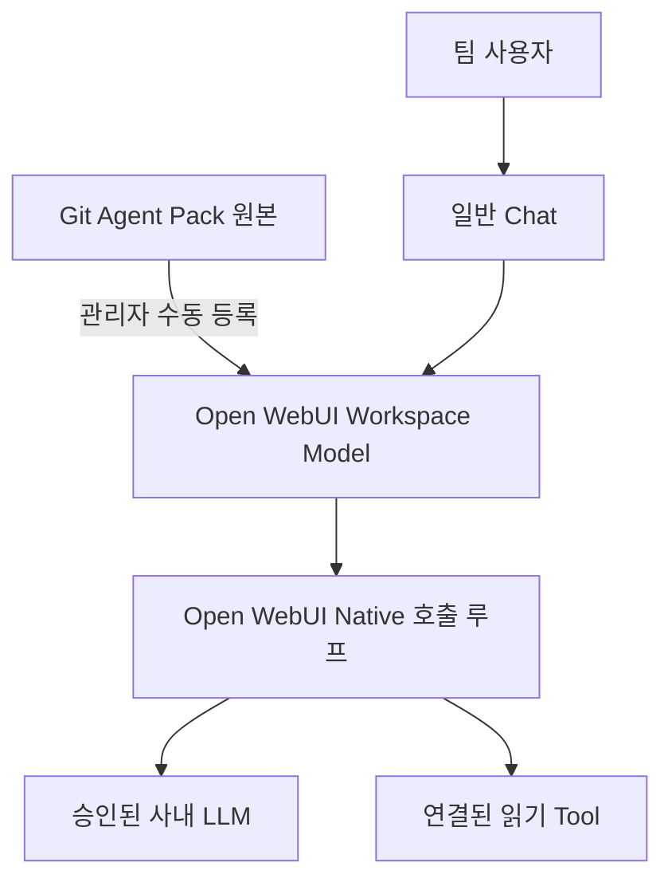

# Team Agent POC

비개발자도 웹 브라우저에서 사내 LLM과 팀 지침·조회 기능을 사용할 수 있도록 Open WebUI 위에 구성하는 POC입니다. Open WebUI 원본은 수정하지 않고, 배포할 Agent Pack과 실행·검증 절차를 이 저장소에서 관리합니다.

## 어디부터 읽나

- **개발을 이어갈 GPT**: [AGENTS.md](AGENTS.md) → [현재 상태](docs/STATUS.md) → 해당 기능 파일과 테스트.
- **설치·운영할 사람**: [환경 기준](versions.md) → [설치·기동](docs/01-openwebui-install.md) → 해당 연동 가이드.
- **준비·배포·검증 여부 확인**: [STATUS](docs/STATUS.md)의 요약과 연결된 [평가표](evals/scenarios.md)를 확인합니다. README에는 진행 상태를 복제하지 않습니다.

새 GPT 세션에는 “AGENTS.md와 docs/STATUS.md를 읽고 다음 작업을 이어가 줘”라고 요청합니다. 대화 기억이나 파일 자동 읽기를 전제로 하지 않습니다.

## 저장소 지도

| 경로 | 책임 |
|---|---|
| [AGENTS.md](AGENTS.md) | 이 프로젝트를 개발하는 GPT의 작업 규칙 |
| [docs/STATUS.md](docs/STATUS.md) | 현재 목표·다음 작업·미해결·Git 준비와 WebUI 적용 상태 |
| [agent-pack/](agent-pack/README.md) | 서비스 Assistant에 배포할 Prompt·정책·Skill·합성 Knowledge 원본 |
| [agent-pack/skills/confluence-read/](agent-pack/skills/confluence-read/) | 기능 단위 묶음: 지침과 실행 코드를 함께 관리 |
| [scripts/](scripts/) | 개발·운영자가 실행하는 시작·점검 스크립트 |
| [config/](config/) | 비밀값 없는 설정 예제 |
| [tests/](tests/) | 자동 실행하는 검증 코드 |
| [evals/](evals/) | 합격 기준·실환경 판정·날짜별 검증 증거 |
| [docs/](docs/) | 설치·연동·장애 대응 방법 |
| [versions.md](versions.md) | 의존 버전·환경 기준 |
| [CHANGELOG.md](CHANGELOG.md) | 완료된 변경과 과거 관찰·결정 |

폴더 상세는 `rg --files`로 확인합니다. 파일 목록을 별도 문서에 계속 복사하지 않습니다. 기능에 필요한 참고자료가 생기면 해당 Skill 아래에 `references/`를 추가하되 빈 디렉터리는 미리 만들지 않습니다.

## 실행 구조와 관리 원본

`EES 통합 Assistant`는 별도 학습 모델이나 독립 Agent 서버가 아니라 Open WebUI의 Workspace Model preset입니다. 여기서 “통합”은 공통 지침·Skill·Knowledge·허용 Tool을 묶는 뜻이며, 여러 Agent의 자동 라우팅을 의미하지 않습니다.

- `AGENTS.md`는 **코딩하는 GPT**의 지침이고, `agent-pack/`은 **팀 사용자가 쓰는 Assistant**의 동작 원본입니다.
- Git의 Skill 지침과 Python Tool은 Open WebUI에서 서로 다른 항목으로 등록합니다. 폴더 전체가 자동 설치되는 구조는 아닙니다.
- Git 커밋 완료는 WebUI 반영 완료가 아닙니다. 실제 적용한 원본 커밋과 검증 증거는 STATUS에서 추적합니다.
- Skill·Prompt의 금지 지침은 보안 경계가 아닙니다. 실행 가능한 범위는 Tool 내부 검사·권한·자격증명·네트워크 구성에서 제한합니다.

### 원본과 배포본

| 대상 | 관리 원본 | 배포 위치 |
|---|---|---|
| Assistant 기본 지시 | `agent-pack/system-prompts/` | Workspace Model의 System Prompt |
| 업무 공통 정책 | `agent-pack/policies/` | 검토 후 Prompt·Tool 구성에 반영; 자동 적용 아님 |
| Skill 절차 | `agent-pack/skills/*/SKILL.md` | Workspace Skills |
| 실행 코드 | 해당 Skill의 `scripts/` | Workspace Tools |
| 합성 지식 | `agent-pack/knowledge/` | Workspace Knowledge |
| 실제 PAT·DB·대화 | 승인된 실행 환경 | Git에 저장하지 않음 |

## 설치·검증 안내

| 할 일 | 안내 |
|---|---|
| Open WebUI 설치·시작 | [01-openwebui-install](docs/01-openwebui-install.md) |
| 사내 Chat 모델 연결 | [02-vllm-direct-test](docs/02-vllm-direct-test.md) |
| 기본 Assistant 구성 | [03-openwebui-native-agent](docs/03-openwebui-native-agent.md) |
| Confluence Skill·Tool 등록 | [04-confluence-read-tool](docs/04-confluence-read-tool.md) |
| 오류 원인 분리 | [troubleshooting](docs/troubleshooting.md) |
| 합격 기준·실환경 기록 | [evals/scenarios](evals/scenarios.md) |
| Confluence 사외 시험 증거 | [evals/confluence-offline](evals/confluence-offline.md) |
| 필요 시 Hermes 비교 | [03-hermes-integration](docs/03-hermes-integration.md) |

## 범위와 안전 경계

개인 Windows PC에서 Docker 없이 검증한 뒤 승인된 팀 서버에 새로 배포하는 방식입니다. 정확한 버전은 [환경 기준](versions.md), 현재 진행 순서와 보류 항목은 [STATUS](docs/STATUS.md)에서 확인합니다. 별도 Tool Server·Router·A2A·자동 동기화는 실제 필요가 확인되고 범위가 승인된 뒤에만 추가합니다.

- 운영 DB 직접 연결, DB 자격증명, 범용 SQL·Shell·쓰기 도구는 이 POC에 제공하지 않습니다.
- 승인된 읽기 전용 API 또는 Query Broker를 연결할 때에도 도구·권한·네트워크 수준의 검증이 필요합니다.
- 실제 사내 주소·PAT·API Key·개인정보·사용자 DB·대화·키 파일은 Git에 올리지 않습니다. 설정 예제는 placeholder만 사용합니다.
- 개인 PC의 포트를 팀에 공개하는 방식으로 이전하지 않습니다. 서버 배포 시 사용자 데이터의 이전은 별도 승인 대상으로 둡니다.
- 모델 선택기의 숨김은 UI 정리입니다. 리소스 권한과 사용자 격리는 별도로 검증합니다.
