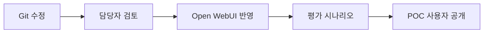

# EES Agent Pack (POC)

Open WebUI의 `EES 통합 Assistant`에 등록할 Git 관리 원본입니다. 현재 파일은 모두 안전한 합성 POC 템플릿이며 공식 사내 정책이 아닙니다.

이 폴더는 담당자가 관리하는 공통 배포 자산의 원본입니다. 팀원 작성물과의 구분은 [관리 경계](../README.md#원본과-배포본)를 따릅니다. 프로젝트를 코딩하는 GPT의 규칙은 [AGENTS.md](../AGENTS.md), Git 준비·WebUI 반영·다음 작업은 [STATUS](../docs/STATUS.md)를 확인합니다. 아래 파일 목록은 Git 원본이며 실제 배포 상태표가 아닙니다.

| 원본 | Open WebUI 반영 위치 |
|---|---|
| [ees-demo.json](ees-demo.json) | ApplyDemo가 관리할 전문 모델 3개·분석 Tool 2개·EES 관리 구역과 시작 질문, 이미 연결된 지원 WO Tool의 갱신 목록 |
| `ees-prompt-suggestions.json` | 팀 시연용 예시 질문 4개; [기존 모델에 적용](../docs/03-openwebui-native-agent.md#first-use-entry) |
| `system-prompts/*.md` | Workspace Model의 System Prompt |
| `policies/*.md` | 공통 규칙의 검토·관리 원본 |
| `knowledge/*.md` | Workspace Knowledge |
| `skills/*/SKILL.md` | Workspace Skills |
| `skills/confluence-read/scripts/confluence_tool.py` | Workspace Tools; 별도 등록 후 Assistant에 연결 |
| `skills/jira-read/scripts/jira_tool.py` | Workspace Tools; 프로젝트 집계·이슈 목록·본문 읽기 |
| `skills/github-read/scripts/github_tool.py` | Workspace Tools; GHES의 개인 PAT 기반 PR 목록·본문 읽기 |
| [cross-system-analysis/scripts/specialists_tool.py](skills/cross-system-analysis/scripts/specialists_tool.py) | `ees_specialists`: 실행 계획·공개 판단 요약, 전문 역량 조회·선택 실행·근거 반환 |
| [cross-system-analysis/scripts/demo_data_tool.py](skills/cross-system-analysis/scripts/demo_data_tool.py) | `ees_demo_data`: 담당 시스템 합성 자료 조회·EES 조건별 비교 |
| [cross-system-analysis/ui/work-panel.js](skills/cross-system-analysis/ui/work-panel.js) | 공통 업무 패널 버튼·화면 전환. 등록 Tool에 포함하며 별도 UI 설치 없음 |

Confluence 묶음은 **Skill 지침 + 실행 코드**를 함께 관리하는 예시입니다. Open WebUI가 폴더를 자동 설치·실행하지는 않습니다. [설치 안내](../docs/04-confluence-read-tool.md)에 따라 두 항목을 등록합니다. 코드 기본값은 비활성화이며 실제 준비·배포 상태는 [STATUS](../docs/STATUS.md), 실환경 판정은 [평가표](../evals/scenarios.md#confluence-live)에만 기록합니다.

Jira는 작은 고정 조회 흐름으로 시작하며 별도 Skill을 추가하지 않습니다. 기존 System Prompt의 조건부 조회 안내와 함수 설명을 사용하고 [Jira 안내](../docs/05-jira-read-tool.md)에 따라 Python Tool만 추가합니다. 세 읽기 Tool은 JSON 결과를 반환하고 Assistant가 일반 문장·표·원문 링크로 답합니다. 확인한 인증·적용 원본은 STATUS에서 관리하며 다른 환경으로 옮길 때 필요한 조건만 확인합니다.

GitHub도 별도 Skill 없이 조건부 Prompt·작은 함수 설명과 기존 채팅 표로 시작합니다. [GitHub 안내](../docs/06-github-read-tool.md)에 따라 도구를 등록하고 새 개인 입력칸의 저장을 확인합니다. PR 목록·본문만 읽으며 GitHub.com의 개발용 연결과 사내 GHES 연결은 별개입니다.

대화 시작 예시와 팀원용 안내는 **팀 시연용 준비본**이며 실제 UI 저장·전달은 STATUS에서 확인합니다. Assistant의 역할 범위를 고정하지 않습니다. 대화 시작 예시는 기존 모델의 화면용 메타데이터입니다. 새 Skill·Tool이나 모델 전체 가져오기 파일이 아니며 System Prompt를 교체하지 않습니다. 질문 버튼은 클릭 즉시 전송될 수 있으므로 실제로 보낼 수 있는 문장으로 작성하고 부족한 대상은 대화에서 확인합니다. [팀원용 시작 안내](../docs/07-team-quickstart.md)는 사용자가 읽는 문서이고 개발·평가 이력을 포함하지 않습니다.

## 변경 절차

초기 확인용 Rich UI와 합성 HTML 예제는 제거했습니다. 기존 설치에는 [일반 답변으로 전환하는 절차](../docs/03-openwebui-native-agent.md#plain-output-update)로 Tool 코드와 공통 Prompt만 반영합니다. 과거 화면 검증 증거는 [기존 기록](../evals/scenarios.md#rich-ui-tools-saved)에 보존합니다. 이후 필요한 화면은 업무 흐름별로 새로 설계합니다.

기존 공통 자산은 해당 가이드에 따라 수동 반영하고, 교차 분석 시연 목록은 `ApplyDemo`로 일괄 적용합니다. [배포 단위·원복 기준](../docs/03-openwebui-native-agent.md#release-delivery)을 따르며 프로그램 산출물은 Agent Pack과 별도로 관리합니다. 모든 개인·공유 자산을 동기화하는 기능은 포함하지 않습니다.

교차 분석 시연 자산과 `ApplyDemo`의 구현 준비본은 [최초 연결·실행 안내](../docs/03-openwebui-native-agent.md#demo-assets-deployment)를 따릅니다. 기존 EES의 기반 LLM을 재사용해 EMS/APC/FDC를 등록하고 도구·지침·시작 질문을 연결합니다. EES ID·사용자 추가 지침·기존 연결·개인 PAT를 보존하며 별도 Skill을 등록하지 않습니다. 기존 서버를 켠 채 실행하고 이후 새 대화에서 sample_a/sample_b 탐색과 EMS 단독 분석을 확인합니다. 사외 합성 검사와 사내 API 적용·모델 분석 결과는 구분해 STATUS에 기록합니다.

이 변경 절차와 공통 정책의 변경 관리 규칙은 이 폴더에서 관리하는 공통 배포 자산에 적용합니다. 변경은 Git 원본에서 검토한 뒤 반영하며, 해당 배포본을 UI에서 먼저 수정했다면 검토 후 Git 원본과 일치시킵니다. ApplyDemo의 관리 구역을 현장에서 수정한 경우에는 다음 적용이 충돌로 중단하므로 관리 구역 밖의 사용자 지침과 구분합니다. STATUS에는 실제 반영한 원본 커밋과 검증 증거를 남기며, 모르는 적용 버전은 미확인으로 둡니다. Skill 내부 `scripts/`는 기능 실행 코드이고, 저장소 최상위 `scripts/`는 개발·운영자용 실행 스크립트입니다.

## 금지 사항

- 실제 API Key·사내 URL·모델 ID·자격증명 커밋
- 실제 사용자 대화나 개인 정보 커밋
- 승인 전 실제 사내 정책을 POC 템플릿에 혼합
- Prompt만으로 운영 DB 접근 금지가 강제된다고 간주

실제 운영 DB Tool과 자격증명을 연결하지 않는 것이 현재의 구조적 통제입니다.
