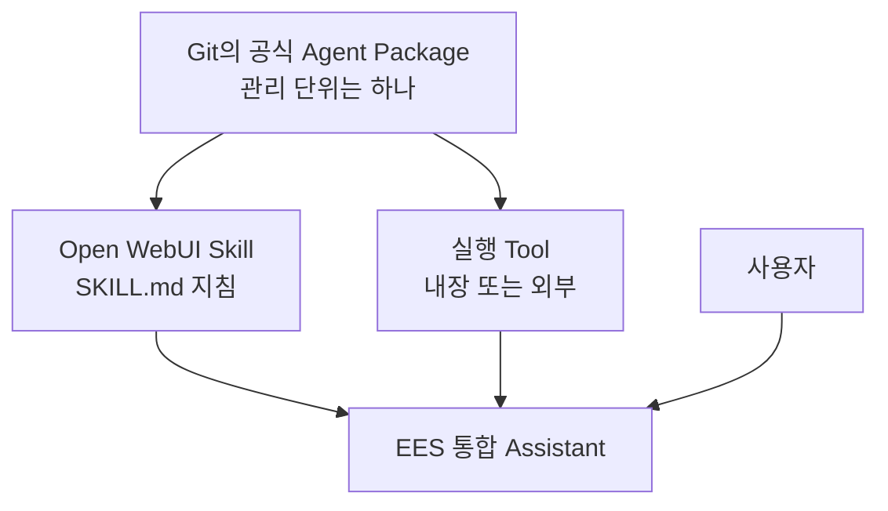
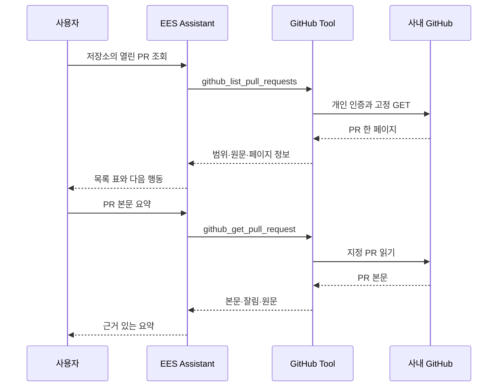
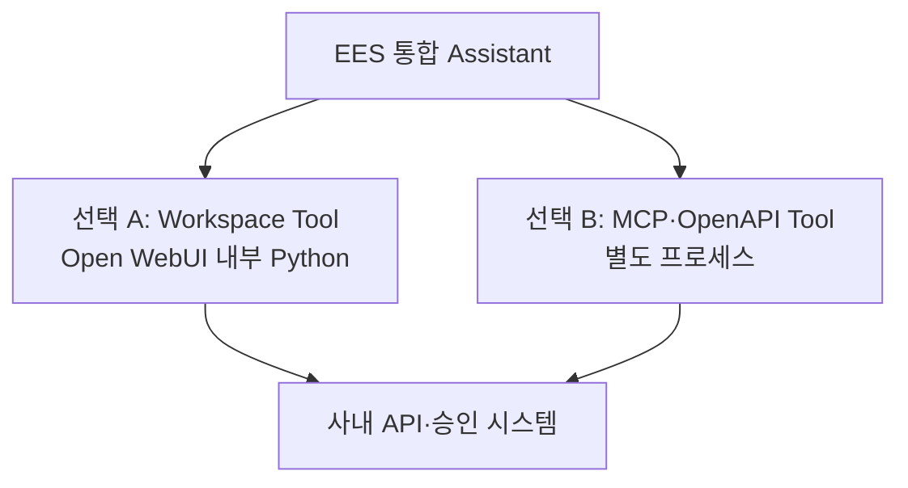
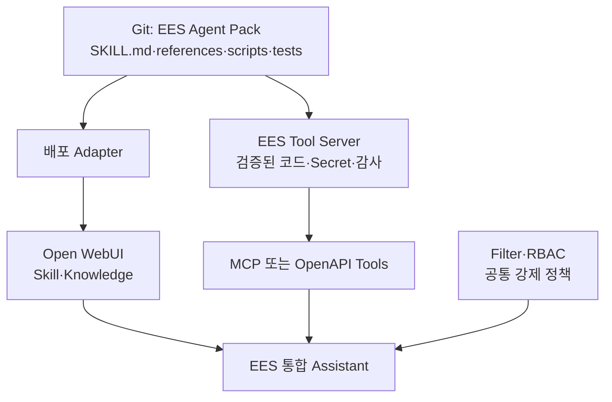
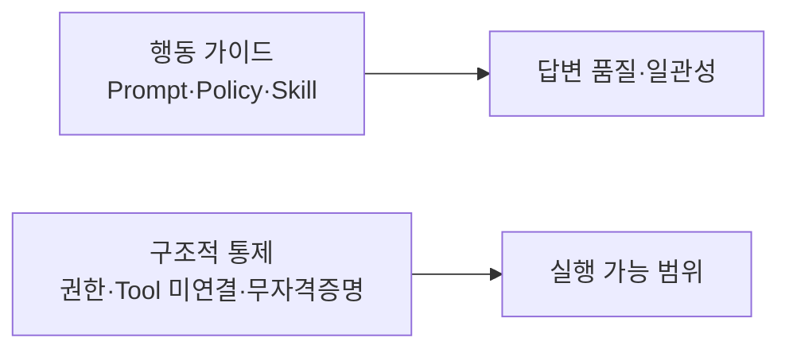
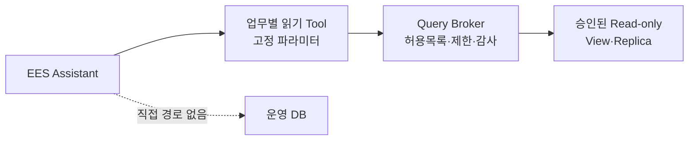
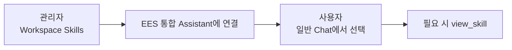

# 03. Open WebUI Native 통합 Assistant

> 문서 역할: Native Assistant 기준선 구성·확장 원칙
>
> 범위: 합성 정보만 사용하며, 실제 사내 정책·URL·모델 ID·업무 데이터는 등록하지 않는다.

최신 적용 상태는 [STATUS](STATUS.md), 시험 판정은 [평가표](../evals/scenarios.md)를 확인합니다. 아래 2-Skill 구성은 합성 문서 기반의 초기 기준선입니다. Confluence 패키지의 추가 적용 절차는 [04. Confluence 읽기 Tool](04-confluence-read-tool.md)에서 다루며, Git에 준비된 것과 실제 UI에 적용된 것은 구분합니다.

## 30초 구조 요약

Git에서는 공식 배포 자산을 하나의 Agent Package로 관리합니다. 팀원이 WebUI에서 만들고 공유하는 개인·팀 자산과의 경계는 [README의 원본과 배포본](../README.md#원본과-배포본)을 따릅니다. Open WebUI Skill 하나가 패키지 전체를 실행할 수 없으므로, 공식 패키지를 배포할 때 **지침**과 **실행 기능**이 서로 다른 위치에 놓입니다.



사용자는 여전히 `EES 통합 Assistant` 하나만 선택합니다. Skill과 Tool을 함께 연결하는 구조에서 Skill은 **무엇을 언제 어떻게 할지** 알려주고 Tool은 **실제로 실행**합니다. 이 구조 설명이 모든 외부 Tool의 연결 완료를 의미하지는 않습니다.

### GitHub PR 읽기 흐름

[GitHub 읽기 Tool](06-github-read-tool.md)을 등록한 뒤의 흐름입니다. 작은 PR 읽기는 별도 Skill 없이 조건부 Prompt와 함수 설명을 사용합니다. 준비·실제 반영 여부는 STATUS를 따릅니다.



`EES 통합 Assistant`는 새로운 물리 모델이 아니라, 승인된 기반 모델에 공통 지침·Skill·Knowledge·허용 Tool을 묶는 Open WebUI Workspace Model입니다.

<a id="rich-ui"></a>

## 되묻기와 Rich UI 선택 기준

업무 Tool을 연결한 뒤 실제 사용 흐름에 필요한 화면을 선택합니다. Rich UI가 있어야 API 연동을 시작할 수 있는 것은 아닙니다.

첫 화면은 [실행 계획](STATUS.md#delivery-plan)의 읽기 업무 하나에 포함해 구현합니다. 모든 연동이 끝난 뒤로 미루거나 UI 프레임워크를 먼저 만들지 않습니다. 실제 Tool 결과의 필터·펼치기·원문 열기를 우선하고, 현재 합성 HTML 예제를 그대로 배포 완료로 간주하지 않습니다.

| 상황 | 우선 사용할 방식 |
|---|---|
| 검색어·대상 등이 모호하거나 후보 중 하나를 골라야 함 | 기본 `ask_user`로 필요한 조건만 확인; 사용할 수 없으면 일반 대화로 질문 |
| 정해진 여러 값을 한 번 입력 | 기존 프롬프트 변수 입력 화면으로 충족되는지 먼저 확인 |
| 짧은 답변·소수의 결과 링크 | 일반 채팅 답변 |
| 받은 결과를 반복해서 필터링·펼치기·비교 | 업무 Tool 또는 사용자 클릭 Action에서 반환하는 Rich UI |

`ask_user`는 [Open WebUI 0.11.3 내장 Tool](https://github.com/open-webui/open-webui/blob/v0.11.3/backend/open_webui/utils/tools.py)입니다. Native 호출·내장 Tool·User Input 설정과 모델의 실제 호출 여부를 해당 환경에서 확인합니다. 알려진 조건을 다시 입력시키거나 동일한 질문용 Tool을 새로 만들지 않습니다.

Rich UI를 구현할 때의 경계:

- 모델이 업무 Tool을 선택하거나 사용자가 Action 버튼을 클릭하면, 연결된 코드가 조회·입력·권한 검증 후 화면을 반환하도록 구현할 수 있습니다. [0.11.3 Action 처리](https://github.com/open-webui/open-webui/blob/v0.11.3/backend/open_webui/utils/actions.py)도 Rich UI 반환을 지원하지만, 현재 패키지에 Action이나 업무용 Rich UI가 연결된 것은 아닙니다. HTML은 고정 템플릿으로 만들고 외부 자료는 텍스트로 삽입합니다.
- `HTMLResponse`와 `Content-Disposition: inline`으로 화면을 반환하고, 모델의 설명에 필요한 데이터는 `(HTMLResponse, context)`로 함께 제공합니다. HTML만 반환했다고 모델이 화면 내용을 읽을 수 있다고 가정하지 않습니다. [공식 Rich UI 안내](https://docs.openwebui.com/features/extensibility/plugin/development/rich-ui/)
- 받은 결과 안의 필터·상세 펼치기는 브라우저에서 처리합니다. 추가 검색·본문 조회는 업무 Tool과 사용자별 권한 검사를 거칩니다. iframe에 PAT를 넣거나 원 시스템 API를 직접 호출시키지 않습니다.
- Rich UI 안의 HTML 버튼은 자동으로 Python Tool을 재호출하지 않습니다. 별도 등록한 Action과 구분하며, 대화로 선택을 전달할지 추가 동작을 구현할지는 사용사례가 정해진 뒤 결정합니다. iframe의 same-origin 권한을 켜는 방식으로 해결하지 않습니다.
- 저장된 채팅의 화면은 당시 결과일 수 있습니다. 갱신 여부를 표시하고, 필터·입력 상태가 재접속 후 자동 복원되거나 항상 최신이라고 설명하지 않습니다.

코드 위치는 [AGENTS의 구현 규칙](../AGENTS.md#3-구현-위치와-과설계-방지)을 따릅니다. 기능별 API 코드는 원 시스템에 요청하는 클라이언트 코드입니다. 원 시스템 서버 구현을 이 저장소에 가져오지 않으며, 둘 이상의 실제 기능에서 같은 코드의 반복 수정이 생기면 공통화를 검토합니다.

### 후속 연동을 시작할 때

각 연동의 제품·인증을 확인한 뒤 작은 읽기 기능부터 구현합니다. 현재 구현·배포 상태와 진행 순서는 [STATUS](STATUS.md)에서 관리합니다.

| 대상 | 구현 전에 확인할 정보 | 첫 읽기 기능 후보 | Rich UI 후보 |
|---|---|---|---|
| Confluence | 제품·버전, 개인 인증, 허용 Space | 문서 검색·본문 조회 | [받은 검색 결과 탐색 예제](04-confluence-read-tool.md#rich-ui-demo) |
| Jira | Cloud/Data Center·버전, 개인 인증, 허용 프로젝트·조회 필드 | 이슈 검색·상세 조회 | 이슈 목록에서 상태·담당자별 좁히기, 상세 펼치기 |
| GitHub | GitHub.com/Enterprise Server·버전, 개인 인증, 허용 저장소 | 이슈·PR 목록과 상세 조회 | PR 목록의 리뷰·검사 상태 비교 |

주소·토큰 값은 승인된 실행 환경에 설정합니다. Confluence의 PAT 방식이나 API 경로를 Jira/GitHub에 그대로 복제하지 않습니다. 각 Tool은 안정적인 원본 ID·URL, 조회 범위·일시, 오류와 부분 결과 여부를 반환하도록 실제 API 응답에 맞춰 설계합니다. 상태 필드가 없거나 권한 때문에 못 읽은 경우를 완료·통과로 바꾸지 않습니다.

문서–이슈–PR 연결 화면은 원문에 명시된 링크·ID를 우선 사용합니다. 제목의 유사성만으로 관계를 확정하지 않습니다. 이슈 생성·수정이나 PR 쓰기 작업은 별도 후속 범위이며, 화면을 먼저 만든 것으로 실행 기능까지 구현됐다고 판단하지 않습니다.

### 업무 흐름 하나를 배포하는 단위

- 제품/버전·개인 인증 방식·첫 조회 업무를 한 번에 확인합니다. 예를 들어 Jira의 특정 프로젝트 열린 이슈 조회처럼 좁게 시작하고, 허용 프로젝트·필드는 승인된 사내 설정으로 제한합니다. 기능 수가 늘기 전에 공통 adapter·registry를 만들지 않습니다.
- 검색 → 받은 결과 탐색 → 필요한 상세/원문 확인까지 준비합니다. 모델이 고정 Tool의 인자를 선택하고, 화면과 모델 답변은 같은 조회 데이터를 사용합니다. 추가 API 조회가 필요한 버튼은 별도 동작으로 구현·검증하기 전까지 약속하지 않습니다.
- 처음 쓰는 팀원에게 실제 가능한 질문 예시 3개와 부족한 조건의 입력 방법을 제공합니다. 일반 요약·Confluence 문서 찾기·새 이슈 조회처럼 연결된 기능만 소개하며 Skill 이름이나 모델 선택법을 학습해야 업무를 시작하는 구조로 만들지 않습니다.
- GPT가 가능한 코드·합성 시험을 끝낸 뒤 사내에서는 정상 업무 흐름·권한 제한·대표 실패와 실제 화면을 짧은 묶음으로 확인합니다. [사용성·공유 기준](../evals/scenarios.md#usability)은 파일럿 참여자의 실제 사용으로 확인합니다.
- 팀원 Prompt·Skill 생성/공유 권한은 필요한 범위로 설정하고 같은 파일럿에서 공유·비공유 사용자를 확인합니다. Python Tool 등록·수정 권한이나 자격증명 공유를 함께 열지 않습니다. 공식 채택과 Git 관리는 [원본 경계](../README.md#원본과-배포본)를 따릅니다.

## 초기 Native 기준선 구성

| 구성 | POC 값 | 역할 |
|---|---|---|
| Workspace Model | `EES 통합 Assistant` 1개 | 사용자가 선택하는 단일 진입점 |
| Base Model | 승인된 Chat 모델 1개 | 실제 추론 |
| System Prompt | 1개 | 공통 행동 원칙 |
| Skill | 2개 | 정책 근거 답변, 구조화된 문제 분석 |
| Knowledge | 합성 문서 1개 | 검색·근거 제시 검증 |
| Function Calling | Native | Skill과 허용 Tool 호출 |
| Memory | Capabilities와 Builtin Tools 모두 OFF | 사용자 격리 검증 전 개인화 제외; [제어 범위](troubleshooting.md#native-memory-controls) |
| Chat History | OFF | 초기 시험에서는 다른 대화 내용을 자동 검색하지 않음; Memory와 별도 설정 |
| 위험 기능 | OFF | Terminal·Shell·Code Interpreter·쓰기·DB Tool 미연결 |

POC에서는 Router, A2A, MCP, 자동 동기화, 외부 Agent를 만들지 않습니다. Native 방식으로 부족한 실제 사례가 확인된 뒤에만 추가합니다.

## 확인된 제한: Open WebUI Skill은 실행 패키지가 아니다

Open WebUI 공식 정의에서 Workspace Skill은 Markdown 지침입니다. 0.11.3에서 기본 내장 Tool을 사용하는 대화는 연결된 Skill의 이름·설명을 먼저 제공하고 필요할 때 `view_skill`로 본문을 불러옵니다. 사용자가 `$`로 Skill을 직접 지정하거나 내장 Tool을 사용하지 않는 경로에서는 본문을 직접 제공합니다. 따라서 `view_skill` 호출이 없다는 이유만으로 Skill이 적용되지 않았다고 판단하지 않습니다. [0.11.3 Skill 처리](https://github.com/open-webui/open-webui/blob/v0.11.3/backend/open_webui/utils/middleware.py)

Python 실행, API 호출, 별도 `references/`·`scripts/` 디렉터리 배포 기능은 Workspace Skill 자체에 없습니다.

따라서 기존 사내 Agent Skill 패키지를 Open WebUI Skill 하나로 옮기는 방식은 사용하지 않습니다.

| 기존 사내 Agent Skill 구성 | Open WebUI에서의 대응 |
|---|---|
| `SKILL.md`의 판단 기준·절차 | Workspace Skill |
| 짧고 정적인 참고 문서 | Knowledge |
| 크거나 구조화된 Reference | Workspace Tool 또는 필요 시 외부 Tool Server의 검색·조회 API |
| `scripts/` 실행 코드 | Workspace Tool 또는 외부 MCP/OpenAPI Tool Server |
| 패키지 의존성·런타임 | Open WebUI 환경 또는 외부 Tool Server 환경 |
| API Key·사내 URL | Workspace Tool 설정 또는 외부 Tool Server의 Secret |
| 반드시 지켜야 하는 공통 정책 | Filter·RBAC·Tool/Broker 내부 강제 |
| 공식 배포 자산의 버전·설치·업데이트 | Git 원본과 별도 배포 절차 |

### 별도 Tool Server는 선택 사항

Open WebUI의 `Workspace > 도구`는 Python 코드를 Open WebUI 백엔드 프로세스 안에서 직접 실행합니다. 따라서 별도 서버 없이도 실제 API 호출·계산·조회 기능을 만들 수 있습니다.



| 구분 | Workspace Tool | 외부 MCP/OpenAPI Tool |
|---|---|---|
| 별도 서버 | 불필요 | 필요 |
| 코드 위치 | Open WebUI DB·프로세스 | Git 배포 디렉터리·별도 프로세스 |
| 적합한 범위 | 작은 POC, 단순 API wrapper | 여러 파일·의존성·복잡한 패키지 |
| Open WebUI 결합도 | 높음 | 낮음 |
| 다른 Agent 재사용 | 별도 Adapter 필요 | 같은 endpoint 재사용 가능 |
| 장애·권한 격리 | WebUI 프로세스를 공유; Tool 내부 검증 필요 | 별도 분리·통제 가능; 실제 배포 설계에 따름 |
| 업데이트 | UI Import·수정 | Git 배포·서비스 재시작 |

현재 POC에서는 **읽기 전용 Workspace Tool 하나**로 실제 실행 루프를 먼저 검증할 수 있습니다. 기존 Agent Skill 전체를 UI에 복사하지 않고, 대표 스크립트 하나를 얇게 감싸 Tool 함수로 노출합니다. 다음 조건 중 하나가 확인되면 외부 Tool Server 분리를 검토합니다. 자동 전환이나 현재 MVP의 선행 조건은 아닙니다.

- 여러 Python 파일과 별도 라이브러리가 필요함
- `references/`·`assets/`를 패키지 상대경로로 읽어야 함
- Hermes·Claude Code 등 다른 Agent도 같은 실행 기능을 써야 함
- Secret·감사·장애·배포 수명주기를 Open WebUI와 분리해야 함
- 패키지 수나 담당 팀이 늘어남

### 선택적 확장 배치 예시 — 현재 MVP에 미구현

아래는 외부 실행 환경이 필요한 경우의 선택지입니다. 현재 Workspace Tool MVP에 별도 Tool Server·배포 Adapter·공통 Filter를 추가해야 한다는 뜻은 아닙니다.



이 확장안에서는 Open WebUI가 사용자 UI와 Native Tool 호출 루프를, Git이 공식 패키지 원본을, 외부 Tool Server가 실행을 담당합니다. Workspace Tool MVP에서는 실행을 Open WebUI 백엔드가 담당합니다. 두 경우 모두 패키지에서 등록한 Open WebUI Skill은 Agent Pack 전체가 아니라 Agent Pack 중 **지침 부분을 투영한 배포본**입니다.

작은 POC 코드는 Open WebUI의 Python Workspace Tool로 넣습니다. 팀 공용 패키지라도 규모만으로 외부 서버를 추가하지 않으며, 의존성·Secret·감사·권한의 별도 수명주기가 필요해질 때 외부 MCP/OpenAPI Tool Server의 운영 비용과 이점을 비교합니다.

현재 [GitHub PR 읽기](06-github-read-tool.md)는 단일 Workspace Tool로 준비했습니다. 아래는 향후 파일 검색·가이드가 필요한 경우의 확장 예시이며 현재 구현 목록이 아닙니다.

- `SKILL.md`: 언제 저장소를 조회하고 근거와 조회 제한을 어떻게 확인하는지
- `references/`: 사내 GitHub 사용 가이드와 API 규격
- `scripts/`: 검색·파일·PR 조회 구현
- Workspace Tool 또는 필요한 경우 Tool Server: `search_repository`, `get_file`, `get_pull_request` 같은 제한된 함수 노출
- 강제 정책: 허용 저장소·조회 범위, 사용자별 권한, 응답 크기·시간 제한

브랜치·PR 생성 같은 쓰기 기능과 그 승인 절차는 읽기 MVP 이후 별도 범위에서 검토합니다.

범용 Shell이나 임의 `git push`를 그대로 노출하지 않습니다. 또한 Tool은 Open WebUI를 실행하는 호스트에서 실행됩니다. 기존 Windows PC를 팀 파일럿 호스트로 사용해도 팀원의 브라우저가 열린 PC에서 실행되는 것은 아닙니다. 사용자 로컬 저장소를 다루려면 별도 로컬 실행 Agent/Runner가 필요하고, 현재 GitHub 읽기 기능은 호스트에서 GitHub API를 호출합니다.

공식 근거:

- [Open WebUI Skills](https://docs.openwebui.com/features/workspace/skills/): Skill은 실행 코드가 아닌 Markdown 지침
- [Open WebUI Extensibility](https://docs.openwebui.com/features/extensibility/): 실행 능력은 Tool·Function·MCP·OpenAPI로 제공
- [Open WebUI Tools](https://docs.openwebui.com/features/extensibility/plugin/tools/): Workspace Tool은 Open WebUI 프로세스 안에서 Python으로 실행
- [Open WebUI MCP](https://docs.openwebui.com/features/extensibility/mcp/): Streamable HTTP MCP Tool Server 연결 지원

## 정책 적용의 두 층



- Prompt와 Skill은 모델에게 무엇을 해야 하는지 안내하지만 보안 경계가 아닙니다.
- 운영 DB 직접 접근 금지는 DB Tool·자격증명·네트워크 경로를 제공하지 않는 것으로 강제합니다.
- 나중에 조회가 필요하면 승인된 읽기 전용 API 또는 Query Broker만 별도 Tool로 연결합니다.

## 단계 구분

현재 진행 단계는 [STATUS](STATUS.md#delivery-plan), 항목별 판정과 실행 시점은 [평가표](../evals/scenarios.md#validation-timing)를 따릅니다. 아래는 검증 범위를 구분하는 기준이며 위 행 전체를 통과해야 다음 행의 개발을 시작하는 순서가 아닙니다.

| 단계 | 확인 대상 | 해석 |
|---|---|---|
| 기본 Assistant | Skill 선택, 절차 준수, Knowledge 조회·근거 표시 | 사내 모델의 행동 품질 검증 |
| 읽기 Tool 연결 | 입력 제한, 사용자별 인증·권한, 실패 처리, 위험 Tool 미연결 | 실제 실행 경로 검증 |
| 다른 사용자에게 공개 전 | 자산 접근 권한, 비밀 저장, 사용자 간 데이터 격리 | 해당 연결 기능의 실환경 평가 |

Tool은 실행 능력을 제공하며 입력 제한·권한 검사도 Tool 코드에서 강제할 수 있습니다. 한 Tool의 제한이 다른 Tool까지 통제하는 것은 아닙니다. 요청·응답을 가로채는 Filter Function이나 외부 Broker는 별도 통제의 필요가 확인될 때 검토하며, 현재 Confluence Workspace Tool MVP의 자동 선행 조건으로 두지 않습니다.

Skill만으로 거절에 성공한 결과는 행동 품질 PASS이며, 강제 통제 PASS로 판정하지 않습니다.

## 향후 DB 조회 Tool의 강제 구조



- 범용 `execute_sql(sql, connection_string)` Tool은 제공하지 않습니다.
- Tool 입력에는 DB 주소·계정·비밀번호·임의 SQL을 받지 않습니다.
- `get_equipment_status(equipment_id, time_range)`처럼 업무 의미가 고정된 API만 노출합니다.
- Broker는 허용된 Query ID·테이블·컬럼·행 범위, 최대 건수, timeout을 서버에서 강제합니다.
- Broker 계정은 읽기 전용이며 가능하면 운영 DB가 아닌 승인된 View·Replica만 접근합니다.
- Open WebUI 서버에서 운영 DB로 가는 직접 네트워크 경로와 자격증명을 제공하지 않습니다.
- 차단 시험은 답변 문구가 아니라 Broker와 DB 감사 로그에서 실제 쿼리 미실행을 확인합니다.

따라서 현재 P05·P06은 모델 행동 평가일 뿐입니다. 향후 승인된 DB 조회 중계 경로를 도입하면 [평가표 S06](../evals/scenarios.md)의 실제 통제 증거를 확인해야 합니다. 이는 운영 DB 직접 접속 Tool을 허용하거나 Confluence 문서 조회에 별도 Broker를 요구한다는 뜻이 아닙니다.

## 공식 Git 원본과 Open WebUI 배포본

아래 절차는 담당자가 공식으로 채택한 배포 자산에 적용합니다. 팀원의 개인·팀 자산 작성과 허용된 범위의 공유에 매번 담당자 승인을 요구하지 않습니다. 관리 경계는 [README의 원본과 배포본](../README.md#원본과-배포본)을 따릅니다.


초기에는 수동 등록으로 변경 절차와 평가 기준을 먼저 확정합니다. 자동 동기화는 업데이트 빈도와 운영 책임자가 정해진 뒤 검토합니다.

## 1. Skill 등록

현재 설치된 Open WebUI 0.11.3 UI에서는 파일 선택형 Import 대신 `Workspace > Skills > Create`에서 `SKILL.md` 전체 내용을 지침 칸에 붙여 넣습니다. YAML frontmatter를 인식해 이름·ID·설명이 자동 입력되므로 값을 검토한 뒤 생성합니다.

| 필드 | 입력 원칙 |
|---|---|
| Skill 이름 | 사람이 알아보기 쉬운 표시 이름 |
| Skill ID | 영문 소문자 slug, 생성 후 변경하지 않음 |
| Skill 설명 | 모델이 선택 기준으로 사용할 짧고 구체적인 설명 |
| 지침 | YAML frontmatter를 포함한 `SKILL.md` 전체 내용 붙여넣기 |

첫 번째 Skill:

| 필드 | 값 |
|---|---|
| Skill 이름 | frontmatter의 `policy-grounded-answer` 자동 입력 확인 |
| Skill ID | `policy-grounded-answer` 자동 입력 확인 |
| Skill 설명 | frontmatter 설명 자동 입력 확인 |
| 지침 | `agent-pack/skills/policy-grounded-answer/SKILL.md` 전체 내용 |

두 번째 Skill은 첫 번째 저장과 단독 호출을 확인한 뒤 등록합니다.

Workspace에 Skill을 생성하는 것만으로는 전체 대화에 적용되지 않습니다. 이후 `Workspace > Models`에서 `EES 통합 Assistant`에 Skill을 연결해야 합니다. 사용자는 Workspace 화면에 들어갈 필요 없이 일반 Chat에서 해당 Assistant를 선택합니다.



현재 기준선의 Native·내장 Tool 사용 경로에서는 Skill을 직접 지정하지 않은 질문으로 필요한 본문을 불러오는지 호출 이력을 확인합니다. `$`로 직접 지정한 시험과 자동 선택 시험은 구분하며, 지침 준수도 실제 사내 모델에서 확인합니다. 일반 사용자에게 공유할 때는 Assistant뿐 아니라 연결된 Skill에도 읽기 권한을 부여해야 합니다.

## 2. Knowledge 등록

1. `Workspace > Knowledge`에서 `EES POC Policy`를 생성합니다.
2. `agent-pack/knowledge/poc-policy.md`를 등록합니다.
3. 현재처럼 파일 추가 시 `임베딩 모델이 없음` 오류가 나면 `관리자 패널 > 설정 > 문서`에서 `임베딩 검색 우회`를 켜고 저장한 뒤 다시 추가합니다.
4. 이 옵션은 파일 등록·소스 본문 처리에서 임베딩을 우회하는 전역 POC 설정입니다. Native의 `query_knowledge_files` 의미 검색은 별도로 임베딩을 사용하므로 이 옵션으로 동작을 보장하지 않습니다. 작은 합성 문서에만 사용하고, 대규모 문서를 넣기 전에는 승인된 임베딩 경로를 별도로 구성·검증합니다.
5. Knowledge를 Assistant에 붙일 때도 `Full Context`를 선택해 이번 시험이 벡터 검색 품질과 섞이지 않게 합니다.
6. 실제 사내 문서는 승인·비식별·접근권한 기준이 정해질 때까지 넣지 않습니다.

`Full Context`를 설정해도 Native에서 모델에 연결한 Knowledge 본문이 자동 주입된다고 가정하지 않습니다. [0.11.3 처리 코드](https://github.com/open-webui/open-webui/blob/v0.11.3/backend/open_webui/utils/middleware.py)는 모델 Knowledge 자동 주입과 Native 내장 조회 경로를 구분합니다. 실제 Knowledge 조회 Tool 호출과 답변 근거를 확인합니다.

임베딩 검색이 아직 준비되지 않은 작은 합성 Knowledge는 [Prompt의 자료 조회 경로](../agent-pack/system-prompts/ees-integrated-assistant.md#현재-poc의-자료-조회-경로)에 따라 목록·파일명 검색으로 파일 ID를 찾고 본문을 읽습니다. `query_knowledge_files`에서 임베딩 오류가 나면 [Native 지식 검색 진단](troubleshooting.md#native-knowledge-embedding)을 따릅니다. Knowledge 전체를 끄면 기존 정책 본문 조회도 영향을 받으므로 임베딩 오류 회피를 위해 일괄 비활성화하지 않습니다.

## 3. Workspace Model 생성

`Workspace > Models`에서 다음처럼 구성합니다.

| 항목 | 값 |
|---|---|
| 이름 | `EES 통합 Assistant` |
| Base Model | `<APPROVED_CHAT_MODEL_ID>` |
| System Prompt | `agent-pack/system-prompts/ees-integrated-assistant.md` 내용 |
| Skills | 위의 2개 |
| Knowledge | `EES POC Policy` |
| Function Calling | Native |
| 공개 범위 | 관리자 또는 POC 사용자만 |

기능 설정은 다음 원칙으로 시작합니다.

```text
ON
├─ Native Function Calling
├─ Knowledge
└─ 현재 대화에 필요한 최소 Builtin 기능

OFF
├─ Memory
├─ Chat History
├─ Web Search
├─ Code Interpreter
├─ Terminal·Shell
├─ 파일 쓰기
├─ Automations
├─ MCP
└─ DB Tool
```

일반 사용자 모델 선택기에서 기반 모델을 정리할 때는 권한 제거와 `Hide`를 구분합니다. 사용자는 Workspace Model이 참조하는 기반 모델에 접근할 수 있어야 하므로, 기반 모델은 접근 가능 상태로 두고 필요하면 UI에서 숨깁니다. `Hide`는 보안 통제가 아닙니다.

Web Search·Code Interpreter·Terminal은 **Workspace → Models → EES 통합 Assistant 편집 → Capabilities**에서 각각 OFF로 확인합니다. 켜진 항목만 해제한 뒤 **저장 및 업데이트 → 새로고침 → 다시 편집**하여 저장된 상태를 확인합니다. 기존 Confluence 읽기 Tool·Skill·Knowledge 연결은 유지합니다.

Tools의 선택 목록과 내장 기능 설정은 별도입니다. Tools에 Confluence만 선택돼 있어도 Web Search·Terminal의 OFF를 확인한 것은 아닙니다. 반대로 기능 ON만으로 외부 서버 연결이나 실제 웹 조회·명령 실행이 확인된 것도 아닙니다. 실제 기능 노출에는 별도 설정·연결 등의 조건이 있으며, [v0.11.3 내장 Tool 조건](https://github.com/open-webui/open-webui/blob/v0.11.3/backend/open_webui/utils/tools.py)을 참고합니다. S04/S05는 확인한 구성·실행 범위를 구분해 기록하며 주소·DB 접속정보·토큰 값은 수집하지 않습니다.

Memory는 모델 편집 화면의 **Capabilities → Memory**와 **Builtin Tools → Memory**를 모두 해제합니다. 내장 Memory 도구만 끄면 자동 문맥 주입·응답 후 검토 경로까지 꺼지는 것은 아닙니다. [Memory 제어 범위](troubleshooting.md#native-memory-controls)를 따릅니다.

과거 대화 검색도 끄려면 **Builtin Tools → Chat History**를 해제하고 저장합니다. Memory OFF만으로는 `search_chats`·`view_chat`이 꺼지지 않습니다. 정확한 설정·재확인 순서는 [새 대화에서 과거 내용을 찾는 경우](troubleshooting.md#native-chat-history)를 따릅니다. 이는 초기 MVP의 대화 분리 기준이며, 이후 같은 계정의 이전 대화 검색을 제공하려면 기능·사용자 안내·평가 기준을 함께 조정합니다.

## 4. 공개 전 검증

현재 파일럿은 [기존 Windows PC](01-openwebui-install.md#local-pc-pilot)를 호스트로 사용합니다. 공개할 기능을 정하고 [검증 시점](../evals/scenarios.md#validation-timing)의 공용 파일럿 전 조건을 묶어서 확인합니다. 같은 DB·키·버전·실행 경로의 기존 저장·조회 증거는 재사용하며, 변경된 접속 경로와 일반 사용자 계정의 격리·자산 권한을 확인합니다. LAN 접속·전송 보호는 개인 환경의 DB 저장 PASS와 별개입니다. 추후 다른 서버로 옮기면 그때 바뀐 환경의 조건을 확인합니다.

대표 조회·정보 부족·실패·문서 속 지시·금지 요청에서 실제 충족한 조건을 연결합니다. 실행 이력은 실제 조회·Skill 선택·금지 실행 여부나 오류 판정에 필요할 때 확인하며, 모든 정책 답변마다 이름 제출을 요구하지 않습니다. P05/P06 실패나 사용자 격리·비밀 보호·허용 범위 위반은 공개 전에 해결합니다.

이 공개 기준은 개인 환경의 다음 읽기 기능 개발을 막는 전수 시험 순서가 아닙니다. GitHub 등 준비되지 않은 연동은 공개 범위에서 제외할 수 있으며, 비개발자 [사용성·공유](../evals/scenarios.md#usability)는 조건을 갖춘 파일럿에서 실제로 확인합니다.

## 5. 업데이트 원칙

```text
공식 Git 자산 변경 → 관련 검사·검토 → Open WebUI 수동 반영 → 영향받는 실환경 조건 확인 → 해당 범위 사용자 공개
```

- 공식 배포 자산은 Git 파일을 관리 원본으로 취급하고 Git에서 수정한 뒤 WebUI에 반영합니다. 개인·팀 작성물 전체를 Git 관리 대상으로 삼지 않습니다.
- 공식 항목을 WebUI에서 직접 수정했다면 Git 원본과 차이를 확인하고 검토·반영하여 복사본 간 불일치를 해소합니다.
- Policy·Skill·Knowledge에는 문서 ID와 버전을 둡니다.
- 자동 업데이트는 롤백·승인·감사 로그가 마련되기 전에는 사용하지 않습니다.
- 모델·서빙 옵션을 교체하면 [사내 모델 운용 기준](../versions.md#사내-모델-운용-기준)에 따라 기존 평가 질문으로 호출 품질·횟수·응답 시간을 다시 확인합니다.

<a id="update-existing-instructions"></a>

### 이미 등록된 지침 갱신

2026-09-06 준비한 지침 개정은 아래 기존 두 항목을 갱신해 적용합니다. 적용 상태는 [STATUS](STATUS.md)에서 확인합니다. 새로운 Skill이나 Assistant를 만들지 않습니다.

| 원본 | 기존 UI 항목 |
|---|---|
| `agent-pack/system-prompts/ees-integrated-assistant.md` 전체 | Workspace → Models → EES 통합 Assistant 편집 → System Prompt |
| `agent-pack/skills/policy-grounded-answer/SKILL.md` 전체, frontmatter 포함 | Workspace → Skills → 기존 policy-grounded-answer 편집 → 지침 |

1. 기존 두 지침을 승인된 사내 로컬 위치에 복사해 보존하고, 직접 추가한 규칙이 있으면 해당 부분을 보존하면서 Git 원본과 맞춥니다. 내부 내용을 외부 채팅·Git에 옮기지 않습니다.
2. 기존 항목의 본문을 갱신합니다. 전체 System Prompt에는 2026-09-07 보완한 자료 조회 경로가 이미 포함돼 있으므로 같은 섹션을 다시 덧붙이지 않습니다. 공통 정책 관리 파일이 자동 등록되는 구조는 아닙니다.
3. 각각 저장하고 모델은 저장 및 업데이트합니다. 이름·ID·모델/Skill 연결·Confluence Tool·Knowledge·기능 OFF 설정·개인 PAT를 유지합니다.
4. 두 항목의 저장 여부와 사용한 원본 Git 커밋을 기록합니다. 모바일로 원문을 옮긴 경우 안내 원본 커밋과 사내 checkout SHA를 혼동하지 않습니다. UI 저장 보고는 등록 내용의 직접 대조나 평가 통과와 구분합니다.
5. [검증 시점](../evals/scenarios.md#validation-timing)에 맞춰 새 대화에서 개정 지침의 관련 대표 흐름을 확인합니다. [개정 후 판정](../evals/scenarios.md#instruction-revision)과 이전 PASS 이력을 구분하며, 지침 저장만으로 전수 문답을 즉시 시작하지 않습니다.

## 다음 단계 Gate

Native POC에서 복잡한 병렬 분석, 장시간 상태 유지, 독립 검증, 외부 전용 ReAct가 실제로 필요하다는 실패 사례가 모일 때만 Hermes 또는 외부 Agent 연결을 비교합니다.
