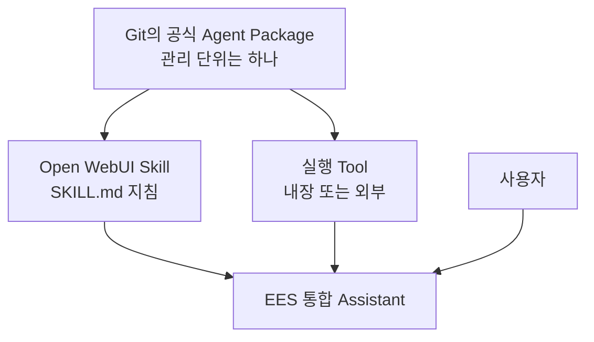
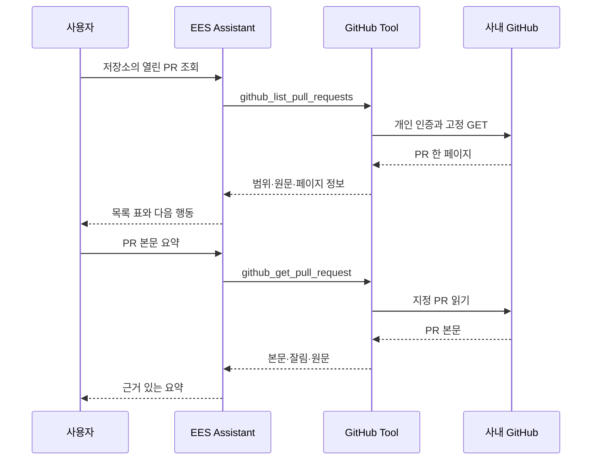
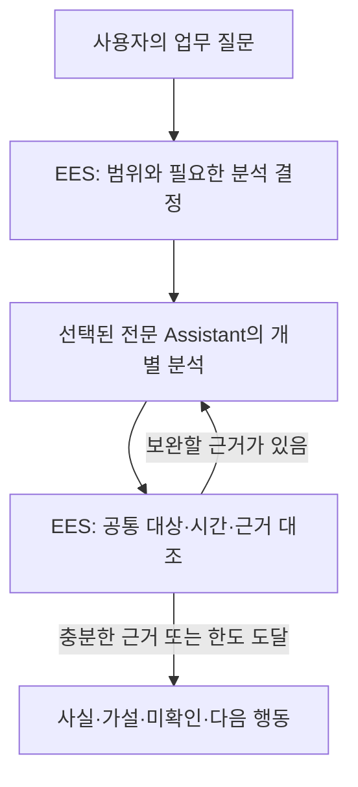
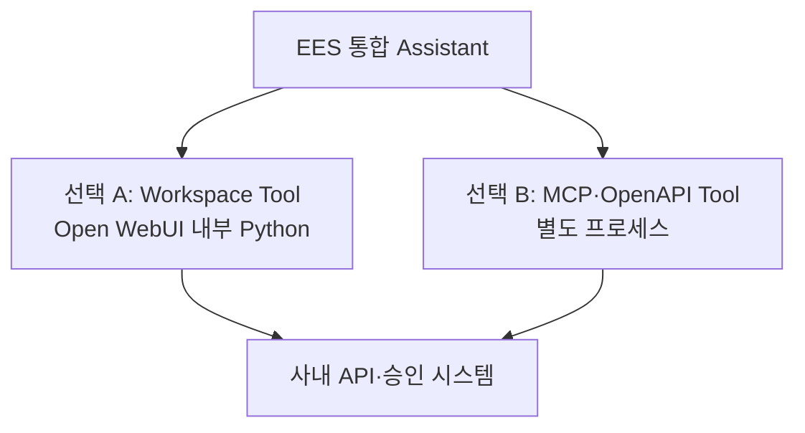
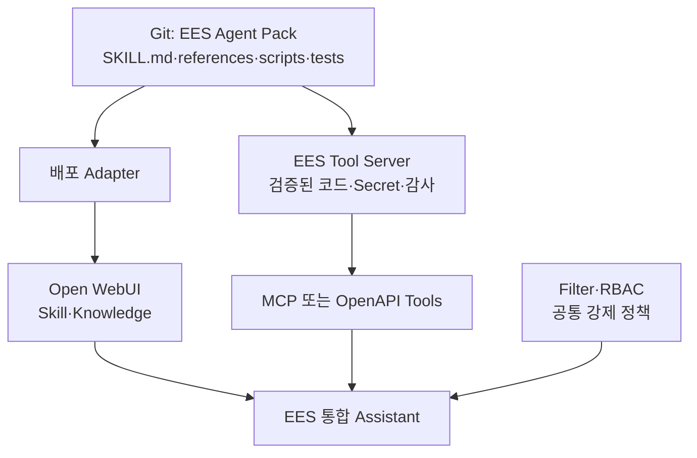
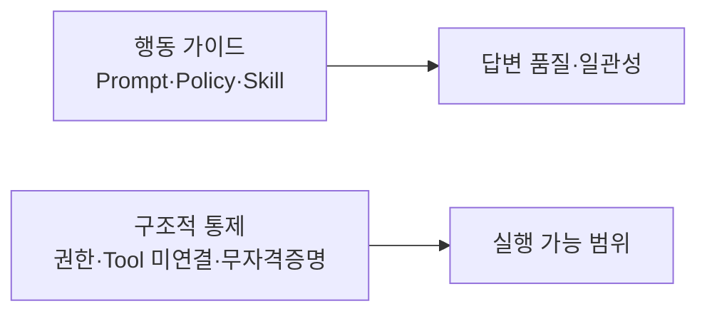
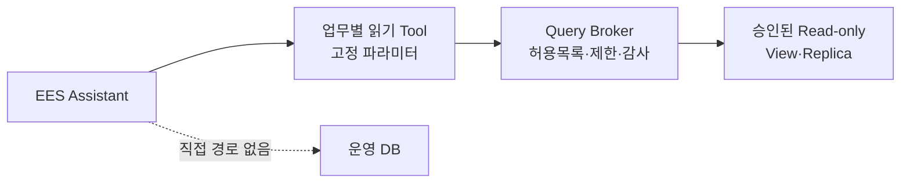
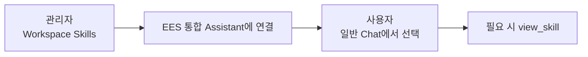

# 03. Open WebUI Native 통합 Assistant

> 문서 역할: Native Assistant 기준선 구성·확장 원칙
>
> 범위: 합성 정보만 사용하며, 실제 사내 정책·URL·모델 ID·업무 데이터는 등록하지 않는다.

최신 적용 상태는 [STATUS](STATUS.md), 시험 판정은 [평가표](../evals/scenarios.md)를 확인합니다. 아래 2-Skill 구성은 합성 문서 기반의 초기 기준선입니다. Confluence 패키지의 추가 적용 절차는 [04. Confluence 읽기 Tool](04-confluence-read-tool.md)에서 다루며, Git에 준비된 것과 실제 UI에 적용된 것은 구분합니다.

운영 작업은 필요한 절로 바로 이동합니다.

| 할 일 | 안내 |
|---|---|
| 시연 자산·첫 화면 제안 적용 | [ApplyDemo](#demo-assets-deployment)·[소개와 제안](#first-use-entry) |
| 프로그램·래퍼 업데이트 | [Upgrade](#ees-wrapper-upgrade) |
| 수동 적용·복구 | [Apply/Restore](#ees-wrapper-apply)·[종료 복구](#ees-stop-recovery) |
| 실패 기록·등록 위치 확인 | [실패 판단](#ees-update-failure-causes)·[사내 기록](#ees-local-state) |

## 30초 구조 요약

Git에서는 공식 배포 자산을 하나의 Agent Package로 관리합니다. 팀원이 WebUI에서 만들고 공유하는 개인·팀 자산과의 경계는 [README의 원본과 배포본](../README.md#원본과-배포본)을 따릅니다. Open WebUI Skill 하나가 패키지 전체를 실행할 수 없으므로, 공식 패키지를 배포할 때 **지침**과 **실행 기능**이 서로 다른 위치에 놓입니다.



사용자는 여전히 `EES 통합 Assistant` 하나만 선택합니다. Skill과 Tool을 함께 연결하는 구조에서 Skill은 **무엇을 언제 어떻게 할지** 알려주고 Tool은 **실제로 실행**합니다. 이 구조 설명이 모든 외부 Tool의 연결 완료를 의미하지는 않습니다.

### GitHub PR 읽기 흐름

[GitHub 읽기 Tool](06-github-read-tool.md)을 등록한 뒤의 흐름입니다. 작은 PR 읽기는 별도 Skill 없이 조건부 Prompt와 함수 설명을 사용합니다. 준비·실제 반영 여부는 STATUS를 따릅니다.



`EES 통합 Assistant`는 새로운 물리 모델이 아니라, 승인된 기반 모델에 공통 지침·Skill·Knowledge·허용 Tool을 묶는 Open WebUI Workspace Model입니다.

<a id="assistant-resource-access"></a>

## Assistant 연결과 팀 사용 권한

Open WebUI **0.11.3은 Assistant 연결과 각 자산의 사용 권한을 별도로 검사**합니다. 모델에 Tool/Skill을 선택해도 그 모델을 사용하는 모든 사람에게 해당 자산의 읽기 권한이 자동 부여되지는 않습니다. 권한 없는 Tool은 사용자 목록·실행 준비에서 제외되고, 권한 없는 Skill은 모델 문맥에서 제외되며 `view_skill`에서도 읽기 권한을 확인합니다. 관리자의 기존 정상 동작만으로 일반 사용자 권한을 판단하지 않습니다.

현재는 사용자 선택에 따라 **기존 Skill·Tool·모델을 모두 Public으로 설정한 상태**로 운영합니다. 당분간 팀원만 사용하는 환경을 전제로 그룹별 설정은 후속으로 미룹니다. [사용자 보고](../evals/scenarios.md#team-public-resource-sharing)는 공개 설정 변경 범위이며, Read/Write 세부 값·Knowledge 공개 여부·일반 사용자 조회 성공까지 확인한 것은 아닙니다. 자산 공유 설정은 Windows의 Public 네트워크 프로필과 구분합니다.

아래 **같은 그룹에 필요한 자산의 읽기 권한을 부여**하는 절차는 사용 대상이 넓어지거나 자산별 제한이 필요할 때 사용할 후속 안내입니다. 현재 사용을 위해 그룹 설정을 다시 요구하지 않습니다.

1. 관리자 패널 → Users → Groups에서 대상 그룹을 만들거나 기존 팀 그룹을 사용하고 일반 사용자 계정을 구성원으로 넣습니다.
2. 각 자산의 **Access / 접근 → Add Access / 접근 권한 추가**에서 같은 그룹에 **Read / 읽기**를 부여하고 저장합니다. 기존에 필요한 권한이 있으면 삭제하거나 다시 부여하지 않습니다.

| 대상 | 파일럿 그룹에 맞출 권한·범위 |
|---|---|
| EES 통합 Assistant | 읽기 — 모델 선택·사용 |
| 실제 기반 Chat 모델 | 읽기 — 기존 [기반 모델 권한](troubleshooting.md#user-model-not-found)을 유지하고 새 팀원 범위에 맞춤 |
| 연결한 Skill 3개 | 읽기 — 정책 근거·장애 분석·Confluence 조회 지침. 활성 상태와 기존 연결 유지 |
| 공개할 읽기 Tool | 읽기/사용 — EES Confluence Read·EES Jira Read·EES GitHub Read 중 파일럿에 포함할 항목 |
| 조회에 쓰는 Knowledge | 읽기 — 현재 합성 정책 자료 등 파일럿 범위의 자료 |

3. 팀원은 화면을 새로고침하고 새 대화에서 Assistant를 선택합니다. 관리자가 연결한 기능 중 권한 있는 항목을 사용할 수 있도록 준비하는 것이며 팀원에게 같은 연결 작업을 반복시키지 않습니다. 미확인 일반 사용자 흐름 하나에서 필요한 지침·조회·원문이 동작하는지 확인하고, 기존 관리자 개인 PAT/저장·모델 복구 시험은 반복하지 않습니다.

새 팀원은 **그룹 구성원 추가**로 이미 그룹에 공유한 자산 권한을 받습니다. **새 Tool/Skill을 붙일 때는 그 자산에도 그룹 읽기 권한을 한 번 설정**해야 하며 모델 연결이 권한을 자동 동기화하지는 않습니다. 다른 사용자/그룹·공개 권한으로 이미 받은 접근은 별도이므로 그룹에서 제외하는 것만으로 모든 권한이 제거됐다고 판단하지 않습니다.

여기서 읽기/사용은 **그룹 Permissions의 Tools Access·Skills Access(Workspace 작성·관리)나 자산 Write 권한과 다릅니다**. 연결된 Tool/Skill을 사용하기 위해 작성·관리 스위치를 켤 필요는 없습니다. 기존 Tool 사용과 본인 UserValves/PAT 입력에는 Tool 읽기 권한을 사용하며 코드 수정 권한을 함께 주지 않습니다. 그룹 공유는 Tool 사용 권한을 제공하고, 실제 Confluence/Jira/GitHub 조회는 각자의 PAT와 원 시스템 권한으로 제한합니다. Skill을 팀원이 작성·공유하는 기능은 그 업무를 제공할 때 별도 생성/공유 권한으로 설정합니다.

근거: [v0.11.3 Tool 로더](https://github.com/open-webui/open-webui/blob/v0.11.3/backend/open_webui/utils/tools.py), [Tool 개인 설정 라우터](https://github.com/open-webui/open-webui/blob/v0.11.3/backend/open_webui/routers/tools.py), [Skill 목록 검사](https://github.com/open-webui/open-webui/blob/v0.11.3/backend/open_webui/models/skills.py), [모델 Skill 연결 처리](https://github.com/open-webui/open-webui/blob/v0.11.3/backend/open_webui/utils/middleware.py), [공식 Skill 접근 설명](https://docs.openwebui.com/features/workspace/skills/#access-control), [그룹 기반 권한](https://docs.openwebui.com/features/authentication-access/rbac/). 실제 적용 판정은 [확인 기록](../evals/scenarios.md#assistant-resource-access-followup)을 따릅니다.

<a id="rich-ui"></a>

## 되묻기와 Rich UI 선택 기준

현재 조회 결과는 **Tool의 JSON → Assistant의 일반 문장·표·원문 링크**로 제공합니다. 초기 기능 확인용 Confluence·Jira·GitHub의 Rich UI와 합성 HTML 예제는 제거하며, 등록본의 갱신 절차는 [Tool·Prompt 갱신](#plain-output-update), 현재 적용 보고는 [STATUS](STATUS.md)에서 관리합니다. 과거 채팅과 화면 검증 증거는 보존합니다.

향후 화면은 [실행 계획](STATUS.md#delivery-plan)의 실제 업무 흐름을 고른 뒤 하나씩 설계합니다. 기존 카드의 전체 디자인 튜닝이나 새 UI 공통 기반을 이번 제거 작업에 붙이지 않습니다. 이름·로고와 대화 시작 예시는 조회 결과 Rich UI와 별도입니다.

| 상황 | 우선 사용할 방식 |
|---|---|
| 검색어·대상 등이 모호하거나 후보 중 하나를 골라야 함 | 기본 `ask_user`로 필요한 조건만 확인; 사용할 수 없으면 일반 대화로 질문 |
| 정해진 여러 값을 한 번 입력 | 기존 프롬프트 변수 입력 화면으로 충족되는지 먼저 확인 |
| 조회 결과·근거·소수의 결과 링크 | 일반 문장·목록·표·Markdown 링크 |
| 받은 결과를 반복해서 필터링·펼치기·비교할 실제 수요가 확인됨 | 그 업무에 필요한 Rich UI를 별도 구현·검증할 후보로 검토 |

`ask_user`는 [Open WebUI 0.11.3 내장 Tool](https://github.com/open-webui/open-webui/blob/v0.11.3/backend/open_webui/utils/tools.py)입니다. Native 호출·내장 Tool·User Input 설정과 모델의 실제 호출 여부를 해당 환경에서 확인합니다. 알려진 조건을 다시 입력시키거나 동일한 질문용 Tool을 새로 만들지 않습니다.

향후 Rich UI를 구현할 때도 지킬 경계:

- 업무 Tool의 조회·입력·사용자별 권한 검사를 유지하고, 화면과 모델의 설명에 같은 조회 데이터를 제공합니다. HTML을 반환했다는 이유로 모델이 화면 내용을 읽을 수 있다고 가정하지 않습니다. 반환 방식은 [공식 Rich UI 안내](https://docs.openwebui.com/features/extensibility/plugin/development/rich-ui/)와 해당 버전에서 확인합니다.
- 외부 자료는 실행 가능한 HTML로 삽입하지 않습니다. iframe에 PAT를 넣거나 원 시스템 API를 직접 호출시키지 않습니다. 추가 검색·본문 조회는 업무 Tool과 사용자별 권한 검사를 거칩니다.
- 버튼의 입력 초안 생성·추가 조회·전송은 각각 실제 구현된 동작만 안내합니다. 저장된 채팅의 결과를 항상 최신이라고 설명하지 않습니다.

코드 위치는 [AGENTS의 구현 규칙](../AGENTS.md#3-구현-위치와-과설계-방지)을 따릅니다. 기능별 API 코드는 원 시스템에 요청하는 클라이언트 코드입니다. 원 시스템 서버 구현을 이 저장소에 가져오지 않으며, 둘 이상의 실제 기능에서 같은 코드의 반복 수정이 생기면 공통화를 검토합니다.

<a id="legacy-ui-design"></a>

### 레거시 업무 화면의 설계 기준

2026-09-09 사용자 합의: **자주 쓰는 업무 화면을 준비하고, 대화·대상·업무 조건에 맞춰 내용과 검토된 화면 부품을 바꾸는 방식**을 기본으로 합니다. 사람과 AI가 같은 작성 화면을 함께 편집하며, 다음 절차로 업무별 화면을 하나씩 완성합니다.

1. **업무 선택 → 클릭 가능한 목업 → 사용자 확인 → 실제 기능 연결 → 업무 흐름 검증** 순서로 진행합니다. 목업은 합성 데이터로 직접 입력·수정, AI 작성·수정의 모의 반영, 발행 전/완료 상태를 보여주고 실제 업무를 실행하지 않습니다. 이번 합의는 개발 방식에 대한 결정이며 개별 목업의 승인이나 EMS 실행 권한을 뜻하지 않습니다.
2. 준비된 업무 화면을 기본으로 설비·기간·작업 종류에 따른 값과 필요한 입력 영역·관련 이력·비교 부품을 바꿉니다. 필수 항목과 발행 동작은 업무 규칙으로 정합니다. 매번 자유 생성하는 화면은 일회성 설명·분석·시각화 후보로 두며 실제 업무 실행 경로와 구분합니다. 같은 화면의 허용된 값·구성 변경마다 디자인 승인을 반복하지 않습니다.
3. 사용자는 직접 입력·선택·수정하거나 채팅으로 AI에게 작성·수정을 요청할 수 있습니다. AI는 화면의 최신 입력값을 기준으로 요청한 부분을 수정하고, 같은 작성 화면을 갱신합니다. AI가 바꾼 항목을 표시하며 처리 중 생긴 사용자 수정을 조용히 덮어쓰지 않습니다. 최신 상태 전달·변경 반영은 구현할 기능이고 기존 Rich UI의 자동 동작으로 가정하지 않습니다.
4. WO 발행 같은 상태 변경은 **AI의 초안 준비와 사용자의 최종 실행을 분리**합니다. “WO 발행해줘”는 우선 작성·확인 화면을 준비하는 요청으로 처리합니다. 사용자가 최종 버튼으로 확인한 내용만 서버가 검증·실행하며 자연어 Tool 호출만으로 이 단계를 건너뛰지 못하게 합니다. 실행 전 내용·대상이 바뀌면 다시 확인하고, 중복 클릭·재시도에 따른 중복 발행 방지와 결과 불명 시 실제 생성 여부 확인을 포함합니다. 성공은 EMS가 반환한 실제 결과·WO 번호로 표시합니다.
5. 공식 Open WebUI 패키지와 기존 래퍼의 관리 방식을 유지합니다. 초기 화면은 작은 HTML/CSS/JavaScript와 기존 Python 업무 연결 코드로 만들고, 실제 반복 수정이 생길 때 공통 부품으로 묶습니다. 복잡한 화면 상태·재사용 필요가 확인될 때만 추가 프레임워크나 빌드 구성을 검토합니다. 브라우저 입력을 인증된 서버 동작으로 전달하는 경로는 해당 Open WebUI 버전에서 구현·검증합니다.
6. 실제 발행은 기존 EMS 업무 서비스·규칙을 재사용합니다. WO 발행은 대표 설계 예시이며 EMS API 유무·필수 항목·서버 로직의 재사용 가능성은 아직 미확인입니다. API가 없다면 필요한 호출 통로를 EMS 쪽에 추가하는 범위를 별도로 정합니다. 현재 읽기 전용 Tool·정책은 유지하고, 향후 허용된 업무 쓰기를 도입할 때 해당 기능의 권한·실행 범위와 검증 기준을 함께 정합니다.

상세 필드·화면 구성은 실제 업무 요구를 확인한 뒤 목업에서 합의합니다. 구현·사용성 검증 완료와 설계 방향 합의를 구분하며 [설계 검토 기록](../evals/scenarios.md#legacy-ui-design)을 따릅니다.

<a id="wo-mockup"></a>

### WO 시연 목업

사용자가 정한 순서는 **시연용 목업 → 시연 피드백 → 운영용 목업 → 실제 EMS 구현**입니다. 기존 Open WebUI 대화창과 우측 WO 패널의 초기 시연은 사내에서 동작한다는 사용자 보고를 받았습니다. v0.1.3의 업무 패널 열기/닫기와 기능 정상 동작도 사용자 보고로 확인했습니다. 이후 설비 조회 결과의 `panel.error.code=panel_error` 보고를 받았습니다. v0.1.5는 패널 실행 예외의 짧은 진단값과 첫 화면 생성 실패 후 재시도를 보완했으며, 갱신 안내 후 패널이 표시된다는 사용자 보고를 받았습니다. 실제 최초 예외 원인·장기 재발 여부는 아직 미확정입니다. 후속 v0.1.6은 크기 조절 바의 마우스 클릭·드래그 테두리를 숨기고 키보드 포커스 표시를 유지합니다. 실제 업무 항목·권한 세분화는 후속으로 둡니다. 첫 [단독 HTML 목업](../agent-pack/skills/ems-work-order/references/wo-mockup.html)은 화면 배치 참고로 보존하며, WebUI에는 기존 **EES WO Demo** Tool 한 개를 계속 사용합니다.

- 채팅으로 WO 작성을 요청하면 AI가 설비를 찾고 대화 내용을 바탕으로 **설비·작업 제목·작업 구분·우선순위·증상 및 요청 내용**을 채워 첫 초안을 보여줍니다. 후보가 여러 개일 때만 설비를 선택하게 합니다. 화면에서 설비를 직접 클릭한 경우에는 “선택한 설비로 초안을 작성해줘”라고 이어서 요청하며, 선택만으로 AI가 자동 호출되지는 않습니다.
- 화면에서 직접 입력하거나 기존 채팅으로 AI에게 수정 요청을 할 수 있습니다. `wo_demo_view`가 현재 화면과 변경 번호를 읽고 `wo_demo_update`가 요청한 항목만 바꿉니다. 그사이 사용자 입력이 바뀌면 이전 변경 번호의 수정을 거부하고 최신 값을 다시 읽도록 합니다. AI가 만든 초안도 사람이 확인·수정한 뒤 최종 버튼으로 결정합니다.
- 설비 검색 조건은 **법인 → 사업장 → SHOP → LINE → PROCESS**입니다. 샘플 32개 설비를 사용하며 한국/헝가리/미국 법인, 천안/울산/헝가리 사업장/미국 사업장, 전극/조립 SHOP과 각 1·2라인, 전극의 믹싱·코팅 및 조립의 권취·조립 공정을 제공합니다. 실제 EMS 조회 결과나 확정 스키마가 아닙니다.
- `ems_demo_find_equipment`를 대화에서 호출하면 우측에 **설비 조회 패널**을 열고 요청한 검색 조건과 샘플 결과를 보여줍니다. 화면에서 필터를 바꾸고 설비를 선택해 정보를 확인할 수 있으며, 설비 조회만으로 WO 작성 폼을 열거나 기존 초안 대상을 바꾸지 않습니다. 내부 공통 조회 함수는 화면 없이도 재사용하며 현재 EES WO Demo 등록 항목 하나에 포함합니다. 사용자는 설비 조회가 여러 업무의 공통 도구가 될 것이므로 독립 등록·관리가 유리하다고 보되, 이번 시연은 적용 편의를 위해 한 항목으로 유지하기로 했습니다. 운영용 설계에서는 설비 조회를 공통 Tool로 별도 등록하는 방향으로 분리합니다. 현재는 공통 샘플 목록·조회 함수를 WO에서도 재사용합니다.
- 넓은 화면에서는 대화와 패널 사이 경계선을 끌어 너비를 바꿉니다. 경계선에 키보드 초점을 두고 좌우 방향키로 조절하거나 Home/End로 허용 범위의 양 끝을 선택할 수 있습니다. 같은 대화에서는 너비를 기억하며 좁은 화면의 패널 방식은 유지합니다.
- 사용자가 작성 내용을 확인하고 최종 버튼을 누르면 샘플 WO 결과만 표시합니다. AI에게 실제 발행 기능을 제공하지 않으며 EMS 조회·발행·저장도 하지 않습니다.
- 해당 대화에서 패널을 처음 연 뒤에는 채팅 오른쪽 위 **‘제어’ 옆의 업무 패널 아이콘**으로 AI 호출 없이 접고 펼칩니다. 마우스를 올리면 ‘업무 패널 열기/닫기’ 안내가 보입니다. 같은 브라우저 탭에서 다른 대화로 이동했다 돌아오면 그 대화의 검색 조건·선택 설비·WO 내용·확인/완료 상태·너비와 열림/닫힘 상태를 복원합니다. 처음 방문한 다른 대화에 이전 대화의 패널을 표시하지 않습니다.
- 작성 내용은 현재 브라우저 탭의 메모리에만 있습니다. 새로고침·탭 종료·로그아웃에서는 초기화하며 영구 저장 기능은 아닙니다. 처음 패널을 열지 않은 대화에서는 제안 질문이나 설비 조회 요청으로 시작합니다. 일반 대화에서 사용하며 임시 대화·노트에는 붙이지 않습니다.

구현은 [wo_demo_tool.py](../agent-pack/skills/ems-work-order/scripts/wo_demo_tool.py)의 고정된 화면 코드와 Open WebUI 0.11.3의 [공식 execute 이벤트](https://docs.openwebui.com/features/extensibility/plugin/development/events/#execute-works-with-both-__event_call__-and-__event_emitter__)를 사용합니다. 우측 패널을 붙이는 위치는 [0.11.3 Chat 화면 구조](https://github.com/open-webui/open-webui/blob/v0.11.3/src/lib/components/chat/Chat.svelte)에 의존하며 공식 업무 패널 등록 API가 아닙니다. 모델이 실행할 JavaScript를 작성하지 않고 정해진 입력값만 전달합니다. 프런트엔드 재빌드·재설치·추가 서버·CDN은 필요하지 않습니다. 사외 검사와 실제 사내 WebUI·모델 동작 확인은 [검증 기록](../evals/scenarios.md#wo-mockup)에서 구분합니다.

**현재 기존 사용자 갱신:** PR #19는 main에 병합됐으며, 현재 v0.1.8은 [ApplyDemo](#demo-assets-deployment)가 이미 EES에 연결된 공식 v0.1.6/v0.1.7 등록본을 같은 ID로 갱신합니다. 시연 자산 v0.2.1부터는 고정 WebUI 편집기가 자동 정렬해 저장한 공식 등록본도 지원합니다. 아래 수동 복사를 반복하지 않습니다. 새 통합 업무 패널의 공통 코드는 ApplyDemo가 포함하며 초기 등록과 현장 수정 여부에 따라 지원되지 않는 원본이면 먼저 대조합니다. 마지막 사내 확인 버전과 결과는 [평가 기록](../evals/scenarios.md#wo-mockup)을 따릅니다.

**처음 설치할 때만:** 최신 main의 [Tool 원본](../agent-pack/skills/ems-work-order/scripts/wo_demo_tool.py)을 EES WO Demo로 등록해 EES에 연결합니다. 같은 main의 [공통 Prompt](../agent-pack/system-prompts/ees-integrated-assistant.md)에서 `WO 시연 도구가 연결된 경우` 절을 기존 EES 지침 끝에 한 번 추가하고, [시작 질문 안내](#first-use-entry)를 따릅니다. 이어 ApplyDemo로 공통 패널 코드와 대표 시연 질문 세 개를 함께 반영합니다. 이미 등록된 사용자의 Tool을 삭제·재생성하지 않습니다.

**아래는 2026-09-09 v0.1.6 수동 적용 이력입니다.** 당시에는 1·2번으로 기존 Tool 코드만 교체하고 WO 지침·제안 JSON은 변경하지 않아 3·4번을 반복하지 않았습니다. 현재 갱신 명령으로 사용하지 않습니다. 패널 오류가 재발한 경우에만 아래의 짧은 진단값을 확인합니다.

1. 사내 PowerShell에서 다음 블록을 실행하면 준비본을 받고 Tool 코드 전체가 클립보드에 복사됩니다. 실패하면 다음 단계로 넘어가지 않습니다.

   ```powershell
   & {
       $ErrorActionPreference = 'Stop'
       $eesRepo = Join-Path $env:USERPROFILE 'team-agent-poc'
       $eesDemo = Join-Path $env:TEMP 'ees-wo-demo'
       New-Item -ItemType Directory -Path $eesDemo -Force | Out-Null
       git -C $eesRepo fetch origin docs/legacy-ui-workflow
       if ($LASTEXITCODE -ne 0) { throw 'Git fetch failed' }
       git -C $eesRepo archive FETCH_HEAD --format=zip --output="$eesDemo\source.zip" agent-pack/skills/ems-work-order/scripts/wo_demo_tool.py agent-pack/system-prompts/ees-integrated-assistant.md agent-pack/ees-prompt-suggestions.json
       if ($LASTEXITCODE -ne 0) { throw 'Source export failed' }
       Expand-Archive -LiteralPath "$eesDemo\source.zip" -DestinationPath $eesDemo -Force
       $eesToolCode = Get-Content -LiteralPath "$eesDemo\agent-pack\skills\ems-work-order\scripts\wo_demo_tool.py" -Raw -Encoding UTF8
       if ($eesToolCode -notmatch '(?m)^version: 0\.1\.6\r?$') { throw 'Expected WO demo version 0.1.6' }
       Set-Clipboard -Value $eesToolCode
   }
   ```

2. **이미 시연한 사용자:** Workspace → Tools의 기존 **EES WO Demo**를 편집해 코드 전체를 교체하고 `version: 0.1.6`를 확인해 저장합니다. 삭제·재생성하지 않으며 기존 모델 연결·설정은 보존합니다. **처음 설치하는 경우에만** 새 EES WO Demo를 만들고 사용 중인 EES 모델의 Tools에 추가합니다. 다른 Tool 선택은 유지하며 새 Skill은 등록하지 않습니다.
3. 다음 블록으로 [공통 Prompt](../agent-pack/system-prompts/ees-integrated-assistant.md)의 **WO 시연 도구가 연결된 경우** 절을 복사합니다. **기존 사용자는 같은 제목의 이전 절만 교체**하고, 처음 설치하는 경우에만 현재 프롬프트 끝에 한 번 추가합니다. 이전 절을 중복 추가하거나 프롬프트 전체·사용자 추가 지침을 교체하지 않습니다.

   ```powershell
   & {
       $ErrorActionPreference = 'Stop'
       $eesPrompt = Get-Content -LiteralPath "$env:TEMP\ees-wo-demo\agent-pack\system-prompts\ees-integrated-assistant.md" -Raw -Encoding UTF8
       $eesSection = [regex]::Match($eesPrompt, '(?ms)^## WO 시연 도구가 연결된 경우\r?\n.*?(?=^## |\z)')
       if (-not $eesSection.Success) { throw 'Demo instructions missing' }
       Set-Clipboard -Value $eesSection.Value.Trim()
   }
   ```

4. 같은 EES 모델 편집 화면에서 **프롬프트(Prompts) → 기본값(Default)을 눌러 사용자 정의(Custom)**로 전환합니다. 아래 명령으로 가져올 파일 경로를 복사한 뒤 **가져오기(Import)** 파일 선택창의 파일 이름 칸에 붙여넣습니다. 사용자 정의 목록은 EES 모델의 기본 영어 제안을 대신하며, 새 설치에서 목록 안의 기본 예시·빈 항목을 정리하고 JSON의 세 문구를 사용합니다. 이미 ApplyDemo로 관리 중인 모델은 [자동 갱신 안내](#first-use-entry)를 따릅니다. 가져오기는 추가 방식이므로 중복으로 가져오지 않습니다. 모델 전체 가져오기나 System Prompt에 넣는 JSON이 아닙니다. [제안 편집 상세](#first-use-entry).

   ```powershell
   Set-Clipboard -Value (Join-Path $env:TEMP 'ees-wo-demo\agent-pack\ees-prompt-suggestions.json')
   ```

   제안은 **천안 설비 찾기 / 헝가리 설비 찾기 / AI로 WO 초안 작성 / 직접 설비 선택하기**입니다. 앞의 두 문구는 조건이 채워진 조회 패널, 세 번째는 소음 점검 WO 초안, 네 번째는 사용자가 필터를 조작할 조회 화면을 요청합니다. 네 질문 모두 샘플 시연임을 명시합니다.

5. 모델을 저장·업데이트하고 브라우저를 한 번 새로고침한 뒤 폴더 밖의 새 일반 대화에서 **EES Assistant**를 선택합니다. 이전 메모리의 화면 코드와 작성 중인 샘플 초안이 초기화됩니다. 제안을 클릭하면 사용자 설정에 따라 바로 전송되거나 입력창에 채워지며, 입력창에 들어온 경우 전송하면 됩니다. 프로그램 Apply·서버 재시작은 필요하지 않습니다.

**패널 오류 확인:** 설비 조회는 성공해도 화면 표시 결과인 `panel.ok`는 실패할 수 있습니다. 도구 실행 결과의 `panel.error.code`가 그 요청의 오류 분류이며 다른 예시 코드들을 별도로 찾을 필요는 없습니다. `panel_error`는 브라우저에서 화면 코드가 실행되다 예외가 났다는 뜻입니다. v0.1.5부터 `panel.error.diagnostic`에 `script_version`, `stage`, `exception`만 추가하며 예외 원문·스택·대화 내용은 반환하지 않습니다. 같은 오류가 나면 이 세 값만 짧게 전달합니다. `browser_response_unconfirmed`는 브라우저 응답을 확인하지 못한 별도 분류이고 8초 대기는 패널 표시 요청부터 시작하므로 전체 LLM 응답 대기와 구분합니다. 초기 화면을 완성한 뒤에만 대화별 캐시에 넣어 첫 생성 실패 후 재시도가 불완전한 화면을 재사용하지 않게 했습니다. 이미 정상 작성하던 WO 상태를 일괄 초기화하지 않습니다.

**첫 시연:** 일반 EES 대화에서 “한국 천안 조립 SHOP 조립 1라인 권취 설비에서 소음이 나. 점검 WO 초안 작성해줘”라고 한 번 요청합니다. 유일한 샘플 설비 `KR-CA-211`과 초안의 다섯 항목이 채워지면 화면에서 내용을 직접 수정하고, 채팅으로 “긴급으로 변경해줘”, “점검 항목을 추가해줘”를 이어서 요청합니다. 패널 너비 조절과 변경 내용 확인 → 최종 확인·샘플 발행까지 체험하고 피드백으로 운영용 목업을 다듬습니다. 설비 조회부터 시연하려면 “천안 조립 1라인의 설비를 찾아줘”라고 요청합니다. 우측 검색 패널에서 권취 설비를 선택한 뒤 “이 설비에서 소음이 나. 점검 WO 초안 작성해줘”라고 말하면 같은 패널의 WO 작성 화면으로 이어집니다. 기존 WO를 작성하던 중 다른 설비를 찾아봐도 초안은 보존합니다.

<a id="plain-output-update"></a>

### 기존 조회를 일반 답변으로 전환

기존 **Confluence·Jira·GitHub Tool 세 개의 코드와 EES 통합 Assistant의 공통 System Prompt**를 갱신합니다. 카드·필터·펼치기·질문 버튼을 제거하고 읽기 API·페이지 이동·개인 인증·권한 검사와 실제 원문 링크는 유지합니다. 이번 변경은 Agent Pack 자산 갱신으로, 이미 성공한 프로그램 Apply·Stop·Start나 wheel 재생성·환경 재설치가 필요하지 않습니다.

1. 기존 `manage-ees.ps1 -Action Update`로 검토된 main을 받습니다. Git 갱신만으로 WebUI에 저장된 코드는 바뀌지 않습니다.
2. **Workspace → Tools**에서 아래 기존 항목을 각각 편집하고 코드 전체를 해당 파일로 교체·저장합니다. Tool을 삭제하거나 새로 만들지 않으며 ID·접근 권한·관리자 Valves·사용자 PAT/UserValves·모델 연결은 유지합니다.

| 기존 항목 | 코드 원본 |
|---|---|
| EES Confluence Read | [confluence_tool.py](../agent-pack/skills/confluence-read/scripts/confluence_tool.py) |
| EES Jira Read | [jira_tool.py](../agent-pack/skills/jira-read/scripts/jira_tool.py) |
| EES GitHub Read | [github_tool.py](../agent-pack/skills/github-read/scripts/github_tool.py) |

3. **Workspace → Models → 기존 EES 통합 Assistant**에서 [System Prompt 원본](../agent-pack/system-prompts/ees-integrated-assistant.md)의 변경된 공통 지침을 반영하고 저장·업데이트합니다. 별도로 추가한 사용자 지침은 보존하며 기존 모델·Skill·Knowledge 연결을 유지합니다. 이전 카드 중복 억제·화면 필터·질문 버튼 안내는 새 지침으로 바뀝니다.
4. 새 일반 대화에서 평소의 Confluence 검색·Jira 현황·GitHub PR 조회를 한 번씩 요청해 **카드 없이 일반 답변과 원문 링크가 나오는지** 확인합니다. 저장 완료와 조회/출력 결과를 1~2줄로 보고하며 전체 로그·파일·사진이나 이전 인증 전수 검사를 요구하지 않습니다.

과거 대화에 저장된 카드는 당시 출력이므로 남을 수 있습니다. 이번 변경은 새 조회의 출력에 적용하며 기존 대화·DB를 지우거나 다시 작성하지 않습니다. Git 구현·검증과 사내 Tool/Prompt 반영·새 출력 확인은 [STATUS](STATUS.md)에 나누어 기록합니다.

사내 PowerShell에서는 다음 블록을 **하나 실행할 때마다 해당 편집 화면에 붙여넣고 저장한 뒤** 다음 블록으로 넘어갑니다. 어느 명령이나 저장이든 실패하면 다음 단계로 넘어가지 않습니다. 명령은 파일 내용을 로컬 클립보드에 복사하므로 코드 전체를 외부 채팅에 옮길 필요가 없습니다.

먼저 main을 받고 Confluence 코드를 복사합니다. 기존 Confluence Tool의 코드 전체를 교체하고 헤더 `version: 0.1.6`을 확인해 저장합니다.

```powershell
& {
    $ErrorActionPreference = 'Stop'
    $eesRepo = Join-Path $env:USERPROFILE 'team-agent-poc'
    & (Join-Path $eesRepo 'scripts\manage-ees.ps1') -Action Update
    Get-Content -LiteralPath (Join-Path $eesRepo 'agent-pack\skills\confluence-read\scripts\confluence_tool.py') -Raw -Encoding UTF8 | Set-Clipboard
}
```

이어서 Jira 코드를 복사해 기존 Jira Tool에 붙여넣고 `version: 0.1.6`으로 저장합니다.

```powershell
Get-Content -LiteralPath "$env:USERPROFILE\team-agent-poc\agent-pack\skills\jira-read\scripts\jira_tool.py" -Raw -Encoding UTF8 -ErrorAction Stop | Set-Clipboard
```

GitHub도 기존 항목에 붙여넣고 `version: 0.1.4`로 저장합니다.

```powershell
Get-Content -LiteralPath "$env:USERPROFILE\team-agent-poc\agent-pack\skills\github-read\scripts\github_tool.py" -Raw -Encoding UTF8 -ErrorAction Stop | Set-Clipboard
```

마지막으로 공통 System Prompt를 복사해 기존 EES 통합 Assistant에 반영합니다. 별도로 덧붙인 사내 지침이 있다면 보존하고 저장·업데이트합니다.

```powershell
Get-Content -LiteralPath "$env:USERPROFILE\team-agent-poc\agent-pack\system-prompts\ees-integrated-assistant.md" -Raw -Encoding UTF8 -ErrorAction Stop | Set-Clipboard
```

새 대화에서 세 조회를 확인한 뒤 `3도구/Prompt 저장, 카드 없음, 3조회/원문 정상`처럼 실제 확인한 결과만 1~2줄로 전달합니다. 한 항목이 실패하면 그 이름과 짧은 증상만 함께 적습니다.

### 후속 연동을 시작할 때

아래 표는 새 연동을 선정할 때의 범용 검토 기준입니다. 이미 연결한 Confluence·Jira·GitHub의 제품·인증을 다시 확인하는 순서가 아닙니다. 현재 구현·배포 상태와 진행 순서는 [STATUS](STATUS.md)에서 관리합니다.

| 대상 | 구현 전에 확인할 정보 | 첫 읽기 기능 후보 | 향후 화면 후보 |
|---|---|---|---|
| Confluence | 제품·버전, 개인 인증, 허용 Space | 문서 검색·본문 조회 | 필요한 문서 비교·근거 탐색 |
| Jira | Cloud/Data Center·버전, 개인 인증, 허용 프로젝트·조회 필드 | 이슈 검색·상세 조회 | 이슈 목록에서 상태·담당자별 좁히기, 상세 펼치기 |
| GitHub | GitHub.com/Enterprise Server·버전, 개인 인증, 허용 저장소 | 이슈·PR 목록과 상세 조회 | PR 목록의 리뷰·검사 상태 비교 |

주소·토큰 값은 승인된 실행 환경에 설정합니다. Confluence의 PAT 방식이나 API 경로를 Jira/GitHub에 그대로 복제하지 않습니다. 각 Tool은 안정적인 원본 ID·URL, 조회 범위·일시, 오류와 부분 결과 여부를 반환하도록 실제 API 응답에 맞춰 설계합니다. 상태 필드가 없거나 권한 때문에 못 읽은 경우를 완료·통과로 바꾸지 않습니다.

문서–이슈–PR 연결 화면은 원문에 명시된 링크·ID를 우선 사용합니다. 제목의 유사성만으로 관계를 확정하지 않습니다. 이슈 생성·수정이나 PR 쓰기 작업은 별도 후속 범위이며, 화면을 먼저 만든 것으로 실행 기능까지 구현됐다고 판단하지 않습니다.

### 업무 흐름 하나를 배포하는 단위

- 제품/버전·개인 인증 방식·첫 조회 업무를 한 번에 확인합니다. 예를 들어 Jira의 특정 프로젝트 열린 이슈 조회처럼 좁게 시작하고, 허용 프로젝트·필드는 승인된 사내 설정으로 제한합니다. 기능 수가 늘기 전에 공통 adapter·registry를 만들지 않습니다.
- 검색 → 받은 결과 탐색 → 필요한 상세/원문 확인까지 준비합니다. 모델이 고정 Tool의 인자를 선택하고 실제 반환 데이터로 답합니다. 별도 화면이나 추가 API 조회 버튼은 업무상 필요를 정하고 구현·검증하기 전까지 약속하지 않습니다.
- 처음 쓰는 팀원에게 실제 가능한 질문 예시 3개와 부족한 조건의 입력 방법을 제공합니다. 일반 요약·Confluence 문서 찾기·새 이슈 조회처럼 연결된 기능만 소개하며 Skill 이름이나 모델 선택법을 학습해야 업무를 시작하는 구조로 만들지 않습니다.
- GPT가 가능한 코드·합성 시험을 끝낸 뒤 사내에서는 정상 업무 흐름·권한 제한·대표 실패와 실제 화면을 짧은 묶음으로 확인합니다. [사용성·공유 기준](../evals/scenarios.md#usability)은 파일럿 참여자의 실제 사용으로 확인합니다.
- 팀원 Prompt·Skill 생성/공유 권한은 필요한 범위로 설정하고 같은 파일럿에서 공유·비공유 사용자를 확인합니다. Python Tool 등록·수정 권한이나 자격증명 공유를 함께 열지 않습니다. 공식 채택과 Git 관리는 [원본 경계](../README.md#원본과-배포본)를 따릅니다.

## 초기 Native 기준선 구성

| 구성 | POC 값 | 역할 |
|---|---|---|
| Workspace Model | `EES 통합 Assistant` 1개 | 사용자가 선택하는 단일 진입점 |
| Base Model | 승인된 Chat 모델 1개 | 실제 추론 |
| System Prompt | 1개 | 공통 행동 원칙 |
| Skill | 2개 | 정책 근거 답변, 구조화된 문제 분석 |
| Knowledge | 합성 문서 1개 | 검색·근거 제시 검증 |
| Function Calling | Native | Skill과 허용 Tool 호출 |
| Memory | Capabilities와 Builtin Tools 모두 OFF | 사용자 격리 검증 전 개인화 제외; [제어 범위](troubleshooting.md#native-memory-controls) |
| Chat History | OFF | 초기 시험에서는 다른 대화 내용을 자동 검색하지 않음; Memory와 별도 설정 |
| 위험 기능 | OFF | Terminal·Shell·Code Interpreter·쓰기·DB Tool 미연결 |

POC에서는 Router, A2A, MCP, 자동 동기화, 외부 Agent를 만들지 않습니다. Native 방식으로 부족한 실제 사례가 확인된 뒤에만 추가합니다.

## 확인된 제한: Open WebUI Skill은 실행 패키지가 아니다

Open WebUI 공식 정의에서 Workspace Skill은 Markdown 지침입니다. 0.11.3에서 기본 내장 Tool을 사용하는 대화는 연결된 Skill의 이름·설명을 먼저 제공하고 필요할 때 `view_skill`로 본문을 불러옵니다. 사용자가 `$`로 Skill을 직접 지정하거나 내장 Tool을 사용하지 않는 경로에서는 본문을 직접 제공합니다. 따라서 `view_skill` 호출이 없다는 이유만으로 Skill이 적용되지 않았다고 판단하지 않습니다. [0.11.3 Skill 처리](https://github.com/open-webui/open-webui/blob/v0.11.3/backend/open_webui/utils/middleware.py)

Python 실행, API 호출, 별도 `references/`·`scripts/` 디렉터리 배포 기능은 Workspace Skill 자체에 없습니다.

따라서 기존 사내 Agent Skill 패키지를 Open WebUI Skill 하나로 옮기는 방식은 사용하지 않습니다.

| 기존 사내 Agent Skill 구성 | Open WebUI에서의 대응 |
|---|---|
| `SKILL.md`의 판단 기준·절차 | Workspace Skill |
| 짧고 정적인 참고 문서 | Knowledge |
| 크거나 구조화된 Reference | Workspace Tool 또는 필요 시 외부 Tool Server의 검색·조회 API |
| `scripts/` 실행 코드 | Workspace Tool 또는 외부 MCP/OpenAPI Tool Server |
| 패키지 의존성·런타임 | Open WebUI 환경 또는 외부 Tool Server 환경 |
| API Key·사내 URL | Workspace Tool 설정 또는 외부 Tool Server의 Secret |
| 상시 공통 행동 원칙 | EES Assistant의 System Prompt; 지침 준수와 기계적 차단은 구분 |
| 코드로 판정할 수 있는 실행 제한 | RBAC·Tool/Broker 내부 검사; 입출력 검사에 필요한 경우 Filter 검토 |
| 공식 배포 자산의 버전·설치·업데이트 | Git 원본과 별도 배포 절차 |

<a id="managed-policy-workflow"></a>

### EES의 공통 정책과 관리자 워크플로

[프로젝트 목표](../README.md#프로젝트-목표)의 공통 정책은 **EES Assistant 사용 시** 적용합니다. 개인 모델·개인 Assistant는 대상에서 제외합니다. 현재 공통 지침은 해당 Workspace Model에 두며, 향후 확장을 사용하더라도 이 적용 범위를 유지합니다. 실제 배포 여부는 [STATUS](STATUS.md)에서 관리합니다.

정책은 무엇을 지키고 허용할지 정하는 원칙이고, 워크플로는 어떤 입력을 받아 어떤 순서·분기·확인 절차로 처리할지 정하는 업무 흐름입니다. 관리자가 단계를 정의하는 능력을 별도 목표로 두며, 현재 Skill의 절차 지침과 Native의 도구 선택만으로 실행 순서·검사가 보장된다고 보지 않습니다.

| 필요한 동작 | 우선 검토할 수단과 경계 |
|---|---|
| 모든 EES 답변에 공통 원칙 전달 | 기존 System Prompt. 긴 상세 절차는 필요한 Skill로 분리하며 정책 질문 때만 읽는 Skill에 공통 원칙을 전부 맡기지 않음 |
| 특정 업무의 처리 절차 안내 | Skill. 필요한 때 참고하는 지침이며 필수 단계 실행 여부는 별도로 확인 |
| 요청·응답의 정해진 시점에서 처리 | Hook 역할의 Filter 후보. 검사 위치가 실제 필요한 단계와 맞는지 확인하고, Tool 실행 권한은 해당 실행 코드에서도 검사 |
| 필수 조회·검사의 고정 순서와 분기 | 작은 업무 Tool 안에서 순서·중단·오류를 코드로 제어할 수 있는지 먼저 검토 |
| 여러 모델/도구의 단계·분기·병렬 실행 제어 | Pipe 또는 외부 워크플로/Agent를 비교할 수 있음. 기존 방식으로 충족하기 어려운 대표 업무 요구를 기준으로 선택하며 자동 도입하지 않음 |

공식 [Filter 설명](https://docs.openwebui.com/features/extensibility/plugin/functions/filter/)은 요청·응답 처리 지점을, [Function 설명](https://docs.openwebui.com/features/extensibility/plugin/functions/)은 Pipe의 다단계 처리 제어를 설명합니다. 이는 구현 후보의 역할 참고이며 현재 0.11.3 사내 환경에서 연결·검증했다는 뜻은 아닙니다. 실제 구현 단계에서 해당 버전과 EES에만 적용되는 범위·스트리밍·호출 횟수를 확인합니다.

첫 워크플로는 기존 문서/조회 기능을 재사용하는 업무 하나로 입력·단계·분기·완료 조건을 먼저 정의합니다. 단순 대화까지 계획·검토용 모델 호출을 매번 추가하지 않으며, 워크플로가 필요한 요청에만 추가 단계를 적용합니다. 모델 수·단계 수·외부 서버를 늘릴 때는 업무 효과와 호출/유지보수 비용을 비교합니다. 시각적 워크플로 편집기나 다중 Agent가 필수라는 뜻은 아닙니다.

<a id="cross-system-orchestration"></a>

### EES의 시스템 간 분석 오케스트레이션

2026-09-10 요구: 사용자는 EES 통합 Assistant에 업무 질문을 하고, EES가 EMS/APC/EGIS/FDC/EPT 및 향후 추가되는 전문 Assistant를 필요에 따라 선택해 분석을 맡깁니다. 시스템별로 나뉜 근거를 설비·공정·시간 등의 관계로 연결하고, 결과를 비교해 부족한 근거를 다시 요청하는 것이 목표입니다. EMS/APC/FDC의 합성 자료, 전문 호출 Tool과 일괄 적용 코드를 구현한 준비본입니다. 실제 사내 자산 등록·모델 분석 품질·운영 데이터 연결은 미확인입니다. [판정 기준](../evals/scenarios.md#cross-system-orchestration)을 따릅니다.

EES는 요청의 목표·범위를 정하고 가설과 필요한 근거를 나눈 뒤, 서로 독립된 분석을 병렬로 맡길 수 있습니다. 결과를 받은 뒤 식별자·시간 범위·근거의 일치와 모순을 확인하고, 필요한 전문 Assistant에 구체적인 보완 질문을 보냅니다. 최종 답변은 확인된 사실·근거가 지지하는 가설·반증·미확인 사항·다음 확인 행동을 구분합니다. 단순 질문은 직접 답하거나 해당 전문 Assistant 하나만 사용합니다.



**전문 Assistant 추가와 관리:** 각 Workspace Model의 지침·지식·도구·스킬은 해당 모델에 둡니다. EES에 연결할 대상 목록은 안정된 시스템 키와 모델 ID, 짧은 역량 설명, 지원 대상/식별자, 실제 조회 가능한 정보와 미연결 범위를 제공해야 합니다. EES는 이 설명을 보고 선택하며 이름만으로 기능을 추정하지 않습니다. 새 시스템은 승인된 목록과 연결 정보를 추가하는 방식으로 확장하고, 중앙 Prompt에 모든 시스템의 상세 지식·전체 도구 정의를 복제하지 않습니다. 지금은 시연용 역량 설명과 합성 자료의 범위를 정의합니다. EGIS/EPT를 포함한 실제 담당 범위와 데이터 관계 확인은 운영 데이터 연결 단계에 진행합니다.

2026-09-10 사용자 합의: **시스템별 전문 Assistant와 공통 도구 재사용**을 기본으로 합니다. EES는 일반 사용자의 기본 창구로 공통 조회·전문 업무 위임·교차 분석을 담당하고, 담당자는 해당 전문 Assistant에 직접 질문할 수도 있습니다. Confluence/Jira/GitHub 조회는 필요한 Assistant가 같은 구현을 재사용하며 단순 조회를 매번 하위 모델에 위임하지 않습니다. 기존 설비 조회·WO 패널의 사용자 조작은 EES 대화에 유지하고, 전문 Assistant는 분석 결과와 초안 근거를 반환합니다. 하위 호출의 UI가 부모에 자동 표시된다고 가정하지 않습니다. 최종 목표는 질문받은 문제 분석에 더해 **시스템 간 근거로 새로운 이슈·개선 기회·KPI 후보를 발견하고 검증을 돕는 것**입니다.

**구현 범위:** 기존 Open WebUI와 래퍼 안에서 `ees_specialists` Tool의 `list_specialists`로 역량을 확인하고 `consult_specialists`로 선택한 전문 모델에 작업을 전달합니다. 호출 대상은 사용자가 접근 가능한 EES 등록 목록으로 제한하고, 현재 사용자 권한과 개인 UserValves/PAT를 유지합니다. 대상 모델의 지침·도구·스킬·필요 기능이 실제로 적용되는 전체 채팅 처리 경로를 연결해야 합니다. Workspace 모델 ID만 하위 LLM 호출에 넣는 것으로 전문 Assistant 실행이 완성됐다고 보지 않습니다. 고정 0.11.3의 Native 호출 루프와 등록 모델 지침·도구 전달을 합성 응답으로 검사했으며, 사내에서는 아래 세 질문으로 실제 선택·분석을 확인합니다.

확인한 0.11.3의 내장 `delegate_task`는 부모의 모델·도구·스킬을 사용하며 대상 Workspace 모델을 고르는 인자가 없습니다. 따라서 내장 기능을 켜는 것과 위 전문 Assistant 선택 호출 구현을 구분합니다. 기존 [공식 서브에이전트 설명](https://docs.openwebui.com/features/chat-conversations/chat-features/subagents/)과 [0.11.3 구현](https://github.com/open-webui/open-webui/blob/v0.11.3/backend/open_webui/utils/subagents.py)을 참고하되, 고정 wheel의 실제 처리 코드와 합성 시험 통과가 사내 호출·스트리밍·권한 동작의 실환경 검증을 대신하지는 않습니다. 별도 Agent 서버·A2A·전사 지식 그래프는 첫 시연의 전제로 두지 않습니다.

**관계를 판단할 최소 근거:** 시스템 간 설비/라인 ID 대응, 조회 기간·시간대·집계 구간, 해당될 때 LOT/작업 ID가 필요합니다. 필요한 값의 단위와 의미, 데이터 누락·갱신 시각도 함께 확인합니다. 명칭이 같거나 사건 시간이 가깝다는 이유만으로 같은 대상·원인으로 확정하지 않습니다. 알려진 관계는 업무 문서·코드·담당자 근거로 제공하고, EES가 새로 제안한 관계는 검증할 가설로 표시합니다. AI는 여러 시스템의 근거를 반복적으로 모으고 대조하는 일을 맡으며, 실제 연결 정보가 없는 부분까지 자동으로 이해한다고 가정하지 않습니다.

각 전문 결과에는 조회 범위와 공통 식별자, 확인 사실, 원문/레코드 근거, 도메인 내 해석, 미확인·누락·오류를 포함합니다. 부모 EES는 자식의 문장을 그대로 확정 사실로 채택하지 않고 반환 근거와 범위를 비교합니다. 조회·수치 계산은 승인된 도구의 결과를 사용하고 운영 DB 직접 접근·범용 SQL·쓰기 권한을 추가하지 않습니다.

<a id="cross-system-demo"></a>

#### 현재 우선순위: 합성 데이터로 실제 오케스트레이션 시연

**목표는 EES가 필요한 전문 Assistant를 선택하고, 반환된 근거에 따라 추가 확인·종합 분석을 수행하여 사용자가 지목하지 않은 개선 기회와 지표 후보를 제안하는 모습을 보여주는 것입니다.** 실제 DB·코드 조사, 전 시스템 관계 정리, 전문가 자료 수집은 이번 시연의 선행 조건으로 두지 않습니다. 아래 합성 시연 자산과 `ApplyDemo` 코드는 구현 준비본이며, Git 병합·CI와 사내 적용 상태는 [STATUS](STATUS.md) 및 [평가 기록](../evals/scenarios.md#cross-system-orchestration)에서 구분합니다.

| 구분 | 이번 시연 범위 |
|---|---|
| 미리 준비할 자료 | EMS/APC/FDC의 합성 데이터, 시연용 역량 설명, 공통 설비 ID·시간 기준·연결 관계 |
| 실제로 실행할 기능 | EES의 모델 판단, 선택한 전문 Assistant의 모델·조회 도구 호출, 근거에 따른 조건부 보완과 최종 분석 |
| 운영 연결 때 진행 | 실제 DB·코드의 관계 조사, 담당자 의미 확인, 실제 데이터 연결과 분석 정확도 검증 |

첫 질문은 **“이 시연 데이터에서 놓치고 있는 개선 기회를 찾아줘”**로 두며 원인·레시피·목표 KPI를 질문에 미리 알려주지 않습니다. EMS/APC/FDC가 서로 다른 근거를 가진 합성 사례로 시작합니다. `sample_a`에 조건별 관측 변화와 정상 대조·무관한 설정 변경·미안정·결측 사례를, `sample_b`에 구성 비율이 다른 비교 자료를 포함합니다. 시연 질문과 모델 지침에는 평가용 원인·결론 라벨을 넣지 않습니다. 아래 역할은 시연용 예시입니다.

| 전문 Assistant | 합성 사례에서 확인할 근거 예시 |
|---|---|
| EMS | 정비 시각·변경 부품·작업 이력·생산 재개 시각 |
| APC | 같은 대상·기간의 설정값 또는 보정 이력 |
| FDC | 이상 발생 시점·신호 변화·비교 구간 |

시연은 아래 세 흐름으로 제한합니다. 합성 조회 자료를 읽고 실제 모델이 선택·분석하도록 구현하며 호출 순서·결론을 질문별 고정 대본으로 넣지 않습니다. 데이터 생성 규칙과 수치 계산은 고정할 수 있지만, 평가용 기대 답변과 원인 라벨을 모델 Prompt·Tool 설명·일반 조회 결과에 주입하지 않습니다.

| 흐름 | 질문과 자료 | 보여줄 행동 |
|---|---|---|
| 개선 기회 발견 | 위의 열린 질문과 조건부 안정화 지연 사례 | 필요한 전문 Assistant의 근거를 연결하고, 부족한 비교를 추가 확인한 뒤 이슈·KPI 후보 제안 |
| 최초 가설 수정 | 같은 질문, 레시피별 비교에서는 차이가 사라지는 자료 변형 | 전체 평균만 보고 정비 문제로 단정한 가설을 철회하거나 보류. 발견이 없으면 없다고 답변 |
| 전문 업무 한정 | “EMS 정비 이력에서 반복 작업의 개선 기회를 찾아줘” | EMS로 충분하면 APC/FDC를 호출하지 않음. 전문가 직접 대화도 같은 자료·도구 사용 |

EES만 위임하며 첫 분석은 필요한 전문 Assistant별 최대 1회, 추가 보완은 전체에서 최대 1회로 제한합니다. 따라서 전문 Assistant 호출은 최대 4회이고, 각 전문 호출 안의 합성 조회·계산도 최대 3회로 시작합니다. 이 횟수는 하위 모델의 내부 LLM 요청 수나 전체 API 호출 수와 같지 않습니다. 실행 코드가 요청별 호출·조회 한도를 적용하고 전문 분석 한 번의 제한 시간은 기본 120초입니다. 준비된 근거는 부분 결과로 보존하고 실패·시간 초과를 표시하며, 취소 시 진행 중인 하위 작업도 취소합니다. 실제 응답 지연은 첫 사내 시연에서 확인해 `ees_specialists`의 `specialist_timeout_seconds`로 조정합니다. 재귀 위임·상시 감시·정기 자동 탐색·별도 Agent 서버는 이번 범위에 넣지 않습니다.

**KPI 후보의 판정 예시:** ‘정비 후 안정화 확인 소요시간’은 생산 재개부터 APC 보정과 FDC 신호가 레시피별 시연 허용 범위에 **1분 간격 5개 연속 표본** 동안 들어온 것을 확인한 시각까지의 경과분으로 정의합니다. 5번째 표본의 시각을 종료로 사용합니다. 비교 기간은 재개 후 30분이며 정상 생산 재개 사례와 설비·레시피별로 대조합니다. 유효 이벤트 수/전체 대상 수, 30분 내 미안정 수, 결측·중단으로 판정 불가한 수를 함께 표시하고 미안정·결측을 0분으로 치환하지 않습니다. 이는 합성 시연의 평가 기준이며 사내 KPI 정의나 검증된 인과 관계가 아닙니다. 데이터 Tool이 허용된 조건별 집계·시간 차이·연속 표본 판정 등 수치 연산을 수행하고, AI는 근거에 맞는 지표 정의·활용 제안과 추가 확인을 담당합니다.

화면에는 선택한 Assistant와 분석 목적, 실제 조회/완료/실패 상태, 근거에 따른 추가 확인 이유와 최종 결과를 보여줍니다. 긴 내부 사고 전문 대신 사용자가 판단 과정을 검토할 수 있는 짧은 설명과 근거를 제공합니다. 합성 데이터 표시를 유지하고, “여러 Assistant를 호출했다”는 사실만으로 교차 분석 성공으로 판정하지 않습니다. 이 시연의 성공은 합성 사례에서 오케스트레이션이 작동한 증거이며, 실제 사내 데이터의 관계·원인 분석 정확도가 검증됐다는 뜻은 아닙니다.

**사람이 읽는 분석 결과:** v0.2.0은 EES가 실행 전에 계획과 선택 이유를 등록하고 실제 실행 결과에 따라 상태를 표시합니다. 대화에는 결론과 다음 행동을 간결하게 남기고, 상세 회신·판단 근거·자료는 아래 [오른쪽 업무 패널](#cooperation-panel)에서 확인합니다. 일반 문서 조회에 이 계획을 강제하지 않습니다. 이전 가독성 피드백과 패널 열림 확인은 [기존 기록](../evals/scenarios.md#cross-system-demo-panel)에 보존합니다.

| 답변 구성 | 사용자가 이해할 내용 |
|---|---|
| 대화의 결론 | 핵심 발견 1~3개와 업무 의미. 필요한 실제 수치·분모와 합성 자료 범위 |
| 대화의 다음 행동 | 우선 행동 한 줄과 판단을 제한하는 주요 미확인 사항 |
| 패널의 실행 계획 | 단계별 목적·선행 관계와 실제 실행 상태. 필요한 경우 근거를 갖춘 보완 단계 추가 |
| 패널의 단계 상세 | 실행 전 선택 이유, 실제 결과·회신·자료, 실행 후 판단 요약과 불확실성 |

전문 Tool은 각 결과의 `request.question`과 `request.kind`로 실제 요청·첫 분석/보완을 연결하고, `analysis`·`evidence`는 실제 회신·조회 결과로 유지합니다. 회신의 기존 길이 제한에 걸리면 `analysis_truncated=true`로 표시하며 전체 회신으로 설명하지 않습니다. 미호출 분야의 가짜 행, 실패를 정상으로 바꾼 요약, 병렬 요청을 순차 호출로 꾸민 설명을 만들지 않습니다. 남은 호출 횟수는 내부 제어용이며 추가 분석을 권하는 기본 문구로 쓰지 않습니다. 추가 서버·LLM 요약 호출은 없습니다.

<a id="cooperation-panel"></a>

#### 실행 계획과 오른쪽 업무 패널

EES가 시연 분석 계획을 먼저 등록하고 자동 실행합니다. **업무 패널 열기** 버튼 하나로 대화 오른쪽의 분석·설비 조회·WO 화면을 전환합니다. 각 화면은 해당 기능이 현재 대화에서 준비된 뒤 사용할 수 있습니다. 좁은 화면에서도 패널을 아래로 쌓지 않으며, 기존 크기 조절과 설비 선택·WO 초안을 유지합니다. 기존 EES → EMS/APC/FDC 호출 구조를 유지하고 별도 실행 서버나 요약 모델을 추가하지 않습니다. 목업용 ‘진행 시연’ 버튼은 배포 화면에 없습니다.

| 화면 | 표시 기준 |
|---|---|
| 실행 계획 | 실제 실행 전에 등록한 목적·단계·선행 관계를 표시. 대기·실행·완료·부분·실패·취소를 구분하며 독립된 전문 작업은 병렬 실행 가능 |
| 결과 요약 | EES가 확보한 결과를 정리한 결론·다음 행동·한계. 전문 회신 수신과 최종 분석 정리를 구분 |
| 단계 상세 | 선택한 단계의 결과·판단 근거·상세 자료를 클릭해 확인. 실행 전 선택 이유와 실제 결과 후 판단·불확실성을 분리 |
| EES 교차 비교 | 실제 계산값의 비교와 근거를 표시. 평균의 분모·미확인·판정 불가를 함께 읽으며 없는 수치를 0으로 바꾸지 않음 |
| 질문별 기록 | 대화·답변 메시지·호출별로 구분하고 지연·중복 이벤트가 새 상태를 덮지 않도록 처리. 첫 분석과 보완 회신을 별도로 유지 |

`manage_analysis_plan`은 최초 계획과 공개 판단 요약을 관리하고, `consult_specialists`·`compare_demo_data`는 계획 단계 ID와 선행 실행을 확인한 뒤 실제 결과로 상태를 갱신합니다. 기본 추가 호출은 계획 등록 한 번과 분석 정리 한 번입니다. 실행 전 이유는 나중에 덮어쓰지 않으며, 새 근거에 따른 보완은 변경 이유와 함께 추가합니다. 종료되지 않은 실행 단계가 있으면 분석 정리를 거부합니다. 실패한 단계의 한계는 최종 정리에도 남깁니다.

판단 근거는 사용자가 검토할 수 있는 **선택 이유·근거·불확실성의 공개 요약**입니다. 내부 사고 원문이 아니며 공개 요약의 정확성은 실제 근거와 대조해야 합니다. 전문 회신 수신·교차 계산 완료를 최종 답변 전달 완료로 표시하지 않습니다. 화면을 접어도 분석은 계속되고, 화면 전달 실패는 분석 실패로 바꾸지 않습니다. 상세를 펼치는 것은 이미 받은 기록을 보는 동작이며 모델을 다시 호출하지 않습니다.

화면 기록은 **현재 브라우저 탭의 메모리**에만 유지합니다. 같은 탭에서 대화를 이동했다 돌아올 때 확보한 기록을 다시 볼 수 있지만, 다른 대화를 보고 있는 동안 WebUI가 전달하지 않은 이벤트는 복원할 수 없습니다. 이때 미완료 기록의 최신 상태는 미확인으로 표시합니다. 새로고침·탭 종료 뒤 패널 기록의 복원은 이번 범위에 없습니다. 채팅의 기존 결과는 그대로 남습니다. 같은 사용자가 같은 대화를 여러 탭에서 열면 각 탭에 이벤트가 표시될 수 있습니다.

구현은 [분석 화면](../agent-pack/skills/cross-system-analysis/ui/cooperation-panel.js), [공통 버튼·화면 전환](../agent-pack/skills/cross-system-analysis/ui/work-panel.js)과 기존 Tool의 부모 대화 `execute` 이벤트를 사용합니다. 패널 배치는 고정 Open WebUI 0.11.3의 화면 구조에 의존하며 공식 패널 등록 API가 아닙니다. 화면 코드·스타일은 고정하고 질문·회신·조회 결과는 텍스트로 넣습니다. 하위 실행의 메모리·DB 격리, 현재 사용자 권한, 호출/조회 한도와 계산 정의는 유지합니다. [검증 범위와 한계](../evals/scenarios.md#cross-system-plan-work-panel).

이 업데이트는 아래 `ApplyDemo`로 적용합니다. Tool 원본 파일만 UI에 복사하면 비어 있는 화면 코드 삽입 위치가 채워지지 않아 협업 패널이 포함되지 않습니다. 별도 프롬프트·도구 복사 작업은 필요하지 않습니다.

v0.1.3의 회신 중심 표현을 거쳐, 이번에는 사용자가 확인한 목업의 계획 우선·결론 중심·오른쪽 통합 패널 방향을 구현합니다. 상세 기록을 접어도 실패·부분 결과·회신 잘림 안내는 숨기지 않습니다. 이전 수치와 판정 기준은 유지하며 화면 목업의 예시 수치를 실제 결과로 사용하지 않습니다.

<a id="demo-assets-deployment"></a>

#### 시연 자산과 한 번 적용하는 방식

`manage-ees.ps1 -Action ApplyDemo`는 **[시연 관리 목록](../agent-pack/ees-demo.json)에 지정한 모델·Tool·Prompt·시작 질문만 등록·갱신**합니다. API 등록 성공과 실제 모델의 분석 성공은 별도로 확인합니다. 사내 적용·시연 및 원격 병합·CI의 현재 상태는 [STATUS](STATUS.md)를 따릅니다. 기존 `Update`는 파일, `Upgrade`는 파일·프로그램을 갱신하고 WebUI 안의 자산 등록은 `ApplyDemo`가 담당합니다.

| 관리 대상 | 적용 내용 |
|---|---|
| 기존 EES 모델 | 기존 ID·기반 모델 유지. `params.system`의 `EES-DEMO:BEGIN/END` 관리 구역, Native 함수 호출 설정, 필요한 도구와 시작 질문 추가 |
| 전문 모델 3개 | `ees_demo_ems`, `ees_demo_apc`, `ees_demo_fdc`. 기존 EES의 기반 LLM을 재사용하고 전문 지침·합성 자료 도구 연결. 전문 모델 메모리는 OFF |
| 전문 호출 Tool | `ees_specialists`: 역량 조회, 현재 사용자 권한의 전문 모델 실행, 실제 조회 근거와 진행 상태 반환 |
| 합성 자료 Tool | `ees_demo_data`: 도메인별 내장 자료 조회, EES의 조건별 수치 비교. 실제 DB·추가 서버·외부 다운로드 없음 |
| 업무 패널 화면 | 공통 버튼과 분석 화면 코드를 두 Tool에 포함해 독립 실행 가능한 등록 소스로 구성. 별도 프런트엔드 빌드·서버 재시작 없음 |
| 기존 EES WO Demo | EES에 이미 연결된 공식 v0.1.6/v0.1.7 또는 현재 Git 원본의 최초 수동 등록본만 같은 ID로 갱신. 고정 편집기의 검증된 자동 정렬본도 포함함. 이름·권한·설정과 기존 연결을 보존하며 새 WO 항목은 생성하지 않음. 지원 원본과 다른 현장 수정은 덮어쓰지 않고 적용 전 중단 |
| 모델별 시작 질문 | [전문 지침과 EES 관리 구역](../agent-pack/system-prompts/ees-orchestration-demo.md), EMS/APC/FDC 지침을 모델 필드에 등록. 별도 Workspace Prompts·Skill 등록 없음 |

실행 코드는 [전문 호출](../agent-pack/skills/cross-system-analysis/scripts/specialists_tool.py)과 [합성 자료](../agent-pack/skills/cross-system-analysis/scripts/demo_data_tool.py), 운영 코드는 [ApplyDemo 진입점](../scripts/ees_apply_demo.py)과 [자산 병합](../scripts/ees_demo_assets.py)에 있습니다. 공유 자료의 도메인은 서버가 주입하는 `__metadata__.model_id`로 정하며 LLM이 제공한 모델 이름이나 Task Model의 `__model__`을 사용하지 않습니다. 전문 모델은 자기 자료만 조회하고 EES는 조건별 비교만 수행합니다. 모델 ID 검사는 기존 사용자·Tool 접근권한 검사를 대신하지 않습니다.

**최초 적용:** 기존 서버와 배포 환경 등록을 유지한 상태에서, 변경이 main에 반영되고 해당 CI가 성공한 뒤 아래 블록을 한 번 실행합니다. `Update`는 처음 `ApplyDemo`가 없는 스크립트를 갱신하는 단계입니다.

```powershell
& {
    $ErrorActionPreference = 'Stop'
    Set-Location (Join-Path $env:USERPROFILE 'team-agent-poc')
    .\scripts\manage-ees.ps1 -Action Update
    .\scripts\manage-ees.ps1 -Action ApplyDemo
}
```

이후에는 같은 저장소 폴더에서 아래 한 명령으로 원본 갱신과 시연 자산 적용을 처리합니다.

```powershell
.\scripts\manage-ees.ps1 -Action ApplyDemo
```

**이미 EES Portal 표시를 확인한 이번 적용:** 위 `ApplyDemo`만 실행합니다. 완료 후 완전히 새로고침하고 새 EES 대화에서 “조립 2라인에서 놓치고 있는 개선 기회를 찾아줘”라고 질문합니다. 계획이 먼저 보이고 실제 실행 상태로 바뀌는지, **업무 패널 열기** 하나로 오른쪽 상세를 볼 수 있는지만 짧게 확인합니다. 이전 Upgrade 복구 블록을 다시 실행하지 않습니다.

**화면 이름이 아직 EES Assistant인 경우:** `ApplyDemo`는 서비스 이름을 바꾸는 프로그램 업데이트를 포함하지 않습니다. Portal 이름과 최신 시연 자산을 함께 적용하려면 같은 저장소 폴더에서 아래 블록을 한 번 실행합니다. 앞 단계가 실패하면 멈춥니다.

```powershell
& {
    $ErrorActionPreference = 'Stop'
    .\scripts\manage-ees.ps1 -Action Upgrade
    .\scripts\manage-ees.ps1 -Action ApplyDemo
}
```

`Upgrade`는 검증된 프로그램을 준비한 뒤 필요한 경우 서버를 중지·갱신·다시 시작합니다. 기존 Python·의존성·DB·키·선택한 CA와 사용자 설정은 유지합니다. 이후 `ApplyDemo`가 시연 자산을 갱신합니다. 서비스 이름은 **EES Portal**로 바뀌며, 대화에서 선택하는 기존 Assistant 모델의 이름과 ID는 유지합니다. [프로그램 업데이트 범위와 실패 처리](#ees-wrapper-upgrade)를 따르며 새 설치나 토큰 재입력을 선행하지 않습니다.

처음에는 **Open WebUI 관리자 API Key**를 화면에 표시하지 않고 입력받아 현재 Windows 사용자 DPAPI로 저장합니다. 관리자 계정의 설정 → 계정 → API keys에서 기존 키를 확인하거나 처음 발급합니다. GitHub 다운로드 PAT와 별개이며, 이 PC에 GitHub 조회 토큰이 아직 저장되지 않았다면 먼저 [첫 실행 인증](#ees-wrapper-upgrade)에 따라 한 번 입력합니다. 기존 Git fetch 인증은 재사용합니다. API Key 사용이 허용되어 있지 않으면 관리자가 WebUI의 API Key 설정·발급을 먼저 완료해야 합니다. 스크립트가 인증 설정이나 API 경로 제한을 자동 완화하지 않습니다. 기존 EES 모델 이름이 유일하게 식별되면 선택하고, 그렇지 않으면 표시된 모델 목록에서 번호를 한 번 입력합니다. 이후에는 저장한 주소와 대상 ID를 재사용합니다.

`ApplyDemo` 자체는 기존 서버를 켠 상태에서 진행하며 프로그램 wheel 다운로드·Stop/Start·의존성 설치가 없습니다. 적용 중 대상 모델의 UI 편집과 대화는 피하고, 완료 후 **브라우저를 완전히 새로고침한 다음 EES 통합 Assistant의 새 대화**에서 시연합니다. 이미 열려 있던 화면의 도구 목록·대화 선택 상태는 API 등록과 별개입니다. 새로고침 뒤 모델의 기본 연결 도구가 자동 선택되어야 하며 매 대화마다 수동으로 도구를 켜는 운영을 전제로 하지 않습니다.

1. **준비 확인:** 저장한 Git 프록시·인증으로 정확한 main 커밋의 CI 성공을 확인하고 래퍼를 갱신합니다. 갱신된 실행기가 같은 커밋의 관리 목록과 파일을 읽습니다. WebUI 0.11.3 또는 EES 수정 버전, 관리자 인증, 기존 EES와 모든 입력 파일을 쓰기 전에 확인합니다.
2. **기존 설정 병합:** 현재 모델·도구를 API로 읽고 변경 전 값과 적용 의도를 사내에 기록합니다. 모델 GET 응답의 `write_access=true`를 요구하며 관리자가 쓰기 API를 호출할 수 있어도 원본 설정이 가려져 있으면 중단합니다. 기존 EES의 사용자 추가 지침·다른 도구/Skill/Knowledge·메모리·공유 권한과 시작 질문을 보존하고 이번 관리 구역만 추가·갱신합니다.
3. **순서대로 적용:** 분석 Tool 2개와 연결 설정, 대상인 기존 WO Tool, 전문 모델 3개, 기존 EES 연결을 적용합니다. 새 항목은 기존 EES의 조회 대상에게 필요한 읽기 권한을 부여합니다. 기존 Jira/Confluence/GitHub와 개인 PAT는 변경하지 않습니다. 신규 시연 Tool의 관리자 설정 중 EES 모델 ID만 관리하고 다른 설정은 보존합니다. WO는 기존 EES에 연결된 지원 원본만 같은 등록 항목에서 갱신하며 설치되지 않았다면 건너뜁니다.
4. **재조회와 재실행:** 각 쓰기 후 API 재조회로 실제 관리 필드·연결·권한을 확인하고 마지막에 실행 모델 목록을 갱신합니다. 같은 원본을 다시 적용하면 무변경으로 끝납니다. 일반 API 부분 실패·응답 유실 뒤에는 기록과 현재 ID를 대조해 완료된 항목을 건너뜁니다. 관리 구역의 현장 수정이나 기존 ID 충돌은 덮어쓰지 않고 중단합니다.

일반적인 API 실패 뒤에는 같은 `ApplyDemo`를 다시 실행할 수 있습니다. 프로세스 강제 종료나 OS 파일 잠금까지 자동 복구한다고 보장하지 않으며, 잠금·로컬 기록 문제는 마지막 오류 코드로 확인합니다. 자동 삭제·DB 전체 복원·시연 자산 원복 명령은 제공하지 않습니다. 필요하면 기록된 이전 필드와 실제 상태를 먼저 대조합니다.

WO 갱신에서 `unrecognized_existing_wo_source`는 등록 코드가 지원하는 저장 형태와 일치하지 않는다는 뜻이며 사용자 수정이 있었다는 확정은 아닙니다. v0.2.0은 편집기의 자동 정렬본을 누락해 공식 등록본도 거부했으며 v0.2.1에서 보완했습니다. 이 오류와 `changed=0`을 받은 기존 사용자는 수정본 CI 성공 뒤 위 ApplyDemo 한 명령으로 재개합니다. 수정본에서도 같으면 코드를 덮어쓰지 말고 마지막 오류 코드를 전달합니다. [실패와 확인 범위](../evals/scenarios.md#wo-editor-format-adoption).

`ambiguous_existing_work_order`는 대상 EES에 후보가 둘 이상 연결됐다는 뜻이고, `pending_work_order_unbound`는 앞선 미완료 갱신의 도구 연결이 바뀌었다는 뜻입니다. 이 경우 연결을 임의로 삭제하거나 같은 명령을 반복하지 않고 마지막 오류 코드만 전달합니다.

| 필요한 경우 | 옵션·대응 |
|---|---|
| 저장한 WebUI 인증 교체 | `-ResetDemoToken`으로 비표시 재입력 |
| 저장한 GitHub 다운로드 인증 교체 | `-ResetUpdateToken` |
| 기본 주소 또는 EES 대상 변경 | `-WebUIUrl` 또는 `-EesModelId`; API Key를 인자로 넣지 않음 |
| WebUI HTTPS에 별도 CA 필요 | `-WebUICaFile`에 승인된 CA 파일 경로 지정 |
| `model_write_access_required` | 기존 EES의 소유자·편집 권한과 모델 설정 조회 가능 여부 확인 |
| `managed_field_conflict` / `asset_id_collision` | 기록된 관리 필드·기존 항목의 수정을 검토. 자동 덮어쓰기·삭제하지 않음 |

마지막 출력은 `EES action=apply_demo result=... changed=... commit=... stage=... code=... next=...` 한 줄입니다. 사용자는 **result와 실패 시 code**, 성공 뒤에는 아래 질문의 답변 요지만 전달하면 됩니다. 상세 기록은 사내에 남기며 원문 로그·토큰·전체 결과를 옮길 필요가 없습니다. `changed`는 자산 수가 아니라 API 변경 횟수이며 신규 Tool의 연결 설정도 포함합니다. 쓰기 응답을 확인하지 못했다면 `changed=- pending=true`로 표시하며 미반영으로 단정하지 않습니다.

**적용 후 시연 질문:** EES 통합 Assistant의 새 대화에서 아래 질문을 각각 실행합니다. 한 결과를 다음 질문의 답으로 미리 알려주지 않습니다.

| 시연 | 질문 | 관찰할 점 |
|---|---|---|
| 개선 기회 발견 | `조립 2라인을 분석해서 생산 손실을 줄일 수 있는 개선 기회를 찾아줘.` | 전문 분석의 근거를 연결하고 비교 수치·확인 범위에 맞는 이슈·지표 후보를 제안하는지 |
| 다른 자료의 검증 | `조립 2라인의 다른 시연 사례에서도 개선 기회가 있는지 확인해줘.` | 첫 자료의 결론을 반복하지 않고 비교 근거에 따라 가설을 수정·보류하는지 |
| EMS 업무 한정 | `조립 2라인에서 반복 정비를 줄일 수 있는 부분을 찾아줘.` | EMS로 충분하면 APC/FDC를 호출하지 않는지. EMS Assistant에 직접 질문해도 담당 자료를 사용하는지 |

여기서 **조립 2라인은 합성 자료 전체에 붙인 가상 시연 범위명**입니다. 기본 사례는 `sample_a`, 다른 시연 사례는 `sample_b`이며 실제 라인이나 서로 다른 운영 기간을 의미하지 않습니다. 각 사례는 EQ-01·EQ-02를 포함하고, 라인 번호 2를 EQ-02 한 설비로 해석하지 않습니다. 원래 자료 ID·조회 조건·사건·수치 계산은 유지합니다. 시작 질문에는 업무 표현을 쓰고 카드 부제·답변·패널에서 합성 시연임을 밝힙니다. 실제 운영 자료 요청이나 다른 라인 요청을 이 자료로 임의 대체하지 않습니다. 기존 `sample_a`/`sample_b` 질문도 계속 사용할 수 있습니다.

API 등록 성공과 실제 사내 모델의 도구 선택·분석 성공은 따로 기록합니다. 고정 wheel의 실제 Native 처리 경로를 합성 모델 응답으로 실행한 검사와 자료 계산·권한·호출 한도·자산 재실행 검사는 사외 증거입니다. 사내 모델의 분석 품질·지연과 WebUI API 실적용은 위 시연에서 확인해야 하며, `ApplyDemo` 자체가 LLM 분석을 반복 호출하지는 않습니다.

<a id="shared-db-relations"></a>

#### 운영 연결 단계의 후속 설계: 공유 DB 관계 발견

**현재 컨셉 시연의 선행 작업이 아닙니다.** 2026-09-10 사용자 결정에 따라 실제 DB·코드 조사와 담당자 검증은 운영 데이터 연결을 준비할 때 진행합니다. 아래 내용은 그때 사용할 설계로 보존하며, 지금은 시연용 공통 식별자·시간·관계를 미리 정의한 합성 자료로 오케스트레이션을 보여줍니다.

2026-09-10 사용자 설명: 대상 시스템들은 **하나의 물리 DB를 사용하고 일부 공통 데이터가 존재**하지만, 담당자 지식은 자기 시스템에 집중되어 있어 어떤 부분을 공통으로 사용하는지 전체적으로 정리되어 있지 않습니다. 같은 DB라는 사실은 스키마·공통 참조를 대조할 출발점이며, 같은 권한·같은 식별자 의미·검증된 연결을 보장하지 않습니다. 실제 스키마와 코드는 아직 제공받거나 분석하지 않았습니다.

운영 연결을 준비할 때는 담당자에게 전체 시스템의 연결 기준을 먼저 정의하도록 요구하지 않고, AI가 승인된 DB 구조와 코드에서 **이미 쓰는 연결과 검증할 후보를 찾아 관계 목록 초안을 작성**하는 단계를 둡니다. 사용자 질문마다 전체 DB·코드를 다시 읽는 실행 경로로 만들지 않습니다. 운영에 연결할 첫 업무 주변의 공통 설비/공정 기준과 관련 조회부터 조사하고, 새 업무나 근거 코드 변경 때 범위를 넓힙니다.

1. 승인된 테이블·컬럼·주석·PK/FK/고유키·뷰·시노님·프로시저 정의와 관련 서비스/UI 코드를 대상으로 실제 읽기/쓰기 주체, 공통 마스터, 조인식·필터·키 변환·상태 전이를 찾습니다. FK가 없는 연결도 코드에서 조사하고 동적 SQL·분석할 수 없는 호출은 미확인으로 남깁니다. 이름·타입·값이 비슷한 항목은 탐색 단서로만 사용합니다.
2. 발견한 연결마다 원본 테이블/컬럼과 코드·DDL의 버전/위치, 적용 업무·사업장 범위, 키 변환과 시간 조건을 붙입니다. 뷰·복제/집계 테이블은 실제 원본과 갱신 지연도 확인합니다. 기존 코드의 조인은 해당 업무에서 사용했다는 근거이며 모든 업무에 맞는 관계로 자동 승격하지 않습니다.
3. 담당자는 자기 시스템에서 그 식별자·한 행·시각이 뜻하는 것과 예외를 확인합니다. AI가 양쪽 설명을 모아 일치/불일치와 추가 질문을 정리하므로 한 담당자가 타 시스템 전체를 알아야 하는 전제를 두지 않습니다.
4. 승인된 읽기 경로 또는 비식별 검증 자료로 키의 유일성·중복/미매칭·예상 연결 수·시간 범위를 확인합니다. 스키마/코드 근거만 있는 관계와 해당 범위에서 데이터까지 검증한 관계를 구분하고, 미확인 연결로 확정 통계를 만들지 않습니다. 기존 운영 DB 직접 접근 금지와 API/Query Broker 경계를 유지하며 DB 조회 권한을 새로 부여하지 않습니다.

관계 하나의 최소 기록은 아래와 같습니다. 처음에는 기존 업무 자료와 함께 작은 표/구조화 파일로 관리하고, 전사 공통 모델이나 그래프 저장소의 완성을 선행 조건으로 두지 않습니다.

| 기록 | 필요한 내용 |
|---|---|
| 연결 대상·의미 | 양쪽 테이블/뷰와 시스템, 같은 설비/작업을 뜻하는지 또는 업무 선후 관계인지 |
| 키와 유효 범위 | 복합키·사업장/라인 범위·변환식·유효기간, 코드 재사용/설비 교체 예외 |
| 한 행과 연결 수 | 정비 한 건·신호 한 점 등 행의 의미와 예상 1:1/1:N 관계, 집계 시 중복 방지 조건 |
| 시간 조건 | 발생/기록/수집 시각 구분, 시간대·집계 구간·이력 유효기간·갱신 지연 |
| 근거·확인 상태 | DDL/코드/담당자/검증 결과와 원본 버전·확인 시점, 후보·구조/코드 근거 있음·범위 내 검증·보류 |

예를 들어 EMS 정비 한 건과 FDC 신호 여러 건을 연결할 수 있어도, 조인 결과 행 수를 정비 건수로 세면 중복됩니다. 또한 사업장별로 같은 설비 코드가 존재하거나 부품 교체 뒤 설비 코드가 유지되는 경우를 연결 조건에 반영해야 합니다. 이 예시는 실제 데이터 구조가 확인됐다는 뜻이 아닙니다.

EES의 업무 분석은 필요한 범위의 관계 목록을 찾아 **검증된 연결 조건으로 사실을 모은 뒤 영향/원인 가설을 검토**하는 흐름입니다. 확인된 식별자 연결과 새 인과 가설은 별도 상태로 다룹니다. 목록에 없는 관계가 필요하면 후보와 부족한 근거를 제시하고 조사·검증 대상으로 남깁니다. 새로 추론했다는 이유만으로 검증 상태를 변경하거나 런타임 조인·권한을 자동 확대하지 않습니다.

Oracle을 사용하는 경우 메타데이터의 출발점은 [제약조건과 참조 키](https://docs.oracle.com/en/database/oracle/oracle-database/19/refrn/ALL_CONSTRAINTS.html), [복합키의 컬럼 순서](https://docs.oracle.com/en/database/oracle/oracle-database/19/refrn/ALL_CONS_COLUMNS.html), [프로시저·뷰 등 객체 의존관계](https://docs.oracle.com/en/database/oracle/oracle-database/19/refrn/ALL_DEPENDENCIES.html)입니다. 객체 의존 정보 자체가 컬럼 조인식·업무 의미를 제공하지는 않으므로 실제 정의와 코드를 함께 봅니다. 참조 무결성은 제약조건의 활성/검증 상태까지 확인하며, FK가 없다는 이유로 관계가 없다고 판단하지 않습니다. 이는 조사 설계 참고이며 사내 DB에서 해당 조회를 실행한 것은 아닙니다.

### 별도 Tool Server는 선택 사항

Open WebUI의 `Workspace > 도구`는 Python 코드를 Open WebUI 백엔드 프로세스 안에서 직접 실행합니다. 따라서 별도 서버 없이도 실제 API 호출·계산·조회 기능을 만들 수 있습니다.



| 구분 | Workspace Tool | 외부 MCP/OpenAPI Tool |
|---|---|---|
| 별도 서버 | 불필요 | 필요 |
| 코드 위치 | Open WebUI DB·프로세스 | Git 배포 디렉터리·별도 프로세스 |
| 적합한 범위 | 작은 POC, 단순 API wrapper | 여러 파일·의존성·복잡한 패키지 |
| Open WebUI 결합도 | 높음 | 낮음 |
| 다른 Agent 재사용 | 별도 Adapter 필요 | 같은 endpoint 재사용 가능 |
| 장애·권한 격리 | WebUI 프로세스를 공유; Tool 내부 검증 필요 | 별도 분리·통제 가능; 실제 배포 설계에 따름 |
| 업데이트 | UI Import·수정 | Git 배포·서비스 재시작 |

현재 POC에서는 **읽기 전용 Workspace Tool 하나**로 실제 실행 루프를 먼저 검증할 수 있습니다. 기존 Agent Skill 전체를 UI에 복사하지 않고, 대표 스크립트 하나를 얇게 감싸 Tool 함수로 노출합니다. 다음 조건 중 하나가 확인되면 외부 Tool Server 분리를 검토합니다. 자동 전환이나 현재 MVP의 선행 조건은 아닙니다.

- 여러 Python 파일과 별도 라이브러리가 필요함
- `references/`·`assets/`를 패키지 상대경로로 읽어야 함
- Hermes·Claude Code 등 다른 Agent도 같은 실행 기능을 써야 함
- Secret·감사·장애·배포 수명주기를 Open WebUI와 분리해야 함
- 패키지 수나 담당 팀이 늘어남

### 선택적 확장 배치 예시 — 현재 MVP에 미구현

아래는 외부 실행 환경이 필요한 경우의 선택지입니다. 현재 Workspace Tool MVP에 별도 Tool Server·배포 Adapter·공통 Filter를 추가해야 한다는 뜻은 아닙니다.



이 확장안에서는 Open WebUI가 사용자 UI와 Native Tool 호출 루프를, Git이 공식 패키지 원본을, 외부 Tool Server가 실행을 담당합니다. Workspace Tool MVP에서는 실행을 Open WebUI 백엔드가 담당합니다. 두 경우 모두 패키지에서 등록한 Open WebUI Skill은 Agent Pack 전체가 아니라 Agent Pack 중 **지침 부분을 투영한 배포본**입니다.

작은 POC 코드는 Open WebUI의 Python Workspace Tool로 넣습니다. 팀 공용 패키지라도 규모만으로 외부 서버를 추가하지 않으며, 의존성·Secret·감사·권한의 별도 수명주기가 필요해질 때 외부 MCP/OpenAPI Tool Server의 운영 비용과 이점을 비교합니다.

현재 [GitHub PR 읽기](06-github-read-tool.md)는 단일 Workspace Tool로 준비했습니다. 아래는 향후 파일 검색·가이드가 필요한 경우의 확장 예시이며 현재 구현 목록이 아닙니다.

- `SKILL.md`: 언제 저장소를 조회하고 근거와 조회 제한을 어떻게 확인하는지
- `references/`: 사내 GitHub 사용 가이드와 API 규격
- `scripts/`: 검색·파일·PR 조회 구현
- Workspace Tool 또는 필요한 경우 Tool Server: `search_repository`, `get_file`, `get_pull_request` 같은 제한된 함수 노출
- 강제 정책: 허용 저장소·조회 범위, 사용자별 권한, 응답 크기·시간 제한

브랜치·PR 생성 같은 쓰기 기능과 그 승인 절차는 읽기 MVP 이후 별도 범위에서 검토합니다.

범용 Shell이나 임의 `git push`를 그대로 노출하지 않습니다. 또한 Tool은 Open WebUI를 실행하는 호스트에서 실행됩니다. 기존 Windows PC를 팀 파일럿 호스트로 사용해도 팀원의 브라우저가 열린 PC에서 실행되는 것은 아닙니다. 사용자 로컬 저장소를 다루려면 별도 로컬 실행 Agent/Runner가 필요하고, 현재 GitHub 읽기 기능은 호스트에서 GitHub API를 호출합니다.

공식 근거:

- [Open WebUI Skills](https://docs.openwebui.com/features/workspace/skills/): Skill은 실행 코드가 아닌 Markdown 지침
- [Open WebUI Extensibility](https://docs.openwebui.com/features/extensibility/): 실행 능력은 Tool·Function·MCP·OpenAPI로 제공
- [Open WebUI Tools](https://docs.openwebui.com/features/extensibility/plugin/tools/): Workspace Tool은 Open WebUI 프로세스 안에서 Python으로 실행
- [Open WebUI MCP](https://docs.openwebui.com/features/extensibility/mcp/): Streamable HTTP MCP Tool Server 연결 지원

## 정책 적용의 두 층



- Prompt와 Skill은 모델에게 무엇을 해야 하는지 안내하지만 보안 경계가 아닙니다.
- 운영 DB 직접 접근 금지는 DB Tool·자격증명·네트워크 경로를 제공하지 않는 것으로 강제합니다.
- 나중에 조회가 필요하면 승인된 읽기 전용 API 또는 Query Broker만 별도 Tool로 연결합니다.

## 단계 구분

현재 진행 단계는 [STATUS](STATUS.md#delivery-plan), 항목별 판정과 실행 시점은 [평가표](../evals/scenarios.md#validation-timing)를 따릅니다. 아래는 검증 범위를 구분하는 기준이며 위 행 전체를 통과해야 다음 행의 개발을 시작하는 순서가 아닙니다.

| 단계 | 확인 대상 | 해석 |
|---|---|---|
| 기본 Assistant | Skill 선택, 절차 준수, Knowledge 조회·근거 표시 | 사내 모델의 행동 품질 검증 |
| 읽기 Tool 연결 | 입력 제한, 사용자별 인증·권한, 실패 처리, 위험 Tool 미연결 | 실제 실행 경로 검증 |
| 다른 사용자에게 공개 전 | 자산 접근 권한, 비밀 저장, 사용자 간 데이터 격리 | 해당 연결 기능의 실환경 평가 |

Tool은 실행 능력을 제공하며 입력 제한·권한 검사도 Tool 코드에서 강제할 수 있습니다. 한 Tool의 제한이 다른 Tool까지 통제하는 것은 아닙니다. 요청·응답을 가로채는 Filter Function이나 외부 Broker는 별도 통제의 필요가 확인될 때 검토하며, 현재 Confluence Workspace Tool MVP의 자동 선행 조건으로 두지 않습니다.

Skill만으로 거절에 성공한 결과는 행동 품질 PASS이며, 강제 통제 PASS로 판정하지 않습니다.

## 향후 DB 조회 Tool의 강제 구조



- 범용 `execute_sql(sql, connection_string)` Tool은 제공하지 않습니다.
- Tool 입력에는 DB 주소·계정·비밀번호·임의 SQL을 받지 않습니다.
- `get_equipment_status(equipment_id, time_range)`처럼 업무 의미가 고정된 API만 노출합니다.
- Broker는 허용된 Query ID·테이블·컬럼·행 범위, 최대 건수, timeout을 서버에서 강제합니다.
- Broker 계정은 읽기 전용이며 가능하면 운영 DB가 아닌 승인된 View·Replica만 접근합니다.
- Open WebUI 서버에서 운영 DB로 가는 직접 네트워크 경로와 자격증명을 제공하지 않습니다.
- 차단 시험은 답변 문구가 아니라 Broker와 DB 감사 로그에서 실제 쿼리 미실행을 확인합니다.

따라서 현재 P05·P06은 모델 행동 평가일 뿐입니다. 향후 승인된 DB 조회 중계 경로를 도입하면 [평가표 S06](../evals/scenarios.md)의 실제 통제 증거를 확인해야 합니다. 이는 운영 DB 직접 접속 Tool을 허용하거나 Confluence 문서 조회에 별도 Broker를 요구한다는 뜻이 아닙니다.

## 공식 Git 원본과 Open WebUI 배포본

아래 절차는 담당자가 공식으로 채택한 배포 자산에 적용합니다. 팀원의 개인·팀 자산 작성과 허용된 범위의 공유에 매번 담당자 승인을 요구하지 않습니다. 관리 경계는 [README의 원본과 배포본](../README.md#원본과-배포본)을 따릅니다.


초기에는 수동 등록으로 변경 절차와 평가 기준을 먼저 확정합니다. 자동 동기화는 업데이트 빈도와 운영 책임자가 정해진 뒤 검토합니다.

## 1. Skill 등록

현재 설치된 Open WebUI 0.11.3 UI에서는 파일 선택형 Import 대신 `Workspace > Skills > Create`에서 `SKILL.md` 전체 내용을 지침 칸에 붙여 넣습니다. YAML frontmatter를 인식해 이름·ID·설명이 자동 입력되므로 값을 검토한 뒤 생성합니다.

| 필드 | 입력 원칙 |
|---|---|
| Skill 이름 | 사람이 알아보기 쉬운 표시 이름 |
| Skill ID | 영문 소문자 slug, 생성 후 변경하지 않음 |
| Skill 설명 | 모델이 선택 기준으로 사용할 짧고 구체적인 설명 |
| 지침 | YAML frontmatter를 포함한 `SKILL.md` 전체 내용 붙여넣기 |

첫 번째 Skill:

| 필드 | 값 |
|---|---|
| Skill 이름 | frontmatter의 `policy-grounded-answer` 자동 입력 확인 |
| Skill ID | `policy-grounded-answer` 자동 입력 확인 |
| Skill 설명 | frontmatter 설명 자동 입력 확인 |
| 지침 | `agent-pack/skills/policy-grounded-answer/SKILL.md` 전체 내용 |

두 번째 Skill은 첫 번째 저장과 단독 호출을 확인한 뒤 등록합니다.

Workspace에 Skill을 생성하는 것만으로는 전체 대화에 적용되지 않습니다. 이후 `Workspace > Models`에서 `EES 통합 Assistant`에 Skill을 연결해야 합니다. 사용자는 Workspace 화면에 들어갈 필요 없이 일반 Chat에서 해당 Assistant를 선택합니다.



현재 기준선의 Native·내장 Tool 사용 경로에서는 Skill을 직접 지정하지 않은 질문으로 필요한 본문을 불러오는지 호출 이력을 확인합니다. `$`로 직접 지정한 시험과 자동 선택 시험은 구분하며, 지침 준수도 실제 사내 모델에서 확인합니다. 일반 사용자에게 공유할 때는 Assistant뿐 아니라 연결된 Skill에도 읽기 권한을 부여해야 합니다.

## 2. Knowledge 등록

1. `Workspace > Knowledge`에서 `EES POC Policy`를 생성합니다.
2. `agent-pack/knowledge/poc-policy.md`를 등록합니다.
3. 현재처럼 파일 추가 시 `임베딩 모델이 없음` 오류가 나면 `관리자 패널 > 설정 > 문서`에서 `임베딩 검색 우회`를 켜고 저장한 뒤 다시 추가합니다.
4. 이 옵션은 파일 등록·소스 본문 처리에서 임베딩을 우회하는 전역 POC 설정입니다. Native의 `query_knowledge_files` 의미 검색은 별도로 임베딩을 사용하므로 이 옵션으로 동작을 보장하지 않습니다. 작은 합성 문서에만 사용하고, 대규모 문서를 넣기 전에는 승인된 임베딩 경로를 별도로 구성·검증합니다.
5. Knowledge를 Assistant에 붙일 때도 `Full Context`를 선택해 이번 시험이 벡터 검색 품질과 섞이지 않게 합니다.
6. 실제 사내 문서는 승인·비식별·접근권한 기준이 정해질 때까지 넣지 않습니다.

`Full Context`를 설정해도 Native에서 모델에 연결한 Knowledge 본문이 자동 주입된다고 가정하지 않습니다. [0.11.3 처리 코드](https://github.com/open-webui/open-webui/blob/v0.11.3/backend/open_webui/utils/middleware.py)는 모델 Knowledge 자동 주입과 Native 내장 조회 경로를 구분합니다. 실제 Knowledge 조회 Tool 호출과 답변 근거를 확인합니다.

임베딩 검색이 아직 준비되지 않은 작은 합성 Knowledge는 [Prompt의 자료 조회 경로](../agent-pack/system-prompts/ees-integrated-assistant.md#현재-poc의-자료-조회-경로)에 따라 목록·파일명 검색으로 파일 ID를 찾고 본문을 읽습니다. `query_knowledge_files`에서 임베딩 오류가 나면 [Native 지식 검색 진단](troubleshooting.md#native-knowledge-embedding)을 따릅니다. Knowledge 전체를 끄면 기존 정책 본문 조회도 영향을 받으므로 임베딩 오류 회피를 위해 일괄 비활성화하지 않습니다.

## 3. Workspace Model 생성

`Workspace > Models`에서 다음처럼 구성합니다.

| 항목 | 값 |
|---|---|
| 이름 | `EES 통합 Assistant` |
| Base Model | `<APPROVED_CHAT_MODEL_ID>` |
| System Prompt | `agent-pack/system-prompts/ees-integrated-assistant.md` 내용 |
| Skills | 위의 2개 |
| Knowledge | `EES POC Policy` |
| Function Calling | Native |
| 공개 범위 | 현재 팀원 사용 환경에서 Public 설정 보고. [현재 운영·후속 그룹 안내](#assistant-resource-access) 참고 |

기능 설정은 다음 원칙으로 시작합니다.

```text
ON
├─ Native Function Calling
├─ Knowledge
└─ 현재 대화에 필요한 최소 Builtin 기능

OFF
├─ Memory
├─ Chat History
├─ Web Search
├─ Code Interpreter
├─ Terminal·Shell
├─ 파일 쓰기
├─ Automations
├─ MCP
└─ DB Tool
```

일반 사용자 모델 선택기에서 기반 모델을 정리할 때는 권한 제거와 `Hide`를 구분합니다. 사용자는 Workspace Model이 참조하는 기반 모델에 접근할 수 있어야 하므로, 기반 모델은 접근 가능 상태로 두고 필요하면 UI에서 숨깁니다. `Hide`는 보안 통제가 아닙니다.

Web Search·Code Interpreter·Terminal은 **Workspace → Models → EES 통합 Assistant 편집 → Capabilities**에서 각각 OFF로 확인합니다. 켜진 항목만 해제한 뒤 **저장 및 업데이트 → 새로고침 → 다시 편집**하여 저장된 상태를 확인합니다. 기존 Confluence 읽기 Tool·Skill·Knowledge 연결은 유지합니다.

Tools의 선택 목록과 내장 기능 설정은 별도입니다. Tools에 Confluence만 선택돼 있어도 Web Search·Terminal의 OFF를 확인한 것은 아닙니다. 반대로 기능 ON만으로 외부 서버 연결이나 실제 웹 조회·명령 실행이 확인된 것도 아닙니다. 실제 기능 노출에는 별도 설정·연결 등의 조건이 있으며, [v0.11.3 내장 Tool 조건](https://github.com/open-webui/open-webui/blob/v0.11.3/backend/open_webui/utils/tools.py)을 참고합니다. S04/S05는 확인한 구성·실행 범위를 구분해 기록하며 주소·DB 접속정보·토큰 값은 수집하지 않습니다.

Memory는 모델 편집 화면의 **Capabilities → Memory**와 **Builtin Tools → Memory**를 모두 해제합니다. 내장 Memory 도구만 끄면 자동 문맥 주입·응답 후 검토 경로까지 꺼지는 것은 아닙니다. [Memory 제어 범위](troubleshooting.md#native-memory-controls)를 따릅니다.

과거 대화 검색도 끄려면 **Builtin Tools → Chat History**를 해제하고 저장합니다. Memory OFF만으로는 `search_chats`·`view_chat`이 꺼지지 않습니다. 정확한 설정·재확인 순서는 [새 대화에서 과거 내용을 찾는 경우](troubleshooting.md#native-chat-history)를 따릅니다. 이는 초기 MVP의 대화 분리 기준이며, 이후 같은 계정의 이전 대화 검색을 제공하려면 기능·사용자 안내·평가 기준을 함께 조정합니다.

<a id="first-use-entry"></a>

### 기존 Assistant의 팀 시연용 첫 화면 — 적용 준비

사용자가 여섯 목표의 본격 구현 전에 팀원 시연을 위한 이름·로고·빠른 제안과 배포 방식을 먼저 준비하자고 요청했습니다. [이전 보류 결정](../evals/scenarios.md#onboarding-deferred)은 당시 이력으로 보존합니다. 현재 [제안 JSON](../agent-pack/ees-prompt-suggestions.json)은 **생산 손실 분석·점검 WO 초안 작성·Jira/GitHub/Confluence 업무 현황의 대표 질문 세 개**로 구성합니다. ApplyDemo는 이 파일을 직접 읽으며, 별도의 분석 질문 목록을 중복 관리하지 않습니다. 범용 Assistant의 역할·최종 기능 목록을 제한하지 않으며 준비·실제 UI 저장·팀원 시연 결과는 구분합니다.

**v0.2.4 적용 뒤 제안이 그대로인 경우:** 이전 래퍼는 화면이 읽지 않는 `meta.suggestionPrompts`에 저장했습니다. v0.2.5는 실제 편집기·메인 화면이 사용하는 `meta.suggestion_prompts`를 갱신하고 기존 적용 기록과 관리 질문을 호환 처리합니다. 새 수정본의 main CI 성공 뒤 아래 ApplyDemo를 한 번 사용합니다. 이전 버전 반복 실행·서버 재시작·수동 모델/질문 삭제는 해결 절차가 아닙니다. [사용자 보고·원인·검증](../evals/scenarios.md#starter-ui-field-fix).

**이미 시연 자산을 적용한 사용자:** 변경이 main에 반영되고 해당 CI가 성공한 뒤 기존 저장소 폴더에서 아래 명령 한 번으로 갱신합니다. ApplyDemo가 최신 파일을 가져오므로 별도 Update·Upgrade·프로그램 다운로드·재시작은 필요하지 않습니다. 기존 연결된 WO 시연 기능과 지침을 사용합니다.

```powershell
Set-Location "$env:USERPROFILE\team-agent-poc"
.\scripts\manage-ees.ps1 -Action ApplyDemo
```

기존 관리 질문을 새 세 개로 갱신하고, 과거 공식 수동 질문 네 개와 v0.2.4~0.2.5의 독립 설비 조회 질문은 제목·부제·본문·추가 필드까지 원본과 같은 항목만 정리합니다. 사용자가 고치거나 추가한 항목은 보존하므로 그런 항목이 있으면 전체 개수는 세 개보다 많을 수 있습니다. 새 질문과 본문이 같은 사용자 수정 항목은 덮어쓰지 않고 충돌을 알립니다. 관리 중인 제안은 수동으로 삭제·가져오기하지 않습니다.

완료 후 Ctrl+F5로 완전 새로고침하고 **폴더 밖의 새 EES 대화**에서 세 제목을 확인합니다. 시연은 아래 순서로 진행하면 됩니다. 조회·WO와 분석은 각각의 합성 자료를 사용하며 서로 같은 설비 기록이라고 연결하지 않습니다.

| 시작 질문 제목 | 시연할 동작 |
|---|---|
| 생산 손실 줄이기 | 조립 2라인의 계획·EMS/APC/FDC 분석·근거와 우선 확인 항목 |
| 점검 WO 초안 작성 | 천안 권취 설비 1호를 찾아 소음 점검 초안을 채우고 화면에서 검토·수정 |
| 회의 전 업무 현황 보기 | Jira 시스템별 전체·미완료 이슈 수, GitHub 열린 PR, Confluence EMS 문서 1개의 본문 요약과 원문 |

실제 EMS/APC/FDC 운영 데이터 조회와 WO 발행은 연결하지 않았습니다. 분석은 시작 답변에서 합성 자료임을 밝히고, 설비·WO 질문은 시연용임을 명시합니다. 업무 현황은 기존 Jira·GitHub·Confluence 연결과 본인 권한의 실제 읽기 결과를 사용합니다. 시연 계정의 세 연결과 Confluence의 EMS 문서 존재 여부를 확인하고, 저장소가 여러 개면 조회할 대상을 선택합니다. 문서가 없으면 존재하는 주제로 이어서 요청하며, 검색 결과만으로 본문 요약을 만들지 않습니다. ApplyDemo가 세 연동을 새로 설치하거나 개인 토큰을 등록하지는 않습니다. 사내 적용 후 새 제안·실제 답변과 원문 확인은 별도로 진행합니다.

**새로 설치하거나 수동 설정할 때만:** 아래 이름·소개·제안 편집 절차를 사용합니다.

이미 동작하는 Assistant에서 **표시 이름·소개 문구·예시 질문**을 정리합니다. 초기 기준선의 Skill 2개로 되돌리거나 모델·Tool을 다시 만들지 않습니다. 기존 System Prompt·기능·개인 설정은 유지합니다. 이 절은 적용 안내이며 실제 UI 저장 여부는 [STATUS](STATUS.md)에 기록합니다.

1. **Workspace → Models → 기존 EES 통합 Assistant 편집**을 엽니다. 표시 이름은 `EES Assistant`로 정리하되 기존 모델 ID와 연결은 유지합니다. 이 변경은 서비스 전체 로고·이름 교체와 별개입니다. 기존 이름·소개·제안을 원복할 수 있게 기록합니다.
2. **Description → Custom**에 아래 소개를 넣습니다. 기존에 팀 전용 설명이 있다면 필요한 문구를 보존합니다.

```text
궁금한 것을 묻고, 글을 쓰거나 업무 내용을 정리해 보세요. 연결된 문서와 이슈도 내 권한 안에서 찾아볼 수 있습니다.
```

3. **프롬프트(Prompts) → 기본값(Default)을 눌러 사용자 정의(Custom) → 가져오기(Import)**에서 [ees-prompt-suggestions.json](../agent-pack/ees-prompt-suggestions.json)을 선택합니다. 사용자 정의 목록은 해당 EES 모델의 전역 기본 제안을 대체하므로 전역 영어 목록을 삭제할 필요가 없습니다. 새 설치의 사용자 정의 안에 남은 기본 예시·처음 전환할 때 생긴 빈 항목은 정리해 대표 시연 제안 세 개를 사용합니다. 별도로 작성한 사용자 질문은 보존합니다. 가져오기는 기존 목록에 **추가**하므로 같은 예시가 이미 있으면 반복하지 않습니다. 파일 전달이 어려우면 같은 JSON의 `title` 두 값을 **Title / Subtitle**, `content`를 **Content**에 입력해 항목을 추가할 수 있습니다.
4. 저장 및 업데이트 후 새로고침하고 **폴더 밖의 새 일반 대화**에서 Assistant를 선택합니다. 소개와 예시 질문을 확인합니다. 예시 순서는 달라질 수 있고 입력 상태에 따라 일부만 보일 수 있습니다.

이 JSON은 Prompts 목록만 가져오는 형식입니다. 모델 전체 Import나 System Prompt 입력란에 넣지 않습니다. 일반 팀원이 이 설정을 반복할 필요는 없습니다. 소개 문구는 두 줄로 줄여 보일 수 있으며, 예시 질문은 개인 설정에 따라 클릭 즉시 전송되거나 입력창에 채워집니다. 토큰이나 미치환된 placeholder를 예시에 넣지 않습니다.

모델 설명과 질문 메타데이터는 대화 지침을 바꾸지 않습니다. Jira/GitHub 조회 지침은 기존 [System Prompt의 해당 절](../agent-pack/system-prompts/ees-integrated-assistant.md)에 포함되며 UI 저장·실제 흐름 확인 범위는 [STATUS](STATUS.md)를 따릅니다. 실제 질문에서 조회 선택·범위 안내가 어긋날 때 해당 절의 누락 여부만 확인하며, 정상 동작 중인 지침을 첫 화면 변경 때문에 일괄 교체하지 않습니다.

근거: [v0.11.3 ModelEditor](https://github.com/open-webui/open-webui/blob/v0.11.3/src/lib/components/workspace/Models/ModelEditor.svelte), [Prompts 편집·가져오기](https://github.com/open-webui/open-webui/blob/v0.11.3/src/lib/components/workspace/Models/PromptSuggestions.svelte), [새 대화 화면](https://github.com/open-webui/open-webui/blob/v0.11.3/src/lib/components/chat/Placeholder.svelte), [예시 선택 처리](https://github.com/open-webui/open-webui/blob/v0.11.3/src/lib/components/chat/Chat.svelte).

팀 시연 안내는 [처음 사용하기](07-team-quickstart.md)를 사용합니다. GitHub 예시는 저장소 형식을 무조건 먼저 묻지 않으며 기존 Prompt에 따라 단일 허용 저장소는 자동 선택하고 여러 개일 때 필요한 대상만 확인합니다. 실제 사용 확인은 그때 자주 쓰는 업무로 선정합니다. 일반 사용자 한 명이 본인 Jira PAT로 **시스템별 현황 → 관심 시스템의 받은 목록 → 원문**을 보는 흐름은 가능한 예시 중 하나입니다. 도움 없이 시작했는지, 막힌 단계가 있었는지, 결과·조회 범위를 이해했는지를 기록하며 같은 실행이 실제 만족한 평가 조건만 연결합니다. 이 흐름은 모든 연동이나 사용자 격리 전체의 통과를 대신하지 않습니다. 완료한 관리자 인증·저장·재시작·건수 대조 시험이나 별도 연결 확인을 반복하지 않습니다.

**시작 공지의 후속 방향:** 2026-09-09 사용자는 첫 시작의 `새로운 기능 EES Assistant`·v0.11.3 영어 릴리스 노트가 팀 사용자에게 도움이 적다고 보고했습니다. 해당 영역을 향후 관리자가 팀 공지를 올리는 용도로 쓰고자 한다는 요구를 기록합니다. 이번 Rich UI 제거에는 팝업 수정이나 공지 기능 구현을 포함하지 않으며, 실제 게시·수정 방법과 노출 방식은 그 기능을 만들 때 정합니다.

## 4. 공개 전 검증

현재 파일럿은 [기존 Windows PC](01-openwebui-install.md#local-pc-pilot)를 호스트로 사용합니다. 공개할 기능을 정하고 [검증 시점](../evals/scenarios.md#validation-timing)의 공용 파일럿 전 조건을 묶어서 확인합니다. 같은 DB·키·버전·실행 경로의 기존 저장·조회 증거는 재사용하며, 변경된 접속 경로와 일반 사용자 계정의 격리·자산 권한을 확인합니다. LAN 접속·전송 보호는 개인 환경의 DB 저장 PASS와 별개입니다. 추후 다른 서버로 옮기면 그때 바뀐 환경의 조건을 확인합니다.

대표 조회·정보 부족·실패·문서 속 지시·금지 요청에서 실제 충족한 조건을 연결합니다. 실행 이력은 실제 조회·Skill 선택·금지 실행 여부나 오류 판정에 필요할 때 확인하며, 모든 정책 답변마다 이름 제출을 요구하지 않습니다. P05/P06 실패나 사용자 격리·비밀 보호·허용 범위 위반은 공개 전에 해결합니다.

이 공개 기준은 개인 환경의 다음 읽기 기능 개발을 막는 전수 시험 순서가 아닙니다. GitHub 등 준비되지 않은 연동은 공개 범위에서 제외할 수 있으며, 비개발자 [사용성·공유](../evals/scenarios.md#usability)는 조건을 갖춘 파일럿에서 실제로 확인합니다.

<a id="release-delivery"></a>

## 5. 업데이트 원칙

**Git 수정 → 관련 검사·검토 → 필요한 수정사항 전달 → 기존 환경에 적용 → 바뀐 부분 확인·기록**으로 관리합니다. 사용자는 공식 Open WebUI와 사내 래퍼 두 구성으로 충분하며 과도한 배포 체계를 원하지 않는다고 확정했습니다. 별도 후보 환경의 진단과 자동 전환 개선은 중단합니다. [EES delivery](../.github/workflows/ees-delivery.yml)의 기존 빌드·전달 기능은 재사용할 수 있지만 이전 Prepare/Deploy 절차를 현재 필수 작업으로 안내하지 않습니다.

<a id="ees-wrapper-maintenance"></a>

### 공식 패키지와 래퍼의 단순 유지보수

**Apply/CheckOnly·직전 Restore와 기존 Start/Stop/Status 연결을 구현했습니다.** 구현·자동 검증과 사내 적용 성공은 별개이며 [이번 검증 기록](../evals/scenarios.md#ees-wrapper-implementation)에 구분합니다. 관리 원본은 공식 Open WebUI와 이 저장소의 사내 래퍼 두 개입니다. 기존 Python·호환 라이브러리를 재사용하며 이름·아이콘 수정에 새 가상환경·전체 의존성 재설치·자동 전환 체계를 붙이지 않습니다.

| 관리 대상 | 책임 |
|---|---|
| 공식 Open WebUI | 기본 제품·지원 upstream 버전의 기준. 현재 Python 3.11 / Open WebUI 0.11.3 |
| 이 저장소의 사내 래퍼 | 설정·Prompt·Skill·Tool, Open WebUI 수정사항·자산과 수정본 생성/적용/되돌리기 |
| 사내 실행 데이터 | 기존 DB·첨부·검색 인덱스·키·개인 설정. 위 두 코드 구성의 설치·삭제 대상에서 제외 |

<a id="ees-wrapper-design"></a>

#### 선택한 적용 방식과 이유

**기존 Python으로, 래퍼가 관리하는 Open WebUI 프로그램 파일을 실행합니다.** 기존 Python·pandas 등 의존성과 uvx 설치 파일은 수정하지 않습니다. 수정된 Open WebUI wheel의 `open_webui/`와 해당 `.dist-info/`만 기존 관리 폴더의 `state_root/program`에 함께 둡니다. 이 폴더에는 Python 실행 파일이나 의존성 환경을 만들지 않습니다. 활성 프로그램 한 개와 직전 프로그램 보관본 한 개만 유지합니다.

현재 등록 환경은 uvx로 만든 설치이며, [uv 공식 문서](https://docs.astral.sh/uv/concepts/tools/#tool-environments)는 캐시 안의 tool 환경을 직접 변경하는 방식을 권장하지 않고 cache clean으로 제거될 수 있다고 설명합니다. 따라서 이전 설명의 “기존 설치에 바로 패치/재설치”를 현재 환경의 확정 실행 방법으로 삼지 않습니다. 기존 interpreter가 캐시 정리로 사라질 수 있는 한계는 남으며, 이 경우 짧은 오류로 멈춥니다. 이번 작업에서 영구 환경 이전·자동 재설치를 추가하지 않습니다.

| 검토한 방법 | 결정 |
|---|---|
| uvx 설치 폴더에 직접 패치하거나 pip로 교체 | 기본안에서 제외. uv 관리 경계·공유 파일·캐시 수명과 충돌 |
| 별도 가상환경에 전체 의존성 복제 | 제외. 중단한 후보 환경 방식이며 현재 커스터마이징에 불필요 |
| 수정된 Open WebUI 프로그램만 별도 위치에 두고 기존 Python/의존성 사용 | 채택. 기존 브랜딩 wheel을 재사용하고 실제 교체 범위를 앱 파일로 제한 |

`build_ees_webui.py`의 공식 wheel SHA·정확한 패치 위치/횟수 확인·이름/아이콘 변경·manifest/RECORD 생성은 재사용합니다. **현재 manifest의 changed_files는 설치용 파일 목록이 아닙니다.** 공식 `_app/`에서 브랜딩별 `_ees1/`(기존)·`_ees2/`(Portal 이름)·`_ees3/`(초기 대화 스타일)·`_ees4/`(대화 폭·조절 표시)로의 전체 frontend 이동과 버전 metadata 변경도 있으므로 일부 파일 복사 대신 검증된 앱과 metadata 전체를 함께 적용합니다. 다른 upstream 버전·의존성 변경·범용 wheel 설치는 이번 지원 범위가 아닙니다. 공식 wheel에 함께 들어 있는 Docker 참고 파일 `requirements-min.txt`·`data/readme.txt`는 전체 wheel 해시/RECORD 검증 후 추출에서 제외합니다. 앱·metadata만 포함한 RECORD를 재생성하고 원본 wheel 해시와 별도로 기록하므로 보존한 프로그램 ZIP을 그대로 사용할 수 있습니다.

#### 실행 경로와 데이터 경계

기존 시작 코드에 선택한 프로그램의 절대경로 하나만 전달합니다. 자식 Python에서 그 **문자열 경로**를 `sys.path` 앞에 두고 현재와 같은 `open_webui.serve`를 호출합니다. 전역 PYTHONPATH·import hook·별도 상시 서비스는 추가하지 않습니다. 적용본을 선택한 상태에서 코드나 metadata가 없으면 원본으로 조용히 넘어가지 않고 시작을 거부합니다. 코드 위치와 `importlib.metadata`의 배포 정보 위치가 같은 프로그램 폴더를 가리켜야 합니다. [Python의 검색 경로](https://docs.python.org/3.11/reference/import.html#the-path-based-finder), [metadata 검색 기준](https://docs.python.org/3.11/library/importlib.metadata.html#distribution-discovery).

0.11.3의 [serve 진입점](https://github.com/open-webui/open-webui/blob/v0.11.3/backend/open_webui/__init__.py)·[env 경로 처리](https://github.com/open-webui/open-webui/blob/v0.11.3/backend/open_webui/env.py)·[frontend 연결](https://github.com/open-webui/open-webui/blob/v0.11.3/backend/open_webui/main.py)을 대조했습니다. 기존 cwd·호스트/포트·암호화된 실행 설정과 **명시적인 기존 DATA_DIR·키**를 유지합니다. DATA_DIR가 빠지면 upstream이 프로그램 위치 기준 데이터 경로를 만들거나 옮길 수 있으므로 앱 import 전에 기존 경로를 확인합니다. 프로그램 상위 경로의 예기치 않은 `.env` 유무도 확인하며 값을 삭제하거나 출력하지 않습니다. 지원 범위는 기존 단일 worker·reload 없는 serve입니다. 별도 Python 프로세스가 이 경로 선택을 자동 상속한다고 가정하지 않습니다.

개인 PAT·DB·첨부·모델 캐시 전체를 프로그램 보관본에 넣지 않습니다. 데이터 백업 정책은 유지하고, 이번 적용/되돌리기는 프로그램 파일·선택 기록만 변경합니다. 실제 서버 시작 후 Open WebUI 자체의 정상 DB 쓰기는 이 파일 교체 작업과 구분합니다.

#### 관리자 작업

진입점은 기존 `manage-ees.ps1` 하나를 유지합니다. 일상 업데이트는 [Upgrade 안내](#ees-wrapper-upgrade), 수동 전달·복구는 [Apply/Restore 안내](#ees-wrapper-apply)를 사용하며, 구현 브랜치/PR과 main 반영 상태를 [STATUS](STATUS.md)에서 먼저 구분합니다.

| 작업 | 동작·끝나는 조건 |
|---|---|
| 기존 Update | 래퍼 Git 갱신만 수행. 서버·프로그램을 자동 교체하지 않음 |
| `Upgrade` | main CI 확인·래퍼 갱신·호환 프로그램 ZIP 다운로드/검증 후 기존 Stop/Apply/Start 실행. 이미 적용된 프로그램은 재시작 생략. [최초 준비·결과 안내](#ees-wrapper-upgrade) |
| `Apply -Bundle <ZIP> -Commit <40자리 SHA> -CheckOnly` | 저장 설정·버전/의존성 요구·전달물·설치 경로와 적용 가능 여부를 읽어 표시. 앱 import·서버 중지·쓰기 없음 |
| `Apply -Bundle <ZIP> -Commit <40자리 SHA>` | 서버가 종료됐음을 확인한 뒤 검증된 프로그램만 적용. 같은 커밋/해시이면 변경 없음. 자동 시작·health 대기 없음 |
| `Apply -Bundle <ZIP> -Commit <40자리 SHA> -Resume` | promote에서 중단된 실제 적용의 폴더를 사용자가 옮긴 뒤, 같은 ZIP·기록·전체 파일을 대조해 완료 기록만 남김. 파일 이동/추출·자동 시작 없음. `-CheckOnly`를 함께 쓰면 읽기 검증만 수행 |
| `Restore` | **직전 적용 전 프로그램 상태**로 한 번 되돌림. 최초 적용의 직전 상태는 원래 Open WebUI. 복원 뒤 같은 Restore는 변경 없음 |
| 기존 Start / Stop / Status | 같은 interpreter/cwd/데이터로 시작·정상 종료·상태 표시. 실제 앱 원본/사내 수정 여부와 적용 커밋을 구분 |
| `Start -UseWindowsCA` | 종료된 서버에 Windows 신뢰 CA 스냅샷을 선택하고 시작. 이후 일반 Start에서도 재사용. [SSL 복구 절차](#ees-start-windows-ca) |

일상 흐름은 **Upgrade → 변경 부분 확인**이며, 내부에서 전달물·사전 확인을 마친 뒤 필요한 경우에만 Stop → Apply → Start를 실행합니다. 수동 Apply도 같은 순서를 따릅니다. 사전 확인이 실패하면 서버를 중지하지 않습니다. 적용 실패 시 결과에서 멈추며 필요하면 사용자가 상태를 확인하고 명시적 Resume 또는 Restore·Start를 실행합니다. 기존 Start의 한 번의 health 대기만 사용하며 같은 실패를 자동 반복하지 않습니다.

전달물은 기존 CI·Git 전달 방식을 재사용합니다. `Apply/Restore/Start/Stop/Status -Summary`는 상태·변경 여부·적용 커밋·실패 단계·프로그램 선택을 한 줄로 출력합니다. `-Summary`를 사용한 Apply/Restore/Start/Stop의 마지막 상세 결과는 `state_root/last-operation.json`에 저장하며, CheckOnly와 Status는 결과 파일이나 잠금을 쓰지 않습니다. 상세 결과 저장이 실패하면 `report=unavailable`로 표시하므로 이전 파일을 새 결과로 해석하지 않습니다. 파일 적용과 실제 기동 결과를 구분하고 외부 전달은 **마지막 요약과 화면 확인 1~2줄**로 제한합니다. 이미 실행한 결과를 요약 형식 때문에 다시 측정하지 않습니다. Tool/Skill/Prompt는 지금처럼 바뀐 항목만 기존 ID에 반영하며 자동 API 동기화는 추가하지 않습니다.

#### 필요한 최소 실패 처리

- 쓰기 전에 버전·원본 기준·wheel 해시/RECORD·동일한 의존성 요구를 확인합니다. 추출은 고정 purelib wheel의 앱/metadata만 허용하고 경로 이탈·중복·링크·`.data`/스크립트 배치/`.pth` 등 범용 설치 동작은 거부합니다.
- 서버 종료·기존 관리 프로세스 식별·포트 확인과 기존 작업 잠금을 재사용합니다. 식별되지 않은 프로세스를 종료하지 않으며 파일 잠금이면 적용을 멈춥니다.
- 임시 앱 폴더 검증을 마친 뒤 직전 프로그램을 한 개 보관하고 교체합니다. **여러 파일 교체를 원자적이라고 주장하지 않습니다.** 기존 상태 파일에 적용 미완료를 먼저 기록하고, 성공한 경우에만 완료로 바꿉니다.
- 적용 중 중단되면 Start를 차단합니다. 명시적인 Restore로 되돌리거나, Apply의 promote 단계에서 사용자가 실제 폴더 이동을 마친 경우에만 [Apply -Resume](#ees-wrapper-manual-promote)으로 전체 파일/기록을 검증해 완료할 수 있습니다. 다른 단계·남은 staging·다른 ZIP/기록·손상 파일은 재개하지 않습니다. Start의 수정본 선택·완료/일치 검사는 기존 already_running 빠른 반환보다 먼저 수행하며 Stop은 미완료 기록·보관본·소유자를 지우지 않습니다.
- Restore는 잠금 내용이 저장된 미완료 작업의 소유자 PID·생성시각과 일치하고 그 프로세스의 종료가 확인된 경우에만 해당 잠금을 회수합니다. PID만 있는 구형 잠금·식별 불가·기록 불일치는 제거하지 않고 중단합니다. 별도 잠금 정리 명령이나 백그라운드 복구는 추가하지 않습니다.
- Restore는 보관본·기록을 대조해 복원하며 손상·예상 밖 변경이면 덮어쓰기를 멈춥니다. DB 전체 복구·자동 재시도·여러 릴리스 이력 관리로 확대하지 않습니다.
- 프로그램 선택은 기존 배포 기록에서 관리하되 `original` Python 사용을 “원본 앱 실행”으로 오표시하지 않습니다. 새 기록 형식은 구형 도구가 거부하도록 하고, 새 방식 채택 후 옛 Prepare/Deploy/Rollback/ProbeImports와 혼용하지 않습니다. 이전 실패·배포 기록은 보존합니다.

#### 구현 범위와 완료 기준

아래 1·2의 구현·검증을 완료했습니다. [2026-09-08 설계 검토](../evals/scenarios.md#ees-wrapper-design)와 [2026-09-09 구현 검증](../evals/scenarios.md#ees-wrapper-implementation)을 구분합니다. 3은 사내 수동 폴더 변경 뒤 Apply -Resume·수정본 Start 성공과 이름·로고 변경, 기존 대화 유지, 평소 Jira·Confluence·GitHub 조회 정상을 2026-09-09 사용자 보고로 확인했습니다. 이는 해당 적용과 사용 흐름의 성공이며 보고 이후의 실시간 가동이나 rename/SSL 원인 해소를 뜻하지 않습니다. [최신 사내 결과](../evals/scenarios.md#ees-wrapper-manual-resume).

| 순서 | 작업 | 완료 기준 |
|---|---|---|
| 1 | 기존 검증/빌더를 재사용해 앱 파일 적용·보관·Restore와 상태 기록 구현 | 원본 설치·의존성·데이터/키를 변경하지 않고 정상 적용/중복 적용/직전 복원이 동작 |
| 2 | 기존 launcher·Start/Stop/Status에 앱 선택 통합, Windows/Linux Python 3.11 검사 | 코드·metadata·정적 파일이 같은 앱을 선택하고 의존성은 기존 환경 사용. 부분 실패·오류·구형 명령 혼용은 기동 전에 차단 |
| 3 | 검토된 변경을 main에 반영하고 사내 한 번 적용 | 짧은 블록으로 사전 확인·적용·기동 수행 후 이름/아이콘·기존 대화·대표 연동 한 흐름 확인. 1~2줄 보고로 끝내고 이전 전수 검사는 반복하지 않음 |

필수 검증은 정상 적용/Restore·같은 수정 재적용, 원본/metadata/해시 불일치·누락, 교체 도중 오류/중단·파일 잠금, Stop 뒤에도 미완료 차단 유지, 원본 패키지/의존성/합성 데이터/키 보존입니다. 실제 Open WebUI wheel의 코드·정적 파일·metadata 일치도 확인합니다. 전체 pandas 재검사·새 후보 배포·기존 인증/저장/20회 안정성 시험은 이 구현의 통과 조건이 아닙니다. 사내 실제 기동 전에는 기능 구현·합성 검증 성공을 배포 성공으로 기록하지 않습니다.

| 코드 위치 | 책임 |
|---|---|
| `scripts/build_ees_webui.py`, `branding/ees/` | 기존 사내 수정 원본·자산·wheel 생성 재사용 |
| `scripts/ees_webui_customization.py` (신규 한 모듈) | 고정 앱 파일 준비·적용·직전 복원. 범용 패키지 관리자나 별도 서비스가 아님 |
| `scripts/manage-ees.ps1`, `scripts/manage_ees.py` | 두 작업 연결·기존 설정/잠금/상태 재사용·구형 전환과 혼용 차단 |
| `scripts/ees_deploy_process.py` | 현재 시작/종료 유지, 앱 경로 선택과 시작 전 일치 확인 |
| `scripts/ees_deploy_release.py`, `tests/` | 기존 전달물 검증 재사용·필요한 함수 분리와 위 변경 범위 검사 |

별도 프로젝트·폴더 계층·플러그인 시스템·대시보드를 만들지 않습니다. 예전 후보 코드나 증거는 삭제하지 않고 현재 절차에서 제외합니다. [설계 검토와 미확인 범위](../evals/scenarios.md#ees-wrapper-design), [현재 작업 상태](STATUS.md).

| 변경 종류 | 배포 단위 | 원복 기준 |
|---|---|---|
| 모델 이름·소개·빠른 제안 | 기존 모델 ID의 메타데이터. [소개·제안 적용](#first-use-entry), 프로필은 [EES 아이콘](../branding/ees/assets/favicon.png) | 반영 전 이름·소개·제안·프로필만 복구 |
| 공통 Prompt·Skill·Tool | 커밋별 Agent Pack ZIP에서 바뀐 항목만 기존 ID에 반영 | 실제 적용했던 직전 커밋의 해당 항목 |
| 서비스 이름·아이콘·대화 스타일 | EES Portal의 새 `open_webui-0.11.3+ees.4-py3-none-any.whl`과 브랜딩 manifest. 기존 ees.1/ees.2/ees.3 보관본은 Restore에 사용 | 변경 전 프로그램 복원·같은 DATA_DIR/키/접속 설정 유지. [Apply/Restore 안내](#ees-wrapper-apply) 사용 |

<a id="ees-accept64-guard"></a>

#### WinError64 수신 보호와 정지 전 확인

09-14 장애의 임시 복구 이후 [PR #35](https://github.com/knadalkim-a11y/team-agent-poc/pull/35)의 검증·병합·승인된 사내 보호 적용까지 확인했습니다. 현재 보호 적용·기동 health는 확인됐고 유휴 이후 안정성은 미확인입니다. 이미 완료한 진단·적용·재시작을 반복하지 않으며 다음 자연 유휴 이후 접속 유지 여부만 확인합니다. 실제 적용 원본·사용자 보고·과거 실패는 [검증 근거](../evals/scenarios.md#accept64-guard-20260914)에서 관리합니다.

기존 래퍼는 원본·커스터마이즈 모두 자식 기동에서만 [수락 보호](../scripts/ees_deploy_accept.py)를 설치합니다. 검토한 Windows CPython 3.11 `IocpProactor.accept` AST·필요 메서드·오류 상수가 다르면 WebUI import 전에 중단합니다. WinError64는 실패한 연결 소켓을 닫고 0.1초 뒤 재수락합니다. 다른 오류는 전파하고 취소·수신 종료 때 재시도하지 않습니다. 로그는 고정 오류 번호와 1·2·4·8…회 누계만 남깁니다. Proactor의 비동기 subprocess 지원과 원래 종료·식별 경계를 유지합니다. 시스템 Python·패키지·DB·키·등록 주소는 바꾸지 않습니다.

`Start -CheckOnly -Summary`는 실행 중인 서버에서도 등록 Python의 호환성을 읽기 전용으로 확인합니다. 앱 import·포트 바인드·Stop·health 대기·기록 쓰기를 하지 않습니다. `guard=compatible`은 적용 가능성이고, 새 Start의 `guard=win64_retry`는 현재 자식 로그의 보호 설치 표시입니다. 기존 프로세스에 Start만 실행해 `already_running`을 받은 것은 보호 적용 증거가 아닙니다. 보관된 과거 로그는 재사용하지 않습니다.

아래는 **향후 별도로 승인된 적용 시점용** 절차이며, 이번 적용 성공 뒤 다시 실행할 명령이 아닙니다. 그 시점의 검증된 main·변경 범위를 먼저 확인하고 기존 checkout·등록 환경을 사용합니다. Update 이후 호환성 확인이 실패하면 Stop 전에 끝납니다. 코드 전송은 파일 실행을 사용하며 PowerShell `python -c`로 Python 소스를 전달하지 않습니다. 기존 포털 프로그램 교체·ApplyDemo·모델 변경은 포함하지 않습니다. Update 결과의 `next=upgrade`만으로 추가 Upgrade를 실행하지 않습니다.

```powershell
& {
    $ErrorActionPreference = 'Stop'
    Set-Location "$env:USERPROFILE\team-agent-poc"
    .\scripts\manage-ees.ps1 -Action Update
    .\scripts\manage-ees.ps1 -Action Start -CheckOnly -Summary
    .\scripts\manage-ees.ps1 -Action Stop -Summary
    .\scripts\manage-ees.ps1 -Action Start -HealthTimeout 120 -Summary
}
```

성공 기준은 사전검사의 `guard=compatible`, 마지막 Start의 `result=ok running=true guard=win64_retry`입니다. Start는 등록 프로세스와 프록시 없는 로컬 `/health`를 확인하며 응답하면 120초 전에 즉시 끝납니다. 실패하면 후속 실행·강제 종료·자동 재시작 없이 중단합니다. 마지막 성공 또는 실패 EES 줄 하나만 전달하며 상세 기록은 기존 state_root에 보존합니다. 이후 평소 유휴 시간을 지난 뒤 접속 유지 여부를 별도로 확인해야 재발 방지의 실환경 효과를 판단할 수 있습니다. 단기 health 성공을 장기 안정성으로 기록하지 않습니다.

<a id="ees-start-windows-ca"></a>

#### Start에서 Windows 신뢰 인증서 사용

**이 옵션이 main에 반영되고 해당 CI가 통과한 뒤 사용합니다.** 현재 Apply/Restore 래퍼에서 `health_timeout`과 `cert_verify_failed`·다운로드·모델 캐시 누락 신호가 함께 나타나면, 등록된 환경이 Windows의 사내 인증서를 사용하지 못하는지 확인합니다. 2026-09-09의 [진단 결과와 이전 CA 비교](../evals/scenarios.md#ees-start-health-followup)는 이 복구 경로를 뒷받침하지만 정확한 모델·다운로드 주소와 최초 서버 종료 원인은 아직 미확인입니다.

현재 PowerShell의 인증서 환경변수만 바꿔도 Start는 등록한 환경을 복원하므로 그 값이 서버에 전달된다고 가정하지 않습니다. `Start -UseWindowsCA`는 기존 Python으로 Windows ROOT/CA와 기본 경로의 신뢰 인증서를 읽고 검증한 PEM을 `state_root/trusted-ca/<sha256>.pem`에 저장합니다. 해시는 기존 배포 기록의 `runtime_ca_sha256`에 보존하고, 서버 자식 환경의 `REQUESTS_CA_BUNDLE`·`SSL_CERT_FILE`만 바꿉니다. 등록 config/DPAPI·원본 Python·패키지·DB·키·시스템 신뢰 저장소는 수정하지 않으며 TLS 인증서·호스트 이름 검증을 유지합니다. 명시적으로 별도 SSL 설정을 쓰는 클라이언트까지 바꾸지는 않습니다([HTTPX SSL 설정](https://www.python-httpx.org/advanced/ssl/)).

실행 중인 서버에는 새 CA를 적용할 수 없어 Stop이 먼저 필요합니다. 아래 블록은 기존 등록 계정의 PowerShell에서 **Update → Stop → CA 선택 후 Start**를 한 번 수행하며 앞 단계가 실패하면 멈춥니다. Tool·Prompt 갱신, Apply, 새 환경 설치는 필요하지 않습니다.

```powershell
& {
    $ErrorActionPreference = 'Stop'
    Set-Location "$env:USERPROFILE\team-agent-poc"
    .\scripts\manage-ees.ps1 -Action Update
    .\scripts\manage-ees.ps1 -Action Stop -Summary
    .\scripts\manage-ees.ps1 -Action Start -UseWindowsCA -HealthTimeout 120 -Summary
}
```

성공 기준은 마지막 Start의 `result=ok`, `running=true`와 기존 주소의 접속입니다. 마지막 EES 요약 한 줄과 접속 여부만 전달합니다. PowerShell 창은 열어 둡니다. 현재 실행 방식은 콘솔 분리를 보장하지 않으며, 이것이 최초 종료 원인이었는지는 확인되지 않았습니다.

CA 선택은 health timeout 뒤에도 보존되고 이후 일반 Start·프로그램 Apply/Restore에서 유지됩니다. `Status.ca_mode=windows_snapshot`으로 선택을 확인하며, Windows 신뢰 저장소 변경을 반영하려면 서버를 Stop한 뒤 옵션을 다시 지정합니다. PEM이 없거나 변조되면 시작을 차단하고 Status는 `program_valid=false`로 표시하지만 Stop은 허용합니다. CA 내보내기/검증 실패나 사용 중인 포트에는 새 서버를 실행하지 않습니다. 신뢰 파일은 DATA_DIR와 별도이므로 운영 상태 폴더와 함께 보존합니다.

다시 실패하면 마지막 EES 줄의 실패 단계만 전달하고 같은 긴 대기나 재설치를 반복하지 않습니다. 인증서 해결만으로 모든 다운로드 호스트 접근·모델 캐시 확보가 보장되지는 않습니다. 캐시가 없다는 신호가 있는 동안 오류를 숨기려고 offline 모드부터 켜지 않습니다. 구형 후보 `Deploy -UseWindowsCA`를 현재 복구 절차로 사용하지 않습니다.

<a id="ees-portal-name"></a>

#### EES Portal로 서비스 이름 변경

2026-09-09 요청에 따라 서비스 표시 이름을 **EES Portal**로 변경합니다. 브라우저 탭·로그인/초기 화면·서비스명을 쓰는 알림/채널 제목과 SVG 접근성 이름이 대상입니다. 새 브랜딩은 `0.11.3+ees.2`, frontend 경로는 `/_ees2/`로 구분해 기존 JavaScript 캐시와 섞이지 않도록 합니다. E 아이콘 그림과 기반 Open WebUI 0.11.3·Python·의존성은 유지합니다.

등록된 환경의 WEBUI_NAME이 옛 이름 `EES Assistant`이면 새 프로그램이 `EES Portal`로 표시합니다. config/DPAPI를 직접 수정하지 않으며 별도로 지정한 다른 이름은 보존합니다. 기존 ees.1 보관본을 Restore하면 그 프로그램의 이름 규칙으로 돌아갑니다. 래퍼 Update 직후에도 설치된 이전 버전을 시작·검증·복원할 수 있도록 선택 기록의 버전별 metadata/RECORD/frontend 경로를 확인합니다. 당시 새 Apply 전달물은 ees.2였으며, 현재는 아래 ees.4 대화 스타일 릴리스를 사용합니다. 메타데이터와 캐시 경로가 섞인 프로그램은 거부합니다.

서비스 이름과 채팅에서 선택하는 **EES Assistant Workspace Model**은 구분합니다. 이름 변경 자체는 모델 ID·표시 이름·Prompt·Skill·Tool 연결과 공통 정책 범위를 바꾸지 않습니다. WO 목업의 서비스 표기는 Tool v0.1.7에서 EES Portal로 바뀌었고 현재 v0.1.8은 [ApplyDemo](#demo-assets-deployment)로 기존 지원 등록본의 코드와 공통 업무 패널을 함께 갱신합니다. 새 Tool 등록이나 WO 지침 재입력은 필요하지 않습니다.

**반영 순서:** main 반영 및 해당 CI 성공 → [Upgrade 실행](#ees-wrapper-upgrade) → 브라우저 새로고침 → 기존 WO Tool 코드 갱신. Upgrade가 새 프로그램 ZIP과 원본 커밋을 선택하며 이미 선택한 Windows CA를 재사용합니다. 자동 다운로드 경로를 사용할 수 없어 수동 전달하는 경우 아래 Apply 안내를 따릅니다. 이전 `EES-demo-4a8779bbf3ee.zip`은 새 이름이 없어 이번 Portal 적용에 재사용하지 않습니다. WO Tool 등록 코드는 이번 Upgrade가 자동 반영하지 않습니다.

확인은 브라우저 탭/로그인 화면의 EES Portal 표시와 기존 대화 접근, 갱신한 업무 패널의 Portal 표기로 한정합니다. 일반 조회·인증·정책 검사를 다시 처음부터 수행하지 않습니다. 실제 사내 적용은 [STATUS](STATUS.md), 준비·검증은 [변경 기록](../evals/scenarios.md#ees-portal-name)에서 구분합니다.

<a id="ees-chat-theme"></a>

#### 승인한 대화창 시안 적용

2026-09-10 사용자가 확인한 목업의 글꼴·색상·간격을 EES Portal `0.11.3+ees.3`에 처음 적용했으며, 현재 `0.11.3+ees.4`는 아래 가로 폭·크기 조절 피드백을 반영합니다. 기본 대화 본문·사용자 메시지·입력창·사이드바와 오른쪽 업무 패널을 같은 팔레트로 맞추며 밝은 화면과 어두운 화면을 지원합니다. 메시지 내용·모델 호출 방식·업무 패널의 열림 방향과 기존 너비 조절은 유지합니다. 실제 답변의 제목과 문단 구성은 모델 응답을 따르며 목업의 예시 분석 결과를 삽입하지 않습니다.

시안에 선언한 Inter와 Noto Sans KR를 고정 공식 wheel에서 그대로 가져와 `/_ees4/fonts/`에서 제공합니다. 사내 브라우저가 외부 폰트 서버에 접속하거나 사용자 PC에 폰트를 설치할 필요가 없습니다. 기존 `STATIC_DIR` 설정과 별개로 제공하고 `custom.css` 파일은 보존합니다. [전용 CSS](../branding/ees/ui/chat-theme.css)와 [폰트 출처·라이선스](../branding/ees/ui/font-licenses.txt)는 프로그램에 포함되며 새 브라우저 캐시 경로 `/_ees4/`를 사용합니다. 목업 당시 PC에서 실제 선택된 설치 폰트·화면 배율은 측정하지 않았으므로 픽셀 단위의 동일성까지 확인한 것으로 기록하지 않습니다.

<a id="ees-chat-width-resize"></a>

**1920×1080 화면과 패널 크기 조절:** 글꼴·업무 패널 변경을 확인한 사용자 피드백에 따라 기본 본문과 입력창의 최대 폭을 672px에서 **1024px(64rem)**로 넓혔습니다. 기본 배율에서 좌우 여백을 제외한 본문 공간은 약 968px입니다. 오른쪽 패널을 넓히거나 브라우저 창이 좁아지면 남은 대화 영역에 맞춰 축소되고 기존 와이드 모드도 유지합니다. 글꼴·색상·본문 크기는 바꾸지 않습니다.

분석 과정 패널의 크기 조절 손잡이에 포커스가 갈 때 높이 전체에 강제로 그리던 파란 테두리를 제거했습니다. 마우스·터치 조절은 테두리 없이 작동하고 키보드 Tab으로 이동할 때만 작은 손잡이에 포커스를 표시합니다. 방향키·Home·End 조절, 패널 폭 기억과 닫기 동작은 유지합니다. [피드백·검증 근거](../evals/scenarios.md#ees-chat-width-resize).

**이 UI 수정은 사내 적용과 두 항목의 정상 표시까지 사용자 확인을 받았습니다.** 기존 사용자는 아래 적용을 반복하지 않습니다. 새 대상에 적용할 때만 main CI와 프로그램 산출물 생성을 확인하고 아래 순서를 사용합니다. ApplyDemo는 [현재 관리 목록](../agent-pack/ees-demo.json)의 자산으로 분석 패널·전문 도구 호환을 먼저 반영하고, Upgrade가 프로그램을 갱신합니다. 앞 단계가 실패하면 멈추며 저장된 연결·인증·설정을 재사용합니다.

```powershell
& {
    $ErrorActionPreference = 'Stop'
    Set-Location (Join-Path $env:USERPROFILE 'team-agent-poc')
    .\scripts\manage-ees.ps1 -Action ApplyDemo
    .\scripts\manage-ees.ps1 -Action Upgrade
}
```

성공 뒤 브라우저에서 `Ctrl+F5`로 완전히 새로고침합니다. 1920×1080의 기본 대화에서 본문·입력창 폭과 분석 과정 패널의 마우스 크기 조절 표시를 확인합니다. 이미 확인한 글꼴·패널 기능을 처음부터 다시 검사하지 않습니다. 외부에는 마지막 EES 결과와 화면 확인 여부만 1~2줄로 전달합니다. 실패 시 마지막 요약의 stage/code를 기준으로 기존 복구 절차를 사용하며 과거 promote 복구 블록을 반복 실행하지 않습니다. 프로그램을 Restore하면 직전 스타일로 돌아가고 갱신한 전문 도구는 이전 ees.1/ees.2/ees.3에서도 동작합니다. [검증과 사내 적용 경계](../evals/scenarios.md#ees-chat-theme).

<a id="ees-update-failure-causes"></a>

#### 반복 실패 조치와 보존 로그의 읽기 검사

기존 UI 수정은 정상 확인됐습니다. 이번 래퍼 수정은 Windows 종료 경합·잘못된 대기 상태 처리와 오류 기록 누락을 보완합니다. 정상 종료 실패를 자동 강제 종료로 바꾸거나 Python·의존성·DB·키를 다시 만들지 않습니다. [실패별 원인·조치와 미확정 범위](../evals/scenarios.md#ees-update-failure-causes).

실패 요약은 `operation/reason`, Windows 숫자 오류, 경과 시간·한도와 알려진 코드 위치를 표시합니다. `last-operation.json`은 최신 작업 결과이고 `last-failure.json`은 최신 실패를 이후 성공과 구분해 보존합니다. 파일은 사내에 남기며 원문을 외부로 옮기지 않습니다.

2026-09-11 사용자의 Update 성공과 보존 종료 실패 로그 검사를 확인했습니다. 전체 28,850바이트에서 지정 accept/Win64·TLS·기동 완료 표시는 모두 false였으며, 추가 오류 위치 확인까지 완료했습니다. `startup_complete=false`는 문구 부재이고 현재 서버의 기동 실패를 뜻하지 않습니다. `source=stop_failure`를 앞선 접속 장애와 같은 서버·같은 원인으로 가정하지 않습니다.

오류 종류는 `KeyboardInterrupt,other,ValueError,OperationalError`, 첫 공개 위치는 `sqlalchemy/util/_concurrency_py3k.py:196:greenlet_spawn`, 마지막 위치는 `sqlalchemy/dialects/sqlite/aiosqlite.py:339:_handle_exception`이었습니다. 이 목록은 중복 제거한 종류이며 전체 예외 순서·인과관계가 아닙니다. 고정 소스의 마지막 위치는 활성 연결 부재 오류의 변환 지점으로, 중단 뒤 정리 과정의 후속 오류 가능성은 있으나 최초 장애 원인은 미확정입니다.

**이전 검사는 마쳤으므로 반복 실행하지 않습니다.** Update의 `next=upgrade`는 일반 안내로, 이 결과만으로 Upgrade를 다시 실행할 이유가 아닙니다. 정상 확인된 구성을 유지하고 자연 재발 시 이미 보완한 실패 기록으로 판단합니다. 당시 읽기 검사·한시적 두 줄 조회의 원문은 [고정 커밋](https://github.com/knadalkim-a11y/team-agent-poc/blob/5c6926b943e6c7a0d7785403d19f604686724c65/docs/03-openwebui-native-agent.md#ees-update-failure-causes), 실행 결과·소스 대조·한계는 [기존 평가 기록](../evals/scenarios.md#ees-update-failure-causes)에 보존합니다.

새 실패에서도 보존된 해당 실패 기록을 먼저 확인합니다. `truncated=true`·`status=unavailable`이면 오류 부재로 판정하지 않고, 현재 서버 로그나 최신 로그로 임의 대체하지 않습니다. 외부 전달은 기존 마지막 요약의 필요한 항목 1~2줄로 제한합니다.

<a id="ees-stop-recovery"></a>

#### 승인된 Upgrade 종료 실패의 한 번 복구

**이번 사건은 복구·적용·기동과 실제 화면 확인까지 완료했습니다.** 사용자가 넓어진 기본 대화창과 분석 패널 드래그 시 파란 테두리 제거 모두 정상이라고 확인했습니다. 아래 명령은 사건의 절차 기록이며 다시 실행하지 않습니다. [적용·화면 확인 결과](../evals/scenarios.md#ees-stop-recovery).

2026-09-10의 `c099e427f62b / process_stop / operation_failed / changed=false` 사건에 대한 명시적 사용자 승인 범위입니다. 프로세스가 살아 있고 접속 포트는 없으며 로그에 KeyboardInterrupt가 있었지만, 그 문자열로 최초 원인이나 종료 신호 전달 성공을 확정하지 않습니다. 이 복구를 일반 Stop·Upgrade의 자동 대체 절차로 사용하지 않습니다. [사건과 확인 범위](../evals/scenarios.md#ees-stop-recovery).

[복구 코드](../scripts/ees_deploy_stop_recovery.py)는 실패/registry 스냅샷, 보관 ZIP의 source commit·무결성, 현재 프로그램·환경·빈 포트를 먼저 검사합니다. 명시 플래그가 있고 상태가 그대로일 때만 검증된 서버 한 개를 동일 Windows 핸들에서 종료합니다. CPython venv 실행기 아래의 단일 실제 서버인 경우 부모/자식 관계·실행 파일·생성 시각을 확인하여 실제 서버만 종료하고 실행기의 자연 종료를 기다립니다. 알 수 없는 자식·상태 변경·식별 실패·종료 실패·포트 점유는 적용 전에 중단합니다. 프로세스 이름 전체, 임의 자식 트리, 콘솔 창을 종료하지 않습니다.

**복구 코드의 Windows/Linux CI와 main 반영을 확인한 뒤**, 기존 등록 계정의 PowerShell에서 아래를 한 번 실행합니다. Update가 마지막 결과를 바꾸므로 **실패와 registry를 먼저 사내 요청 파일에 보존**합니다. 요청 파일·원래 로그·기존 ZIP은 사내에 남깁니다. 이후 새 다운로드 없이 보관 ZIP으로 기존 Apply→Start 경로를 실행하며 Python·의존성·DB·키를 재생성하지 않습니다. 실제 강제 종료에서는 앱의 미완료 정리 작업이 중단될 수 있습니다.

```powershell
& {
    $ErrorActionPreference = 'Stop'
    $repo = Join-Path $env:USERPROFILE 'team-agent-poc'
    $cfg = Join-Path $env:LOCALAPPDATA 'EES-Agent-POC\deployment\config.json'
    $c = Get-Content -Raw -Encoding UTF8 $cfg | ConvertFrom-Json
    $failureJson = Get-Content -Raw -Encoding UTF8 (Join-Path $c.state_root 'last-operation.json')
    $last = $failureJson | ConvertFrom-Json
    if ($last.action -ne 'upgrade' -or $last.result.stage -ne 'process_stop' -or $last.failed -ne $true) {
        throw 'Saved stop failure changed; recovery stopped.'
    }
    $registryJson = Get-Content -Raw -Encoding UTF8 (Join-Path $c.state_root 'deployment.json')
    $request = Join-Path $c.state_root ('stop-recovery-' + [guid]::NewGuid().ToString('N') + '.json')
    $json = '{"failure":' + $failureJson + ',"registry":' + $registryJson + '}'
    [IO.File]::WriteAllText($request, $json, [Text.UTF8Encoding]::new($false))
    & (Join-Path $repo 'scripts\manage-ees.ps1') -Action Update
    & $c.source_python -I -B (Join-Path $repo 'scripts\ees_deploy_stop_recovery.py') `
        --config $cfg --request $request --commit c099e427f62bcdb752fe4321e39223915cac035a `
        --terminate-recorded-process --health-timeout 120
    if ($LASTEXITCODE -ne 0) { throw 'EES recovery stopped; use the final EES result.' }
}
```

성공 기준은 마지막 `EES action=recover_stop result=ok ... running=true`와 Ctrl+F5 후 폭·드래그 표시 확인입니다. 외부에는 마지막 결과와 화면 확인 여부만 1~2줄로 전달합니다. 실패하면 블록을 반복하거나 요청 파일·잠금을 지우지 않고 마지막 `stage/code/operation/errno/winerror`로 이어갑니다. 종료가 성공하고 Apply/Start가 실패한 상태도 별도로 남기며 자동 Restore·다른 서버 시작을 하지 않습니다. 이번 복구 준비와 실제 사내 실행 성공·원인 해결은 구분합니다.

<a id="ees-wrapper-upgrade"></a>

#### 사내 명령 한 번으로 업데이트

**이 변경이 main에 반영되고 EES delivery CI와 프로그램 산출물 생성이 성공한 뒤 사용합니다.** 이미 등록한 Windows 계정·기존 checkout·Python 환경이 필요합니다. `Upgrade`는 프로그램·래퍼 업데이트만 처리하고 WebUI에 저장한 Tool·Skill·Prompt는 기존 등록 절차로 관리합니다.

최초 한 번은 기존 스크립트의 `Update`로 새 명령을 받은 뒤 같은 블록에서 실행합니다. 아래 블록은 저장소 폴더가 기존 안내 위치인 경우이며 앞 단계 실패 시 멈춥니다.

```powershell
& {
    $ErrorActionPreference = 'Stop'
    Set-Location (Join-Path $env:USERPROFILE 'team-agent-poc')
    .\scripts\manage-ees.ps1 -Action Update
    .\scripts\manage-ees.ps1 -Action Upgrade
}
```

그다음부터 저장소 폴더에서 실행할 명령은 하나입니다. `-Summary`를 생략해도 마지막 결과를 짧게 출력합니다.

```powershell
.\scripts\manage-ees.ps1 -Action Upgrade
```

**첫 실행의 인증:** 사내 PowerShell에 표시되는 숨김 입력창에 GitHub 읽기 토큰을 입력합니다. 비공개 저장소는 fine-grained PAT에서 이 저장소만 선택하고 **Actions: Read-only**를 부여합니다. Git fetch 인증은 기존 Git 설정을 사용합니다. 토큰은 현재 Windows 사용자만 복호화하는 DPAPI로 `state_root/github-update.dpapi`에 저장하고 이후 재사용합니다. 만료·교체 시 `-Action Upgrade -ResetUpdateToken`으로 다시 입력합니다. 실제 PAT를 명령 인수·채팅·Git에 넣거나 외부로 전달하지 않습니다.

GitHub URL에 저장된 기존 Git 프록시 설정을 API·artifact 다운로드에도 사용하고 TLS 검증을 유지합니다. **Git 접속 성공과 GitHub API·실제 artifact 저장소 접속은 별개**이며 사내의 정확한 다운로드 경로·프록시 인증 동작은 아직 미확인입니다. 접근 실패는 짧은 오류로 끝내고 서버를 중지하지 않습니다.

실행은 다음 순서입니다.

1. origin이 지정 HTTPS 저장소이고 브랜치가 main이며 추적 파일에 로컬 수정이 없는지 확인합니다. main을 fetch하고 그 커밋의 성공한 EES delivery CI를 확인한 뒤 fast-forward합니다. 래퍼가 바뀌면 갱신된 Python 코드로 이어서 실행합니다.
2. 새 main과 프로그램 빌드 입력이 같은 조상 커밋 중 가장 최근의 유효한 프로그램 artifact를 선택합니다. 임의의 최신 ZIP·실패한 CI·Agent Pack 전용 ZIP으로 대체하지 않습니다. 해당 프로그램이 없거나 만료됐다면 관리자가 Actions의 **EES delivery → Run workflow → main → include_branding=true**로 생성하고 성공 뒤 다시 실행합니다. Upgrade가 workflow를 자동 실행하거나 쓰기 토큰을 요구하지 않습니다.
3. 바깥 artifact ZIP의 digest를 확인하고 안쪽 EES-demo ZIP을 자동 선택합니다. manifest·프로그램 해시·버전/의존성과 등록 상태를 확인한 뒤 기존 잠금·Stop/Apply/Start를 사용합니다. Python·의존성 전체 재설치와 데이터·키 재생성은 없습니다. Start의 정상 응답 확인은 기본 120초로 한 번만 수행합니다.
4. 적용 기록과 현재 설치본이 일치하면 다운로드와 재시작을 생략합니다. 다른 커밋의 ZIP이라도 프로그램 wheel이 같으면 다시 시작하지 않습니다. 이 경우에도 현재 관리 프로세스·정상 응답을 확인하고, 정지/비정상이면 실패를 알리며 자동 복구하지 않습니다.

마지막 `EES action=upgrade` 줄에서 `wrapper`는 래퍼 커밋, `commit`은 실제 프로그램 원본입니다. 두 값은 달라도 정상일 수 있으며 `changed`는 프로그램 변경, `wrapper_changed`는 래퍼 변경입니다. `result=ok` 후 브라우저를 새로고침하고 Portal 이름·기존 대화 접근을 확인합니다. 외부에는 마지막 요약과 화면 확인 1~2줄만 입력합니다.

실패 시 `stage/code/next`로 다음 행동을 구분합니다. `check_ci`는 main CI/프로그램 산출물, `check_download_access`는 사내 다운로드 접근, `reset_update_token`은 인증, `check_status`는 현재 서버 상태를 확인하라는 뜻입니다. 원문 오류·토큰·내부 경로를 전달하지 않습니다. 자세한 결과는 사내 `state_root/last-operation.json`에 남으며 저장 실패는 `report=unavailable`로 표시합니다. 다운로드·사전 검사 실패는 서버 종료 전에 멈추지만 이미 끝난 래퍼 Git 갱신을 되돌리지는 않습니다.

Apply 실패 후에는 내려받은 ZIP과 그 로컬 경로를 결과의 `result.bundle`에 보존합니다. 이 기록과 현재 미완료 상태를 대조해 기존의 **명시적 Apply -Resume 또는 Restore**를 선택합니다. 과거 ees.1 고정 ZIP 명령을 새 실패에 그대로 재사용하지 않습니다. 자동 재시도·되돌리기는 없고 health 시간 초과 뒤에도 서버가 늦게 켜질 수 있으므로 Start/Upgrade를 반복하기 전에 현재 상태를 확인합니다. [수동 복구 조건](#ees-wrapper-manual-promote), [검증·사내 적용 경계](../evals/scenarios.md#ees-wrapper-upgrade).

<a id="ees-wrapper-apply"></a>

#### 수동 ZIP 적용·확인 안내

**구현본이 main에 반영되고 해당 CI가 통과한 뒤 사용합니다.** 현재 게시·검증 상태는 [STATUS](STATUS.md), 실제 사내 결과는 [구현 기록](../evals/scenarios.md#ees-wrapper-implementation)에서 구분합니다. 이미 등록한 운영 PowerShell과 `%USERPROFILE%\team-agent-poc` checkout을 사용하며 최초 Init·후보 Prepare·pandas 진단을 반복하지 않습니다. 기존 저장 설정과 Python이 있어야 하며 누락·불일치는 사전 확인에서 중단합니다.

현재 새 Apply에는 EES Portal `0.11.3+ees.4`를 포함한 프로그램 ZIP과 그 ZIP의 `manifest.json`에 있는 전체 `source_commit`을 사용합니다. [전달물 준비](#release-delivery)의 프로그램 포함 산출물을 선택하며, 과거 ees.1/ees.2/ees.3 ZIP의 재사용은 이번 대화 스타일 적용 절차가 아닙니다. Apply는 새 ZIP의 해시·wheel·대상 버전/의존성·앱 경로를 다시 확인합니다. 운영 코드 최신 HEAD를 프로그램 Commit에 넣지 않으며, Agent Pack 전용 ZIP이나 후보 venv를 새 전달물로 사용하지 않습니다.

`$eesBundle`에는 **파일명과 `.zip` 확장자까지 포함한 새 ZIP의 전체 경로**, `$eesProgramCommit`에는 manifest의 40자리 source_commit을 넣습니다. Downloads 같은 폴더만 지정하면 실패합니다. 경로를 채팅에 알려줄 필요는 없습니다. 아래 블록은 **Git 갱신 → 읽기 전용 사전 확인 → 정상 종료 → 프로그램 적용 → 명시적인 시작** 순서입니다. 앞 단계가 실패하면 그 자리에서 멈춥니다. 특히 CheckOnly 실패 시 Stop을 실행하지 않습니다. 기존 프로세스를 식별하지 못하거나 포트가 사용 중이면 임의 종료하지 않습니다. 자동 전환·복구·재시도 없이 첫 기동의 health 확인을 최대 120초로 요청하며, 시간 초과를 배포 성공으로 해석하지 않습니다. 기존 기본값이나 등록 설정은 바꾸지 않습니다.

```powershell
& {
    $ErrorActionPreference = 'Stop'
    $eesRepo = Join-Path $env:USERPROFILE 'team-agent-poc'
    $eesManager = Join-Path $eesRepo 'scripts\manage-ees.ps1'
    & $eesManager -Action Update
    $eesBundle = '새 EES Portal 프로그램 ZIP의 전체 경로'
    $eesProgramCommit = '이 ZIP manifest.json의 40자리 source_commit'
    & $eesManager -Action Apply -Bundle $eesBundle -Commit $eesProgramCommit -CheckOnly -Summary
    & $eesManager -Action Stop -Summary
    & $eesManager -Action Apply -Bundle $eesBundle -Commit $eesProgramCommit -Summary
    & $eesManager -Action Start -HealthTimeout 120 -Summary
}
```

이번 이름 변경이 성공하면 기존 주소에서 새로고침 뒤 **탭/로그인 화면의 EES Portal 이름과 기존 대화 접근**을 확인합니다. 새 기능 연결을 포함한 다른 프로그램 변경 때는 그 변경에 해당하는 대표 흐름 한 건을 추가합니다. 인증/저장·20회 안정성 등 완료한 전수 검사를 반복하지 않습니다. 외부에는 아래 두 줄만 직접 타이핑하며 경로·주소·로그·파일·사진은 전달하지 않습니다.

```text
마지막 EES 줄: action=... result=... changed=... commit=... stage=... program=... running=...
화면: Portal 이름=정상/미확인, 기존 대화=유지/미확인
```

실패하면 마지막 `EES` 줄에서 `action/result/stage`와 표시된 `error/errno/winerror/at`만 한 줄로 전달합니다. 일반 파일/상태 예외의 `at`는 저장소 내부 코드 파일명/행이며 개인 경로나 원문 오류는 출력하지 않습니다. `stage`는 작업 종류일 수 있으므로 코드 위치와 함께 판단하고, 이미 실패한 Apply를 새 출력 형식을 얻기 위해 반복하지 않습니다. 이전 버전의 `local_state_or_file_unavailable`만 남은 오류는 원래 예외를 복원할 수 없습니다. [이번 보완과 사내 실패 근거](../evals/scenarios.md#ees-wrapper-error-evidence). PowerShell에서 먼저 막혀 EES 줄이 없다면 실패한 작업명과 짧은 오류 종류만 전달하고 나머지 명령을 실행하지 않습니다. `result=ok`인 Apply는 프로그램 파일 적용 성공이며, Start의 health와 화면 확인까지 완료해야 실제 사내 적용 성공으로 기록합니다. 마지막 서버 가동 보고는 현재 상태로 간주하지 않습니다.

Start의 `stage=health_check` 시간 초과는 지정한 시간 안에 정상 응답을 확인하지 못했다는 뜻입니다. 프로세스를 자동 종료하지 않으므로 나중에 접속될 수 있으며, 시간 초과만으로 Start/uvx를 반복하거나 Restore를 실행하지 않습니다. 이후 기존 주소 접속을 확인했고 다른 문제가 없다면 추가 로그 수집을 요구하지 않습니다. 저장된 실패는 당시 대기 결과로 보존하고 이후 접속 관찰을 별도로 기록하며, 원래 서버의 접속을 EES 수정본 Apply 성공으로 간주하지 않습니다.

<a id="ees-wrapper-manual-promote"></a>

#### 탐색기에서 실제 프로그램 폴더를 옮긴 뒤 적용 완료

**2026-09-10 Portal 표시 확인 전에 안내한 복구 절차:** [실패 기록](../evals/scenarios.md#ees-portal-upgrade-apply-failure)의 `errno=13/winerror=5`, program 없음·previous/staging/ZIP 있음·lock 없음에 맞춘 절차입니다. 아래 블록은 기존 상태를 다시 확인하고 보존 ZIP과 target commit을 먼저 읽습니다. 탐색기가 열리면 `program.staging`을 F2로 `program`으로 변경한 뒤 PowerShell에서 Enter를 누릅니다. 이름 변경이 거부되면 Ctrl+C로 끝내고 그 사실만 전달합니다. `program.previous`는 보존합니다.

이후 사용자가 **EES Portal 이름 표시를 확인했으므로 현재 아래 블록을 다시 실행하지 않습니다.** 개별 Resume/Start/ApplyDemo 결과·패널 v0.1.3 반영은 별도 미확인입니다. 다음 확인은 새 대화의 패널 가독성과 예시질문이며, 아래 명령은 당시 실패 상태에 대한 복구 이력으로 보존합니다.

```powershell
& {
    $ErrorActionPreference = 'Stop'
    $m = Join-Path $env:USERPROFILE 'team-agent-poc\scripts\manage-ees.ps1'
    $f = Join-Path $env:LOCALAPPDATA 'EES-Agent-POC\deployment\config.json'
    $c = Get-Content -LiteralPath $f -Raw -Encoding UTF8 | ConvertFrom-Json
    $lastFile = Join-Path $c.state_root 'last-operation.json'
    $s = Get-Content -LiteralPath $lastFile -Raw -Encoding UTF8 | ConvertFrom-Json
    $r = Get-Content -LiteralPath (Join-Path $c.state_root 'deployment.json') -Raw -Encoding UTF8 | ConvertFrom-Json
    $p = $r.customization.pending
    $b = $s.result.bundle
    $k = $p.target.source_commit
    $program = Join-Path $c.state_root 'program'
    $staging = Join-Path $c.state_root 'program.staging'
    $previous = Join-Path $c.state_root 'program.previous'
    $lockFile = Join-Path $c.state_root 'deployment.lock'

    if ($s.action -ne 'upgrade' -or $s.failed -ne $true -or
        $s.result.stage -ne 'apply' -or $p.action -ne 'apply' -or
        $p.stage -ne 'promote' -or $r.phase -ne 'idle' -or
        $r.process -or $r.pending -or $r.launch_uncertain -or
        $k -notmatch '^[a-f0-9]{40}$' -or -not $b -or
        -not (Test-Path -LiteralPath $b -PathType Leaf) -or
        (Test-Path -LiteralPath $lockFile) -or
        (Test-Path -LiteralPath $program) -or
        -not (Test-Path -LiteralPath $staging -PathType Container) -or
        -not (Test-Path -LiteralPath $previous -PathType Container)) {
        throw 'EES recovery stopped: state changed.'
    }

    $backup = Join-Path (Split-Path -Parent $b) 'upgrade-failure.json'
    if (-not (Test-Path -LiteralPath $backup)) {
        Copy-Item -LiteralPath $lastFile -Destination $backup
    }
    Invoke-Item -LiteralPath $c.state_root
    [void](Read-Host 'Rename program.staging to program in Explorer, then press Enter')

    if ((Test-Path -LiteralPath $staging) -or
        -not (Test-Path -LiteralPath $program -PathType Container)) {
        throw 'EES recovery stopped: rename not completed.'
    }
    & $m -Action Apply -Bundle $b -Commit $k -Resume -Summary
    & $m -Action Start -HealthTimeout 120 -Summary
    & $m -Action ApplyDemo
}
```

원래 Upgrade 오류 기록은 보존 ZIP 옆의 `upgrade-failure.json`에 한 번 복사합니다. Resume/Start가 마지막 작업 결과를 갱신해도 원래 ZIP 위치를 잃지 않기 위한 사내 기록이며 외부로 전달하지 않습니다. Resume은 현재 정지/포트·잠금·같은 ZIP/commit·새 program과 직전 previous 전체를 검증한 뒤 적용 기록을 완료합니다. 그 성공 뒤에만 Start, Start 성공 뒤에만 ApplyDemo를 실행합니다. 실제 재설치·권한 변경·자동 재시도는 없으며 실패 후 같은 블록을 반복하지 않습니다. 마지막 실패한 EES 요약이나 폴더 이름 변경 실패 여부만 전달합니다.

아래 고정 ZIP·커밋 명령은 **ees.1 최초 적용 당시의 복구 안내**입니다. 현재 Portal 신규 적용에는 [새 프로그램 ZIP 절차](#ees-wrapper-apply)를 사용하며, 기존 미완료 ees.1 기록의 재개가 필요할 때만 그 기록·보존한 전달물을 별도로 대조합니다.

2026-09-09 사내 별도 프로그램 복사본에서 Python의 rename 실패 뒤 같은 폴더의 탐색기 이름 변경 성공을 보고받았습니다. 실행 프로세스와 경과 시간이 함께 달라졌으므로 Python 결함이나 특정 보안 제품을 원인으로 단정하지 않습니다. 원인을 알아내기 위한 반복 검사 대신, 사용자가 폴더를 옮기고 래퍼가 검증·완료하는 명시적 경로를 지원합니다. 시험용 `done-*`은 운영 적용 기록에 속하지 않으므로 채택하지 않습니다.

아래 첫 블록은 원본으로 Restore된 상태에서 새로 적용할 때 사용합니다. 이미 Apply·Start를 완료했다면 반복 실행하지 않습니다. 기존 ZIP을 Downloads에 보존한 경우의 경로이며 다른 위치라면 `$b`만 실제 ZIP 파일 전체 경로로 바꿉니다. Update→CheckOnly→Stop→Apply 순서로 한 번 실행합니다. Apply가 바로 성공하면 Start까지 진행하므로 수동 변경/Resume을 생략합니다. Apply가 promote에서 중단되고 staging만 남아 있으며 잠금이 해제된 경우에만 관리 폴더를 열고 `next=manual_rename`으로 끝냅니다. 이때 서버는 아직 시작하지 않습니다.

```powershell
& {
    $ErrorActionPreference = 'Stop'
    $m = Join-Path $env:USERPROFILE 'team-agent-poc\scripts\manage-ees.ps1'
    $b = Join-Path $env:USERPROFILE 'Downloads\EES-demo-4a8779bbf3ee.zip'
    $k = '4a8779bbf3ee078abe8c94ff75b59fa3bb7aad50'
    & $m -Action Update
    & $m -Action Apply -Bundle $b -Commit $k -CheckOnly -Summary
    & $m -Action Stop -Summary
    try {
        & $m -Action Apply -Bundle $b -Commit $k -Summary
    } catch {
        $f = Join-Path $env:LOCALAPPDATA 'EES-Agent-POC\deployment\config.json'
        $c = Get-Content -LiteralPath $f -Raw -Encoding UTF8 | ConvertFrom-Json
        $r = Get-Content -LiteralPath (Join-Path $c.state_root 'deployment.json') -Raw -Encoding UTF8 | ConvertFrom-Json
        $p = $r.customization.pending
        if ($p.action -ne 'apply' -or $p.stage -ne 'promote' -or
            (Test-Path -LiteralPath (Join-Path $c.state_root 'deployment.lock')) -or
            (Test-Path -LiteralPath (Join-Path $c.state_root 'program')) -or
            -not (Test-Path -LiteralPath (Join-Path $c.state_root 'program.staging') -PathType Container)) { throw }
        Invoke-Item -LiteralPath $c.state_root
        'next=manual_rename program.staging -> program'
        return
    }
    & $m -Action Start -HealthTimeout 120 -Summary
}
```

**`next=manual_rename`이 표시된 경우에만**, 열린 폴더의 **`program.staging`을 F2로 `program`으로 변경**합니다. 시험용 probe/done이나 원본 uvx 폴더가 대상이 아닙니다. 이름 변경이 실패하거나 이미 program이 있으면 덮어쓰지 않고 멈춥니다. 성공한 뒤에만 아래 두 번째 블록을 실행합니다.

```powershell
& {
    $ErrorActionPreference = 'Stop'
    $m = Join-Path $env:USERPROFILE 'team-agent-poc\scripts\manage-ees.ps1'
    $b = Join-Path $env:USERPROFILE 'Downloads\EES-demo-4a8779bbf3ee.zip'
    $k = '4a8779bbf3ee078abe8c94ff75b59fa3bb7aad50'
    & $m -Action Apply -Bundle $b -Commit $k -Resume -Summary
    & $m -Action Start -HealthTimeout 120 -Summary
}
```

Resume은 정상 작업 잠금과 서버 종료·포트 검사를 유지합니다. 저장된 pending=apply/promote와 같은 ZIP/commit, 이전 선택 기록, program 전체 해시/metadata, 직전 보관본을 확인하고 staging이 없을 때만 완료 기록을 남깁니다. 새 작업 소유자를 먼저 기록하며 완료 저장 실패 시 미완료 상태를 보존합니다. 별도 경로 입력·시험 복사본 채택·파일 이동/추출·남은 잠금 회수·자동 Restore/Start/재시도는 추가하지 않습니다. Resume 실패 시 Start도 실행되지 않으며 기존 명시적 Restore는 유지합니다. `-Resume -CheckOnly`는 같은 완료 조건의 읽기 검증이고 서버를 종료하거나 완료 기록을 쓰지 않습니다.

사내 결과는 **Apply/Resume와 Start 결과 한 줄, 이름/아이콘·기존 대화·대표 조회 확인 한 줄**만 전달합니다. 실패하면 마지막 EES 줄의 action/result/stage와 표시된 오류 코드만 전달하며, 수동 이름 변경 실패는 그 사실 한 줄이면 됩니다. Start의 health 시간 초과 뒤에는 Start/uvx를 반복하지 않고 위의 지연 기동 안내를 따릅니다. Resume 성공은 프로그램 적용 기록 완료이며 실제 사내 성공은 Start/화면 확인과 구분합니다. [구현·검증 및 사내 결과](../evals/scenarios.md#ees-wrapper-manual-resume).

**직전 프로그램으로 되돌릴 때만** 아래 별도 블록을 사용합니다. 최초 Apply의 직전 상태는 원래 Open WebUI이며, 복원 완료 뒤 같은 Restore를 반복해도 변경하지 않습니다. 보관본·잠금·미완료 기록이 일치하지 않으면 멈추고, 임의 잠금 삭제·프로세스 강제 종료·DB 복구를 하지 않습니다. Start 실패 뒤 Restore가 자동 실행되는 구조는 아닙니다.

일반 원복은 Stop→Restore→Start 순서입니다.

```powershell
& {
    $ErrorActionPreference = 'Stop'
    $eesManager = Join-Path $env:USERPROFILE 'team-agent-poc\scripts\manage-ees.ps1'
    & $eesManager -Action Stop -Summary
    & $eesManager -Action Restore -Summary
    & $eesManager -Action Start -HealthTimeout 120 -Summary
}
```

**Apply/Restore 작업 자체가 중단되어 미완료 기록이 남은 경우**에는 아래처럼 Restore를 직접 실행합니다. 잠금까지 남아 있다면 Stop이 먼저 차단될 수 있습니다. Restore가 저장된 작업 소유자의 종료·잠금 일치와 현재 서버 종료·포트 상태를 확인한 뒤 복원하며, 확인되지 않으면 변경하지 않고 멈춥니다. 성공했을 때만 Start를 이어갑니다.

```powershell
& {
    $ErrorActionPreference = 'Stop'
    $eesManager = Join-Path $env:USERPROFILE 'team-agent-poc\scripts\manage-ees.ps1'
    & $eesManager -Action Restore -Summary
    & $eesManager -Action Start -HealthTimeout 120 -Summary
}
```

현재 선택·실행 상태만 필요할 때는 같은 진입점의 `-Action Status -Summary`를 사용합니다. `program=original/customized`는 프로그램 선택, `incomplete/invalid`는 미완료/불일치, `-`는 해당 요약에서 미확인이라는 뜻입니다. Status의 `result=ok`만으로 프로그램 정상이나 health 성공을 판정하지 않으며 실제 화면·연동 성공을 대신하지 않습니다. 새 방식 채택 후 상태 형식은 구형 후보 명령을 거부하며 이전 실패·배포 기록은 보존합니다.

### 검사와 전달물 생성

관련 PR과 모든 main 변경에 Python 3.11 / Windows·Linux의 패키징 시험, 문서·diff 점검을 실행합니다. Upgrade가 정확한 main HEAD의 성공 CI를 요구하므로 main은 문서만 바뀌어도 검사합니다. main에서는 `EES-demo-<commit>.zip`을 Actions artifact로 생성합니다. Prompt·Skill 수정만 있으면 작은 Agent Pack 묶음만 만들며 브랜딩 자산·패키징 도구/검사·workflow가 바뀐 커밋에만 프로그램 wheel도 포함합니다. 프로그램을 다시 만들려면 Actions → **EES delivery → Run workflow → main → include_branding=true**를 선택합니다. 자동 검사에는 패키징, 배포 상태·백업, 고정 의존성의 오프라인 설치, 실제 합성 서버의 시작·정상 종료와 Upgrade의 선택/다운로드/실패 경계가 포함됩니다. Linux CI는 기본 Chrome에서 실제 wheel의 CSS·폰트와 기본 대화 구조의 fixture를 사용해 밝은/어두운/좁은 화면의 계산된 스타일도 확인합니다. 전체 WebUI 로그인·스트리밍 통합이나 사내 실제 화면 확인을 대신하지 않습니다.

프로그램 포함 artifact는 `ees-program-<40자리 SHA>`로 **90일**, Agent Pack 전용은 `ees-demo-<40자리 SHA>`로 **14일** 보존합니다. 한 실행에서는 둘 중 해당하는 artifact 한 개만 만들며 안쪽 ZIP 이름은 계속 `EES-demo-<commit>.zip`입니다. Upgrade는 이름으로 프로그램 산출물을 구분하고 내용도 검증합니다. 적용할 ZIP과 직전 배포 ZIP은 승인된 내부 위치에 보관합니다. ZIP의 `manifest.json`에 원본 커밋·파일별 SHA-256/크기를 기록하며 브랜딩 포함 시 그 manifest도 넣습니다. 배포 도구는 Git 추적 파일 중 정한 경로만 포함하고 `.env`·DB·키·비추적 파일을 제외합니다. 운영 데이터나 사용자 작성물을 Git/전달 폴더에 넣지 않습니다.

로컬 개발 환경에서도 다음 명령으로 만들 수 있습니다. 실제 배포에는 검토한 clean checkout을 사용하며 로컬 개발용 `--allow-dirty` 산출물은 미커밋 상태로 표시됩니다.

```powershell
python scripts/build_demo_bundle.py --output-dir dist/delivery
```

프로그램 묶음이 필요한 경우에만 같은 checkout에서 실행합니다. `pip download`는 현재 환경에 WebUI나 의존성을 설치하지 않습니다.

```powershell
python -m pip download --no-deps --only-binary=:all: --dest dist/upstream open-webui==0.11.3
python scripts/build_ees_webui.py --wheel dist/upstream/open_webui-0.11.3-py3-none-any.whl --output-dir dist/branding
python scripts/build_demo_bundle.py --output-dir dist/delivery --branding-dir dist/branding
```

[브랜딩 빌더](../scripts/build_ees_webui.py)는 공식 wheel의 고정 SHA-256과 패치 위치를 확인한 뒤 별도 파일을 만듭니다. 이름 기본값·자동 접미사·브라우저 제목/알림·아이콘과 대화 스타일을 변경하고, frontend 경로를 릴리스별로 바꿔 이전 JavaScript 캐시와 분리합니다. upstream 라이선스·주석·의존성 요구는 보존하고 wheel RECORD를 다시 계산합니다. 버전·원본 파일이나 패치 위치가 다르면 중단합니다. 임의 버전에 패치를 강제 적용하지 않습니다.

아이콘은 저장소의 SVG가 원본입니다. 그림을 수정할 때만 개발 환경의 CairoSVG 2.8.2·Pillow 12.3.0과 시스템 Cairo로 [렌더 스크립트](../scripts/render_ees_brand_assets.py)를 실행하고 파생 파일을 함께 커밋합니다. 일반 wheel 빌드와 사내 서버에는 이 렌더 의존성이 필요하지 않습니다. 다음 브랜딩 변경은 패키지 버전·frontend 경로를 함께 올려 별도 릴리스로 관리합니다.

<a id="데이터-보존과-사내-자동화-계획"></a>

### 데이터 보존과 적용 범위

래핑의 필수 조건은 **프로그램·지정한 공통 자산을 갱신하면서 기존 운영 데이터를 계속 사용하는 것**입니다. 현재 적용 기준은 위의 단순 유지보수입니다. 현재 구현한 자산 적용은 [시연 자산의 한 번 적용](#demo-assets-deployment)이며 `ApplyDemo` 관리 목록에 한정합니다. `Update`/`Upgrade`와 ZIP 배포는 그 안의 모든 Prompt·Skill·Tool을 자동 등록하지 않습니다.

| 대상 | 관리·보존 방식 |
|---|---|
| 브랜딩·공통 Prompt/Skill/Tool·배포 코드 | Git 원본, 고정 커밋의 검토한 배포물 |
| 기존 Skills·Tools·Workspace Models·소유자·연결·공유 권한 | 기존 DB와 자산 ID 유지. EES 관리 대상으로 지정한 필드만 변경 |
| 사용자·대화·개인 설정·Native Memory | 기존 DB 유지. Git 동기화나 초기화 대상에서 제외. Memory ON/OFF도 유지 |
| 첨부·Knowledge·Memory/Knowledge 검색 인덱스 | 기존 파일·벡터 저장소 유지. 기본 로컬 구성에서는 DATA_DIR의 uploads/vector_db 포함 |
| 개인 PAT·관리자 valves·암호화 키·실행 설정 | 기존 값·암호화 방식·키 소스 유지, Git/배포 ZIP에 포함하지 않음 |
| 외부 DB·벡터 DB·객체 저장소·외부 Agent Memory | 해당 저장소와 연결 설정을 별도로 보존. DATA_DIR만으로 보존됐다고 판정하지 않음 |

0.11.3에서 Skills·Tools·Models·사용자·대화·Native Memory는 관계형 DB에 저장됩니다. 기본 DB는 `DATA_DIR/webui.db`이고 키 파일은 기본적으로 작업 폴더의 `.webui_secret_key`에 있습니다. 개인 Tool 설정은 User ID와 Tool ID에 연결되고 암호화에는 기존 `WEBUI_SECRET_KEY`가 필요합니다. 따라서 프로그램 폴더 교체와 데이터 폴더 교체를 같은 작업으로 취급하지 않습니다. Workspace Model의 보존은 사내 모델 연결·설정의 보존이며 vLLM 가중치를 배포하는 의미는 아닙니다.

현재 공통 자산 갱신은 [ApplyDemo 관리 목록](#demo-assets-deployment)에 한정합니다. 기존 항목을 읽어 관리 필드만 변경하며 ID·연결·공유 권한·개인 valves를 보존합니다. 관리 필드의 수동 변경이 마지막 적용본과 충돌하면 자동 덮어쓰기를 멈춥니다. 여러 API 호출의 일괄 트랜잭션을 가정하지 않고 항목별 결과와 실패 후 복구 범위를 남깁니다.

별도 후보 환경·전체 자산 API 동기화·자동 전환/원복 확대는 현재 계획에서 제외합니다. [2026-09-08 결정과 이유](../evals/scenarios.md#ees-wrapper-maintenance)에 당시 범위 변경을 보존합니다. 프로그램은 직전 적용 전 상태로 Restore하며, 정상 대화가 계속 쌓인 DB 전체를 평소 원복 수단으로 덮어쓰지 않습니다. upstream 업그레이드로 DB 스키마가 바뀌는 경우의 백업·마이그레이션·복구는 별도 검토 대상입니다.

### 기존 Windows 서버에 적용

등록된 서버의 일상 운영은 [관리자 작업](#관리자-작업)·[Upgrade](#ees-wrapper-upgrade)·[Apply/Restore](#ees-wrapper-apply)를 따릅니다. 아래에는 현재도 사용하는 최초 등록과 사내 기록 위치만 둡니다. 기존 Python·호환 의존성을 재사용하고, 서버·DB·키·접속 설정을 새 예제로 덮어쓰지 않습니다.

최초 운영 전 `Get-ExecutionPolicy -List`로 PowerShell 실행 정책을 확인합니다. 모든 범위가 `Undefined`이고 유효 정책이 `Restricted`인 Windows 기본 상태라면, 아래 설정을 **실제 운영 명령을 실행할 창**에만 적용합니다. `MachinePolicy`/`UserPolicy` 등 별도 정책이 있는 경우 해당 정책의 허용·서명 절차를 따릅니다. 스크립트가 실행 정책을 자동 변경하지는 않습니다. [Microsoft 실행 정책 안내](https://learn.microsoft.com/en-us/powershell/module/microsoft.powershell.core/about/about_execution_policies).

```powershell
Set-ExecutionPolicy -Scope Process -ExecutionPolicy RemoteSigned -Force
```

`Process` 설정은 영구 저장되지 않으므로 새 운영 창에서는 다시 적용 여부를 확인합니다. 서버를 실행했던 창의 환경변수를 보존하려고 관리자 권한의 새 창으로 바꾸지 않습니다.

**래퍼를 처음 연결할 때만 등록:** 이미 등록된 서버는 Init을 반복하지 않습니다. 신규 등록에 한해 현재 서버를 실행한 PowerShell에서 Ctrl+C로 종료하고 **그 창을 닫지 않은 상태**로 진행합니다. 새 창에서 등록하면 기존 창에만 설정한 값이 빠질 수 있으며 이를 자동 복원한다고 보장하지 않습니다. `SourcePython`은 실제 WebUI가 설치된 uvx 환경의 `Scripts\python.exe`이고, uv의 기본 Python 경로가 아닙니다. 아래 자리표시자는 현재 실행 명령·경로에서 확인한 값으로 바꿉니다. 같은 창에서 저장소 폴더로 이동한 뒤 실행하되 `WorkingDirectory`는 원래 서버 폴더로 지정합니다. 사내 경로/환경 값은 외부에 붙여넣지 않습니다.

```powershell
$setup = @{
    Action = 'Init'
    SourcePython = '기존 WebUI 환경의 python.exe 절대 경로'
    WorkingDirectory = '기존 서버 작업 폴더의 절대 경로'
    DataDirectory = '현재 webui.db가 있는 DATA_DIR 절대 경로'
    ListenHost = '기존 --host IP'
    Port = 8080 # 기존 포트가 다르면 그대로 사용
}
.\scripts\manage-ees.ps1 @setup
.\scripts\manage-ees.ps1 -Action Start
```

<a id="ees-local-state"></a>

기본 등록 위치는 `%LOCALAPPDATA%\EES-Agent-POC\deployment\config.json`입니다. 실행 설정은 해당 Windows 사용자만 복호화할 수 있는 DPAPI 파일에 저장하며, 새 창의 앱 설정 대신 등록한 스냅샷과 기존 DATA_DIR를 사용합니다. 키 파일을 쓰던 경우 원래 경로와 해시를 확인합니다. 현재 사용자 계정과 기존 Python·작업 폴더·캐시를 유지해야 합니다. 초기 연결값은 등록 후 임의 JSON 편집으로 바꾸지 않습니다.

이미 등록한 서버를 이어서 관리할 때는 아래 위치를 사용합니다. `config`는 위 JSON을 뜻하며 실제 값·내용은 사내에만 둡니다. 현재 사용 상태와 실행 필요 여부는 [STATUS](STATUS.md)를 먼저 확인하고 최초 설치 예제를 반복하지 않습니다.

| 필요한 정보 | 사내 관리 원본 |
|---|---|
| 기존 Python·작업 위치·DATA_DIR·수신 주소 | `config.source_python`, `cwd`, `data_dir`, `host`, `port` |
| 보존 환경 스냅샷 | `config.environment_file`의 DPAPI 파일 |
| 현재/직전 프로그램·프로세스·실패 상태·백업 참조 | `config.state_root/deployment.json` |
| 기동 로그 | `config.state_root/logs/server-*.log` |
| 현재/직전 수정 프로그램 | `config.state_root/program`, `program.previous` |
| 최신 작업/실패의 상세 결과 | `config.state_root/last-operation.json`, `last-failure.json` |
| 중단한 후보 방식의 준비 기록 | `config.releases_dir/<commit>/release.json`, `prepare.log` — 현재 실행 대상 아님 |
| 기존 데이터·키·설정의 백업 | `config.backups_dir/<backup_id>/`와 `manifest.json` |

이 경로는 확인 위치이며 파일 전체를 채팅·Git에 옮기는 목록이 아닙니다. 진단에는 필요한 상태 필드와 비식별 오류만 사용합니다.

기존 `.env`, 외부 DB/벡터 저장소, 별도 업로드/정적 파일 경로, 다중 worker, 네트워크 경로가 있으면 초기 구현은 중단합니다. 검사를 통과시키려고 설정을 지우지 말고 기존 수동 환경을 계속 사용하면서 해당 구성을 검토합니다. 프로그램의 환경변수 이름은 설치된 소스에서 정적으로 조사하고 앱을 import하지 않습니다. 등록 과정이 원래 창의 환경을 확인하는 절차를 대신하지 않습니다.

#### 중단한 후보 환경 방식의 이력

**2026-09-08 중단한 Prepare/Deploy/Rollback/ProbeImports·후보 캐시/진단 절차는 현재 실행 목록에서 제외합니다.** 새 래퍼 상태와 옛 후보 명령의 혼용은 지원하지 않습니다. 당시 코드·시험·날짜별 결과는 보존하며, 아래 앵커는 기존 변경 기록에서 과거 근거를 찾기 위한 연결입니다.

당시 지원 범위는 Windows/Python 3.11/Open WebUI 0.11.3의 별도 후보 환경에서 `0.11.3+ees.1`로 전환하는 것이었습니다. [원래 절차의 고정 커밋 원문](https://github.com/knadalkim-a11y/team-agent-poc/blob/5c6926b943e6c7a0d7785403d19f604686724c65/docs/03-openwebui-native-agent.md#기존-windows-서버에-적용)과 [후보 준비·복구 기록](../evals/scenarios.md#ees-program-deployment)을 보존합니다. 과거 명령을 복사해 실행하거나 처음부터 순서대로 재시험하지 않습니다.

<a id="ees-offline-recovery"></a>

**오프라인 후보 준비:** antlr4 wheel 준비 실패와 보존 캐시 복구, 후보 준비 성공은 당시 시험입니다. 현재 Apply는 별도 후보 환경을 준비하지 않습니다. [당시 증거](../evals/scenarios.md#ees-antlr-runtime-observation).

<a id="ees-deployment-diagnostics"></a>
<a id="ees-failed-candidate-summary"></a>
<a id="ees-failed-network-frames"></a>
<a id="ees-failure-timing"></a>
<a id="ees-resume-prepared-release"></a>

**후보 전환·실패 로그:** 후보 전환 health 실패와 기존 프로그램 복구, 로그 시간·공개 프레임의 관측 범위는 날짜별 기록에 보존합니다. 복구 성공을 최초 장애 원인 해소로 판정하지 않습니다. [당시 증거](../evals/scenarios.md#ees-retransition-health-failure).

<a id="ees-candidate-bytecode"></a>
<a id="ees-candidate-cache-partial"></a>
<a id="ees-candidate-cache-write"></a>
<a id="ees-candidate-cache-extended"></a>
<a id="ees-candidate-cache-finish"></a>

**후보 bytecode·경로 길이 진단:** 후보 캐시 생성·부분 실패·임시 파일 경로 길이 관측과 후속 배치 결과는 당시 기록입니다. 캐시 작업 후에도 후보 전환은 실패했으며 현재 재실행하지 않습니다. [당시 증거](../evals/scenarios.md#ees-windows-ca-support).

<a id="ees-startup-proxy-check"></a>
<a id="ees-startup-tls-detail"></a>
<a id="ees-windows-ca-check"></a>
<a id="ees-windows-ca-deploy"></a>

**후보 프록시·인증서 비교:** 공개 URL의 TLS 비교 성공과 후보 기동 실패를 구분해 보존합니다. 현재 래퍼의 인증서 선택은 [Start -UseWindowsCA](#ees-start-windows-ca)를 따릅니다. [당시 증거](../evals/scenarios.md#ees-windows-ca-support).

<a id="ees-numpy-import-check"></a>

**독립 NumPy 비교:** 기존/후보 NumPy 단독 import는 성공했으나 전체 Open WebUI 기동의 성공이나 누적 지연 원인 해소를 증명하지 않았습니다. [당시 증거](../evals/scenarios.md#ees-retransition-health-failure).

<a id="ees-diagnose-once"></a>
<a id="ees-diagnostic-workflow"></a>

**당시 Diagnose·전달 방식:** 후보 로그 선택·비식별 요약과 기록 보완의 검증은 보존합니다. 현재 장애는 [래퍼 실패 기록](#ees-update-failure-causes)으로 확인하며, 별도 후보 진단을 재개하지 않습니다. [당시 증거](../evals/scenarios.md#ees-diagnostic-workflow).

<a id="ees-import-probe"></a>
<a id="ees-import-followup"></a>
<a id="ees-import-deadline"></a>

**고정 import 비교·검사 결함 보완:** ProbeImports의 환경 필터·시간 기준 결함을 수정한 이력과 관측 한계는 [후속 검사](../evals/scenarios.md#ees-import-followup)·[deadline 수정](../evals/scenarios.md#ees-import-deadline)에 보존합니다. [당시 증거](../evals/scenarios.md#ees-import-probe).

<a id="ees-import-saved-followup"></a>
<a id="ees-import-dump-detail"></a>

**저장 보고서 조회·진단 종료:** S1/T2 조회를 마친 뒤 2026-09-08 사용자 결정으로 후보 진단을 종료했습니다. pandas/create_module 위치와 self 시간만으로 최초 원인을 확정하지 않았습니다. [저장 결과](../evals/scenarios.md#ees-import-saved-followup)·[관측 범위](../evals/scenarios.md#ees-import-dump-detail). [당시 증거](../evals/scenarios.md#ees-wrapper-maintenance).

<a id="update-existing-instructions"></a>

### 이미 등록된 지침 갱신

2026-09-06 준비한 지침 개정은 아래 기존 두 항목을 갱신해 적용합니다. 적용 상태는 [STATUS](STATUS.md)에서 확인합니다. 새로운 Skill이나 Assistant를 만들지 않습니다.

| 원본 | 기존 UI 항목 |
|---|---|
| `agent-pack/system-prompts/ees-integrated-assistant.md` 전체 | Workspace → Models → EES 통합 Assistant 편집 → System Prompt |
| `agent-pack/skills/policy-grounded-answer/SKILL.md` 전체, frontmatter 포함 | Workspace → Skills → 기존 policy-grounded-answer 편집 → 지침 |

1. 기존 두 지침을 승인된 사내 로컬 위치에 복사해 보존하고, 직접 추가한 규칙이 있으면 해당 부분을 보존하면서 Git 원본과 맞춥니다. 내부 내용을 외부 채팅·Git에 옮기지 않습니다.
2. 기존 항목의 본문을 갱신합니다. 전체 System Prompt에는 2026-09-07 보완한 자료 조회 경로가 이미 포함돼 있으므로 같은 섹션을 다시 덧붙이지 않습니다. 공통 정책 관리 파일이 자동 등록되는 구조는 아닙니다.
3. 각각 저장하고 모델은 저장 및 업데이트합니다. 이름·ID·모델/Skill 연결·Confluence Tool·Knowledge·기능 OFF 설정·개인 PAT를 유지합니다.
4. 두 항목의 저장 여부와 사용한 원본 Git 커밋을 기록합니다. 모바일로 원문을 옮긴 경우 안내 원본 커밋과 사내 checkout SHA를 혼동하지 않습니다. UI 저장 보고는 등록 내용의 직접 대조나 평가 통과와 구분합니다.
5. [검증 시점](../evals/scenarios.md#validation-timing)에 맞춰 새 대화에서 개정 지침의 관련 대표 흐름을 확인합니다. [개정 후 판정](../evals/scenarios.md#instruction-revision)과 이전 PASS 이력을 구분하며, 지침 저장만으로 전수 문답을 즉시 시작하지 않습니다.

## 다음 단계 Gate

관리자 워크플로의 요구와 대표 흐름은 현재 계획에서 설계합니다. 기존 Native·Skill·작은 업무 Tool로 필요한 제어를 충족하기 어렵고 복잡한 병렬 분석, 장시간 상태 유지, 독립 검증 등이 요구될 때 Hermes 또는 외부 Agent를 비교합니다. 외부 엔진 선택을 업무 흐름 설계의 선행조건으로 두지 않으며 기존 Hermes 환경은 보존합니다.
