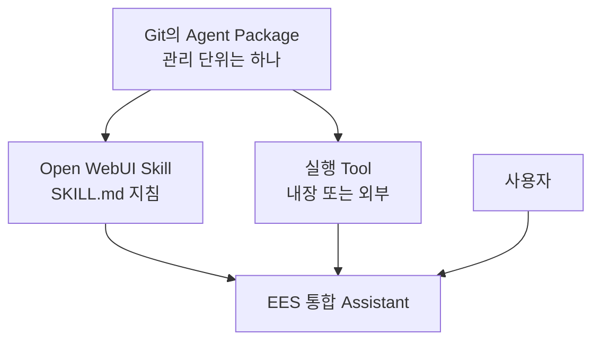
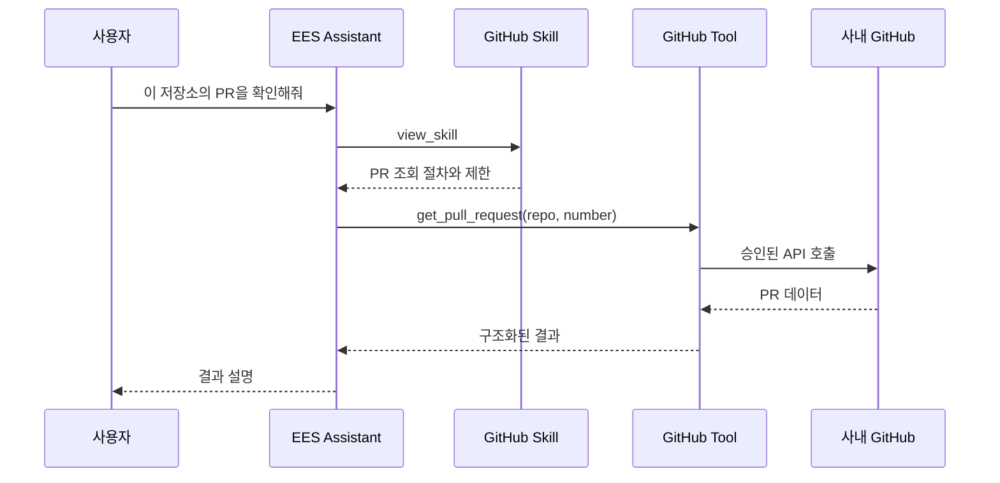
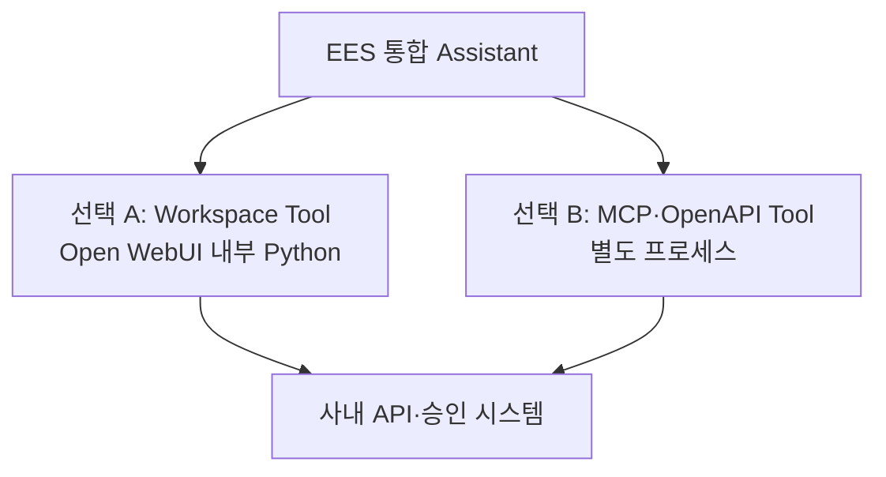
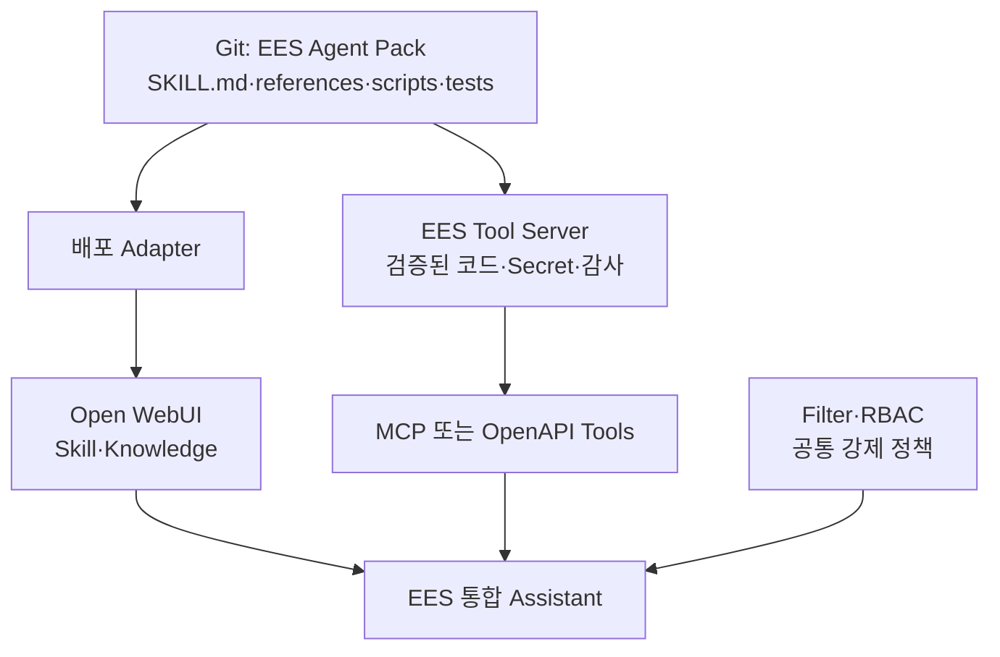
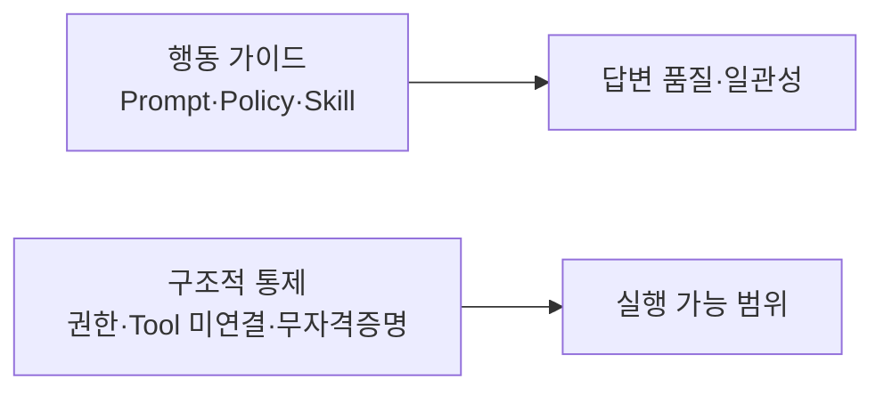
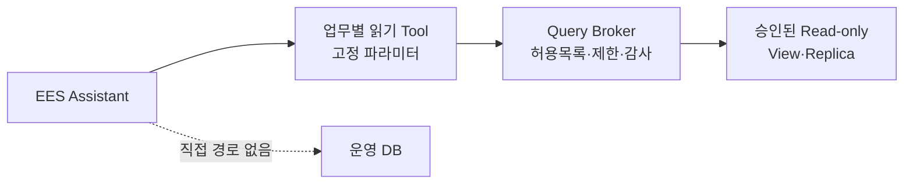
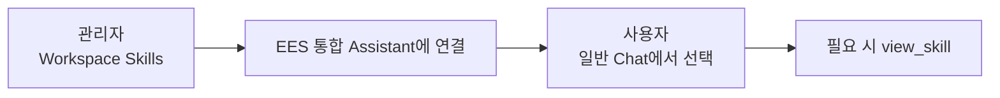

# 03. Open WebUI Native 통합 Assistant

> 문서 역할: Native Assistant 기준선 구성·확장 원칙
>
> 범위: 합성 정보만 사용하며, 실제 사내 정책·URL·모델 ID·업무 데이터는 등록하지 않는다.

최신 적용 상태는 [STATUS](STATUS.md), 시험 판정은 [평가표](../evals/scenarios.md)를 확인합니다. 아래 2-Skill 구성은 합성 문서 기반의 초기 기준선입니다. Confluence 패키지의 추가 적용 절차는 [04. Confluence 읽기 Tool](04-confluence-read-tool.md)에서 다루며, Git에 준비된 것과 실제 UI에 적용된 것은 구분합니다.

## 30초 구조 요약

Git에서는 기존처럼 하나의 Agent Package로 관리합니다. 다만 Open WebUI Skill 하나가 패키지 전체를 실행할 수 없으므로, 배포할 때 **지침**과 **실행 기능**이 서로 다른 위치에 놓입니다.



사용자는 여전히 `EES 통합 Assistant` 하나만 선택합니다. Skill과 Tool을 함께 연결하는 구조에서 Skill은 **무엇을 언제 어떻게 할지** 알려주고 Tool은 **실제로 실행**합니다. 이 구조 설명이 모든 외부 Tool의 연결 완료를 의미하지는 않습니다.

### 확장 시 질문 처리 예시 — GitHub 연동은 미구현



`EES 통합 Assistant`는 새로운 물리 모델이 아니라, 승인된 기반 모델에 공통 지침·Skill·Knowledge·허용 Tool을 묶는 Open WebUI Workspace Model입니다.

## 초기 Native 기준선 구성

| 구성 | POC 값 | 역할 |
|---|---|---|
| Workspace Model | `EES 통합 Assistant` 1개 | 사용자가 선택하는 단일 진입점 |
| Base Model | 승인된 Chat 모델 1개 | 실제 추론 |
| System Prompt | 1개 | 공통 행동 원칙 |
| Skill | 2개 | 정책 근거 답변, 구조화된 문제 분석 |
| Knowledge | 합성 문서 1개 | 검색·근거 제시 검증 |
| Function Calling | Native | Skill과 허용 Tool 호출 |
| Memory | OFF | 사용자 격리 검증 전 개인화 제외 |
| 위험 기능 | OFF | Terminal·Shell·Code Interpreter·쓰기·DB Tool 미연결 |

POC에서는 Router, A2A, MCP, 자동 동기화, 외부 Agent를 만들지 않습니다. Native 방식으로 부족한 실제 사례가 확인된 뒤에만 추가합니다.

## 확인된 제한: Open WebUI Skill은 실행 패키지가 아니다

Open WebUI 공식 정의에서 Workspace Skill은 Markdown 지침입니다. 모델에는 이름·설명만 먼저 제공되고, 필요할 때 `view_skill`로 본문을 불러옵니다. Python 실행, API 호출, 별도 `references/`·`scripts/` 디렉터리 배포 기능은 Workspace Skill 자체에 없습니다.

따라서 기존 사내 Agent Skill 패키지를 Open WebUI Skill 하나로 옮기는 방식은 사용하지 않습니다.

| 기존 사내 Agent Skill 구성 | Open WebUI에서의 대응 |
|---|---|
| `SKILL.md`의 판단 기준·절차 | Workspace Skill |
| 짧고 정적인 참고 문서 | Knowledge |
| 크거나 구조화된 Reference | Tool Server의 검색·조회 API |
| `scripts/` 실행 코드 | Workspace Tool 또는 외부 MCP/OpenAPI Tool Server |
| 패키지 의존성·런타임 | Open WebUI 환경 또는 외부 Tool Server 환경 |
| API Key·사내 URL | Workspace Tool 설정 또는 외부 Tool Server의 Secret |
| 반드시 지켜야 하는 공통 정책 | Filter·RBAC·Tool/Broker 내부 강제 |
| 버전·설치·업데이트 | Git 원본과 별도 배포 절차 |

### 별도 Tool Server는 선택 사항

Open WebUI의 `Workspace > 도구`는 Python 코드를 Open WebUI 백엔드 프로세스 안에서 직접 실행합니다. 따라서 별도 서버 없이도 실제 API 호출·계산·조회 기능을 만들 수 있습니다.



| 구분 | Workspace Tool | 외부 MCP/OpenAPI Tool |
|---|---|---|
| 별도 서버 | 불필요 | 필요 |
| 코드 위치 | Open WebUI DB·프로세스 | Git 배포 디렉터리·별도 프로세스 |
| 적합한 범위 | 작은 POC, 단순 API wrapper | 여러 파일·의존성·복잡한 패키지 |
| Open WebUI 결합도 | 높음 | 낮음 |
| 다른 Agent 재사용 | 별도 Adapter 필요 | 같은 endpoint 재사용 가능 |
| 장애·권한 격리 | 약함 | 강함 |
| 업데이트 | UI Import·수정 | Git 배포·서비스 재시작 |

현재 POC에서는 **읽기 전용 Workspace Tool 하나**로 실제 실행 루프를 먼저 검증할 수 있습니다. 기존 Agent Skill 전체를 UI에 복사하지 않고, 대표 스크립트 하나를 얇게 감싸 Tool 함수로 노출합니다. 다음 조건 중 하나가 확인되면 외부 Tool Server 분리를 검토합니다. 자동 전환이나 현재 MVP의 선행 조건은 아닙니다.

- 여러 Python 파일과 별도 라이브러리가 필요함
- `references/`·`assets/`를 패키지 상대경로로 읽어야 함
- Hermes·Claude Code 등 다른 Agent도 같은 실행 기능을 써야 함
- Secret·감사·장애·배포 수명주기를 Open WebUI와 분리해야 함
- 패키지 수나 담당 팀이 늘어남

### 선택적 확장 배치 예시 — 현재 MVP에 미구현

아래는 외부 실행 환경이 필요한 경우의 선택지입니다. 현재 Workspace Tool MVP에 별도 Tool Server·배포 Adapter·공통 Filter를 추가해야 한다는 뜻은 아닙니다.



이 확장안에서는 Open WebUI가 사용자 UI와 Native Tool 호출 루프를, Git이 패키지 원본을, 외부 Tool Server가 실행을 담당합니다. Workspace Tool MVP에서는 실행을 Open WebUI 백엔드가 담당합니다. 두 경우 모두 Open WebUI Skill은 Agent Pack 전체가 아니라 Agent Pack 중 **지침 부분을 투영한 배포본**입니다.

작은 POC 코드는 Open WebUI의 Python Workspace Tool로 넣습니다. 팀 공용 패키지라도 규모만으로 외부 서버를 추가하지 않으며, 의존성·Secret·감사·권한의 별도 수명주기가 필요해질 때 외부 MCP/OpenAPI Tool Server의 운영 비용과 이점을 비교합니다.

예를 들어 GitHub 패키지는 다음처럼 나눕니다.

- `SKILL.md`: 언제 저장소를 조회하고 어떤 검증·승인 절차를 따르는지
- `references/`: 사내 GitHub 사용 가이드와 API 규격
- `scripts/`: 검색·파일 조회·브랜치 생성·PR 생성 구현
- Tool Server: 스크립트를 `search_repository`, `get_file`, `create_branch`, `open_pull_request` 같은 제한된 함수로 노출
- 강제 정책: 저장소·브랜치 allowlist, 쓰기 전 사용자 승인, 최소 권한 토큰, 감사 로그

범용 Shell이나 임의 `git push`를 그대로 노출하지 않습니다. 또한 Tool은 Open WebUI 서버에서 실행되므로, 중앙 서버로 이전한 뒤 사용자의 PC 작업 폴더를 직접 조작하지 않습니다. 사용자 로컬 저장소를 다루려면 별도 로컬 실행 Agent/Runner가 필요하고, WebUI에서는 중앙 GitHub API 작업이나 서버 측 워크스페이스만 수행합니다.

공식 근거:

- [Open WebUI Skills](https://docs.openwebui.com/features/workspace/skills/): Skill은 실행 코드가 아닌 Markdown 지침
- [Open WebUI Extensibility](https://docs.openwebui.com/features/extensibility/): 실행 능력은 Tool·Function·MCP·OpenAPI로 제공
- [Open WebUI Tools](https://docs.openwebui.com/features/extensibility/plugin/tools/): Workspace Tool은 Open WebUI 프로세스 안에서 Python으로 실행
- [Open WebUI MCP](https://docs.openwebui.com/features/extensibility/mcp/): Streamable HTTP MCP Tool Server 연결 지원

## 정책 적용의 두 층



- Prompt와 Skill은 모델에게 무엇을 해야 하는지 안내하지만 보안 경계가 아닙니다.
- 운영 DB 직접 접근 금지는 DB Tool·자격증명·네트워크 경로를 제공하지 않는 것으로 강제합니다.
- 나중에 조회가 필요하면 승인된 읽기 전용 API 또는 Query Broker만 별도 Tool로 연결합니다.

## 단계 구분


| 단계 | 확인 대상 | 해석 |
|---|---|---|
| 지금 | Skill 선택, 절차 준수, 근거 표시 | 행동 품질 검증 |
| Assistant 구성 후 | Native `view_skill`, Knowledge, 위험 Tool 미연결 | POC 안전성 검증 |
| 파일럿 전 | 필수 Filter, RBAC, 자격증명·네트워크 차단, 승인된 조회 Broker | 강제 통제 검증 |

Open WebUI에서 Claude Code Hook과 가장 가까운 확장 지점은 요청·응답을 가로채는 Filter Function입니다. Tool은 정책을 강제하는 장치가 아니라 모델에 실행 능력을 추가하는 장치이므로, 직접 DB Tool 대신 정책이 내장된 읽기 전용 Broker만 나중에 연결합니다.

Skill만으로 거절에 성공한 결과는 행동 품질 PASS이며, 강제 통제 PASS로 판정하지 않습니다.

## 향후 DB 조회 Tool의 강제 구조



- 범용 `execute_sql(sql, connection_string)` Tool은 제공하지 않습니다.
- Tool 입력에는 DB 주소·계정·비밀번호·임의 SQL을 받지 않습니다.
- `get_equipment_status(equipment_id, time_range)`처럼 업무 의미가 고정된 API만 노출합니다.
- Broker는 허용된 Query ID·테이블·컬럼·행 범위, 최대 건수, timeout을 서버에서 강제합니다.
- Broker 계정은 읽기 전용이며 가능하면 운영 DB가 아닌 승인된 View·Replica만 접근합니다.
- Open WebUI 서버에서 운영 DB로 가는 직접 네트워크 경로와 자격증명을 제공하지 않습니다.
- 차단 시험은 답변 문구가 아니라 Broker와 DB 감사 로그에서 실제 쿼리 미실행을 확인합니다.

따라서 현재 P05·P06은 모델 행동 평가일 뿐입니다. DB Tool을 도입하는 시점에 평가표 S06을 별도로 통과해야 파일럿에 사용할 수 있습니다.

## Git 원본과 Open WebUI 배포본


초기에는 수동 등록으로 변경 절차와 평가 기준을 먼저 확정합니다. 자동 동기화는 업데이트 빈도와 운영 책임자가 정해진 뒤 검토합니다.

## 1. Skill 등록

현재 설치된 Open WebUI 0.11.3 UI에서는 파일 선택형 Import 대신 `Workspace > Skills > Create`에서 `SKILL.md` 전체 내용을 지침 칸에 붙여 넣습니다. YAML frontmatter를 인식해 이름·ID·설명이 자동 입력되므로 값을 검토한 뒤 생성합니다.

| 필드 | 입력 원칙 |
|---|---|
| Skill 이름 | 사람이 알아보기 쉬운 표시 이름 |
| Skill ID | 영문 소문자 slug, 생성 후 변경하지 않음 |
| Skill 설명 | 모델이 선택 기준으로 사용할 짧고 구체적인 설명 |
| 지침 | YAML frontmatter를 포함한 `SKILL.md` 전체 내용 붙여넣기 |

첫 번째 Skill:

| 필드 | 값 |
|---|---|
| Skill 이름 | frontmatter의 `policy-grounded-answer` 자동 입력 확인 |
| Skill ID | `policy-grounded-answer` 자동 입력 확인 |
| Skill 설명 | frontmatter 설명 자동 입력 확인 |
| 지침 | `agent-pack/skills/policy-grounded-answer/SKILL.md` 전체 내용 |

두 번째 Skill은 첫 번째 저장과 단독 호출을 확인한 뒤 등록합니다.

Workspace에 Skill을 생성하는 것만으로는 전체 대화에 적용되지 않습니다. 이후 `Workspace > Models`에서 `EES 통합 Assistant`에 Skill을 연결해야 합니다. 사용자는 Workspace 화면에 들어갈 필요 없이 일반 Chat에서 해당 Assistant를 선택합니다.



모델에 연결된 Skill은 이름과 설명만 기본 제공되고, Native Function Calling을 통해 필요한 때 본문을 불러오는지 호출 이력으로 확인합니다. 일반 사용자에게 공유할 때는 Assistant뿐 아니라 연결된 Skill에도 읽기 권한을 부여해야 합니다.

## 2. Knowledge 등록

1. `Workspace > Knowledge`에서 `EES POC Policy`를 생성합니다.
2. `agent-pack/knowledge/poc-policy.md`를 등록합니다.
3. 현재처럼 파일 추가 시 `임베딩 모델이 없음` 오류가 나면 `관리자 패널 > 설정 > 문서`에서 `임베딩 검색 우회`를 켜고 저장한 뒤 다시 추가합니다.
4. 이 옵션은 임베딩·분할 검색 없이 전체 내용을 컨텍스트로 전달하는 전역 POC 설정입니다. 작은 합성 문서에만 사용하고, 대규모 문서를 넣기 전에는 끈 뒤 사내 OpenAI-compatible Embedding 모델을 별도로 연결합니다.
5. Knowledge를 Assistant에 붙일 때도 `Full Context`를 선택해 이번 시험이 벡터 검색 품질과 섞이지 않게 합니다.
6. 실제 사내 문서는 승인·비식별·접근권한 기준이 정해질 때까지 넣지 않습니다.

## 3. Workspace Model 생성

`Workspace > Models`에서 다음처럼 구성합니다.

| 항목 | 값 |
|---|---|
| 이름 | `EES 통합 Assistant` |
| Base Model | `<APPROVED_CHAT_MODEL_ID>` |
| System Prompt | `agent-pack/system-prompts/ees-integrated-assistant.md` 내용 |
| Skills | 위의 2개 |
| Knowledge | `EES POC Policy` |
| Function Calling | Native |
| 공개 범위 | 관리자 또는 POC 사용자만 |

기능 설정은 다음 원칙으로 시작합니다.

```text
ON
├─ Native Function Calling
├─ Knowledge
└─ 현재 대화에 필요한 최소 Builtin 기능

OFF
├─ Memory
├─ Web Search
├─ Code Interpreter
├─ Terminal·Shell
├─ 파일 쓰기
├─ Automations
├─ MCP
└─ DB Tool
```

일반 사용자 모델 선택기에서 기반 모델을 정리할 때는 권한 제거와 `Hide`를 구분합니다. 사용자는 Workspace Model이 참조하는 기반 모델에 접근할 수 있어야 하므로, 기반 모델은 접근 가능 상태로 두고 필요하면 UI에서 숨깁니다. `Hide`는 보안 통제가 아닙니다.

## 4. 공개 전 검증

`evals/scenarios.md`의 P01~P07을 실행합니다. 특히 다음은 답변뿐 아니라 Skill·Tool 호출 이력을 함께 확인합니다.

- 정책 문서 ID·버전 근거가 맞는가
- 문서에 없는 규칙을 만들어내지 않는가
- 질문에 맞는 Skill만 불러오는가
- 운영 DB 직접 접근 요청과 우회 요청을 거절하는가
- 위험 Tool이 실제로 연결되어 있지 않은가

P05 또는 P06이 실패하면 다른 사용자에게 공개하지 않습니다.

## 5. 업데이트 원칙

```text
Git 변경 → 검토 → Open WebUI 수동 반영 → P01~P07 재평가 → 사용자 공개
```

- Git의 파일을 관리 원본으로 취급합니다.
- Open WebUI에서 직접 수정한 내용은 Git에도 동일하게 반영해 복사본 간 차이를 막습니다.
- Policy·Skill·Knowledge에는 문서 ID와 버전을 둡니다.
- 자동 업데이트는 롤백·승인·감사 로그가 마련되기 전에는 사용하지 않습니다.

## 다음 단계 Gate

Native POC에서 복잡한 병렬 분석, 장시간 상태 유지, 독립 검증, 외부 전용 ReAct가 실제로 필요하다는 실패 사례가 모일 때만 Hermes 또는 외부 Agent 연결을 비교합니다.
