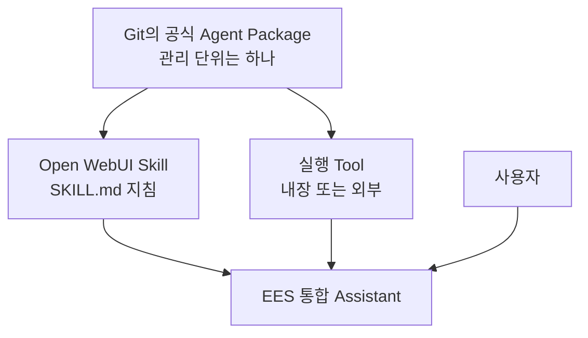
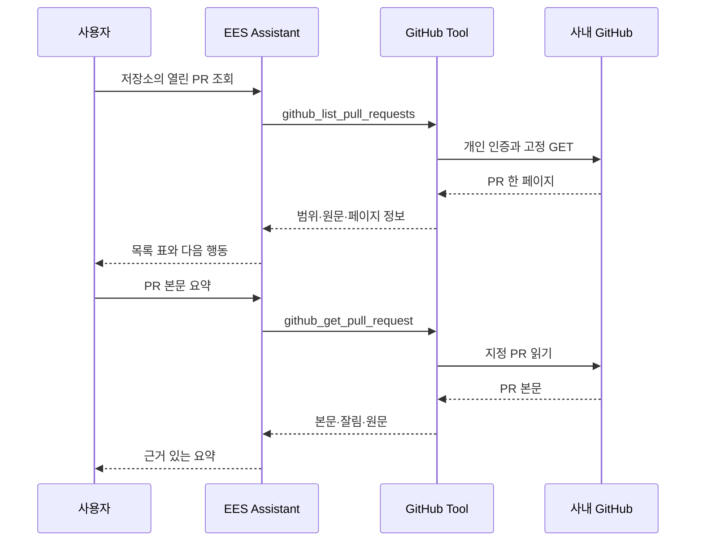
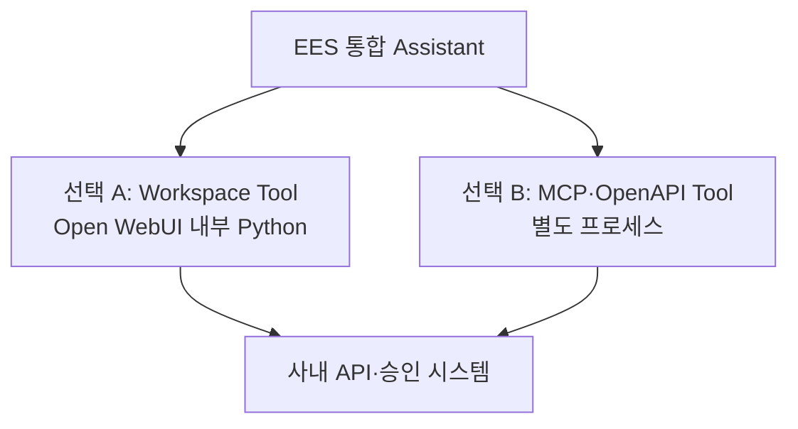
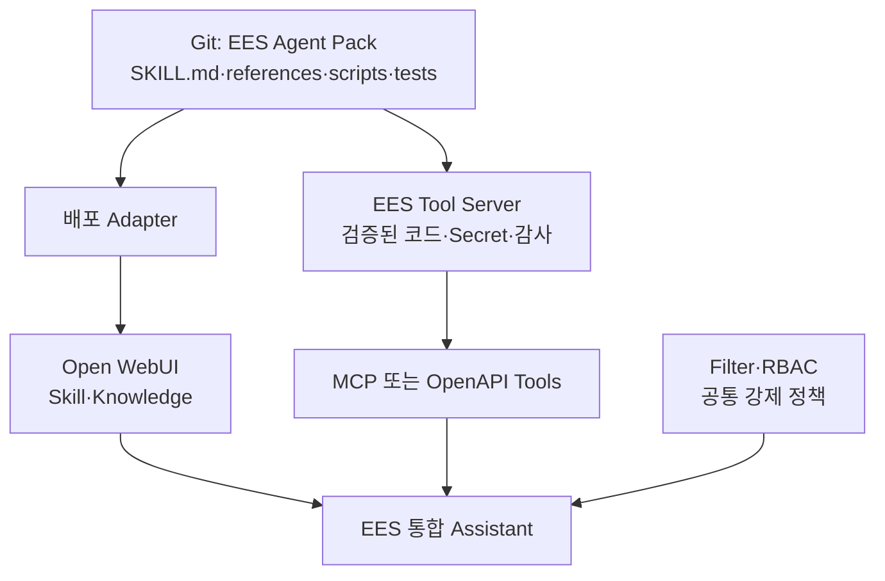
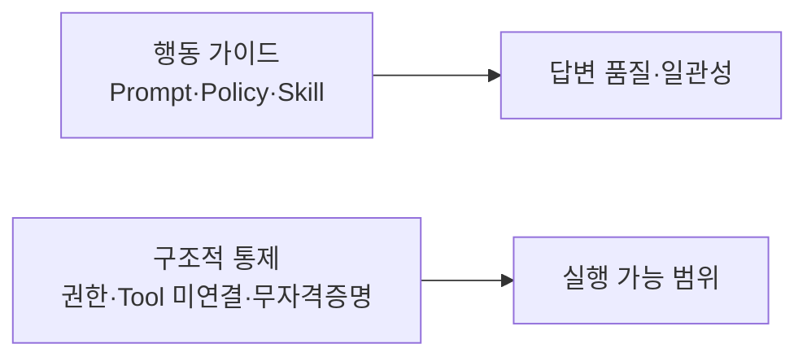
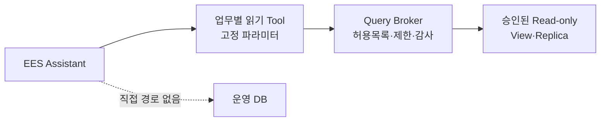
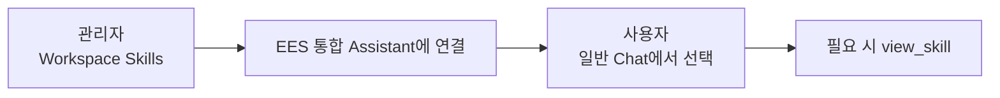

# 03. Open WebUI Native 통합 Assistant

> 문서 역할: Native Assistant 기준선 구성·확장 원칙
>
> 범위: 합성 정보만 사용하며, 실제 사내 정책·URL·모델 ID·업무 데이터는 등록하지 않는다.

최신 적용 상태는 [STATUS](STATUS.md), 시험 판정은 [평가표](../evals/scenarios.md)를 확인합니다. 아래 2-Skill 구성은 합성 문서 기반의 초기 기준선입니다. Confluence 패키지의 추가 적용 절차는 [04. Confluence 읽기 Tool](04-confluence-read-tool.md)에서 다루며, Git에 준비된 것과 실제 UI에 적용된 것은 구분합니다.

## 30초 구조 요약

Git에서는 공식 배포 자산을 하나의 Agent Package로 관리합니다. 팀원이 WebUI에서 만들고 공유하는 개인·팀 자산과의 경계는 [README의 원본과 배포본](../README.md#원본과-배포본)을 따릅니다. Open WebUI Skill 하나가 패키지 전체를 실행할 수 없으므로, 공식 패키지를 배포할 때 **지침**과 **실행 기능**이 서로 다른 위치에 놓입니다.



사용자는 여전히 `EES 통합 Assistant` 하나만 선택합니다. Skill과 Tool을 함께 연결하는 구조에서 Skill은 **무엇을 언제 어떻게 할지** 알려주고 Tool은 **실제로 실행**합니다. 이 구조 설명이 모든 외부 Tool의 연결 완료를 의미하지는 않습니다.

### GitHub PR 읽기 흐름

[GitHub 읽기 Tool](06-github-read-tool.md)을 등록한 뒤의 흐름입니다. 작은 PR 읽기는 별도 Skill 없이 조건부 Prompt와 함수 설명을 사용합니다. 준비·실제 반영 여부는 STATUS를 따릅니다.



`EES 통합 Assistant`는 새로운 물리 모델이 아니라, 승인된 기반 모델에 공통 지침·Skill·Knowledge·허용 Tool을 묶는 Open WebUI Workspace Model입니다.

<a id="assistant-resource-access"></a>

## Assistant 연결과 팀 사용 권한

Open WebUI **0.11.3은 Assistant 연결과 각 자산의 사용 권한을 별도로 검사**합니다. 모델에 Tool/Skill을 선택해도 그 모델을 사용하는 모든 사람에게 해당 자산의 읽기 권한이 자동 부여되지는 않습니다. 권한 없는 Tool은 사용자 목록·실행 준비에서 제외되고, 권한 없는 Skill은 모델 문맥에서 제외되며 `view_skill`에서도 읽기 권한을 확인합니다. 관리자의 기존 정상 동작만으로 일반 사용자 권한을 판단하지 않습니다.

현재는 사용자 선택에 따라 **기존 Skill·Tool·모델을 모두 Public으로 설정한 상태**로 운영합니다. 당분간 팀원만 사용하는 환경을 전제로 그룹별 설정은 후속으로 미룹니다. [사용자 보고](../evals/scenarios.md#team-public-resource-sharing)는 공개 설정 변경 범위이며, Read/Write 세부 값·Knowledge 공개 여부·일반 사용자 조회 성공까지 확인한 것은 아닙니다. 자산 공유 설정은 Windows의 Public 네트워크 프로필과 구분합니다.

아래 **같은 그룹에 필요한 자산의 읽기 권한을 부여**하는 절차는 사용 대상이 넓어지거나 자산별 제한이 필요할 때 사용할 후속 안내입니다. 현재 사용을 위해 그룹 설정을 다시 요구하지 않습니다.

1. 관리자 패널 → Users → Groups에서 대상 그룹을 만들거나 기존 팀 그룹을 사용하고 일반 사용자 계정을 구성원으로 넣습니다.
2. 각 자산의 **Access / 접근 → Add Access / 접근 권한 추가**에서 같은 그룹에 **Read / 읽기**를 부여하고 저장합니다. 기존에 필요한 권한이 있으면 삭제하거나 다시 부여하지 않습니다.

| 대상 | 파일럿 그룹에 맞출 권한·범위 |
|---|---|
| EES 통합 Assistant | 읽기 — 모델 선택·사용 |
| 실제 기반 Chat 모델 | 읽기 — 기존 [기반 모델 권한](troubleshooting.md#user-model-not-found)을 유지하고 새 팀원 범위에 맞춤 |
| 연결한 Skill 3개 | 읽기 — 정책 근거·장애 분석·Confluence 조회 지침. 활성 상태와 기존 연결 유지 |
| 공개할 읽기 Tool | 읽기/사용 — EES Confluence Read·EES Jira Read·EES GitHub Read 중 파일럿에 포함할 항목 |
| 조회에 쓰는 Knowledge | 읽기 — 현재 합성 정책 자료 등 파일럿 범위의 자료 |

3. 팀원은 화면을 새로고침하고 새 대화에서 Assistant를 선택합니다. 관리자가 연결한 기능 중 권한 있는 항목을 사용할 수 있도록 준비하는 것이며 팀원에게 같은 연결 작업을 반복시키지 않습니다. 미확인 일반 사용자 흐름 하나에서 필요한 지침·조회·원문이 동작하는지 확인하고, 기존 관리자 개인 PAT/저장·모델 복구 시험은 반복하지 않습니다.

새 팀원은 **그룹 구성원 추가**로 이미 그룹에 공유한 자산 권한을 받습니다. **새 Tool/Skill을 붙일 때는 그 자산에도 그룹 읽기 권한을 한 번 설정**해야 하며 모델 연결이 권한을 자동 동기화하지는 않습니다. 다른 사용자/그룹·공개 권한으로 이미 받은 접근은 별도이므로 그룹에서 제외하는 것만으로 모든 권한이 제거됐다고 판단하지 않습니다.

여기서 읽기/사용은 **그룹 Permissions의 Tools Access·Skills Access(Workspace 작성·관리)나 자산 Write 권한과 다릅니다**. 연결된 Tool/Skill을 사용하기 위해 작성·관리 스위치를 켤 필요는 없습니다. 기존 Tool 사용과 본인 UserValves/PAT 입력에는 Tool 읽기 권한을 사용하며 코드 수정 권한을 함께 주지 않습니다. 그룹 공유는 Tool 사용 권한을 제공하고, 실제 Confluence/Jira/GitHub 조회는 각자의 PAT와 원 시스템 권한으로 제한합니다. Skill을 팀원이 작성·공유하는 기능은 그 업무를 제공할 때 별도 생성/공유 권한으로 설정합니다.

근거: [v0.11.3 Tool 로더](https://github.com/open-webui/open-webui/blob/v0.11.3/backend/open_webui/utils/tools.py), [Tool 개인 설정 라우터](https://github.com/open-webui/open-webui/blob/v0.11.3/backend/open_webui/routers/tools.py), [Skill 목록 검사](https://github.com/open-webui/open-webui/blob/v0.11.3/backend/open_webui/models/skills.py), [모델 Skill 연결 처리](https://github.com/open-webui/open-webui/blob/v0.11.3/backend/open_webui/utils/middleware.py), [공식 Skill 접근 설명](https://docs.openwebui.com/features/workspace/skills/#access-control), [그룹 기반 권한](https://docs.openwebui.com/features/authentication-access/rbac/). 실제 적용 판정은 [확인 기록](../evals/scenarios.md#assistant-resource-access-followup)을 따릅니다.

<a id="rich-ui"></a>

## 되묻기와 Rich UI 선택 기준

업무 Tool을 연결한 뒤 실제 사용 흐름에 필요한 화면을 선택합니다. Rich UI가 있어야 API 연동을 시작할 수 있는 것은 아닙니다.

필요한 업무 화면은 [실행 계획](STATUS.md#delivery-plan)의 읽기 업무 하나에 포함해 구현합니다. 팀 시연을 위한 이름·소개·빠른 제안과 짧은 시작 안내를 먼저 준비합니다. 조회 결과 Rich UI의 전체 시각 디자인 튜닝은 후속으로 둡니다. 실제 Tool 결과의 필터·펼치기·원문 열기처럼 업무 완료에 필요한 조작을 우선하고, 현재 합성 HTML 예제를 그대로 배포 완료로 간주하지 않습니다.

| 상황 | 우선 사용할 방식 |
|---|---|
| 검색어·대상 등이 모호하거나 후보 중 하나를 골라야 함 | 기본 `ask_user`로 필요한 조건만 확인; 사용할 수 없으면 일반 대화로 질문 |
| 정해진 여러 값을 한 번 입력 | 기존 프롬프트 변수 입력 화면으로 충족되는지 먼저 확인 |
| 짧은 답변·소수의 결과 링크 | 일반 채팅 답변 |
| 받은 결과를 반복해서 필터링·펼치기·비교 | 업무 Tool 또는 사용자 클릭 Action에서 반환하는 Rich UI |

`ask_user`는 [Open WebUI 0.11.3 내장 Tool](https://github.com/open-webui/open-webui/blob/v0.11.3/backend/open_webui/utils/tools.py)입니다. Native 호출·내장 Tool·User Input 설정과 모델의 실제 호출 여부를 해당 환경에서 확인합니다. 알려진 조건을 다시 입력시키거나 동일한 질문용 Tool을 새로 만들지 않습니다.

Rich UI를 구현할 때의 경계:

- 모델이 업무 Tool을 선택하면 연결된 코드가 조회·입력·권한 검증 후 화면을 반환할 수 있습니다. [Jira 대시보드](05-jira-read-tool.md#5-구현-경계와-운영)에 이어 [GitHub PR 카드](06-github-read-tool.md#followup-update)·[Confluence 검색/본문 카드](04-confluence-read-tool.md#rich-ui-results)를 기존 Tool 안에 준비했습니다. 실제 적용 상태는 STATUS를 따릅니다. [0.11.3 Action 처리](https://github.com/open-webui/open-webui/blob/v0.11.3/backend/open_webui/utils/actions.py)도 Rich UI 반환을 지원하지만 별도 Action은 이 패키지에 구현하지 않았습니다. HTML은 고정 템플릿으로 만들고 외부 자료는 텍스트로 삽입합니다.
- `HTMLResponse`와 `Content-Disposition: inline`으로 화면을 반환하고, 모델의 설명에 필요한 데이터는 `(HTMLResponse, context)`로 함께 제공합니다. HTML만 반환했다고 모델이 화면 내용을 읽을 수 있다고 가정하지 않습니다. [공식 Rich UI 안내](https://docs.openwebui.com/features/extensibility/plugin/development/rich-ui/)
- 받은 결과 안의 필터·상세 펼치기는 브라우저에서 처리합니다. 추가 검색·본문 조회는 업무 Tool과 사용자별 권한 검사를 거칩니다. iframe에 PAT를 넣거나 원 시스템 API를 직접 호출시키지 않습니다.
- Rich UI 안의 HTML 버튼은 자동으로 Python Tool을 재호출하지 않습니다. 현재 Jira 시스템/다음 목록·GitHub 다음 목록 질문은 `input:prompt`로 입력 초안을 전달하고 사용자가 검토·전송합니다. 문서·PR·이슈의 본문 질문 버튼은 제거했으며 본문은 같은 대화에서 대상을 지정해 요청합니다. 기존 입력을 바꿀 수 있다는 안내와 복사 가능한 초안을 제공하며 자동 전송·원 시스템 직접 API 호출·same-origin 권한 추가는 하지 않습니다.
- 저장된 채팅의 화면은 당시 결과일 수 있습니다. 갱신 여부를 표시하고, 필터·입력 상태가 재접속 후 자동 복원되거나 항상 최신이라고 설명하지 않습니다.

코드 위치는 [AGENTS의 구현 규칙](../AGENTS.md#3-구현-위치와-과설계-방지)을 따릅니다. 기능별 API 코드는 원 시스템에 요청하는 클라이언트 코드입니다. 원 시스템 서버 구현을 이 저장소에 가져오지 않으며, 둘 이상의 실제 기능에서 같은 코드의 반복 수정이 생기면 공통화를 검토합니다.

### 후속 연동을 시작할 때

아래 표는 새 연동을 선정할 때의 범용 검토 기준입니다. 이미 연결한 Confluence·Jira·GitHub의 제품·인증을 다시 확인하는 순서가 아닙니다. 현재 구현·배포 상태와 진행 순서는 [STATUS](STATUS.md)에서 관리합니다.

| 대상 | 구현 전에 확인할 정보 | 첫 읽기 기능 후보 | Rich UI 후보 |
|---|---|---|---|
| Confluence | 제품·버전, 개인 인증, 허용 Space | 문서 검색·본문 조회 | [검색·본문·근거 카드](04-confluence-read-tool.md#rich-ui-results) |
| Jira | Cloud/Data Center·버전, 개인 인증, 허용 프로젝트·조회 필드 | 이슈 검색·상세 조회 | 이슈 목록에서 상태·담당자별 좁히기, 상세 펼치기 |
| GitHub | GitHub.com/Enterprise Server·버전, 개인 인증, 허용 저장소 | 이슈·PR 목록과 상세 조회 | PR 목록의 리뷰·검사 상태 비교 |

주소·토큰 값은 승인된 실행 환경에 설정합니다. Confluence의 PAT 방식이나 API 경로를 Jira/GitHub에 그대로 복제하지 않습니다. 각 Tool은 안정적인 원본 ID·URL, 조회 범위·일시, 오류와 부분 결과 여부를 반환하도록 실제 API 응답에 맞춰 설계합니다. 상태 필드가 없거나 권한 때문에 못 읽은 경우를 완료·통과로 바꾸지 않습니다.

문서–이슈–PR 연결 화면은 원문에 명시된 링크·ID를 우선 사용합니다. 제목의 유사성만으로 관계를 확정하지 않습니다. 이슈 생성·수정이나 PR 쓰기 작업은 별도 후속 범위이며, 화면을 먼저 만든 것으로 실행 기능까지 구현됐다고 판단하지 않습니다.

### 업무 흐름 하나를 배포하는 단위

- 제품/버전·개인 인증 방식·첫 조회 업무를 한 번에 확인합니다. 예를 들어 Jira의 특정 프로젝트 열린 이슈 조회처럼 좁게 시작하고, 허용 프로젝트·필드는 승인된 사내 설정으로 제한합니다. 기능 수가 늘기 전에 공통 adapter·registry를 만들지 않습니다.
- 검색 → 받은 결과 탐색 → 필요한 상세/원문 확인까지 준비합니다. 모델이 고정 Tool의 인자를 선택하고, 화면과 모델 답변은 같은 조회 데이터를 사용합니다. 추가 API 조회가 필요한 버튼은 별도 동작으로 구현·검증하기 전까지 약속하지 않습니다.
- 처음 쓰는 팀원에게 실제 가능한 질문 예시 3개와 부족한 조건의 입력 방법을 제공합니다. 일반 요약·Confluence 문서 찾기·새 이슈 조회처럼 연결된 기능만 소개하며 Skill 이름이나 모델 선택법을 학습해야 업무를 시작하는 구조로 만들지 않습니다.
- GPT가 가능한 코드·합성 시험을 끝낸 뒤 사내에서는 정상 업무 흐름·권한 제한·대표 실패와 실제 화면을 짧은 묶음으로 확인합니다. [사용성·공유 기준](../evals/scenarios.md#usability)은 파일럿 참여자의 실제 사용으로 확인합니다.
- 팀원 Prompt·Skill 생성/공유 권한은 필요한 범위로 설정하고 같은 파일럿에서 공유·비공유 사용자를 확인합니다. Python Tool 등록·수정 권한이나 자격증명 공유를 함께 열지 않습니다. 공식 채택과 Git 관리는 [원본 경계](../README.md#원본과-배포본)를 따릅니다.

## 초기 Native 기준선 구성

| 구성 | POC 값 | 역할 |
|---|---|---|
| Workspace Model | `EES 통합 Assistant` 1개 | 사용자가 선택하는 단일 진입점 |
| Base Model | 승인된 Chat 모델 1개 | 실제 추론 |
| System Prompt | 1개 | 공통 행동 원칙 |
| Skill | 2개 | 정책 근거 답변, 구조화된 문제 분석 |
| Knowledge | 합성 문서 1개 | 검색·근거 제시 검증 |
| Function Calling | Native | Skill과 허용 Tool 호출 |
| Memory | Capabilities와 Builtin Tools 모두 OFF | 사용자 격리 검증 전 개인화 제외; [제어 범위](troubleshooting.md#native-memory-controls) |
| Chat History | OFF | 초기 시험에서는 다른 대화 내용을 자동 검색하지 않음; Memory와 별도 설정 |
| 위험 기능 | OFF | Terminal·Shell·Code Interpreter·쓰기·DB Tool 미연결 |

POC에서는 Router, A2A, MCP, 자동 동기화, 외부 Agent를 만들지 않습니다. Native 방식으로 부족한 실제 사례가 확인된 뒤에만 추가합니다.

## 확인된 제한: Open WebUI Skill은 실행 패키지가 아니다

Open WebUI 공식 정의에서 Workspace Skill은 Markdown 지침입니다. 0.11.3에서 기본 내장 Tool을 사용하는 대화는 연결된 Skill의 이름·설명을 먼저 제공하고 필요할 때 `view_skill`로 본문을 불러옵니다. 사용자가 `$`로 Skill을 직접 지정하거나 내장 Tool을 사용하지 않는 경로에서는 본문을 직접 제공합니다. 따라서 `view_skill` 호출이 없다는 이유만으로 Skill이 적용되지 않았다고 판단하지 않습니다. [0.11.3 Skill 처리](https://github.com/open-webui/open-webui/blob/v0.11.3/backend/open_webui/utils/middleware.py)

Python 실행, API 호출, 별도 `references/`·`scripts/` 디렉터리 배포 기능은 Workspace Skill 자체에 없습니다.

따라서 기존 사내 Agent Skill 패키지를 Open WebUI Skill 하나로 옮기는 방식은 사용하지 않습니다.

| 기존 사내 Agent Skill 구성 | Open WebUI에서의 대응 |
|---|---|
| `SKILL.md`의 판단 기준·절차 | Workspace Skill |
| 짧고 정적인 참고 문서 | Knowledge |
| 크거나 구조화된 Reference | Workspace Tool 또는 필요 시 외부 Tool Server의 검색·조회 API |
| `scripts/` 실행 코드 | Workspace Tool 또는 외부 MCP/OpenAPI Tool Server |
| 패키지 의존성·런타임 | Open WebUI 환경 또는 외부 Tool Server 환경 |
| API Key·사내 URL | Workspace Tool 설정 또는 외부 Tool Server의 Secret |
| 상시 공통 행동 원칙 | EES Assistant의 System Prompt; 지침 준수와 기계적 차단은 구분 |
| 코드로 판정할 수 있는 실행 제한 | RBAC·Tool/Broker 내부 검사; 입출력 검사에 필요한 경우 Filter 검토 |
| 공식 배포 자산의 버전·설치·업데이트 | Git 원본과 별도 배포 절차 |

<a id="managed-policy-workflow"></a>

### EES의 공통 정책과 관리자 워크플로

[프로젝트 목표](../README.md#프로젝트-목표)의 공통 정책은 **EES Assistant 사용 시** 적용합니다. 개인 모델·개인 Assistant는 대상에서 제외합니다. 현재 공통 지침은 해당 Workspace Model에 두며, 향후 확장을 사용하더라도 이 적용 범위를 유지합니다. 실제 배포 여부는 [STATUS](STATUS.md)에서 관리합니다.

정책은 무엇을 지키고 허용할지 정하는 원칙이고, 워크플로는 어떤 입력을 받아 어떤 순서·분기·확인 절차로 처리할지 정하는 업무 흐름입니다. 관리자가 단계를 정의하는 능력을 별도 목표로 두며, 현재 Skill의 절차 지침과 Native의 도구 선택만으로 실행 순서·검사가 보장된다고 보지 않습니다.

| 필요한 동작 | 우선 검토할 수단과 경계 |
|---|---|
| 모든 EES 답변에 공통 원칙 전달 | 기존 System Prompt. 긴 상세 절차는 필요한 Skill로 분리하며 정책 질문 때만 읽는 Skill에 공통 원칙을 전부 맡기지 않음 |
| 특정 업무의 처리 절차 안내 | Skill. 필요한 때 참고하는 지침이며 필수 단계 실행 여부는 별도로 확인 |
| 요청·응답의 정해진 시점에서 처리 | Hook 역할의 Filter 후보. 검사 위치가 실제 필요한 단계와 맞는지 확인하고, Tool 실행 권한은 해당 실행 코드에서도 검사 |
| 필수 조회·검사의 고정 순서와 분기 | 작은 업무 Tool 안에서 순서·중단·오류를 코드로 제어할 수 있는지 먼저 검토 |
| 여러 모델/도구의 단계·분기·병렬 실행 제어 | Pipe 또는 외부 워크플로/Agent를 비교할 수 있음. 기존 방식으로 충족하기 어려운 대표 업무 요구를 기준으로 선택하며 자동 도입하지 않음 |

공식 [Filter 설명](https://docs.openwebui.com/features/extensibility/plugin/functions/filter/)은 요청·응답 처리 지점을, [Function 설명](https://docs.openwebui.com/features/extensibility/plugin/functions/)은 Pipe의 다단계 처리 제어를 설명합니다. 이는 구현 후보의 역할 참고이며 현재 0.11.3 사내 환경에서 연결·검증했다는 뜻은 아닙니다. 실제 구현 단계에서 해당 버전과 EES에만 적용되는 범위·스트리밍·호출 횟수를 확인합니다.

첫 워크플로는 기존 문서/조회 기능을 재사용하는 업무 하나로 입력·단계·분기·완료 조건을 먼저 정의합니다. 단순 대화까지 계획·검토용 모델 호출을 매번 추가하지 않으며, 워크플로가 필요한 요청에만 추가 단계를 적용합니다. 모델 수·단계 수·외부 서버를 늘릴 때는 업무 효과와 호출/유지보수 비용을 비교합니다. 시각적 워크플로 편집기나 다중 Agent가 필수라는 뜻은 아닙니다.

### 별도 Tool Server는 선택 사항

Open WebUI의 `Workspace > 도구`는 Python 코드를 Open WebUI 백엔드 프로세스 안에서 직접 실행합니다. 따라서 별도 서버 없이도 실제 API 호출·계산·조회 기능을 만들 수 있습니다.



| 구분 | Workspace Tool | 외부 MCP/OpenAPI Tool |
|---|---|---|
| 별도 서버 | 불필요 | 필요 |
| 코드 위치 | Open WebUI DB·프로세스 | Git 배포 디렉터리·별도 프로세스 |
| 적합한 범위 | 작은 POC, 단순 API wrapper | 여러 파일·의존성·복잡한 패키지 |
| Open WebUI 결합도 | 높음 | 낮음 |
| 다른 Agent 재사용 | 별도 Adapter 필요 | 같은 endpoint 재사용 가능 |
| 장애·권한 격리 | WebUI 프로세스를 공유; Tool 내부 검증 필요 | 별도 분리·통제 가능; 실제 배포 설계에 따름 |
| 업데이트 | UI Import·수정 | Git 배포·서비스 재시작 |

현재 POC에서는 **읽기 전용 Workspace Tool 하나**로 실제 실행 루프를 먼저 검증할 수 있습니다. 기존 Agent Skill 전체를 UI에 복사하지 않고, 대표 스크립트 하나를 얇게 감싸 Tool 함수로 노출합니다. 다음 조건 중 하나가 확인되면 외부 Tool Server 분리를 검토합니다. 자동 전환이나 현재 MVP의 선행 조건은 아닙니다.

- 여러 Python 파일과 별도 라이브러리가 필요함
- `references/`·`assets/`를 패키지 상대경로로 읽어야 함
- Hermes·Claude Code 등 다른 Agent도 같은 실행 기능을 써야 함
- Secret·감사·장애·배포 수명주기를 Open WebUI와 분리해야 함
- 패키지 수나 담당 팀이 늘어남

### 선택적 확장 배치 예시 — 현재 MVP에 미구현

아래는 외부 실행 환경이 필요한 경우의 선택지입니다. 현재 Workspace Tool MVP에 별도 Tool Server·배포 Adapter·공통 Filter를 추가해야 한다는 뜻은 아닙니다.



이 확장안에서는 Open WebUI가 사용자 UI와 Native Tool 호출 루프를, Git이 공식 패키지 원본을, 외부 Tool Server가 실행을 담당합니다. Workspace Tool MVP에서는 실행을 Open WebUI 백엔드가 담당합니다. 두 경우 모두 패키지에서 등록한 Open WebUI Skill은 Agent Pack 전체가 아니라 Agent Pack 중 **지침 부분을 투영한 배포본**입니다.

작은 POC 코드는 Open WebUI의 Python Workspace Tool로 넣습니다. 팀 공용 패키지라도 규모만으로 외부 서버를 추가하지 않으며, 의존성·Secret·감사·권한의 별도 수명주기가 필요해질 때 외부 MCP/OpenAPI Tool Server의 운영 비용과 이점을 비교합니다.

현재 [GitHub PR 읽기](06-github-read-tool.md)는 단일 Workspace Tool로 준비했습니다. 아래는 향후 파일 검색·가이드가 필요한 경우의 확장 예시이며 현재 구현 목록이 아닙니다.

- `SKILL.md`: 언제 저장소를 조회하고 근거와 조회 제한을 어떻게 확인하는지
- `references/`: 사내 GitHub 사용 가이드와 API 규격
- `scripts/`: 검색·파일·PR 조회 구현
- Workspace Tool 또는 필요한 경우 Tool Server: `search_repository`, `get_file`, `get_pull_request` 같은 제한된 함수 노출
- 강제 정책: 허용 저장소·조회 범위, 사용자별 권한, 응답 크기·시간 제한

브랜치·PR 생성 같은 쓰기 기능과 그 승인 절차는 읽기 MVP 이후 별도 범위에서 검토합니다.

범용 Shell이나 임의 `git push`를 그대로 노출하지 않습니다. 또한 Tool은 Open WebUI를 실행하는 호스트에서 실행됩니다. 기존 Windows PC를 팀 파일럿 호스트로 사용해도 팀원의 브라우저가 열린 PC에서 실행되는 것은 아닙니다. 사용자 로컬 저장소를 다루려면 별도 로컬 실행 Agent/Runner가 필요하고, 현재 GitHub 읽기 기능은 호스트에서 GitHub API를 호출합니다.

공식 근거:

- [Open WebUI Skills](https://docs.openwebui.com/features/workspace/skills/): Skill은 실행 코드가 아닌 Markdown 지침
- [Open WebUI Extensibility](https://docs.openwebui.com/features/extensibility/): 실행 능력은 Tool·Function·MCP·OpenAPI로 제공
- [Open WebUI Tools](https://docs.openwebui.com/features/extensibility/plugin/tools/): Workspace Tool은 Open WebUI 프로세스 안에서 Python으로 실행
- [Open WebUI MCP](https://docs.openwebui.com/features/extensibility/mcp/): Streamable HTTP MCP Tool Server 연결 지원

## 정책 적용의 두 층



- Prompt와 Skill은 모델에게 무엇을 해야 하는지 안내하지만 보안 경계가 아닙니다.
- 운영 DB 직접 접근 금지는 DB Tool·자격증명·네트워크 경로를 제공하지 않는 것으로 강제합니다.
- 나중에 조회가 필요하면 승인된 읽기 전용 API 또는 Query Broker만 별도 Tool로 연결합니다.

## 단계 구분

현재 진행 단계는 [STATUS](STATUS.md#delivery-plan), 항목별 판정과 실행 시점은 [평가표](../evals/scenarios.md#validation-timing)를 따릅니다. 아래는 검증 범위를 구분하는 기준이며 위 행 전체를 통과해야 다음 행의 개발을 시작하는 순서가 아닙니다.

| 단계 | 확인 대상 | 해석 |
|---|---|---|
| 기본 Assistant | Skill 선택, 절차 준수, Knowledge 조회·근거 표시 | 사내 모델의 행동 품질 검증 |
| 읽기 Tool 연결 | 입력 제한, 사용자별 인증·권한, 실패 처리, 위험 Tool 미연결 | 실제 실행 경로 검증 |
| 다른 사용자에게 공개 전 | 자산 접근 권한, 비밀 저장, 사용자 간 데이터 격리 | 해당 연결 기능의 실환경 평가 |

Tool은 실행 능력을 제공하며 입력 제한·권한 검사도 Tool 코드에서 강제할 수 있습니다. 한 Tool의 제한이 다른 Tool까지 통제하는 것은 아닙니다. 요청·응답을 가로채는 Filter Function이나 외부 Broker는 별도 통제의 필요가 확인될 때 검토하며, 현재 Confluence Workspace Tool MVP의 자동 선행 조건으로 두지 않습니다.

Skill만으로 거절에 성공한 결과는 행동 품질 PASS이며, 강제 통제 PASS로 판정하지 않습니다.

## 향후 DB 조회 Tool의 강제 구조



- 범용 `execute_sql(sql, connection_string)` Tool은 제공하지 않습니다.
- Tool 입력에는 DB 주소·계정·비밀번호·임의 SQL을 받지 않습니다.
- `get_equipment_status(equipment_id, time_range)`처럼 업무 의미가 고정된 API만 노출합니다.
- Broker는 허용된 Query ID·테이블·컬럼·행 범위, 최대 건수, timeout을 서버에서 강제합니다.
- Broker 계정은 읽기 전용이며 가능하면 운영 DB가 아닌 승인된 View·Replica만 접근합니다.
- Open WebUI 서버에서 운영 DB로 가는 직접 네트워크 경로와 자격증명을 제공하지 않습니다.
- 차단 시험은 답변 문구가 아니라 Broker와 DB 감사 로그에서 실제 쿼리 미실행을 확인합니다.

따라서 현재 P05·P06은 모델 행동 평가일 뿐입니다. 향후 승인된 DB 조회 중계 경로를 도입하면 [평가표 S06](../evals/scenarios.md)의 실제 통제 증거를 확인해야 합니다. 이는 운영 DB 직접 접속 Tool을 허용하거나 Confluence 문서 조회에 별도 Broker를 요구한다는 뜻이 아닙니다.

## 공식 Git 원본과 Open WebUI 배포본

아래 절차는 담당자가 공식으로 채택한 배포 자산에 적용합니다. 팀원의 개인·팀 자산 작성과 허용된 범위의 공유에 매번 담당자 승인을 요구하지 않습니다. 관리 경계는 [README의 원본과 배포본](../README.md#원본과-배포본)을 따릅니다.


초기에는 수동 등록으로 변경 절차와 평가 기준을 먼저 확정합니다. 자동 동기화는 업데이트 빈도와 운영 책임자가 정해진 뒤 검토합니다.

## 1. Skill 등록

현재 설치된 Open WebUI 0.11.3 UI에서는 파일 선택형 Import 대신 `Workspace > Skills > Create`에서 `SKILL.md` 전체 내용을 지침 칸에 붙여 넣습니다. YAML frontmatter를 인식해 이름·ID·설명이 자동 입력되므로 값을 검토한 뒤 생성합니다.

| 필드 | 입력 원칙 |
|---|---|
| Skill 이름 | 사람이 알아보기 쉬운 표시 이름 |
| Skill ID | 영문 소문자 slug, 생성 후 변경하지 않음 |
| Skill 설명 | 모델이 선택 기준으로 사용할 짧고 구체적인 설명 |
| 지침 | YAML frontmatter를 포함한 `SKILL.md` 전체 내용 붙여넣기 |

첫 번째 Skill:

| 필드 | 값 |
|---|---|
| Skill 이름 | frontmatter의 `policy-grounded-answer` 자동 입력 확인 |
| Skill ID | `policy-grounded-answer` 자동 입력 확인 |
| Skill 설명 | frontmatter 설명 자동 입력 확인 |
| 지침 | `agent-pack/skills/policy-grounded-answer/SKILL.md` 전체 내용 |

두 번째 Skill은 첫 번째 저장과 단독 호출을 확인한 뒤 등록합니다.

Workspace에 Skill을 생성하는 것만으로는 전체 대화에 적용되지 않습니다. 이후 `Workspace > Models`에서 `EES 통합 Assistant`에 Skill을 연결해야 합니다. 사용자는 Workspace 화면에 들어갈 필요 없이 일반 Chat에서 해당 Assistant를 선택합니다.



현재 기준선의 Native·내장 Tool 사용 경로에서는 Skill을 직접 지정하지 않은 질문으로 필요한 본문을 불러오는지 호출 이력을 확인합니다. `$`로 직접 지정한 시험과 자동 선택 시험은 구분하며, 지침 준수도 실제 사내 모델에서 확인합니다. 일반 사용자에게 공유할 때는 Assistant뿐 아니라 연결된 Skill에도 읽기 권한을 부여해야 합니다.

## 2. Knowledge 등록

1. `Workspace > Knowledge`에서 `EES POC Policy`를 생성합니다.
2. `agent-pack/knowledge/poc-policy.md`를 등록합니다.
3. 현재처럼 파일 추가 시 `임베딩 모델이 없음` 오류가 나면 `관리자 패널 > 설정 > 문서`에서 `임베딩 검색 우회`를 켜고 저장한 뒤 다시 추가합니다.
4. 이 옵션은 파일 등록·소스 본문 처리에서 임베딩을 우회하는 전역 POC 설정입니다. Native의 `query_knowledge_files` 의미 검색은 별도로 임베딩을 사용하므로 이 옵션으로 동작을 보장하지 않습니다. 작은 합성 문서에만 사용하고, 대규모 문서를 넣기 전에는 승인된 임베딩 경로를 별도로 구성·검증합니다.
5. Knowledge를 Assistant에 붙일 때도 `Full Context`를 선택해 이번 시험이 벡터 검색 품질과 섞이지 않게 합니다.
6. 실제 사내 문서는 승인·비식별·접근권한 기준이 정해질 때까지 넣지 않습니다.

`Full Context`를 설정해도 Native에서 모델에 연결한 Knowledge 본문이 자동 주입된다고 가정하지 않습니다. [0.11.3 처리 코드](https://github.com/open-webui/open-webui/blob/v0.11.3/backend/open_webui/utils/middleware.py)는 모델 Knowledge 자동 주입과 Native 내장 조회 경로를 구분합니다. 실제 Knowledge 조회 Tool 호출과 답변 근거를 확인합니다.

임베딩 검색이 아직 준비되지 않은 작은 합성 Knowledge는 [Prompt의 자료 조회 경로](../agent-pack/system-prompts/ees-integrated-assistant.md#현재-poc의-자료-조회-경로)에 따라 목록·파일명 검색으로 파일 ID를 찾고 본문을 읽습니다. `query_knowledge_files`에서 임베딩 오류가 나면 [Native 지식 검색 진단](troubleshooting.md#native-knowledge-embedding)을 따릅니다. Knowledge 전체를 끄면 기존 정책 본문 조회도 영향을 받으므로 임베딩 오류 회피를 위해 일괄 비활성화하지 않습니다.

## 3. Workspace Model 생성

`Workspace > Models`에서 다음처럼 구성합니다.

| 항목 | 값 |
|---|---|
| 이름 | `EES 통합 Assistant` |
| Base Model | `<APPROVED_CHAT_MODEL_ID>` |
| System Prompt | `agent-pack/system-prompts/ees-integrated-assistant.md` 내용 |
| Skills | 위의 2개 |
| Knowledge | `EES POC Policy` |
| Function Calling | Native |
| 공개 범위 | 현재 팀원 사용 환경에서 Public 설정 보고. [현재 운영·후속 그룹 안내](#assistant-resource-access) 참고 |

기능 설정은 다음 원칙으로 시작합니다.

```text
ON
├─ Native Function Calling
├─ Knowledge
└─ 현재 대화에 필요한 최소 Builtin 기능

OFF
├─ Memory
├─ Chat History
├─ Web Search
├─ Code Interpreter
├─ Terminal·Shell
├─ 파일 쓰기
├─ Automations
├─ MCP
└─ DB Tool
```

일반 사용자 모델 선택기에서 기반 모델을 정리할 때는 권한 제거와 `Hide`를 구분합니다. 사용자는 Workspace Model이 참조하는 기반 모델에 접근할 수 있어야 하므로, 기반 모델은 접근 가능 상태로 두고 필요하면 UI에서 숨깁니다. `Hide`는 보안 통제가 아닙니다.

Web Search·Code Interpreter·Terminal은 **Workspace → Models → EES 통합 Assistant 편집 → Capabilities**에서 각각 OFF로 확인합니다. 켜진 항목만 해제한 뒤 **저장 및 업데이트 → 새로고침 → 다시 편집**하여 저장된 상태를 확인합니다. 기존 Confluence 읽기 Tool·Skill·Knowledge 연결은 유지합니다.

Tools의 선택 목록과 내장 기능 설정은 별도입니다. Tools에 Confluence만 선택돼 있어도 Web Search·Terminal의 OFF를 확인한 것은 아닙니다. 반대로 기능 ON만으로 외부 서버 연결이나 실제 웹 조회·명령 실행이 확인된 것도 아닙니다. 실제 기능 노출에는 별도 설정·연결 등의 조건이 있으며, [v0.11.3 내장 Tool 조건](https://github.com/open-webui/open-webui/blob/v0.11.3/backend/open_webui/utils/tools.py)을 참고합니다. S04/S05는 확인한 구성·실행 범위를 구분해 기록하며 주소·DB 접속정보·토큰 값은 수집하지 않습니다.

Memory는 모델 편집 화면의 **Capabilities → Memory**와 **Builtin Tools → Memory**를 모두 해제합니다. 내장 Memory 도구만 끄면 자동 문맥 주입·응답 후 검토 경로까지 꺼지는 것은 아닙니다. [Memory 제어 범위](troubleshooting.md#native-memory-controls)를 따릅니다.

과거 대화 검색도 끄려면 **Builtin Tools → Chat History**를 해제하고 저장합니다. Memory OFF만으로는 `search_chats`·`view_chat`이 꺼지지 않습니다. 정확한 설정·재확인 순서는 [새 대화에서 과거 내용을 찾는 경우](troubleshooting.md#native-chat-history)를 따릅니다. 이는 초기 MVP의 대화 분리 기준이며, 이후 같은 계정의 이전 대화 검색을 제공하려면 기능·사용자 안내·평가 기준을 함께 조정합니다.

<a id="first-use-entry"></a>

### 기존 Assistant의 팀 시연용 첫 화면 — 적용 준비

사용자가 여섯 목표의 본격 구현 전에 팀원 시연을 위한 이름·로고·빠른 제안과 배포 방식을 먼저 준비하자고 요청했습니다. [이전 보류 결정](../evals/scenarios.md#onboarding-deferred)은 당시 이력으로 보존하고 소개·예시와 짧은 시작 안내의 준비를 재개합니다. 아래 네 가지는 시작 예시이며 범용 Assistant의 역할·최종 기능 목록을 제한하지 않습니다. 준비·실제 UI 저장·팀원 시연 결과는 구분합니다.

이미 동작하는 Assistant에서 **표시 이름·소개 문구·예시 질문**을 정리합니다. 초기 기준선의 Skill 2개로 되돌리거나 모델·Tool을 다시 만들지 않습니다. 기존 System Prompt·기능·개인 설정은 유지합니다. 이 절은 적용 안내이며 실제 UI 저장 여부는 [STATUS](STATUS.md)에 기록합니다.

1. **Workspace → Models → 기존 EES 통합 Assistant 편집**을 엽니다. 표시 이름은 `EES Assistant`로 정리하되 기존 모델 ID와 연결은 유지합니다. 이 변경은 서비스 전체 로고·이름 교체와 별개입니다. 기존 이름·소개·제안을 원복할 수 있게 기록합니다.
2. **Description → Custom**에 아래 소개를 넣습니다. 기존에 팀 전용 설명이 있다면 필요한 문구를 보존합니다.

```text
궁금한 것을 묻고, 글을 쓰거나 업무 내용을 정리해 보세요. 연결된 문서와 이슈도 내 권한 안에서 찾아볼 수 있습니다.
```

3. **Prompts → Custom → Import**에서 [ees-prompt-suggestions.json](../agent-pack/ees-prompt-suggestions.json)을 선택합니다. 처음 Custom으로 전환하며 생긴 빈 항목은 삭제한 뒤 가져옵니다. 가져오기는 기존 목록에 **추가**하므로 같은 예시가 이미 있으면 반복하지 않습니다. 파일 전달이 어려우면 같은 JSON의 `title` 두 값을 **Title / Subtitle**, `content`를 **Content**에 입력해 항목을 추가할 수 있습니다.
4. 저장 및 업데이트 후 새로고침하고 **폴더 밖의 새 일반 대화**에서 Assistant를 선택합니다. 소개와 예시 질문을 확인합니다. 예시 순서는 달라질 수 있고 입력 상태에 따라 일부만 보일 수 있습니다.

이 JSON은 Prompts 목록만 가져오는 형식입니다. 모델 전체 Import나 System Prompt 입력란에 넣지 않습니다. 일반 팀원이 이 설정을 반복할 필요는 없습니다. 소개 문구는 두 줄로 줄여 보일 수 있으며, 예시 질문은 개인 설정에 따라 클릭 즉시 전송되거나 입력창에 채워집니다. 토큰이나 미치환된 placeholder를 예시에 넣지 않습니다.

모델 설명과 질문 메타데이터는 대화 지침을 바꾸지 않습니다. Jira/GitHub 조회 지침은 기존 [System Prompt의 해당 절](../agent-pack/system-prompts/ees-integrated-assistant.md)에 포함되며 UI 저장·실제 흐름 확인 범위는 [STATUS](STATUS.md)를 따릅니다. 실제 질문에서 조회 선택·범위 안내가 어긋날 때 해당 절의 누락 여부만 확인하며, 정상 동작 중인 지침을 첫 화면 변경 때문에 일괄 교체하지 않습니다.

근거: [v0.11.3 ModelEditor](https://github.com/open-webui/open-webui/blob/v0.11.3/src/lib/components/workspace/Models/ModelEditor.svelte), [Prompts 편집·가져오기](https://github.com/open-webui/open-webui/blob/v0.11.3/src/lib/components/workspace/Models/PromptSuggestions.svelte), [새 대화 화면](https://github.com/open-webui/open-webui/blob/v0.11.3/src/lib/components/chat/Placeholder.svelte), [예시 선택 처리](https://github.com/open-webui/open-webui/blob/v0.11.3/src/lib/components/chat/Chat.svelte).

팀 시연 안내는 [처음 사용하기](07-team-quickstart.md)를 사용합니다. GitHub 예시는 저장소 형식을 무조건 먼저 묻지 않으며 기존 Prompt에 따라 단일 허용 저장소는 자동 선택하고 여러 개일 때 필요한 대상만 확인합니다. 실제 사용 확인은 그때 자주 쓰는 업무로 선정합니다. 일반 사용자 한 명이 본인 Jira PAT로 **시스템별 현황 → 관심 시스템의 받은 목록 → 원문**을 보는 흐름은 가능한 예시 중 하나입니다. 도움 없이 시작했는지, 막힌 단계가 있었는지, 결과·조회 범위를 이해했는지를 기록하며 같은 실행이 실제 만족한 평가 조건만 연결합니다. 이 흐름은 모든 연동이나 사용자 격리 전체의 통과를 대신하지 않습니다. 완료한 관리자 인증·저장·재시작·건수 대조 시험이나 별도 연결 확인을 반복하지 않습니다.

## 4. 공개 전 검증

현재 파일럿은 [기존 Windows PC](01-openwebui-install.md#local-pc-pilot)를 호스트로 사용합니다. 공개할 기능을 정하고 [검증 시점](../evals/scenarios.md#validation-timing)의 공용 파일럿 전 조건을 묶어서 확인합니다. 같은 DB·키·버전·실행 경로의 기존 저장·조회 증거는 재사용하며, 변경된 접속 경로와 일반 사용자 계정의 격리·자산 권한을 확인합니다. LAN 접속·전송 보호는 개인 환경의 DB 저장 PASS와 별개입니다. 추후 다른 서버로 옮기면 그때 바뀐 환경의 조건을 확인합니다.

대표 조회·정보 부족·실패·문서 속 지시·금지 요청에서 실제 충족한 조건을 연결합니다. 실행 이력은 실제 조회·Skill 선택·금지 실행 여부나 오류 판정에 필요할 때 확인하며, 모든 정책 답변마다 이름 제출을 요구하지 않습니다. P05/P06 실패나 사용자 격리·비밀 보호·허용 범위 위반은 공개 전에 해결합니다.

이 공개 기준은 개인 환경의 다음 읽기 기능 개발을 막는 전수 시험 순서가 아닙니다. GitHub 등 준비되지 않은 연동은 공개 범위에서 제외할 수 있으며, 비개발자 [사용성·공유](../evals/scenarios.md#usability)는 조건을 갖춘 파일럿에서 실제로 확인합니다.

<a id="release-delivery"></a>

## 5. 업데이트 원칙

**Git 수정 → 관련 검사·검토 → 커밋별 전달물 생성 → 사내 관리자 반영 → 바뀐 부분 확인·기록**으로 관리합니다. [EES delivery](../.github/workflows/ees-delivery.yml)는 검사와 파일 전달을 자동화합니다. 사내에서는 [운영 스크립트](../scripts/manage-ees.ps1)로 기존 프로그램 환경을 등록하고 준비·전환·원복합니다. CI에서 사내 PC에 접속하는 연결은 없습니다.

| 변경 종류 | 배포 단위 | 원복 기준 |
|---|---|---|
| 모델 이름·소개·빠른 제안 | 기존 모델 ID의 메타데이터. [소개·제안 적용](#first-use-entry), 프로필은 [EES 아이콘](../branding/ees/assets/favicon.png) | 반영 전 이름·소개·제안·프로필만 복구 |
| 공통 Prompt·Skill·Tool | 커밋별 Agent Pack ZIP에서 바뀐 항목만 기존 ID에 반영 | 실제 적용했던 직전 커밋의 해당 항목 |
| 서비스 이름·아이콘 | `open_webui-0.11.3+ees.1-py3-none-any.whl`과 브랜딩 manifest | 보존한 기존 프로그램 환경으로 기동; 같은 DATA_DIR·키·접속 설정 |

### 검사와 전달물 생성

PR과 관련 main 변경에 Python 3.11 / Windows·Linux의 패키징 시험, 문서·diff 점검을 실행합니다. main에서는 `EES-demo-<commit>.zip`을 Actions artifact로 생성합니다. Prompt·Skill 수정만 있으면 작은 Agent Pack 묶음만 만들며 브랜딩 자산·패키징 도구/검사·workflow가 바뀐 커밋에만 프로그램 wheel도 포함합니다. 기존 커밋의 프로그램을 다시 만들려면 Actions → **EES delivery → Run workflow → include_branding**을 선택합니다. 자동 검사에는 패키징, 배포 상태·백업, 고정 의존성의 오프라인 설치, 실제 합성 서버의 시작·정상 종료가 포함됩니다. 개별 업무 Tool 기능 시험·사내 Open WebUI 사용 확인을 대신하지 않습니다.

Artifacts 보존 기간은 14일입니다. 적용할 ZIP과 직전 배포 ZIP은 승인된 내부 위치에 보관합니다. ZIP의 `manifest.json`에 원본 커밋·파일별 SHA-256/크기를 기록하며 브랜딩 포함 시 그 manifest도 넣습니다. 배포 도구는 Git 추적 파일 중 정한 경로만 포함하고 `.env`·DB·키·비추적 파일을 제외합니다. 운영 데이터나 사용자 작성물을 Git/전달 폴더에 넣지 않습니다.

로컬 개발 환경에서도 다음 명령으로 만들 수 있습니다. 실제 배포에는 검토한 clean checkout을 사용하며 로컬 개발용 `--allow-dirty` 산출물은 미커밋 상태로 표시됩니다.

```powershell
python scripts/build_demo_bundle.py --output-dir dist/delivery
```

프로그램 묶음이 필요한 경우에만 같은 checkout에서 실행합니다. `pip download`는 현재 환경에 WebUI나 의존성을 설치하지 않습니다.

```powershell
python -m pip download --no-deps --only-binary=:all: --dest dist/upstream open-webui==0.11.3
python scripts/build_ees_webui.py --wheel dist/upstream/open_webui-0.11.3-py3-none-any.whl --output-dir dist/branding
python scripts/build_demo_bundle.py --output-dir dist/delivery --branding-dir dist/branding
```

[브랜딩 빌더](../scripts/build_ees_webui.py)는 공식 wheel의 고정 SHA-256과 패치 위치를 확인한 뒤 별도 파일을 만듭니다. 이름 기본값·자동 접미사·브라우저 제목/알림·아이콘을 변경하고, frontend 경로를 릴리스별로 바꿔 이전 JavaScript 캐시와 분리합니다. upstream 라이선스·주석·의존성 요구는 보존하고 wheel RECORD를 다시 계산합니다. 버전·원본 파일이나 패치 위치가 다르면 중단합니다. 임의 버전에 패치를 강제 적용하지 않습니다.

아이콘은 저장소의 SVG가 원본입니다. 수정할 때만 개발 환경의 CairoSVG 2.8.2·Pillow 12.3.0과 시스템 Cairo로 [렌더 스크립트](../scripts/render_ees_brand_assets.py)를 실행하고 파생 파일을 함께 커밋합니다. 일반 wheel 빌드와 사내 서버에는 이 렌더 의존성이 필요하지 않습니다. 다음 브랜딩 변경은 패키지 버전·frontend 경로를 함께 올려 별도 릴리스로 관리합니다.

### 데이터 보존과 사내 자동화 계획

사용자 요구에 따라 래핑의 필수 조건은 **프로그램·지정한 공통 자산을 갱신하면서 기존 운영 데이터를 계속 사용하는 것**입니다. 프로그램 배포 자동화가 첫 구현 단위입니다. CI 검사·전달물 생성과 사내 프로그램 준비·전환·원복 명령을 제공합니다. 공통 자산의 API 동기화는 후속 구현이며 이번 명령은 ZIP 안의 Prompt·Skill·Tool을 WebUI에 저장하지 않습니다.

| 대상 | 관리·보존 방식 |
|---|---|
| 브랜딩·공통 Prompt/Skill/Tool·배포 코드 | Git 원본, 고정 커밋의 검토한 배포물 |
| 기존 Skills·Tools·Workspace Models·소유자·연결·공유 권한 | 기존 DB와 자산 ID 유지. EES 관리 대상으로 지정한 필드만 변경 |
| 사용자·대화·개인 설정·Native Memory | 기존 DB 유지. Git 동기화나 초기화 대상에서 제외. Memory ON/OFF도 유지 |
| 첨부·Knowledge·Memory/Knowledge 검색 인덱스 | 기존 파일·벡터 저장소 유지. 기본 로컬 구성에서는 DATA_DIR의 uploads/vector_db 포함 |
| 개인 PAT·관리자 valves·암호화 키·실행 설정 | 기존 값·암호화 방식·키 소스 유지, Git/배포 ZIP에 포함하지 않음 |
| 외부 DB·벡터 DB·객체 저장소·외부 Agent Memory | 해당 저장소와 연결 설정을 별도로 보존. DATA_DIR만으로 보존됐다고 판정하지 않음 |

0.11.3에서 Skills·Tools·Models·사용자·대화·Native Memory는 관계형 DB에 저장됩니다. 기본 DB는 `DATA_DIR/webui.db`이고 키 파일은 기본적으로 작업 폴더의 `.webui_secret_key`에 있습니다. 개인 Tool 설정은 User ID와 Tool ID에 연결되고 암호화에는 기존 `WEBUI_SECRET_KEY`가 필요합니다. 따라서 프로그램 폴더 교체와 데이터 폴더 교체를 같은 작업으로 취급하지 않습니다. Workspace Model의 보존은 사내 모델 연결·설정의 보존이며 vLLM 가중치를 배포하는 의미는 아닙니다.

프로그램 배포는 아래 명령으로 구현했고, 공통 자산 API 부분은 후속 목표입니다.

1. **개발·검토:** Git에서 수정하고 관련 검사 후 main에 통합합니다. 사내에 적용할 대상은 성공한 CI의 커밋·해시로 고정합니다.
2. **초기 연결 한 번:** 사내 전용 설정에 기존 실행 환경·데이터/키/저장소 경로·기동 인자와 기존 EES 자산 ID를 연결합니다. 기존 자산을 새 ID로 재생성하지 않으며 정상 사용자 데이터와 직접 추가한 설정을 초기 기준으로 보존합니다.
3. **배포 계획:** 사내에서 스크립트로 Git을 갱신하고, 성공한 Actions에서 프로그램을 포함한 커밋별 ZIP을 내려받습니다. 버전·해시·기존 설정을 확인하고 변경 항목·재시작 여부·원복 대상을 보여줍니다. 설치 준비는 운영 서버를 계속 둔 상태에서 진행하고 다운로드/준비 실패는 현재 서버에 영향을 주지 않게 합니다.
4. **변경별 적용:** 화면/프로그램이면 별도 릴리스 환경을 준비한 뒤 기존 서버 종료·일관된 내부 백업·실행 버전 전환·재시작을 처리합니다. 공통 자산이면 기존 WebUI API로 해당 ID를 조회하고 관리 필드만 병합해 갱신합니다. 프로그램이 바뀌지 않는 자산 갱신은 일반적으로 서버 전체 재시작 없이 처리합니다.
5. **보존·변경 확인:** 이번에 바뀐 화면/기능과 ID·소유자·권한·연결·개인 설정 보존을 관련 범위만 확인합니다. 최초 전환에서는 저장된 데이터·키/저장소가 이어지는지도 확인하고, 이후 무관한 배포에서 완료한 전수 시험은 반복하지 않습니다. 사용한 커밋·자산별 적용 해시·이전 버전·결과는 사내 배포 기록에 남깁니다.
6. **원복:** 같은 DB 스키마의 프로그램은 기존 실행 버전으로 돌아갑니다. 공통 자산은 변경했던 필드만 직전 값으로 되돌립니다. 정상 대화·메모리가 계속 쌓인 DB 전체를 평소 원복 수단으로 덮어쓰지 않습니다. upstream 업그레이드로 DB 스키마가 바뀌는 경우는 별도 백업·마이그레이션·복구 계획을 검토하며 자동 원복을 보장하지 않습니다.

운영자 진입점은 **manage-ees.ps1 하나**입니다. 프로그램 작업은 아래 명령으로 실행하고, 공통 자산 API 동기화는 아직 실행하지 않습니다. Git은 코드와 원하는 공통 설정을 관리하고, 사내 설정·사용자 데이터·API 인증정보·백업·배포 이력은 사내에 둡니다. 기존 허용된 프록시/전달 경로를 사용하며 외부 CI에서 사내 PC로 접속하는 연결은 전제하지 않습니다.

API 동기화는 관리 목록에 지정한 EES 자산·필드만 대상으로 합니다. 현재 0.11.3 업데이트 API는 완전한 부분 갱신 API가 아니므로 현재 값을 먼저 읽고 병합해야 합니다. 모델의 params/meta·활성 여부·연결과 공유 권한, Tool의 관리자/개인 valves를 기본값이나 빈 값으로 덮어쓰지 않습니다. UI에서 관리 필드를 직접 수정해 마지막 적용본과 충돌하면 그 항목의 자동 갱신을 멈추고 차이를 보여줍니다. 사용자 작성 자산을 삭제하거나 전체 DB를 Git 상태에 맞추는 동기화는 제공하지 않습니다. 여러 API 호출의 일괄 트랜잭션을 가정하지 않고 항목별 적용 결과와 실패 후 복구 범위를 기록합니다.

### 기존 Windows 서버에 적용

현재 지원 범위는 **기존 Windows / Python 3.11 / Open WebUI 0.11.3 / 로컬 SQLite·Chroma·업로드 / 단일 서버**에서 `0.11.3+ees.1`로의 프로그램 전환입니다. 새 서비스나 Selector 실행 파일은 추가하지 않습니다. 기존 환경의 Python 패치 버전·모든 설치 패키지를 고정하고 Open WebUI 항목만 교체합니다. 운영 중인 uvx 환경과 캐시는 보존합니다. 후속 브랜딩 버전은 해당 버전의 호환성·원복 지원을 함께 갱신한 뒤 사용합니다.

[manage-ees.ps1](../scripts/manage-ees.ps1)은 아래 작업을 제공합니다. 상대 경로는 저장소 루트 기준입니다.

| Action | 동작 |
|---|---|
| `Init` | 기존 Python·작업 폴더·DATA_DIR·IP/포트·uv를 한 번 등록. 기존 서버/데이터를 수정하거나 시작하지 않음 |
| `Update` | 현재 main의 추적 파일이 깨끗할 때만 `fetch`와 `merge --ff-only`. 사내 Git 프록시는 `-GitProxy`로 전달 |
| `Status` | 현재 프로그램·관리 프로세스·원복 가능 여부 표시. 키/환경 값 출력 없음 |
| `Plan` | 지정 커밋의 프로그램 포함 ZIP·모든 파일 해시/크기·wheel RECORD 확인 |
| `Prepare` | 기존 서버를 둔 채 별도 venv에 정확한 기존 의존성을 오프라인 설치·검사. 운영 환경은 수정하지 않음 |
| `Deploy` | 등록된 서버 정상 종료 → 전체 기존 data/키/설정 백업·검사 → 준비된 프로그램 시작 → health 확인·기록 |
| `Rollback` | 직전 프로그램으로 전환. 최신 대화/메모리가 있는 현재 DATA_DIR 사용, DB 전체 복구 안 함 |
| `Start` / `Stop` | 현재 등록된 프로그램의 시작 / 기록된 프로세스의 정상 종료 |

최초 운영 전 `Get-ExecutionPolicy -List`로 PowerShell 실행 정책을 확인합니다. 모든 범위가 `Undefined`이고 유효 정책이 `Restricted`인 Windows 기본 상태라면, 아래 설정을 **실제 운영 명령을 실행할 창**에만 적용합니다. `MachinePolicy`/`UserPolicy` 등 별도 정책이 있는 경우 해당 정책의 허용·서명 절차를 따릅니다. 스크립트가 실행 정책을 자동 변경하지는 않습니다. [Microsoft 실행 정책 안내](https://learn.microsoft.com/en-us/powershell/module/microsoft.powershell.core/about/about_execution_policies).

```powershell
Set-ExecutionPolicy -Scope Process -ExecutionPolicy RemoteSigned -Force
```

`Process` 설정은 영구 저장되지 않으므로 새 운영 창에서는 다시 적용 여부를 확인합니다. 서버를 실행했던 창의 환경변수를 보존하려고 관리자 권한의 새 창으로 바꾸지 않습니다.

**첫 등록:** 현재 서버를 실행한 PowerShell에서 Ctrl+C로 종료하고 **그 창을 닫지 않은 상태**로 진행합니다. 새 창에서 등록하면 기존 창에만 설정한 값이 빠질 수 있으며 이를 자동 복원한다고 보장하지 않습니다. `SourcePython`은 실제 WebUI가 설치된 uvx 환경의 `Scripts\python.exe`이고, uv의 기본 Python 경로가 아닙니다. 아래 자리표시자는 현재 실행 명령·경로에서 확인한 값으로 바꿉니다. 같은 창에서 저장소 폴더로 이동한 뒤 실행하되 `WorkingDirectory`는 원래 서버 폴더로 지정합니다. 사내 경로/환경 값은 외부에 붙여넣지 않습니다.

```powershell
$setup = @{
    Action = 'Init'
    SourcePython = '기존 WebUI 환경의 python.exe 절대 경로'
    WorkingDirectory = '기존 서버 작업 폴더의 절대 경로'
    DataDirectory = '현재 webui.db가 있는 DATA_DIR 절대 경로'
    ListenHost = '기존 --host IP'
    Port = 8080 # 기존 포트가 다르면 그대로 사용
}
.\scripts\manage-ees.ps1 @setup
.\scripts\manage-ees.ps1 -Action Start
```

기본 등록 위치는 `%LOCALAPPDATA%\EES-Agent-POC\deployment\config.json`입니다. 실행 설정은 해당 Windows 사용자만 복호화할 수 있는 DPAPI 파일에 저장하며, 새 창의 앱 설정 대신 등록한 스냅샷과 기존 DATA_DIR를 사용합니다. 키 파일을 쓰던 경우 원래 경로와 해시를 확인합니다. 현재 사용자 계정과 기존 Python·작업 폴더·캐시를 유지해야 합니다. 초기 연결값은 등록 후 임의 JSON 편집으로 바꾸지 않습니다.

기존 `.env`, 외부 DB/벡터 저장소, 별도 업로드/정적 파일 경로, 다중 worker, 네트워크 경로가 있으면 초기 구현은 중단합니다. 검사를 통과시키려고 설정을 지우지 말고 기존 수동 환경을 계속 사용하면서 해당 구성을 검토합니다. 프로그램의 환경변수 이름은 설치된 소스에서 정적으로 조사하고 앱을 import하지 않습니다. 등록 과정이 원래 창의 환경을 확인하는 절차를 대신하지 않습니다.

**이후 배포:** 성공한 이 저장소 Actions artifact를 승인된 내부 위치로 내려받아 바깥 ZIP을 풉니다. 아래 `$bundle`에는 그 안의 `EES-demo-<12자리>.zip`, `$commit`에는 같은 Actions의 **전체 40자리 원본 커밋**을 넣습니다. GitHub 로그인/다운로드는 현재 사용 중인 허용 경로를 사용하며 스크립트에 GitHub 토큰을 저장하지 않습니다. Agent Pack 전용 ZIP은 프로그램 배포 대상이 아닙니다.

```powershell
.\scripts\manage-ees.ps1 -Action Update -GitProxy $gitProxy
$bundle = '내려받은 EES-demo-12자리커밋.zip 절대 경로'
$commit = 'Actions 원본 커밋 40자리'
.\scripts\manage-ees.ps1 -Action Plan -Bundle $bundle -Commit $commit
.\scripts\manage-ees.ps1 -Action Prepare -Bundle $bundle -Commit $commit
```

준비는 uv 0.12.7의 오프라인 캐시만 사용합니다. 정확한 기존 버전의 패키지가 부족하면 서버를 바꾸지 않고 실패하며 `releases/<commit>/prepare.log`에 내부 진단을 남깁니다. 필요한 Windows wheel을 승인된 방식으로 준비한 경우 `Prepare`에 `-Wheelhouse '절대 경로'`를 추가할 수 있습니다. 실패한 후보 폴더는 자동 삭제하지 않습니다. 현재/직전 실행 대상이 아닌 실패 후보임을 확인한 뒤 그 폴더를 내부 격리 위치로 옮기고 같은 커밋으로 다시 준비합니다. 운영 환경에 새 의존성을 설치하거나 버전 고정을 풀지 않습니다.

준비 성공 후 사용이 적은 시간에 적용합니다. 기존 수동 서버가 아직 실행 중이면 이를 자동 종료하지 않으며, 한 번 Ctrl+C로 종료한 뒤 `Deploy`를 실행합니다. 이후 스크립트가 시작한 서버는 PID·실행 파일·생성 시각을 대조하고 정상 종료합니다. 현재 방식은 Windows 서비스가 아니므로 서버를 시작한 콘솔은 유지합니다.

```powershell
.\scripts\manage-ees.ps1 -Action Deploy -Commit $commit
.\scripts\manage-ees.ps1 -Action Status
```

백업은 서버 종료와 포트 반환 확인 후 수행합니다. 기존 DATA_DIR 전체(uploads/vector_db 포함), 키 파일, 등록 설정/암호화 스냅샷을 내부 `backups/`에 복사해 파일별 해시와 복사본 SQLite `quick_check`를 확인합니다. 파일 해시는 스트리밍 계산하며 백업을 자동 정리하지 않습니다. 로그와 백업에는 내부 데이터가 있을 수 있으므로 Git/공유 폴더에 옮기지 않습니다.

기동 health 대기는 기본 **300초(5분)**입니다. `Start`·`Deploy`·`Rollback`에 `-HealthTimeout 600`처럼 1~900초를 지정할 수 있으며, 배포 실패 후 기존 프로그램 자동 복구에도 같은 제한을 적용합니다. 이 값은 명령 인자로 전달하므로 이미 등록한 config/암호화 스냅샷을 편집하거나 다시 `Init`할 필요가 없습니다. 각 프로그램의 대기 제한이며 전체 배포 소요 시간 제한은 아닙니다.

첫 사내 등록에서는 종전 60초 대기가 만료됐지만 관리 프로세스가 살아 있었고, 이후 `/health`가 `status=true`/HTTP 200으로 응답했습니다. `Start` 시간 초과는 프로세스 종료를 뜻하지 않으므로 현재 `Status`와 `/health`를 보고 계속 진행합니다. 단순 `Status`의 `managed_process_running=true`는 프로세스 생존 확인이며 응답 준비까지 보증하지 않습니다. 정상 응답을 확인한 뒤 대기 시간 변경만을 이유로 다시 재기동하지 않습니다.

새 프로그램의 health가 실패하면 새 프로세스의 정상 종료를 확인하고 기존 프로그램을 같은 현재 데이터로 다시 시작합니다. 프로세스 식별/종료를 확인하지 못하면 자동 복구를 멈춰 이중 서버를 방지합니다. `/health` 성공은 앱의 기동 확인이며 로그인·화면·스트리밍 전체 성공을 뜻하지 않습니다.

첫 전환 후 기존 계정의 대화/Memory·등록 항목이 이어지는지 확인하고, 브라우저 강력 새로고침 한 번 뒤 EES 이름·아이콘과 일반 대화 스트리밍 한 건을 확인합니다. 완료한 연동·PAT·권한 시험과 전체 Prompt 입력은 반복하지 않습니다. 적용 커밋과 결과만 STATUS에 연결합니다.

**일반 원복과 중단 복구:**

```powershell
.\scripts\manage-ees.ps1 -Action Rollback
```

원복은 현재 DB를 직전 Python 환경에서 계속 사용합니다. upstream 버전/DB 스키마 업그레이드는 이번 명령의 지원 범위가 아닙니다. `recovery_required`이면 `Status`와 내부 로그를 확인하고, 식별 가능한 관리 프로세스만 `Stop`한 뒤 `Start`로 기록된 기존 프로그램을 시작합니다. `launch_uncertain`은 시작한 프로세스 식별 자체가 불명확한 상태여서 `Stop`도 자동 처리하지 않습니다. 이 경우 먼저 해당 서버의 종료를 로컬에서 확인하고 배포 기록을 검토해야 합니다. 비정상 종료 뒤 남은 `deployment.lock`도 실제 작업이 끝났는지 확인하기 전 제거하지 않습니다. 강제 PID 종료·DB/키 재생성·캐시 정리·전체 DB 자동 복구는 제공하지 않습니다.

프로그램과 함께 들어 있는 Agent Pack의 자동 등록/갱신은 다음 단위입니다. 현재는 [기존 항목 갱신](#update-existing-instructions) 안내를 따릅니다. 모델 메타데이터만 바꾸는 작업에는 서버 재시작이 필요하지 않습니다.

<a id="update-existing-instructions"></a>

### 이미 등록된 지침 갱신

2026-09-06 준비한 지침 개정은 아래 기존 두 항목을 갱신해 적용합니다. 적용 상태는 [STATUS](STATUS.md)에서 확인합니다. 새로운 Skill이나 Assistant를 만들지 않습니다.

| 원본 | 기존 UI 항목 |
|---|---|
| `agent-pack/system-prompts/ees-integrated-assistant.md` 전체 | Workspace → Models → EES 통합 Assistant 편집 → System Prompt |
| `agent-pack/skills/policy-grounded-answer/SKILL.md` 전체, frontmatter 포함 | Workspace → Skills → 기존 policy-grounded-answer 편집 → 지침 |

1. 기존 두 지침을 승인된 사내 로컬 위치에 복사해 보존하고, 직접 추가한 규칙이 있으면 해당 부분을 보존하면서 Git 원본과 맞춥니다. 내부 내용을 외부 채팅·Git에 옮기지 않습니다.
2. 기존 항목의 본문을 갱신합니다. 전체 System Prompt에는 2026-09-07 보완한 자료 조회 경로가 이미 포함돼 있으므로 같은 섹션을 다시 덧붙이지 않습니다. 공통 정책 관리 파일이 자동 등록되는 구조는 아닙니다.
3. 각각 저장하고 모델은 저장 및 업데이트합니다. 이름·ID·모델/Skill 연결·Confluence Tool·Knowledge·기능 OFF 설정·개인 PAT를 유지합니다.
4. 두 항목의 저장 여부와 사용한 원본 Git 커밋을 기록합니다. 모바일로 원문을 옮긴 경우 안내 원본 커밋과 사내 checkout SHA를 혼동하지 않습니다. UI 저장 보고는 등록 내용의 직접 대조나 평가 통과와 구분합니다.
5. [검증 시점](../evals/scenarios.md#validation-timing)에 맞춰 새 대화에서 개정 지침의 관련 대표 흐름을 확인합니다. [개정 후 판정](../evals/scenarios.md#instruction-revision)과 이전 PASS 이력을 구분하며, 지침 저장만으로 전수 문답을 즉시 시작하지 않습니다.

## 다음 단계 Gate

관리자 워크플로의 요구와 대표 흐름은 현재 계획에서 설계합니다. 기존 Native·Skill·작은 업무 Tool로 필요한 제어를 충족하기 어렵고 복잡한 병렬 분석, 장시간 상태 유지, 독립 검증 등이 요구될 때 Hermes 또는 외부 Agent를 비교합니다. 외부 엔진 선택을 업무 흐름 설계의 선행조건으로 두지 않으며 기존 Hermes 환경은 보존합니다.
