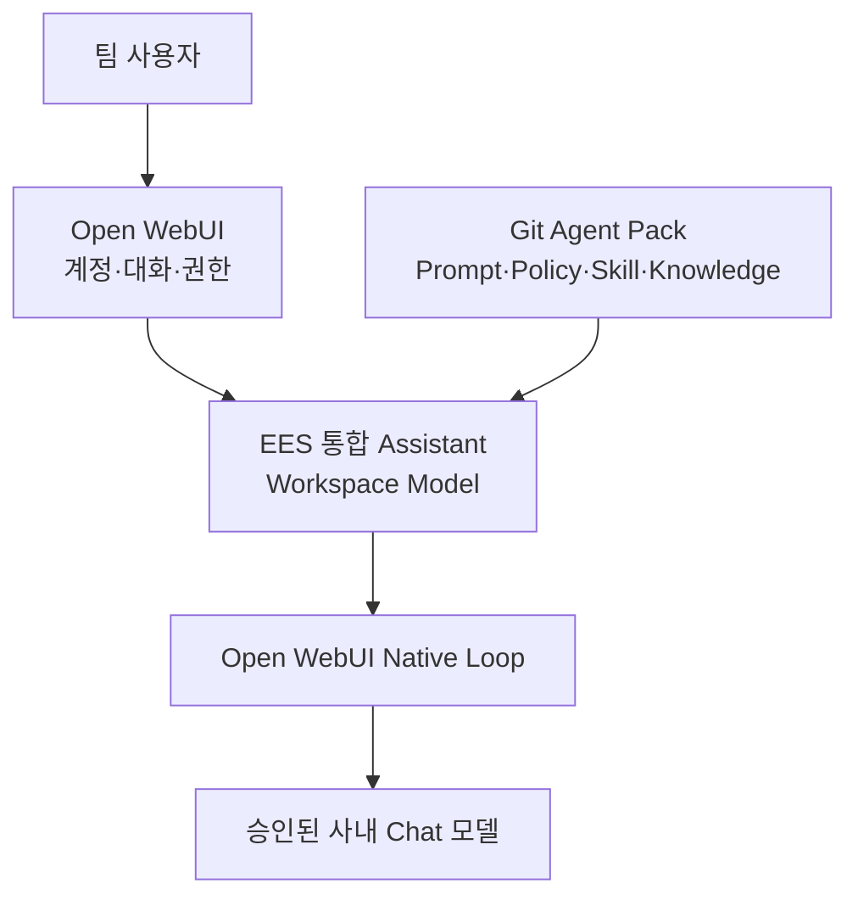
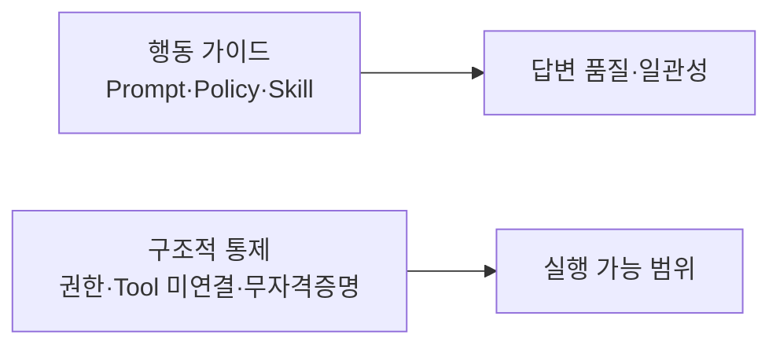
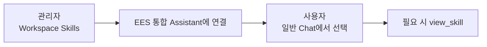

# 03. Open WebUI Native 통합 Assistant

> 상태: **현재 MVP / 미검증**  
> 범위: 합성 정보만 사용하며, 실제 사내 정책·URL·모델 ID·업무 데이터는 등록하지 않는다.

## 목표 구조



`EES 통합 Assistant`는 새로운 물리 모델이 아니라, 승인된 기반 모델에 공통 지침·Skill·Knowledge·허용 기능을 묶는 Open WebUI Workspace Model입니다.

## MVP 구성

| 구성 | POC 값 | 역할 |
|---|---|---|
| Workspace Model | `EES 통합 Assistant` 1개 | 사용자가 선택하는 단일 진입점 |
| Base Model | 승인된 Chat 모델 1개 | 실제 추론 |
| System Prompt | 1개 | 공통 행동 원칙 |
| Skill | 2개 | 정책 근거 답변, 구조화된 문제 분석 |
| Knowledge | 합성 문서 1개 | 검색·근거 제시 검증 |
| Function Calling | Native | Skill과 허용 Tool 호출 |
| Memory | OFF | 사용자 격리 검증 전 개인화 제외 |
| 위험 기능 | OFF | Terminal·Shell·Code Interpreter·쓰기·DB Tool 미연결 |

POC에서는 Router, A2A, MCP, 자동 동기화, 외부 Agent를 만들지 않습니다. Native 방식으로 부족한 실제 사례가 확인된 뒤에만 추가합니다.

## 정책 적용의 두 층



- Prompt와 Skill은 모델에게 무엇을 해야 하는지 안내하지만 보안 경계가 아닙니다.
- 운영 DB 직접 접근 금지는 DB Tool·자격증명·네트워크 경로를 제공하지 않는 것으로 강제합니다.
- 나중에 조회가 필요하면 승인된 읽기 전용 API 또는 Query Broker만 별도 Tool로 연결합니다.

## 단계 구분


| 단계 | 확인 대상 | 해석 |
|---|---|---|
| 지금 | Skill 선택, 절차 준수, 근거 표시 | 행동 품질 검증 |
| Assistant 구성 후 | Native `view_skill`, Knowledge, 위험 Tool 미연결 | POC 안전성 검증 |
| 파일럿 전 | 필수 Filter, RBAC, 자격증명·네트워크 차단, 승인된 조회 Broker | 강제 통제 검증 |

Open WebUI에서 Claude Code Hook과 가장 가까운 확장 지점은 요청·응답을 가로채는 Filter Function입니다. Tool은 정책을 강제하는 장치가 아니라 모델에 실행 능력을 추가하는 장치이므로, 직접 DB Tool 대신 정책이 내장된 읽기 전용 Broker만 나중에 연결합니다.

Skill만으로 거절에 성공한 결과는 행동 품질 PASS이며, 강제 통제 PASS로 판정하지 않습니다.

## Git 원본과 Open WebUI 배포본


초기에는 수동 등록으로 변경 절차와 평가 기준을 먼저 확정합니다. 자동 동기화는 업데이트 빈도와 운영 책임자가 정해진 뒤 검토합니다.

## 1. Skill 등록

현재 설치된 Open WebUI 0.11.3 UI에서는 파일 선택형 Import 대신 `Workspace > Skills > Create` 화면의 네 필드에 수동 입력합니다.

| 필드 | 입력 원칙 |
|---|---|
| Skill 이름 | 사람이 알아보기 쉬운 표시 이름 |
| Skill ID | 영문 소문자 slug, 생성 후 변경하지 않음 |
| Skill 설명 | 모델이 선택 기준으로 사용할 짧고 구체적인 설명 |
| 지침 | `SKILL.md`에서 YAML frontmatter를 제외한 본문 |

첫 번째 Skill:

| 필드 | 값 |
|---|---|
| Skill 이름 | `정책 근거 답변` |
| Skill ID | `policy-grounded-answer` |
| Skill 설명 | `정책·규정·허용 여부 또는 근거를 묻는 질문에 연결된 정책과 지식을 확인하고 문서 ID와 버전을 포함해 답하는 절차` |
| 지침 | `agent-pack/skills/policy-grounded-answer/SKILL.md`의 `# Policy-grounded answer`부터 끝까지 |

두 번째 Skill은 첫 번째 저장과 단독 호출을 확인한 뒤 등록합니다.

Workspace에 Skill을 생성하는 것만으로는 전체 대화에 적용되지 않습니다. 이후 `Workspace > Models`에서 `EES 통합 Assistant`에 Skill을 연결해야 합니다. 사용자는 Workspace 화면에 들어갈 필요 없이 일반 Chat에서 해당 Assistant를 선택합니다.



모델에 연결된 Skill은 이름과 설명만 기본 제공되고, Native Function Calling을 통해 필요한 때 본문을 불러오는지 호출 이력으로 확인합니다. 일반 사용자에게 공유할 때는 Assistant뿐 아니라 연결된 Skill에도 읽기 권한을 부여해야 합니다.

## 2. Knowledge 등록

1. `Workspace > Knowledge`에서 `EES POC Policy`를 생성합니다.
2. `agent-pack/knowledge/poc-policy.md`를 등록합니다.
3. 현재 Hugging Face SSL 또는 임베딩 구성이 불안정하면 POC에서는 작은 문서를 Full Context 방식으로 연결합니다.
4. 실제 사내 문서는 승인·비식별·접근권한 기준이 정해질 때까지 넣지 않습니다.

## 3. Workspace Model 생성

`Workspace > Models`에서 다음처럼 구성합니다.

| 항목 | 값 |
|---|---|
| 이름 | `EES 통합 Assistant` |
| Base Model | `<APPROVED_CHAT_MODEL_ID>` |
| System Prompt | `agent-pack/system-prompts/ees-integrated-assistant.md` 내용 |
| Skills | 위의 2개 |
| Knowledge | `EES POC Policy` |
| Function Calling | Native |
| 공개 범위 | 관리자 또는 POC 사용자만 |

기능 설정은 다음 원칙으로 시작합니다.

```text
ON
├─ Native Function Calling
├─ Knowledge
└─ 현재 대화에 필요한 최소 Builtin 기능

OFF
├─ Memory
├─ Web Search
├─ Code Interpreter
├─ Terminal·Shell
├─ 파일 쓰기
├─ Automations
├─ MCP
└─ DB Tool
```

일반 사용자 모델 선택기에서 기반 모델을 정리할 때는 권한 제거와 `Hide`를 구분합니다. 사용자는 Workspace Model이 참조하는 기반 모델에 접근할 수 있어야 하므로, 기반 모델은 접근 가능 상태로 두고 필요하면 UI에서 숨깁니다. `Hide`는 보안 통제가 아닙니다.

## 4. 공개 전 검증

`evals/scenarios.md`의 P01~P07을 실행합니다. 특히 다음은 답변뿐 아니라 Skill·Tool 호출 이력을 함께 확인합니다.

- 정책 문서 ID·버전 근거가 맞는가
- 문서에 없는 규칙을 만들어내지 않는가
- 질문에 맞는 Skill만 불러오는가
- 운영 DB 직접 접근 요청과 우회 요청을 거절하는가
- 위험 Tool이 실제로 연결되어 있지 않은가

P05 또는 P06이 실패하면 다른 사용자에게 공개하지 않습니다.

## 5. 업데이트 원칙

```text
Git 변경 → 검토 → Open WebUI 수동 반영 → P01~P07 재평가 → 사용자 공개
```

- Git의 파일을 관리 원본으로 취급합니다.
- Open WebUI에서 직접 수정한 내용은 Git에도 동일하게 반영해 복사본 간 차이를 막습니다.
- Policy·Skill·Knowledge에는 문서 ID와 버전을 둡니다.
- 자동 업데이트는 롤백·승인·감사 로그가 마련되기 전에는 사용하지 않습니다.

## 다음 단계 Gate

Native POC에서 복잡한 병렬 분석, 장시간 상태 유지, 독립 검증, 외부 전용 ReAct가 실제로 필요하다는 실패 사례가 모일 때만 Hermes 또는 외부 Agent 연결을 비교합니다.