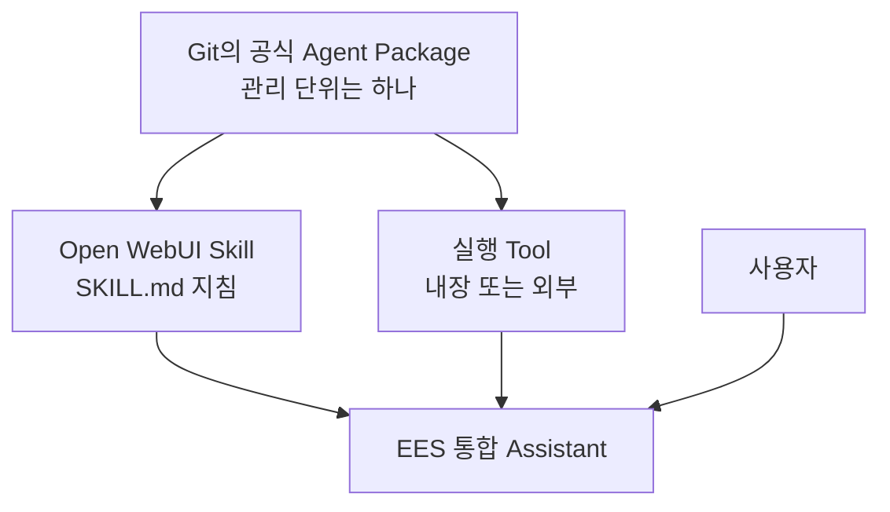
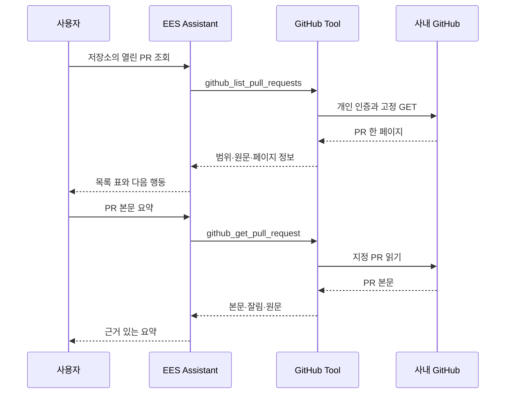
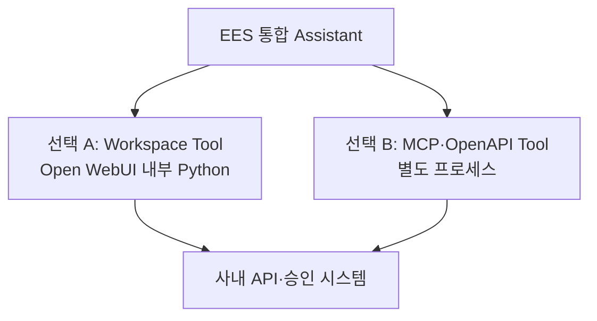
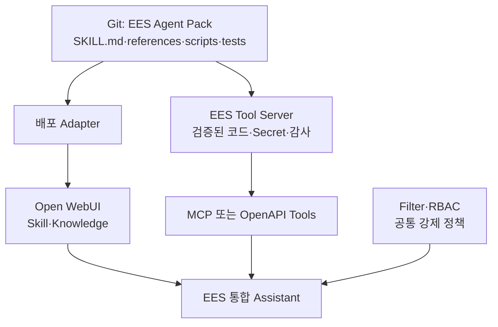
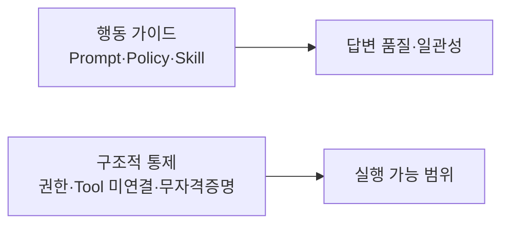
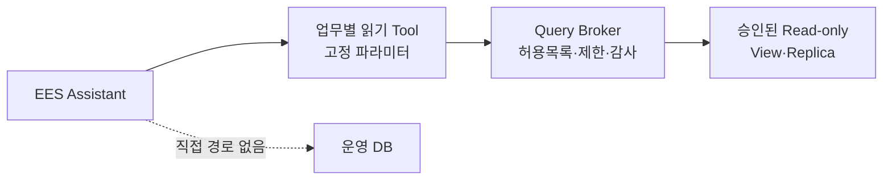
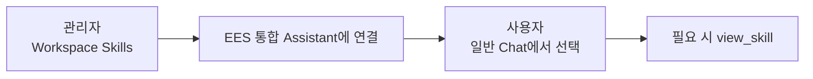

# 03. Open WebUI Native 통합 Assistant

> 문서 역할: Native Assistant 기준선 구성·확장 원칙
>
> 범위: 합성 정보만 사용하며, 실제 사내 정책·URL·모델 ID·업무 데이터는 등록하지 않는다.

최신 적용 상태는 [STATUS](STATUS.md), 시험 판정은 [평가표](../evals/scenarios.md)를 확인합니다. 아래 2-Skill 구성은 합성 문서 기반의 초기 기준선입니다. Confluence 패키지의 추가 적용 절차는 [04. Confluence 읽기 Tool](04-confluence-read-tool.md)에서 다루며, Git에 준비된 것과 실제 UI에 적용된 것은 구분합니다.

## 30초 구조 요약

Git에서는 공식 배포 자산을 하나의 Agent Package로 관리합니다. 팀원이 WebUI에서 만들고 공유하는 개인·팀 자산과의 경계는 [README의 원본과 배포본](../README.md#원본과-배포본)을 따릅니다. Open WebUI Skill 하나가 패키지 전체를 실행할 수 없으므로, 공식 패키지를 배포할 때 **지침**과 **실행 기능**이 서로 다른 위치에 놓입니다.



사용자는 여전히 `EES 통합 Assistant` 하나만 선택합니다. Skill과 Tool을 함께 연결하는 구조에서 Skill은 **무엇을 언제 어떻게 할지** 알려주고 Tool은 **실제로 실행**합니다. 이 구조 설명이 모든 외부 Tool의 연결 완료를 의미하지는 않습니다.

### GitHub PR 읽기 흐름

[GitHub 읽기 Tool](06-github-read-tool.md)을 등록한 뒤의 흐름입니다. 작은 PR 읽기는 별도 Skill 없이 조건부 Prompt와 함수 설명을 사용합니다. 준비·실제 반영 여부는 STATUS를 따릅니다.



`EES 통합 Assistant`는 새로운 물리 모델이 아니라, 승인된 기반 모델에 공통 지침·Skill·Knowledge·허용 Tool을 묶는 Open WebUI Workspace Model입니다.

<a id="assistant-resource-access"></a>

## Assistant 연결과 팀 사용 권한

Open WebUI **0.11.3은 Assistant 연결과 각 자산의 사용 권한을 별도로 검사**합니다. 모델에 Tool/Skill을 선택해도 그 모델을 사용하는 모든 사람에게 해당 자산의 읽기 권한이 자동 부여되지는 않습니다. 권한 없는 Tool은 사용자 목록·실행 준비에서 제외되고, 권한 없는 Skill은 모델 문맥에서 제외되며 `view_skill`에서도 읽기 권한을 확인합니다. 관리자의 기존 정상 동작만으로 일반 사용자 권한을 판단하지 않습니다.

현재는 사용자 선택에 따라 **기존 Skill·Tool·모델을 모두 Public으로 설정한 상태**로 운영합니다. 당분간 팀원만 사용하는 환경을 전제로 그룹별 설정은 후속으로 미룹니다. [사용자 보고](../evals/scenarios.md#team-public-resource-sharing)는 공개 설정 변경 범위이며, Read/Write 세부 값·Knowledge 공개 여부·일반 사용자 조회 성공까지 확인한 것은 아닙니다. 자산 공유 설정은 Windows의 Public 네트워크 프로필과 구분합니다.

아래 **같은 그룹에 필요한 자산의 읽기 권한을 부여**하는 절차는 사용 대상이 넓어지거나 자산별 제한이 필요할 때 사용할 후속 안내입니다. 현재 사용을 위해 그룹 설정을 다시 요구하지 않습니다.

1. 관리자 패널 → Users → Groups에서 대상 그룹을 만들거나 기존 팀 그룹을 사용하고 일반 사용자 계정을 구성원으로 넣습니다.
2. 각 자산의 **Access / 접근 → Add Access / 접근 권한 추가**에서 같은 그룹에 **Read / 읽기**를 부여하고 저장합니다. 기존에 필요한 권한이 있으면 삭제하거나 다시 부여하지 않습니다.

| 대상 | 파일럿 그룹에 맞출 권한·범위 |
|---|---|
| EES 통합 Assistant | 읽기 — 모델 선택·사용 |
| 실제 기반 Chat 모델 | 읽기 — 기존 [기반 모델 권한](troubleshooting.md#user-model-not-found)을 유지하고 새 팀원 범위에 맞춤 |
| 연결한 Skill 3개 | 읽기 — 정책 근거·장애 분석·Confluence 조회 지침. 활성 상태와 기존 연결 유지 |
| 공개할 읽기 Tool | 읽기/사용 — EES Confluence Read·EES Jira Read·EES GitHub Read 중 파일럿에 포함할 항목 |
| 조회에 쓰는 Knowledge | 읽기 — 현재 합성 정책 자료 등 파일럿 범위의 자료 |

3. 팀원은 화면을 새로고침하고 새 대화에서 Assistant를 선택합니다. 관리자가 연결한 기능 중 권한 있는 항목을 사용할 수 있도록 준비하는 것이며 팀원에게 같은 연결 작업을 반복시키지 않습니다. 미확인 일반 사용자 흐름 하나에서 필요한 지침·조회·원문이 동작하는지 확인하고, 기존 관리자 개인 PAT/저장·모델 복구 시험은 반복하지 않습니다.

새 팀원은 **그룹 구성원 추가**로 이미 그룹에 공유한 자산 권한을 받습니다. **새 Tool/Skill을 붙일 때는 그 자산에도 그룹 읽기 권한을 한 번 설정**해야 하며 모델 연결이 권한을 자동 동기화하지는 않습니다. 다른 사용자/그룹·공개 권한으로 이미 받은 접근은 별도이므로 그룹에서 제외하는 것만으로 모든 권한이 제거됐다고 판단하지 않습니다.

여기서 읽기/사용은 **그룹 Permissions의 Tools Access·Skills Access(Workspace 작성·관리)나 자산 Write 권한과 다릅니다**. 연결된 Tool/Skill을 사용하기 위해 작성·관리 스위치를 켤 필요는 없습니다. 기존 Tool 사용과 본인 UserValves/PAT 입력에는 Tool 읽기 권한을 사용하며 코드 수정 권한을 함께 주지 않습니다. 그룹 공유는 Tool 사용 권한을 제공하고, 실제 Confluence/Jira/GitHub 조회는 각자의 PAT와 원 시스템 권한으로 제한합니다. Skill을 팀원이 작성·공유하는 기능은 그 업무를 제공할 때 별도 생성/공유 권한으로 설정합니다.

근거: [v0.11.3 Tool 로더](https://github.com/open-webui/open-webui/blob/v0.11.3/backend/open_webui/utils/tools.py), [Tool 개인 설정 라우터](https://github.com/open-webui/open-webui/blob/v0.11.3/backend/open_webui/routers/tools.py), [Skill 목록 검사](https://github.com/open-webui/open-webui/blob/v0.11.3/backend/open_webui/models/skills.py), [모델 Skill 연결 처리](https://github.com/open-webui/open-webui/blob/v0.11.3/backend/open_webui/utils/middleware.py), [공식 Skill 접근 설명](https://docs.openwebui.com/features/workspace/skills/#access-control), [그룹 기반 권한](https://docs.openwebui.com/features/authentication-access/rbac/). 실제 적용 판정은 [확인 기록](../evals/scenarios.md#assistant-resource-access-followup)을 따릅니다.

<a id="rich-ui"></a>

## 되묻기와 Rich UI 선택 기준

현재 조회 결과는 **Tool의 JSON → Assistant의 일반 문장·표·원문 링크**로 제공합니다. 초기 기능 확인용 Confluence·Jira·GitHub의 Rich UI와 합성 HTML 예제는 제거하며, 등록본의 갱신 절차는 [Tool·Prompt 갱신](#plain-output-update), 현재 적용 보고는 [STATUS](STATUS.md)에서 관리합니다. 과거 채팅과 화면 검증 증거는 보존합니다.

향후 화면은 [실행 계획](STATUS.md#delivery-plan)의 실제 업무 흐름을 고른 뒤 하나씩 설계합니다. 기존 카드의 전체 디자인 튜닝이나 새 UI 공통 기반을 이번 제거 작업에 붙이지 않습니다. 이름·로고와 대화 시작 예시는 조회 결과 Rich UI와 별도입니다.

| 상황 | 우선 사용할 방식 |
|---|---|
| 검색어·대상 등이 모호하거나 후보 중 하나를 골라야 함 | 기본 `ask_user`로 필요한 조건만 확인; 사용할 수 없으면 일반 대화로 질문 |
| 정해진 여러 값을 한 번 입력 | 기존 프롬프트 변수 입력 화면으로 충족되는지 먼저 확인 |
| 조회 결과·근거·소수의 결과 링크 | 일반 문장·목록·표·Markdown 링크 |
| 받은 결과를 반복해서 필터링·펼치기·비교할 실제 수요가 확인됨 | 그 업무에 필요한 Rich UI를 별도 구현·검증할 후보로 검토 |

`ask_user`는 [Open WebUI 0.11.3 내장 Tool](https://github.com/open-webui/open-webui/blob/v0.11.3/backend/open_webui/utils/tools.py)입니다. Native 호출·내장 Tool·User Input 설정과 모델의 실제 호출 여부를 해당 환경에서 확인합니다. 알려진 조건을 다시 입력시키거나 동일한 질문용 Tool을 새로 만들지 않습니다.

향후 Rich UI를 구현할 때도 지킬 경계:

- 업무 Tool의 조회·입력·사용자별 권한 검사를 유지하고, 화면과 모델의 설명에 같은 조회 데이터를 제공합니다. HTML을 반환했다는 이유로 모델이 화면 내용을 읽을 수 있다고 가정하지 않습니다. 반환 방식은 [공식 Rich UI 안내](https://docs.openwebui.com/features/extensibility/plugin/development/rich-ui/)와 해당 버전에서 확인합니다.
- 외부 자료는 실행 가능한 HTML로 삽입하지 않습니다. iframe에 PAT를 넣거나 원 시스템 API를 직접 호출시키지 않습니다. 추가 검색·본문 조회는 업무 Tool과 사용자별 권한 검사를 거칩니다.
- 버튼의 입력 초안 생성·추가 조회·전송은 각각 실제 구현된 동작만 안내합니다. 저장된 채팅의 결과를 항상 최신이라고 설명하지 않습니다.

코드 위치는 [AGENTS의 구현 규칙](../AGENTS.md#3-구현-위치와-과설계-방지)을 따릅니다. 기능별 API 코드는 원 시스템에 요청하는 클라이언트 코드입니다. 원 시스템 서버 구현을 이 저장소에 가져오지 않으며, 둘 이상의 실제 기능에서 같은 코드의 반복 수정이 생기면 공통화를 검토합니다.

<a id="legacy-ui-design"></a>

### 레거시 업무 화면의 설계 기준

2026-09-09 사용자 합의: **자주 쓰는 업무 화면을 준비하고, 대화·대상·업무 조건에 맞춰 내용과 검토된 화면 부품을 바꾸는 방식**을 기본으로 합니다. 사람과 AI가 같은 작성 화면을 함께 편집하며, 다음 절차로 업무별 화면을 하나씩 완성합니다.

1. **업무 선택 → 클릭 가능한 목업 → 사용자 확인 → 실제 기능 연결 → 업무 흐름 검증** 순서로 진행합니다. 목업은 합성 데이터로 직접 입력·수정, AI 작성·수정의 모의 반영, 발행 전/완료 상태를 보여주고 실제 업무를 실행하지 않습니다. 이번 합의는 개발 방식에 대한 결정이며 개별 목업의 승인이나 EMS 실행 권한을 뜻하지 않습니다.
2. 준비된 업무 화면을 기본으로 설비·기간·작업 종류에 따른 값과 필요한 입력 영역·관련 이력·비교 부품을 바꿉니다. 필수 항목과 발행 동작은 업무 규칙으로 정합니다. 매번 자유 생성하는 화면은 일회성 설명·분석·시각화 후보로 두며 실제 업무 실행 경로와 구분합니다. 같은 화면의 허용된 값·구성 변경마다 디자인 승인을 반복하지 않습니다.
3. 사용자는 직접 입력·선택·수정하거나 채팅으로 AI에게 작성·수정을 요청할 수 있습니다. AI는 화면의 최신 입력값을 기준으로 요청한 부분을 수정하고, 같은 작성 화면을 갱신합니다. AI가 바꾼 항목을 표시하며 처리 중 생긴 사용자 수정을 조용히 덮어쓰지 않습니다. 최신 상태 전달·변경 반영은 구현할 기능이고 기존 Rich UI의 자동 동작으로 가정하지 않습니다.
4. WO 발행 같은 상태 변경은 **AI의 초안 준비와 사용자의 최종 실행을 분리**합니다. “WO 발행해줘”는 우선 작성·확인 화면을 준비하는 요청으로 처리합니다. 사용자가 최종 버튼으로 확인한 내용만 서버가 검증·실행하며 자연어 Tool 호출만으로 이 단계를 건너뛰지 못하게 합니다. 실행 전 내용·대상이 바뀌면 다시 확인하고, 중복 클릭·재시도에 따른 중복 발행 방지와 결과 불명 시 실제 생성 여부 확인을 포함합니다. 성공은 EMS가 반환한 실제 결과·WO 번호로 표시합니다.
5. 공식 Open WebUI 패키지와 기존 래퍼의 관리 방식을 유지합니다. 초기 화면은 작은 HTML/CSS/JavaScript와 기존 Python 업무 연결 코드로 만들고, 실제 반복 수정이 생길 때 공통 부품으로 묶습니다. 복잡한 화면 상태·재사용 필요가 확인될 때만 추가 프레임워크나 빌드 구성을 검토합니다. 브라우저 입력을 인증된 서버 동작으로 전달하는 경로는 해당 Open WebUI 버전에서 구현·검증합니다.
6. 실제 발행은 기존 EMS 업무 서비스·규칙을 재사용합니다. WO 발행은 대표 설계 예시이며 EMS API 유무·필수 항목·서버 로직의 재사용 가능성은 아직 미확인입니다. API가 없다면 필요한 호출 통로를 EMS 쪽에 추가하는 범위를 별도로 정합니다. 현재 읽기 전용 Tool·정책은 유지하고, 향후 허용된 업무 쓰기를 도입할 때 해당 기능의 권한·실행 범위와 검증 기준을 함께 정합니다.

상세 필드·화면 구성은 실제 업무 요구를 확인한 뒤 목업에서 합의합니다. 구현·사용성 검증 완료와 설계 방향 합의를 구분하며 [설계 검토 기록](../evals/scenarios.md#legacy-ui-design)을 따릅니다.

<a id="wo-mockup"></a>

### WO 시연 목업

사용자가 정한 순서는 **시연용 목업 → 시연 피드백 → 운영용 목업 → 실제 EMS 구현**입니다. 기존 Open WebUI 대화창과 우측 WO 패널의 초기 시연은 사내에서 동작한다는 사용자 보고를 받았습니다. v0.1.3의 업무 패널 열기/닫기와 기능 정상 동작도 사용자 보고로 확인했습니다. 이후 설비 조회 결과의 `panel.error.code=panel_error` 보고를 받았습니다. v0.1.5는 패널 실행 예외의 짧은 진단값과 첫 화면 생성 실패 후 재시도를 보완했으며, 갱신 안내 후 패널이 표시된다는 사용자 보고를 받았습니다. 실제 최초 예외 원인·장기 재발 여부는 아직 미확정입니다. 후속 v0.1.6은 크기 조절 바의 마우스 클릭·드래그 테두리를 숨기고 키보드 포커스 표시를 유지합니다. 실제 업무 항목·권한 세분화는 후속으로 둡니다. 첫 [단독 HTML 목업](../agent-pack/skills/ems-work-order/references/wo-mockup.html)은 화면 배치 참고로 보존하며, WebUI에는 기존 **EES WO Demo** Tool 한 개를 계속 사용합니다.

- 채팅으로 WO 작성을 요청하면 AI가 설비를 찾고 대화 내용을 바탕으로 **설비·작업 제목·작업 구분·우선순위·증상 및 요청 내용**을 채워 첫 초안을 보여줍니다. 후보가 여러 개일 때만 설비를 선택하게 합니다. 화면에서 설비를 직접 클릭한 경우에는 “선택한 설비로 초안을 작성해줘”라고 이어서 요청하며, 선택만으로 AI가 자동 호출되지는 않습니다.
- 화면에서 직접 입력하거나 기존 채팅으로 AI에게 수정 요청을 할 수 있습니다. `wo_demo_view`가 현재 화면과 변경 번호를 읽고 `wo_demo_update`가 요청한 항목만 바꿉니다. 그사이 사용자 입력이 바뀌면 이전 변경 번호의 수정을 거부하고 최신 값을 다시 읽도록 합니다. AI가 만든 초안도 사람이 확인·수정한 뒤 최종 버튼으로 결정합니다.
- 설비 검색 조건은 **법인 → 사업장 → SHOP → LINE → PROCESS**입니다. 샘플 32개 설비를 사용하며 한국/헝가리/미국 법인, 천안/울산/헝가리 사업장/미국 사업장, 전극/조립 SHOP과 각 1·2라인, 전극의 믹싱·코팅 및 조립의 권취·조립 공정을 제공합니다. 실제 EMS 조회 결과나 확정 스키마가 아닙니다.
- `ems_demo_find_equipment`를 대화에서 호출하면 우측에 **설비 조회 패널**을 열고 요청한 검색 조건과 샘플 결과를 보여줍니다. 화면에서 필터를 바꾸고 설비를 선택해 정보를 확인할 수 있으며, 설비 조회만으로 WO 작성 폼을 열거나 기존 초안 대상을 바꾸지 않습니다. 내부 공통 조회 함수는 화면 없이도 재사용하며 현재 EES WO Demo 등록 항목 하나에 포함합니다. 사용자는 설비 조회가 여러 업무의 공통 도구가 될 것이므로 독립 등록·관리가 유리하다고 보되, 이번 시연은 적용 편의를 위해 한 항목으로 유지하기로 했습니다. 운영용 설계에서는 설비 조회를 공통 Tool로 별도 등록하는 방향으로 분리합니다. 현재는 공통 샘플 목록·조회 함수를 WO에서도 재사용합니다.
- 넓은 화면에서는 대화와 패널 사이 경계선을 끌어 너비를 바꿉니다. 경계선에 키보드 초점을 두고 좌우 방향키로 조절하거나 Home/End로 허용 범위의 양 끝을 선택할 수 있습니다. 같은 대화에서는 너비를 기억하며 좁은 화면의 패널 방식은 유지합니다.
- 사용자가 작성 내용을 확인하고 최종 버튼을 누르면 샘플 WO 결과만 표시합니다. AI에게 실제 발행 기능을 제공하지 않으며 EMS 조회·발행·저장도 하지 않습니다.
- 해당 대화에서 패널을 처음 연 뒤에는 채팅 오른쪽 위 **‘제어’ 옆의 업무 패널 아이콘**으로 AI 호출 없이 접고 펼칩니다. 마우스를 올리면 ‘업무 패널 열기/닫기’ 안내가 보입니다. 같은 브라우저 탭에서 다른 대화로 이동했다 돌아오면 그 대화의 검색 조건·선택 설비·WO 내용·확인/완료 상태·너비와 열림/닫힘 상태를 복원합니다. 처음 방문한 다른 대화에 이전 대화의 패널을 표시하지 않습니다.
- 작성 내용은 현재 브라우저 탭의 메모리에만 있습니다. 새로고침·탭 종료·로그아웃에서는 초기화하며 영구 저장 기능은 아닙니다. 처음 패널을 열지 않은 대화에서는 제안 질문이나 설비 조회 요청으로 시작합니다. 일반 대화에서 사용하며 임시 대화·노트에는 붙이지 않습니다.

구현은 [wo_demo_tool.py](../agent-pack/skills/ems-work-order/scripts/wo_demo_tool.py)의 고정된 화면 코드와 Open WebUI 0.11.3의 [공식 execute 이벤트](https://docs.openwebui.com/features/extensibility/plugin/development/events/#execute-works-with-both-__event_call__-and-__event_emitter__)를 사용합니다. 우측 패널을 붙이는 위치는 [0.11.3 Chat 화면 구조](https://github.com/open-webui/open-webui/blob/v0.11.3/src/lib/components/chat/Chat.svelte)에 의존하며 공식 업무 패널 등록 API가 아닙니다. 모델이 실행할 JavaScript를 작성하지 않고 정해진 입력값만 전달합니다. 프런트엔드 재빌드·재설치·추가 서버·CDN은 필요하지 않습니다. 사외 검사와 실제 사내 WebUI·모델 동작 확인은 [검증 기록](../evals/scenarios.md#wo-mockup)에서 구분합니다.

**사내 시연 적용·갱신:** [PR #19](https://github.com/knadalkim-a11y/team-agent-poc/pull/19)의 `docs/legacy-ui-workflow` 준비본이며 아직 main 배포본이 아닙니다. 아래 명령은 해당 원격 브랜치에서 Tool·Prompt·첫 화면 제안 파일 세 개만 임시 폴더에 꺼냅니다. 기존 checkout의 브랜치·작업 파일·실행 프로그램은 그대로 둡니다. v0.1.3의 기능 정상 보고와 이후 패널 예외, v0.1.5 안내 후 표시 성공 보고를 구분해 기록합니다. v0.1.6의 크기 조절 표시 변경은 기존 Tool 코드만 갱신합니다. 패널 오류 진단을 위해 같은 확인을 반복하지 않습니다. 초기 등록 내용·정확한 적용 파일은 직접 대조하지 않았으며 마지막 전달 원본과 결과는 [평가 기록](../evals/scenarios.md#wo-mockup)을 따릅니다.

**v0.1.2 이후 버전을 적용한 경우:** 아래 1·2번으로 기존 Tool 코드만 교체한 뒤 한 번 새로고침합니다. WO 지침·제안 JSON은 이번에 변경하지 않았으므로 3·4번을 반복하지 않습니다. 패널을 열고 크기 조절 바를 클릭·드래그할 때 테두리가 없는지 사용 중 확인합니다. 이전 전체 기능 검사를 반복하지 않으며, 패널 오류가 재발한 경우에만 아래의 짧은 진단값을 확인합니다.

1. 사내 PowerShell에서 다음 블록을 실행하면 준비본을 받고 Tool 코드 전체가 클립보드에 복사됩니다. 실패하면 다음 단계로 넘어가지 않습니다.

   ```powershell
   & {
       $ErrorActionPreference = 'Stop'
       $eesRepo = Join-Path $env:USERPROFILE 'team-agent-poc'
       $eesDemo = Join-Path $env:TEMP 'ees-wo-demo'
       New-Item -ItemType Directory -Path $eesDemo -Force | Out-Null
       git -C $eesRepo fetch origin docs/legacy-ui-workflow
       if ($LASTEXITCODE -ne 0) { throw 'Git fetch failed' }
       git -C $eesRepo archive FETCH_HEAD --format=zip --output="$eesDemo\source.zip" agent-pack/skills/ems-work-order/scripts/wo_demo_tool.py agent-pack/system-prompts/ees-integrated-assistant.md agent-pack/ees-prompt-suggestions.json
       if ($LASTEXITCODE -ne 0) { throw 'Source export failed' }
       Expand-Archive -LiteralPath "$eesDemo\source.zip" -DestinationPath $eesDemo -Force
       $eesToolCode = Get-Content -LiteralPath "$eesDemo\agent-pack\skills\ems-work-order\scripts\wo_demo_tool.py" -Raw -Encoding UTF8
       if ($eesToolCode -notmatch '(?m)^version: 0\.1\.6\r?$') { throw 'Expected WO demo version 0.1.6' }
       Set-Clipboard -Value $eesToolCode
   }
   ```

2. **이미 시연한 사용자:** Workspace → Tools의 기존 **EES WO Demo**를 편집해 코드 전체를 교체하고 `version: 0.1.6`를 확인해 저장합니다. 삭제·재생성하지 않으며 기존 모델 연결·설정은 보존합니다. **처음 설치하는 경우에만** 새 EES WO Demo를 만들고 사용 중인 EES 모델의 Tools에 추가합니다. 다른 Tool 선택은 유지하며 새 Skill은 등록하지 않습니다.
3. 다음 블록으로 [공통 Prompt](../agent-pack/system-prompts/ees-integrated-assistant.md)의 **WO 시연 도구가 연결된 경우** 절을 복사합니다. **기존 사용자는 같은 제목의 이전 절만 교체**하고, 처음 설치하는 경우에만 현재 프롬프트 끝에 한 번 추가합니다. 이전 절을 중복 추가하거나 프롬프트 전체·사용자 추가 지침을 교체하지 않습니다.

   ```powershell
   & {
       $ErrorActionPreference = 'Stop'
       $eesPrompt = Get-Content -LiteralPath "$env:TEMP\ees-wo-demo\agent-pack\system-prompts\ees-integrated-assistant.md" -Raw -Encoding UTF8
       $eesSection = [regex]::Match($eesPrompt, '(?ms)^## WO 시연 도구가 연결된 경우\r?\n.*?(?=^## |\z)')
       if (-not $eesSection.Success) { throw 'Demo instructions missing' }
       Set-Clipboard -Value $eesSection.Value.Trim()
   }
   ```

4. 같은 EES 모델 편집 화면에서 **프롬프트(Prompts) → 기본값(Default)을 눌러 사용자 정의(Custom)**로 전환합니다. 아래 명령으로 가져올 파일 경로를 복사한 뒤 **가져오기(Import)** 파일 선택창의 파일 이름 칸에 붙여넣습니다. 사용자 정의 목록은 EES 모델의 기본 영어 제안을 대신하며, 목록 안의 기존 예시·빈 항목은 정리하여 아래 네 문구만 남깁니다. 가져오기는 추가 방식이므로 중복으로 가져오지 않습니다. 모델 전체 가져오기나 System Prompt에 넣는 JSON이 아닙니다. [제안 편집 상세](#first-use-entry).

   ```powershell
   Set-Clipboard -Value (Join-Path $env:TEMP 'ees-wo-demo\agent-pack\ees-prompt-suggestions.json')
   ```

   제안은 **천안 설비 찾기 / 헝가리 설비 찾기 / AI로 WO 초안 작성 / 직접 설비 선택하기**입니다. 앞의 두 문구는 조건이 채워진 조회 패널, 세 번째는 소음 점검 WO 초안, 네 번째는 사용자가 필터를 조작할 조회 화면을 요청합니다. 네 질문 모두 샘플 시연임을 명시합니다.

5. 모델을 저장·업데이트하고 브라우저를 한 번 새로고침한 뒤 폴더 밖의 새 일반 대화에서 **EES Assistant**를 선택합니다. 이전 메모리의 화면 코드와 작성 중인 샘플 초안이 초기화됩니다. 제안을 클릭하면 사용자 설정에 따라 바로 전송되거나 입력창에 채워지며, 입력창에 들어온 경우 전송하면 됩니다. 프로그램 Apply·서버 재시작은 필요하지 않습니다.

**패널 오류 확인:** 설비 조회는 성공해도 화면 표시 결과인 `panel.ok`는 실패할 수 있습니다. 도구 실행 결과의 `panel.error.code`가 그 요청의 오류 분류이며 다른 예시 코드들을 별도로 찾을 필요는 없습니다. `panel_error`는 브라우저에서 화면 코드가 실행되다 예외가 났다는 뜻입니다. v0.1.5부터 `panel.error.diagnostic`에 `script_version`, `stage`, `exception`만 추가하며 예외 원문·스택·대화 내용은 반환하지 않습니다. 같은 오류가 나면 이 세 값만 짧게 전달합니다. `browser_response_unconfirmed`는 브라우저 응답을 확인하지 못한 별도 분류이고 8초 대기는 패널 표시 요청부터 시작하므로 전체 LLM 응답 대기와 구분합니다. 초기 화면을 완성한 뒤에만 대화별 캐시에 넣어 첫 생성 실패 후 재시도가 불완전한 화면을 재사용하지 않게 했습니다. 이미 정상 작성하던 WO 상태를 일괄 초기화하지 않습니다.

**첫 시연:** 일반 EES 대화에서 “한국 천안 조립 SHOP 조립 1라인 권취 설비에서 소음이 나. 점검 WO 초안 작성해줘”라고 한 번 요청합니다. 유일한 샘플 설비 `KR-CA-211`과 초안의 다섯 항목이 채워지면 화면에서 내용을 직접 수정하고, 채팅으로 “긴급으로 변경해줘”, “점검 항목을 추가해줘”를 이어서 요청합니다. 패널 너비 조절과 변경 내용 확인 → 최종 확인·샘플 발행까지 체험하고 피드백으로 운영용 목업을 다듬습니다. 설비 조회부터 시연하려면 “천안 조립 1라인의 설비를 찾아줘”라고 요청합니다. 우측 검색 패널에서 권취 설비를 선택한 뒤 “이 설비에서 소음이 나. 점검 WO 초안 작성해줘”라고 말하면 같은 패널의 WO 작성 화면으로 이어집니다. 기존 WO를 작성하던 중 다른 설비를 찾아봐도 초안은 보존합니다.

<a id="plain-output-update"></a>

### 기존 조회를 일반 답변으로 전환

기존 **Confluence·Jira·GitHub Tool 세 개의 코드와 EES 통합 Assistant의 공통 System Prompt**를 갱신합니다. 카드·필터·펼치기·질문 버튼을 제거하고 읽기 API·페이지 이동·개인 인증·권한 검사와 실제 원문 링크는 유지합니다. 이번 변경은 Agent Pack 자산 갱신으로, 이미 성공한 프로그램 Apply·Stop·Start나 wheel 재생성·환경 재설치가 필요하지 않습니다.

1. 기존 `manage-ees.ps1 -Action Update`로 검토된 main을 받습니다. Git 갱신만으로 WebUI에 저장된 코드는 바뀌지 않습니다.
2. **Workspace → Tools**에서 아래 기존 항목을 각각 편집하고 코드 전체를 해당 파일로 교체·저장합니다. Tool을 삭제하거나 새로 만들지 않으며 ID·접근 권한·관리자 Valves·사용자 PAT/UserValves·모델 연결은 유지합니다.

| 기존 항목 | 코드 원본 |
|---|---|
| EES Confluence Read | [confluence_tool.py](../agent-pack/skills/confluence-read/scripts/confluence_tool.py) |
| EES Jira Read | [jira_tool.py](../agent-pack/skills/jira-read/scripts/jira_tool.py) |
| EES GitHub Read | [github_tool.py](../agent-pack/skills/github-read/scripts/github_tool.py) |

3. **Workspace → Models → 기존 EES 통합 Assistant**에서 [System Prompt 원본](../agent-pack/system-prompts/ees-integrated-assistant.md)의 변경된 공통 지침을 반영하고 저장·업데이트합니다. 별도로 추가한 사용자 지침은 보존하며 기존 모델·Skill·Knowledge 연결을 유지합니다. 이전 카드 중복 억제·화면 필터·질문 버튼 안내는 새 지침으로 바뀝니다.
4. 새 일반 대화에서 평소의 Confluence 검색·Jira 현황·GitHub PR 조회를 한 번씩 요청해 **카드 없이 일반 답변과 원문 링크가 나오는지** 확인합니다. 저장 완료와 조회/출력 결과를 1~2줄로 보고하며 전체 로그·파일·사진이나 이전 인증 전수 검사를 요구하지 않습니다.

과거 대화에 저장된 카드는 당시 출력이므로 남을 수 있습니다. 이번 변경은 새 조회의 출력에 적용하며 기존 대화·DB를 지우거나 다시 작성하지 않습니다. Git 구현·검증과 사내 Tool/Prompt 반영·새 출력 확인은 [STATUS](STATUS.md)에 나누어 기록합니다.

사내 PowerShell에서는 다음 블록을 **하나 실행할 때마다 해당 편집 화면에 붙여넣고 저장한 뒤** 다음 블록으로 넘어갑니다. 어느 명령이나 저장이든 실패하면 다음 단계로 넘어가지 않습니다. 명령은 파일 내용을 로컬 클립보드에 복사하므로 코드 전체를 외부 채팅에 옮길 필요가 없습니다.

먼저 main을 받고 Confluence 코드를 복사합니다. 기존 Confluence Tool의 코드 전체를 교체하고 헤더 `version: 0.1.6`을 확인해 저장합니다.

```powershell
& {
    $ErrorActionPreference = 'Stop'
    $eesRepo = Join-Path $env:USERPROFILE 'team-agent-poc'
    & (Join-Path $eesRepo 'scripts\manage-ees.ps1') -Action Update
    Get-Content -LiteralPath (Join-Path $eesRepo 'agent-pack\skills\confluence-read\scripts\confluence_tool.py') -Raw -Encoding UTF8 | Set-Clipboard
}
```

이어서 Jira 코드를 복사해 기존 Jira Tool에 붙여넣고 `version: 0.1.6`으로 저장합니다.

```powershell
Get-Content -LiteralPath "$env:USERPROFILE\team-agent-poc\agent-pack\skills\jira-read\scripts\jira_tool.py" -Raw -Encoding UTF8 -ErrorAction Stop | Set-Clipboard
```

GitHub도 기존 항목에 붙여넣고 `version: 0.1.4`로 저장합니다.

```powershell
Get-Content -LiteralPath "$env:USERPROFILE\team-agent-poc\agent-pack\skills\github-read\scripts\github_tool.py" -Raw -Encoding UTF8 -ErrorAction Stop | Set-Clipboard
```

마지막으로 공통 System Prompt를 복사해 기존 EES 통합 Assistant에 반영합니다. 별도로 덧붙인 사내 지침이 있다면 보존하고 저장·업데이트합니다.

```powershell
Get-Content -LiteralPath "$env:USERPROFILE\team-agent-poc\agent-pack\system-prompts\ees-integrated-assistant.md" -Raw -Encoding UTF8 -ErrorAction Stop | Set-Clipboard
```

새 대화에서 세 조회를 확인한 뒤 `3도구/Prompt 저장, 카드 없음, 3조회/원문 정상`처럼 실제 확인한 결과만 1~2줄로 전달합니다. 한 항목이 실패하면 그 이름과 짧은 증상만 함께 적습니다.

### 후속 연동을 시작할 때

아래 표는 새 연동을 선정할 때의 범용 검토 기준입니다. 이미 연결한 Confluence·Jira·GitHub의 제품·인증을 다시 확인하는 순서가 아닙니다. 현재 구현·배포 상태와 진행 순서는 [STATUS](STATUS.md)에서 관리합니다.

| 대상 | 구현 전에 확인할 정보 | 첫 읽기 기능 후보 | 향후 화면 후보 |
|---|---|---|---|
| Confluence | 제품·버전, 개인 인증, 허용 Space | 문서 검색·본문 조회 | 필요한 문서 비교·근거 탐색 |
| Jira | Cloud/Data Center·버전, 개인 인증, 허용 프로젝트·조회 필드 | 이슈 검색·상세 조회 | 이슈 목록에서 상태·담당자별 좁히기, 상세 펼치기 |
| GitHub | GitHub.com/Enterprise Server·버전, 개인 인증, 허용 저장소 | 이슈·PR 목록과 상세 조회 | PR 목록의 리뷰·검사 상태 비교 |

주소·토큰 값은 승인된 실행 환경에 설정합니다. Confluence의 PAT 방식이나 API 경로를 Jira/GitHub에 그대로 복제하지 않습니다. 각 Tool은 안정적인 원본 ID·URL, 조회 범위·일시, 오류와 부분 결과 여부를 반환하도록 실제 API 응답에 맞춰 설계합니다. 상태 필드가 없거나 권한 때문에 못 읽은 경우를 완료·통과로 바꾸지 않습니다.

문서–이슈–PR 연결 화면은 원문에 명시된 링크·ID를 우선 사용합니다. 제목의 유사성만으로 관계를 확정하지 않습니다. 이슈 생성·수정이나 PR 쓰기 작업은 별도 후속 범위이며, 화면을 먼저 만든 것으로 실행 기능까지 구현됐다고 판단하지 않습니다.

### 업무 흐름 하나를 배포하는 단위

- 제품/버전·개인 인증 방식·첫 조회 업무를 한 번에 확인합니다. 예를 들어 Jira의 특정 프로젝트 열린 이슈 조회처럼 좁게 시작하고, 허용 프로젝트·필드는 승인된 사내 설정으로 제한합니다. 기능 수가 늘기 전에 공통 adapter·registry를 만들지 않습니다.
- 검색 → 받은 결과 탐색 → 필요한 상세/원문 확인까지 준비합니다. 모델이 고정 Tool의 인자를 선택하고 실제 반환 데이터로 답합니다. 별도 화면이나 추가 API 조회 버튼은 업무상 필요를 정하고 구현·검증하기 전까지 약속하지 않습니다.
- 처음 쓰는 팀원에게 실제 가능한 질문 예시 3개와 부족한 조건의 입력 방법을 제공합니다. 일반 요약·Confluence 문서 찾기·새 이슈 조회처럼 연결된 기능만 소개하며 Skill 이름이나 모델 선택법을 학습해야 업무를 시작하는 구조로 만들지 않습니다.
- GPT가 가능한 코드·합성 시험을 끝낸 뒤 사내에서는 정상 업무 흐름·권한 제한·대표 실패와 실제 화면을 짧은 묶음으로 확인합니다. [사용성·공유 기준](../evals/scenarios.md#usability)은 파일럿 참여자의 실제 사용으로 확인합니다.
- 팀원 Prompt·Skill 생성/공유 권한은 필요한 범위로 설정하고 같은 파일럿에서 공유·비공유 사용자를 확인합니다. Python Tool 등록·수정 권한이나 자격증명 공유를 함께 열지 않습니다. 공식 채택과 Git 관리는 [원본 경계](../README.md#원본과-배포본)를 따릅니다.

## 초기 Native 기준선 구성

| 구성 | POC 값 | 역할 |
|---|---|---|
| Workspace Model | `EES 통합 Assistant` 1개 | 사용자가 선택하는 단일 진입점 |
| Base Model | 승인된 Chat 모델 1개 | 실제 추론 |
| System Prompt | 1개 | 공통 행동 원칙 |
| Skill | 2개 | 정책 근거 답변, 구조화된 문제 분석 |
| Knowledge | 합성 문서 1개 | 검색·근거 제시 검증 |
| Function Calling | Native | Skill과 허용 Tool 호출 |
| Memory | Capabilities와 Builtin Tools 모두 OFF | 사용자 격리 검증 전 개인화 제외; [제어 범위](troubleshooting.md#native-memory-controls) |
| Chat History | OFF | 초기 시험에서는 다른 대화 내용을 자동 검색하지 않음; Memory와 별도 설정 |
| 위험 기능 | OFF | Terminal·Shell·Code Interpreter·쓰기·DB Tool 미연결 |

POC에서는 Router, A2A, MCP, 자동 동기화, 외부 Agent를 만들지 않습니다. Native 방식으로 부족한 실제 사례가 확인된 뒤에만 추가합니다.

## 확인된 제한: Open WebUI Skill은 실행 패키지가 아니다

Open WebUI 공식 정의에서 Workspace Skill은 Markdown 지침입니다. 0.11.3에서 기본 내장 Tool을 사용하는 대화는 연결된 Skill의 이름·설명을 먼저 제공하고 필요할 때 `view_skill`로 본문을 불러옵니다. 사용자가 `$`로 Skill을 직접 지정하거나 내장 Tool을 사용하지 않는 경로에서는 본문을 직접 제공합니다. 따라서 `view_skill` 호출이 없다는 이유만으로 Skill이 적용되지 않았다고 판단하지 않습니다. [0.11.3 Skill 처리](https://github.com/open-webui/open-webui/blob/v0.11.3/backend/open_webui/utils/middleware.py)

Python 실행, API 호출, 별도 `references/`·`scripts/` 디렉터리 배포 기능은 Workspace Skill 자체에 없습니다.

따라서 기존 사내 Agent Skill 패키지를 Open WebUI Skill 하나로 옮기는 방식은 사용하지 않습니다.

| 기존 사내 Agent Skill 구성 | Open WebUI에서의 대응 |
|---|---|
| `SKILL.md`의 판단 기준·절차 | Workspace Skill |
| 짧고 정적인 참고 문서 | Knowledge |
| 크거나 구조화된 Reference | Workspace Tool 또는 필요 시 외부 Tool Server의 검색·조회 API |
| `scripts/` 실행 코드 | Workspace Tool 또는 외부 MCP/OpenAPI Tool Server |
| 패키지 의존성·런타임 | Open WebUI 환경 또는 외부 Tool Server 환경 |
| API Key·사내 URL | Workspace Tool 설정 또는 외부 Tool Server의 Secret |
| 상시 공통 행동 원칙 | EES Assistant의 System Prompt; 지침 준수와 기계적 차단은 구분 |
| 코드로 판정할 수 있는 실행 제한 | RBAC·Tool/Broker 내부 검사; 입출력 검사에 필요한 경우 Filter 검토 |
| 공식 배포 자산의 버전·설치·업데이트 | Git 원본과 별도 배포 절차 |

<a id="managed-policy-workflow"></a>

### EES의 공통 정책과 관리자 워크플로

[프로젝트 목표](../README.md#프로젝트-목표)의 공통 정책은 **EES Assistant 사용 시** 적용합니다. 개인 모델·개인 Assistant는 대상에서 제외합니다. 현재 공통 지침은 해당 Workspace Model에 두며, 향후 확장을 사용하더라도 이 적용 범위를 유지합니다. 실제 배포 여부는 [STATUS](STATUS.md)에서 관리합니다.

정책은 무엇을 지키고 허용할지 정하는 원칙이고, 워크플로는 어떤 입력을 받아 어떤 순서·분기·확인 절차로 처리할지 정하는 업무 흐름입니다. 관리자가 단계를 정의하는 능력을 별도 목표로 두며, 현재 Skill의 절차 지침과 Native의 도구 선택만으로 실행 순서·검사가 보장된다고 보지 않습니다.

| 필요한 동작 | 우선 검토할 수단과 경계 |
|---|---|
| 모든 EES 답변에 공통 원칙 전달 | 기존 System Prompt. 긴 상세 절차는 필요한 Skill로 분리하며 정책 질문 때만 읽는 Skill에 공통 원칙을 전부 맡기지 않음 |
| 특정 업무의 처리 절차 안내 | Skill. 필요한 때 참고하는 지침이며 필수 단계 실행 여부는 별도로 확인 |
| 요청·응답의 정해진 시점에서 처리 | Hook 역할의 Filter 후보. 검사 위치가 실제 필요한 단계와 맞는지 확인하고, Tool 실행 권한은 해당 실행 코드에서도 검사 |
| 필수 조회·검사의 고정 순서와 분기 | 작은 업무 Tool 안에서 순서·중단·오류를 코드로 제어할 수 있는지 먼저 검토 |
| 여러 모델/도구의 단계·분기·병렬 실행 제어 | Pipe 또는 외부 워크플로/Agent를 비교할 수 있음. 기존 방식으로 충족하기 어려운 대표 업무 요구를 기준으로 선택하며 자동 도입하지 않음 |

공식 [Filter 설명](https://docs.openwebui.com/features/extensibility/plugin/functions/filter/)은 요청·응답 처리 지점을, [Function 설명](https://docs.openwebui.com/features/extensibility/plugin/functions/)은 Pipe의 다단계 처리 제어를 설명합니다. 이는 구현 후보의 역할 참고이며 현재 0.11.3 사내 환경에서 연결·검증했다는 뜻은 아닙니다. 실제 구현 단계에서 해당 버전과 EES에만 적용되는 범위·스트리밍·호출 횟수를 확인합니다.

첫 워크플로는 기존 문서/조회 기능을 재사용하는 업무 하나로 입력·단계·분기·완료 조건을 먼저 정의합니다. 단순 대화까지 계획·검토용 모델 호출을 매번 추가하지 않으며, 워크플로가 필요한 요청에만 추가 단계를 적용합니다. 모델 수·단계 수·외부 서버를 늘릴 때는 업무 효과와 호출/유지보수 비용을 비교합니다. 시각적 워크플로 편집기나 다중 Agent가 필수라는 뜻은 아닙니다.

### 별도 Tool Server는 선택 사항

Open WebUI의 `Workspace > 도구`는 Python 코드를 Open WebUI 백엔드 프로세스 안에서 직접 실행합니다. 따라서 별도 서버 없이도 실제 API 호출·계산·조회 기능을 만들 수 있습니다.



| 구분 | Workspace Tool | 외부 MCP/OpenAPI Tool |
|---|---|---|
| 별도 서버 | 불필요 | 필요 |
| 코드 위치 | Open WebUI DB·프로세스 | Git 배포 디렉터리·별도 프로세스 |
| 적합한 범위 | 작은 POC, 단순 API wrapper | 여러 파일·의존성·복잡한 패키지 |
| Open WebUI 결합도 | 높음 | 낮음 |
| 다른 Agent 재사용 | 별도 Adapter 필요 | 같은 endpoint 재사용 가능 |
| 장애·권한 격리 | WebUI 프로세스를 공유; Tool 내부 검증 필요 | 별도 분리·통제 가능; 실제 배포 설계에 따름 |
| 업데이트 | UI Import·수정 | Git 배포·서비스 재시작 |

현재 POC에서는 **읽기 전용 Workspace Tool 하나**로 실제 실행 루프를 먼저 검증할 수 있습니다. 기존 Agent Skill 전체를 UI에 복사하지 않고, 대표 스크립트 하나를 얇게 감싸 Tool 함수로 노출합니다. 다음 조건 중 하나가 확인되면 외부 Tool Server 분리를 검토합니다. 자동 전환이나 현재 MVP의 선행 조건은 아닙니다.

- 여러 Python 파일과 별도 라이브러리가 필요함
- `references/`·`assets/`를 패키지 상대경로로 읽어야 함
- Hermes·Claude Code 등 다른 Agent도 같은 실행 기능을 써야 함
- Secret·감사·장애·배포 수명주기를 Open WebUI와 분리해야 함
- 패키지 수나 담당 팀이 늘어남

### 선택적 확장 배치 예시 — 현재 MVP에 미구현

아래는 외부 실행 환경이 필요한 경우의 선택지입니다. 현재 Workspace Tool MVP에 별도 Tool Server·배포 Adapter·공통 Filter를 추가해야 한다는 뜻은 아닙니다.



이 확장안에서는 Open WebUI가 사용자 UI와 Native Tool 호출 루프를, Git이 공식 패키지 원본을, 외부 Tool Server가 실행을 담당합니다. Workspace Tool MVP에서는 실행을 Open WebUI 백엔드가 담당합니다. 두 경우 모두 패키지에서 등록한 Open WebUI Skill은 Agent Pack 전체가 아니라 Agent Pack 중 **지침 부분을 투영한 배포본**입니다.

작은 POC 코드는 Open WebUI의 Python Workspace Tool로 넣습니다. 팀 공용 패키지라도 규모만으로 외부 서버를 추가하지 않으며, 의존성·Secret·감사·권한의 별도 수명주기가 필요해질 때 외부 MCP/OpenAPI Tool Server의 운영 비용과 이점을 비교합니다.

현재 [GitHub PR 읽기](06-github-read-tool.md)는 단일 Workspace Tool로 준비했습니다. 아래는 향후 파일 검색·가이드가 필요한 경우의 확장 예시이며 현재 구현 목록이 아닙니다.

- `SKILL.md`: 언제 저장소를 조회하고 근거와 조회 제한을 어떻게 확인하는지
- `references/`: 사내 GitHub 사용 가이드와 API 규격
- `scripts/`: 검색·파일·PR 조회 구현
- Workspace Tool 또는 필요한 경우 Tool Server: `search_repository`, `get_file`, `get_pull_request` 같은 제한된 함수 노출
- 강제 정책: 허용 저장소·조회 범위, 사용자별 권한, 응답 크기·시간 제한

브랜치·PR 생성 같은 쓰기 기능과 그 승인 절차는 읽기 MVP 이후 별도 범위에서 검토합니다.

범용 Shell이나 임의 `git push`를 그대로 노출하지 않습니다. 또한 Tool은 Open WebUI를 실행하는 호스트에서 실행됩니다. 기존 Windows PC를 팀 파일럿 호스트로 사용해도 팀원의 브라우저가 열린 PC에서 실행되는 것은 아닙니다. 사용자 로컬 저장소를 다루려면 별도 로컬 실행 Agent/Runner가 필요하고, 현재 GitHub 읽기 기능은 호스트에서 GitHub API를 호출합니다.

공식 근거:

- [Open WebUI Skills](https://docs.openwebui.com/features/workspace/skills/): Skill은 실행 코드가 아닌 Markdown 지침
- [Open WebUI Extensibility](https://docs.openwebui.com/features/extensibility/): 실행 능력은 Tool·Function·MCP·OpenAPI로 제공
- [Open WebUI Tools](https://docs.openwebui.com/features/extensibility/plugin/tools/): Workspace Tool은 Open WebUI 프로세스 안에서 Python으로 실행
- [Open WebUI MCP](https://docs.openwebui.com/features/extensibility/mcp/): Streamable HTTP MCP Tool Server 연결 지원

## 정책 적용의 두 층



- Prompt와 Skill은 모델에게 무엇을 해야 하는지 안내하지만 보안 경계가 아닙니다.
- 운영 DB 직접 접근 금지는 DB Tool·자격증명·네트워크 경로를 제공하지 않는 것으로 강제합니다.
- 나중에 조회가 필요하면 승인된 읽기 전용 API 또는 Query Broker만 별도 Tool로 연결합니다.

## 단계 구분

현재 진행 단계는 [STATUS](STATUS.md#delivery-plan), 항목별 판정과 실행 시점은 [평가표](../evals/scenarios.md#validation-timing)를 따릅니다. 아래는 검증 범위를 구분하는 기준이며 위 행 전체를 통과해야 다음 행의 개발을 시작하는 순서가 아닙니다.

| 단계 | 확인 대상 | 해석 |
|---|---|---|
| 기본 Assistant | Skill 선택, 절차 준수, Knowledge 조회·근거 표시 | 사내 모델의 행동 품질 검증 |
| 읽기 Tool 연결 | 입력 제한, 사용자별 인증·권한, 실패 처리, 위험 Tool 미연결 | 실제 실행 경로 검증 |
| 다른 사용자에게 공개 전 | 자산 접근 권한, 비밀 저장, 사용자 간 데이터 격리 | 해당 연결 기능의 실환경 평가 |

Tool은 실행 능력을 제공하며 입력 제한·권한 검사도 Tool 코드에서 강제할 수 있습니다. 한 Tool의 제한이 다른 Tool까지 통제하는 것은 아닙니다. 요청·응답을 가로채는 Filter Function이나 외부 Broker는 별도 통제의 필요가 확인될 때 검토하며, 현재 Confluence Workspace Tool MVP의 자동 선행 조건으로 두지 않습니다.

Skill만으로 거절에 성공한 결과는 행동 품질 PASS이며, 강제 통제 PASS로 판정하지 않습니다.

## 향후 DB 조회 Tool의 강제 구조



- 범용 `execute_sql(sql, connection_string)` Tool은 제공하지 않습니다.
- Tool 입력에는 DB 주소·계정·비밀번호·임의 SQL을 받지 않습니다.
- `get_equipment_status(equipment_id, time_range)`처럼 업무 의미가 고정된 API만 노출합니다.
- Broker는 허용된 Query ID·테이블·컬럼·행 범위, 최대 건수, timeout을 서버에서 강제합니다.
- Broker 계정은 읽기 전용이며 가능하면 운영 DB가 아닌 승인된 View·Replica만 접근합니다.
- Open WebUI 서버에서 운영 DB로 가는 직접 네트워크 경로와 자격증명을 제공하지 않습니다.
- 차단 시험은 답변 문구가 아니라 Broker와 DB 감사 로그에서 실제 쿼리 미실행을 확인합니다.

따라서 현재 P05·P06은 모델 행동 평가일 뿐입니다. 향후 승인된 DB 조회 중계 경로를 도입하면 [평가표 S06](../evals/scenarios.md)의 실제 통제 증거를 확인해야 합니다. 이는 운영 DB 직접 접속 Tool을 허용하거나 Confluence 문서 조회에 별도 Broker를 요구한다는 뜻이 아닙니다.

## 공식 Git 원본과 Open WebUI 배포본

아래 절차는 담당자가 공식으로 채택한 배포 자산에 적용합니다. 팀원의 개인·팀 자산 작성과 허용된 범위의 공유에 매번 담당자 승인을 요구하지 않습니다. 관리 경계는 [README의 원본과 배포본](../README.md#원본과-배포본)을 따릅니다.


초기에는 수동 등록으로 변경 절차와 평가 기준을 먼저 확정합니다. 자동 동기화는 업데이트 빈도와 운영 책임자가 정해진 뒤 검토합니다.

## 1. Skill 등록

현재 설치된 Open WebUI 0.11.3 UI에서는 파일 선택형 Import 대신 `Workspace > Skills > Create`에서 `SKILL.md` 전체 내용을 지침 칸에 붙여 넣습니다. YAML frontmatter를 인식해 이름·ID·설명이 자동 입력되므로 값을 검토한 뒤 생성합니다.

| 필드 | 입력 원칙 |
|---|---|
| Skill 이름 | 사람이 알아보기 쉬운 표시 이름 |
| Skill ID | 영문 소문자 slug, 생성 후 변경하지 않음 |
| Skill 설명 | 모델이 선택 기준으로 사용할 짧고 구체적인 설명 |
| 지침 | YAML frontmatter를 포함한 `SKILL.md` 전체 내용 붙여넣기 |

첫 번째 Skill:

| 필드 | 값 |
|---|---|
| Skill 이름 | frontmatter의 `policy-grounded-answer` 자동 입력 확인 |
| Skill ID | `policy-grounded-answer` 자동 입력 확인 |
| Skill 설명 | frontmatter 설명 자동 입력 확인 |
| 지침 | `agent-pack/skills/policy-grounded-answer/SKILL.md` 전체 내용 |

두 번째 Skill은 첫 번째 저장과 단독 호출을 확인한 뒤 등록합니다.

Workspace에 Skill을 생성하는 것만으로는 전체 대화에 적용되지 않습니다. 이후 `Workspace > Models`에서 `EES 통합 Assistant`에 Skill을 연결해야 합니다. 사용자는 Workspace 화면에 들어갈 필요 없이 일반 Chat에서 해당 Assistant를 선택합니다.



현재 기준선의 Native·내장 Tool 사용 경로에서는 Skill을 직접 지정하지 않은 질문으로 필요한 본문을 불러오는지 호출 이력을 확인합니다. `$`로 직접 지정한 시험과 자동 선택 시험은 구분하며, 지침 준수도 실제 사내 모델에서 확인합니다. 일반 사용자에게 공유할 때는 Assistant뿐 아니라 연결된 Skill에도 읽기 권한을 부여해야 합니다.

## 2. Knowledge 등록

1. `Workspace > Knowledge`에서 `EES POC Policy`를 생성합니다.
2. `agent-pack/knowledge/poc-policy.md`를 등록합니다.
3. 현재처럼 파일 추가 시 `임베딩 모델이 없음` 오류가 나면 `관리자 패널 > 설정 > 문서`에서 `임베딩 검색 우회`를 켜고 저장한 뒤 다시 추가합니다.
4. 이 옵션은 파일 등록·소스 본문 처리에서 임베딩을 우회하는 전역 POC 설정입니다. Native의 `query_knowledge_files` 의미 검색은 별도로 임베딩을 사용하므로 이 옵션으로 동작을 보장하지 않습니다. 작은 합성 문서에만 사용하고, 대규모 문서를 넣기 전에는 승인된 임베딩 경로를 별도로 구성·검증합니다.
5. Knowledge를 Assistant에 붙일 때도 `Full Context`를 선택해 이번 시험이 벡터 검색 품질과 섞이지 않게 합니다.
6. 실제 사내 문서는 승인·비식별·접근권한 기준이 정해질 때까지 넣지 않습니다.

`Full Context`를 설정해도 Native에서 모델에 연결한 Knowledge 본문이 자동 주입된다고 가정하지 않습니다. [0.11.3 처리 코드](https://github.com/open-webui/open-webui/blob/v0.11.3/backend/open_webui/utils/middleware.py)는 모델 Knowledge 자동 주입과 Native 내장 조회 경로를 구분합니다. 실제 Knowledge 조회 Tool 호출과 답변 근거를 확인합니다.

임베딩 검색이 아직 준비되지 않은 작은 합성 Knowledge는 [Prompt의 자료 조회 경로](../agent-pack/system-prompts/ees-integrated-assistant.md#현재-poc의-자료-조회-경로)에 따라 목록·파일명 검색으로 파일 ID를 찾고 본문을 읽습니다. `query_knowledge_files`에서 임베딩 오류가 나면 [Native 지식 검색 진단](troubleshooting.md#native-knowledge-embedding)을 따릅니다. Knowledge 전체를 끄면 기존 정책 본문 조회도 영향을 받으므로 임베딩 오류 회피를 위해 일괄 비활성화하지 않습니다.

## 3. Workspace Model 생성

`Workspace > Models`에서 다음처럼 구성합니다.

| 항목 | 값 |
|---|---|
| 이름 | `EES 통합 Assistant` |
| Base Model | `<APPROVED_CHAT_MODEL_ID>` |
| System Prompt | `agent-pack/system-prompts/ees-integrated-assistant.md` 내용 |
| Skills | 위의 2개 |
| Knowledge | `EES POC Policy` |
| Function Calling | Native |
| 공개 범위 | 현재 팀원 사용 환경에서 Public 설정 보고. [현재 운영·후속 그룹 안내](#assistant-resource-access) 참고 |

기능 설정은 다음 원칙으로 시작합니다.

```text
ON
├─ Native Function Calling
├─ Knowledge
└─ 현재 대화에 필요한 최소 Builtin 기능

OFF
├─ Memory
├─ Chat History
├─ Web Search
├─ Code Interpreter
├─ Terminal·Shell
├─ 파일 쓰기
├─ Automations
├─ MCP
└─ DB Tool
```

일반 사용자 모델 선택기에서 기반 모델을 정리할 때는 권한 제거와 `Hide`를 구분합니다. 사용자는 Workspace Model이 참조하는 기반 모델에 접근할 수 있어야 하므로, 기반 모델은 접근 가능 상태로 두고 필요하면 UI에서 숨깁니다. `Hide`는 보안 통제가 아닙니다.

Web Search·Code Interpreter·Terminal은 **Workspace → Models → EES 통합 Assistant 편집 → Capabilities**에서 각각 OFF로 확인합니다. 켜진 항목만 해제한 뒤 **저장 및 업데이트 → 새로고침 → 다시 편집**하여 저장된 상태를 확인합니다. 기존 Confluence 읽기 Tool·Skill·Knowledge 연결은 유지합니다.

Tools의 선택 목록과 내장 기능 설정은 별도입니다. Tools에 Confluence만 선택돼 있어도 Web Search·Terminal의 OFF를 확인한 것은 아닙니다. 반대로 기능 ON만으로 외부 서버 연결이나 실제 웹 조회·명령 실행이 확인된 것도 아닙니다. 실제 기능 노출에는 별도 설정·연결 등의 조건이 있으며, [v0.11.3 내장 Tool 조건](https://github.com/open-webui/open-webui/blob/v0.11.3/backend/open_webui/utils/tools.py)을 참고합니다. S04/S05는 확인한 구성·실행 범위를 구분해 기록하며 주소·DB 접속정보·토큰 값은 수집하지 않습니다.

Memory는 모델 편집 화면의 **Capabilities → Memory**와 **Builtin Tools → Memory**를 모두 해제합니다. 내장 Memory 도구만 끄면 자동 문맥 주입·응답 후 검토 경로까지 꺼지는 것은 아닙니다. [Memory 제어 범위](troubleshooting.md#native-memory-controls)를 따릅니다.

과거 대화 검색도 끄려면 **Builtin Tools → Chat History**를 해제하고 저장합니다. Memory OFF만으로는 `search_chats`·`view_chat`이 꺼지지 않습니다. 정확한 설정·재확인 순서는 [새 대화에서 과거 내용을 찾는 경우](troubleshooting.md#native-chat-history)를 따릅니다. 이는 초기 MVP의 대화 분리 기준이며, 이후 같은 계정의 이전 대화 검색을 제공하려면 기능·사용자 안내·평가 기준을 함께 조정합니다.

<a id="first-use-entry"></a>

### 기존 Assistant의 팀 시연용 첫 화면 — 적용 준비

사용자가 여섯 목표의 본격 구현 전에 팀원 시연을 위한 이름·로고·빠른 제안과 배포 방식을 먼저 준비하자고 요청했습니다. [이전 보류 결정](../evals/scenarios.md#onboarding-deferred)은 당시 이력으로 보존합니다. 현재 [제안 JSON](../agent-pack/ees-prompt-suggestions.json)은 후속 요청에 따라 **설비 조회·WO 목업을 확인하기 위한 네 질문**으로 구성합니다. 범용 Assistant의 역할·최종 기능 목록을 제한하지 않으며 준비·실제 UI 저장·팀원 시연 결과는 구분합니다. 이번 제안만 갱신할 때는 아래 3·4번을 적용하며 이름·소개를 다시 바꾸지 않습니다.

이미 동작하는 Assistant에서 **표시 이름·소개 문구·예시 질문**을 정리합니다. 초기 기준선의 Skill 2개로 되돌리거나 모델·Tool을 다시 만들지 않습니다. 기존 System Prompt·기능·개인 설정은 유지합니다. 이 절은 적용 안내이며 실제 UI 저장 여부는 [STATUS](STATUS.md)에 기록합니다.

1. **Workspace → Models → 기존 EES 통합 Assistant 편집**을 엽니다. 표시 이름은 `EES Assistant`로 정리하되 기존 모델 ID와 연결은 유지합니다. 이 변경은 서비스 전체 로고·이름 교체와 별개입니다. 기존 이름·소개·제안을 원복할 수 있게 기록합니다.
2. **Description → Custom**에 아래 소개를 넣습니다. 기존에 팀 전용 설명이 있다면 필요한 문구를 보존합니다.

```text
궁금한 것을 묻고, 글을 쓰거나 업무 내용을 정리해 보세요. 연결된 문서와 이슈도 내 권한 안에서 찾아볼 수 있습니다.
```

3. **프롬프트(Prompts) → 기본값(Default)을 눌러 사용자 정의(Custom) → 가져오기(Import)**에서 [ees-prompt-suggestions.json](../agent-pack/ees-prompt-suggestions.json)을 선택합니다. 사용자 정의 목록은 해당 EES 모델의 전역 기본 제안을 대체하므로 전역 영어 목록을 삭제할 필요가 없습니다. 사용자 정의 안에 남은 기존 예시·처음 전환할 때 생긴 빈 항목은 정리해 목업 제안 네 개만 남깁니다. 가져오기는 기존 목록에 **추가**하므로 같은 예시가 이미 있으면 반복하지 않습니다. 파일 전달이 어려우면 같은 JSON의 `title` 두 값을 **Title / Subtitle**, `content`를 **Content**에 입력해 항목을 추가할 수 있습니다.
4. 저장 및 업데이트 후 새로고침하고 **폴더 밖의 새 일반 대화**에서 Assistant를 선택합니다. 소개와 예시 질문을 확인합니다. 예시 순서는 달라질 수 있고 입력 상태에 따라 일부만 보일 수 있습니다.

이 JSON은 Prompts 목록만 가져오는 형식입니다. 모델 전체 Import나 System Prompt 입력란에 넣지 않습니다. 일반 팀원이 이 설정을 반복할 필요는 없습니다. 소개 문구는 두 줄로 줄여 보일 수 있으며, 예시 질문은 개인 설정에 따라 클릭 즉시 전송되거나 입력창에 채워집니다. 토큰이나 미치환된 placeholder를 예시에 넣지 않습니다.

모델 설명과 질문 메타데이터는 대화 지침을 바꾸지 않습니다. Jira/GitHub 조회 지침은 기존 [System Prompt의 해당 절](../agent-pack/system-prompts/ees-integrated-assistant.md)에 포함되며 UI 저장·실제 흐름 확인 범위는 [STATUS](STATUS.md)를 따릅니다. 실제 질문에서 조회 선택·범위 안내가 어긋날 때 해당 절의 누락 여부만 확인하며, 정상 동작 중인 지침을 첫 화면 변경 때문에 일괄 교체하지 않습니다.

근거: [v0.11.3 ModelEditor](https://github.com/open-webui/open-webui/blob/v0.11.3/src/lib/components/workspace/Models/ModelEditor.svelte), [Prompts 편집·가져오기](https://github.com/open-webui/open-webui/blob/v0.11.3/src/lib/components/workspace/Models/PromptSuggestions.svelte), [새 대화 화면](https://github.com/open-webui/open-webui/blob/v0.11.3/src/lib/components/chat/Placeholder.svelte), [예시 선택 처리](https://github.com/open-webui/open-webui/blob/v0.11.3/src/lib/components/chat/Chat.svelte).

팀 시연 안내는 [처음 사용하기](07-team-quickstart.md)를 사용합니다. GitHub 예시는 저장소 형식을 무조건 먼저 묻지 않으며 기존 Prompt에 따라 단일 허용 저장소는 자동 선택하고 여러 개일 때 필요한 대상만 확인합니다. 실제 사용 확인은 그때 자주 쓰는 업무로 선정합니다. 일반 사용자 한 명이 본인 Jira PAT로 **시스템별 현황 → 관심 시스템의 받은 목록 → 원문**을 보는 흐름은 가능한 예시 중 하나입니다. 도움 없이 시작했는지, 막힌 단계가 있었는지, 결과·조회 범위를 이해했는지를 기록하며 같은 실행이 실제 만족한 평가 조건만 연결합니다. 이 흐름은 모든 연동이나 사용자 격리 전체의 통과를 대신하지 않습니다. 완료한 관리자 인증·저장·재시작·건수 대조 시험이나 별도 연결 확인을 반복하지 않습니다.

**시작 공지의 후속 방향:** 2026-09-09 사용자는 첫 시작의 `새로운 기능 EES Assistant`·v0.11.3 영어 릴리스 노트가 팀 사용자에게 도움이 적다고 보고했습니다. 해당 영역을 향후 관리자가 팀 공지를 올리는 용도로 쓰고자 한다는 요구를 기록합니다. 이번 Rich UI 제거에는 팝업 수정이나 공지 기능 구현을 포함하지 않으며, 실제 게시·수정 방법과 노출 방식은 그 기능을 만들 때 정합니다.

## 4. 공개 전 검증

현재 파일럿은 [기존 Windows PC](01-openwebui-install.md#local-pc-pilot)를 호스트로 사용합니다. 공개할 기능을 정하고 [검증 시점](../evals/scenarios.md#validation-timing)의 공용 파일럿 전 조건을 묶어서 확인합니다. 같은 DB·키·버전·실행 경로의 기존 저장·조회 증거는 재사용하며, 변경된 접속 경로와 일반 사용자 계정의 격리·자산 권한을 확인합니다. LAN 접속·전송 보호는 개인 환경의 DB 저장 PASS와 별개입니다. 추후 다른 서버로 옮기면 그때 바뀐 환경의 조건을 확인합니다.

대표 조회·정보 부족·실패·문서 속 지시·금지 요청에서 실제 충족한 조건을 연결합니다. 실행 이력은 실제 조회·Skill 선택·금지 실행 여부나 오류 판정에 필요할 때 확인하며, 모든 정책 답변마다 이름 제출을 요구하지 않습니다. P05/P06 실패나 사용자 격리·비밀 보호·허용 범위 위반은 공개 전에 해결합니다.

이 공개 기준은 개인 환경의 다음 읽기 기능 개발을 막는 전수 시험 순서가 아닙니다. GitHub 등 준비되지 않은 연동은 공개 범위에서 제외할 수 있으며, 비개발자 [사용성·공유](../evals/scenarios.md#usability)는 조건을 갖춘 파일럿에서 실제로 확인합니다.

<a id="release-delivery"></a>

## 5. 업데이트 원칙

**Git 수정 → 관련 검사·검토 → 필요한 수정사항 전달 → 기존 환경에 적용 → 바뀐 부분 확인·기록**으로 관리합니다. 사용자는 공식 Open WebUI와 사내 래퍼 두 구성으로 충분하며 과도한 배포 체계를 원하지 않는다고 확정했습니다. 별도 후보 환경의 진단과 자동 전환 개선은 중단합니다. [EES delivery](../.github/workflows/ees-delivery.yml)의 기존 빌드·전달 기능은 재사용할 수 있지만 이전 Prepare/Deploy 절차를 현재 필수 작업으로 안내하지 않습니다.

<a id="ees-wrapper-maintenance"></a>

### 공식 패키지와 래퍼의 단순 유지보수

**Apply/CheckOnly·직전 Restore와 기존 Start/Stop/Status 연결을 구현했습니다.** 구현·자동 검증과 사내 적용 성공은 별개이며 [이번 검증 기록](../evals/scenarios.md#ees-wrapper-implementation)에 구분합니다. 관리 원본은 공식 Open WebUI와 이 저장소의 사내 래퍼 두 개입니다. 기존 Python·호환 라이브러리를 재사용하며 이름·아이콘 수정에 새 가상환경·전체 의존성 재설치·자동 전환 체계를 붙이지 않습니다.

| 관리 대상 | 책임 |
|---|---|
| 공식 Open WebUI | 기본 제품·지원 upstream 버전의 기준. 현재 Python 3.11 / Open WebUI 0.11.3 |
| 이 저장소의 사내 래퍼 | 설정·Prompt·Skill·Tool, Open WebUI 수정사항·자산과 수정본 생성/적용/되돌리기 |
| 사내 실행 데이터 | 기존 DB·첨부·검색 인덱스·키·개인 설정. 위 두 코드 구성의 설치·삭제 대상에서 제외 |

<a id="ees-wrapper-design"></a>

#### 선택한 적용 방식과 이유

**기존 Python으로, 래퍼가 관리하는 Open WebUI 프로그램 파일을 실행합니다.** 기존 Python·pandas 등 의존성과 uvx 설치 파일은 수정하지 않습니다. 수정된 Open WebUI wheel의 `open_webui/`와 해당 `.dist-info/`만 기존 관리 폴더의 `state_root/program`에 함께 둡니다. 이 폴더에는 Python 실행 파일이나 의존성 환경을 만들지 않습니다. 활성 프로그램 한 개와 직전 프로그램 보관본 한 개만 유지합니다.

현재 등록 환경은 uvx로 만든 설치이며, [uv 공식 문서](https://docs.astral.sh/uv/concepts/tools/#tool-environments)는 캐시 안의 tool 환경을 직접 변경하는 방식을 권장하지 않고 cache clean으로 제거될 수 있다고 설명합니다. 따라서 이전 설명의 “기존 설치에 바로 패치/재설치”를 현재 환경의 확정 실행 방법으로 삼지 않습니다. 기존 interpreter가 캐시 정리로 사라질 수 있는 한계는 남으며, 이 경우 짧은 오류로 멈춥니다. 이번 작업에서 영구 환경 이전·자동 재설치를 추가하지 않습니다.

| 검토한 방법 | 결정 |
|---|---|
| uvx 설치 폴더에 직접 패치하거나 pip로 교체 | 기본안에서 제외. uv 관리 경계·공유 파일·캐시 수명과 충돌 |
| 별도 가상환경에 전체 의존성 복제 | 제외. 중단한 후보 환경 방식이며 현재 커스터마이징에 불필요 |
| 수정된 Open WebUI 프로그램만 별도 위치에 두고 기존 Python/의존성 사용 | 채택. 기존 브랜딩 wheel을 재사용하고 실제 교체 범위를 앱 파일로 제한 |

`build_ees_webui.py`의 공식 wheel SHA·정확한 패치 위치/횟수 확인·이름/아이콘 변경·manifest/RECORD 생성은 재사용합니다. **현재 manifest의 changed_files는 설치용 파일 목록이 아닙니다.** 공식 `_app/`에서 브랜딩별 `_ees1/`(기존)·`_ees2/`(새 Portal)로의 전체 frontend 이동과 버전 metadata 변경도 있으므로 일부 파일 복사 대신 검증된 앱과 metadata 전체를 함께 적용합니다. 다른 upstream 버전·의존성 변경·범용 wheel 설치는 이번 지원 범위가 아닙니다. 공식 wheel에 함께 들어 있는 Docker 참고 파일 `requirements-min.txt`·`data/readme.txt`는 전체 wheel 해시/RECORD 검증 후 추출에서 제외합니다. 앱·metadata만 포함한 RECORD를 재생성하고 원본 wheel 해시와 별도로 기록하므로 보존한 프로그램 ZIP을 그대로 사용할 수 있습니다.

#### 실행 경로와 데이터 경계

기존 시작 코드에 선택한 프로그램의 절대경로 하나만 전달합니다. 자식 Python에서 그 **문자열 경로**를 `sys.path` 앞에 두고 현재와 같은 `open_webui.serve`를 호출합니다. 전역 PYTHONPATH·import hook·별도 상시 서비스는 추가하지 않습니다. 적용본을 선택한 상태에서 코드나 metadata가 없으면 원본으로 조용히 넘어가지 않고 시작을 거부합니다. 코드 위치와 `importlib.metadata`의 배포 정보 위치가 같은 프로그램 폴더를 가리켜야 합니다. [Python의 검색 경로](https://docs.python.org/3.11/reference/import.html#the-path-based-finder), [metadata 검색 기준](https://docs.python.org/3.11/library/importlib.metadata.html#distribution-discovery).

0.11.3의 [serve 진입점](https://github.com/open-webui/open-webui/blob/v0.11.3/backend/open_webui/__init__.py)·[env 경로 처리](https://github.com/open-webui/open-webui/blob/v0.11.3/backend/open_webui/env.py)·[frontend 연결](https://github.com/open-webui/open-webui/blob/v0.11.3/backend/open_webui/main.py)을 대조했습니다. 기존 cwd·호스트/포트·암호화된 실행 설정과 **명시적인 기존 DATA_DIR·키**를 유지합니다. DATA_DIR가 빠지면 upstream이 프로그램 위치 기준 데이터 경로를 만들거나 옮길 수 있으므로 앱 import 전에 기존 경로를 확인합니다. 프로그램 상위 경로의 예기치 않은 `.env` 유무도 확인하며 값을 삭제하거나 출력하지 않습니다. 지원 범위는 기존 단일 worker·reload 없는 serve입니다. 별도 Python 프로세스가 이 경로 선택을 자동 상속한다고 가정하지 않습니다.

개인 PAT·DB·첨부·모델 캐시 전체를 프로그램 보관본에 넣지 않습니다. 데이터 백업 정책은 유지하고, 이번 적용/되돌리기는 프로그램 파일·선택 기록만 변경합니다. 실제 서버 시작 후 Open WebUI 자체의 정상 DB 쓰기는 이 파일 교체 작업과 구분합니다.

#### 관리자 작업

진입점은 기존 `manage-ees.ps1` 하나를 유지합니다. 사내 실행은 [적용 안내](#ees-wrapper-apply)를 사용하며, 구현 브랜치/PR과 main 반영 상태를 [STATUS](STATUS.md)에서 먼저 구분합니다.

| 작업 | 동작·끝나는 조건 |
|---|---|
| 기존 Update | 래퍼 Git 갱신만 수행. 서버·프로그램을 자동 교체하지 않음 |
| `Apply -Bundle <ZIP> -Commit <40자리 SHA> -CheckOnly` | 저장 설정·버전/의존성 요구·전달물·설치 경로와 적용 가능 여부를 읽어 표시. 앱 import·서버 중지·쓰기 없음 |
| `Apply -Bundle <ZIP> -Commit <40자리 SHA>` | 서버가 종료됐음을 확인한 뒤 검증된 프로그램만 적용. 같은 커밋/해시이면 변경 없음. 자동 시작·health 대기 없음 |
| `Apply -Bundle <ZIP> -Commit <40자리 SHA> -Resume` | promote에서 중단된 실제 적용의 폴더를 사용자가 옮긴 뒤, 같은 ZIP·기록·전체 파일을 대조해 완료 기록만 남김. 파일 이동/추출·자동 시작 없음. `-CheckOnly`를 함께 쓰면 읽기 검증만 수행 |
| `Restore` | **직전 적용 전 프로그램 상태**로 한 번 되돌림. 최초 적용의 직전 상태는 원래 Open WebUI. 복원 뒤 같은 Restore는 변경 없음 |
| 기존 Start / Stop / Status | 같은 interpreter/cwd/데이터로 시작·정상 종료·상태 표시. 실제 앱 원본/사내 수정 여부와 적용 커밋을 구분 |
| `Start -UseWindowsCA` | 종료된 서버에 Windows 신뢰 CA 스냅샷을 선택하고 시작. 이후 일반 Start에서도 재사용. [SSL 복구 절차](#ees-start-windows-ca) |

일상 흐름은 **CheckOnly → Stop → Apply → Start → 변경 부분 확인**입니다. 사전 확인이 실패하면 서버를 중지하지 않습니다. 적용 실패 시 서버를 자동으로 다른 프로그램으로 시작하지 않고 결과에서 멈춥니다. 필요하면 사용자가 Stop 상태를 확인하고 Restore·Start를 실행합니다. 기존 Start의 한 번의 명시적 health 대기만 사용하며, 같은 실패를 자동 반복하거나 후보 import 검사를 붙이지 않습니다.

전달물은 기존 CI·Git 전달 방식을 재사용합니다. `Apply/Restore/Start/Stop/Status -Summary`는 상태·변경 여부·적용 커밋·실패 단계·프로그램 선택을 한 줄로 출력합니다. `-Summary`를 사용한 Apply/Restore/Start/Stop의 마지막 상세 결과는 `state_root/last-operation.json`에 저장하며, CheckOnly와 Status는 결과 파일이나 잠금을 쓰지 않습니다. 상세 결과 저장이 실패하면 `report=unavailable`로 표시하므로 이전 파일을 새 결과로 해석하지 않습니다. 파일 적용과 실제 기동 결과를 구분하고 외부 전달은 **마지막 요약과 화면 확인 1~2줄**로 제한합니다. 이미 실행한 결과를 요약 형식 때문에 다시 측정하지 않습니다. Tool/Skill/Prompt는 지금처럼 바뀐 항목만 기존 ID에 반영하며 자동 API 동기화는 추가하지 않습니다.

#### 필요한 최소 실패 처리

- 쓰기 전에 버전·원본 기준·wheel 해시/RECORD·동일한 의존성 요구를 확인합니다. 추출은 고정 purelib wheel의 앱/metadata만 허용하고 경로 이탈·중복·링크·`.data`/스크립트 배치/`.pth` 등 범용 설치 동작은 거부합니다.
- 서버 종료·기존 관리 프로세스 식별·포트 확인과 기존 작업 잠금을 재사용합니다. 식별되지 않은 프로세스를 종료하지 않으며 파일 잠금이면 적용을 멈춥니다.
- 임시 앱 폴더 검증을 마친 뒤 직전 프로그램을 한 개 보관하고 교체합니다. **여러 파일 교체를 원자적이라고 주장하지 않습니다.** 기존 상태 파일에 적용 미완료를 먼저 기록하고, 성공한 경우에만 완료로 바꿉니다.
- 적용 중 중단되면 Start를 차단합니다. 명시적인 Restore로 되돌리거나, Apply의 promote 단계에서 사용자가 실제 폴더 이동을 마친 경우에만 [Apply -Resume](#ees-wrapper-manual-promote)으로 전체 파일/기록을 검증해 완료할 수 있습니다. 다른 단계·남은 staging·다른 ZIP/기록·손상 파일은 재개하지 않습니다. Start의 수정본 선택·완료/일치 검사는 기존 already_running 빠른 반환보다 먼저 수행하며 Stop은 미완료 기록·보관본·소유자를 지우지 않습니다.
- Restore는 잠금 내용이 저장된 미완료 작업의 소유자 PID·생성시각과 일치하고 그 프로세스의 종료가 확인된 경우에만 해당 잠금을 회수합니다. PID만 있는 구형 잠금·식별 불가·기록 불일치는 제거하지 않고 중단합니다. 별도 잠금 정리 명령이나 백그라운드 복구는 추가하지 않습니다.
- Restore는 보관본·기록을 대조해 복원하며 손상·예상 밖 변경이면 덮어쓰기를 멈춥니다. DB 전체 복구·자동 재시도·여러 릴리스 이력 관리로 확대하지 않습니다.
- 프로그램 선택은 기존 배포 기록에서 관리하되 `original` Python 사용을 “원본 앱 실행”으로 오표시하지 않습니다. 새 기록 형식은 구형 도구가 거부하도록 하고, 새 방식 채택 후 옛 Prepare/Deploy/Rollback/ProbeImports와 혼용하지 않습니다. 이전 실패·배포 기록은 보존합니다.

#### 구현 범위와 완료 기준

아래 1·2의 구현·검증을 완료했습니다. [2026-09-08 설계 검토](../evals/scenarios.md#ees-wrapper-design)와 [2026-09-09 구현 검증](../evals/scenarios.md#ees-wrapper-implementation)을 구분합니다. 3은 사내 수동 폴더 변경 뒤 Apply -Resume·수정본 Start 성공과 이름·로고 변경, 기존 대화 유지, 평소 Jira·Confluence·GitHub 조회 정상을 2026-09-09 사용자 보고로 확인했습니다. 이는 해당 적용과 사용 흐름의 성공이며 보고 이후의 실시간 가동이나 rename/SSL 원인 해소를 뜻하지 않습니다. [최신 사내 결과](../evals/scenarios.md#ees-wrapper-manual-resume).

| 순서 | 작업 | 완료 기준 |
|---|---|---|
| 1 | 기존 검증/빌더를 재사용해 앱 파일 적용·보관·Restore와 상태 기록 구현 | 원본 설치·의존성·데이터/키를 변경하지 않고 정상 적용/중복 적용/직전 복원이 동작 |
| 2 | 기존 launcher·Start/Stop/Status에 앱 선택 통합, Windows/Linux Python 3.11 검사 | 코드·metadata·정적 파일이 같은 앱을 선택하고 의존성은 기존 환경 사용. 부분 실패·오류·구형 명령 혼용은 기동 전에 차단 |
| 3 | 검토된 변경을 main에 반영하고 사내 한 번 적용 | 짧은 블록으로 사전 확인·적용·기동 수행 후 이름/아이콘·기존 대화·대표 연동 한 흐름 확인. 1~2줄 보고로 끝내고 이전 전수 검사는 반복하지 않음 |

필수 검증은 정상 적용/Restore·같은 수정 재적용, 원본/metadata/해시 불일치·누락, 교체 도중 오류/중단·파일 잠금, Stop 뒤에도 미완료 차단 유지, 원본 패키지/의존성/합성 데이터/키 보존입니다. 실제 Open WebUI wheel의 코드·정적 파일·metadata 일치도 확인합니다. 전체 pandas 재검사·새 후보 배포·기존 인증/저장/20회 안정성 시험은 이 구현의 통과 조건이 아닙니다. 사내 실제 기동 전에는 기능 구현·합성 검증 성공을 배포 성공으로 기록하지 않습니다.

| 코드 위치 | 책임 |
|---|---|
| `scripts/build_ees_webui.py`, `branding/ees/` | 기존 사내 수정 원본·자산·wheel 생성 재사용 |
| `scripts/ees_webui_customization.py` (신규 한 모듈) | 고정 앱 파일 준비·적용·직전 복원. 범용 패키지 관리자나 별도 서비스가 아님 |
| `scripts/manage-ees.ps1`, `scripts/manage_ees.py` | 두 작업 연결·기존 설정/잠금/상태 재사용·구형 전환과 혼용 차단 |
| `scripts/ees_deploy_process.py` | 현재 시작/종료 유지, 앱 경로 선택과 시작 전 일치 확인 |
| `scripts/ees_deploy_release.py`, `tests/` | 기존 전달물 검증 재사용·필요한 함수 분리와 위 변경 범위 검사 |

별도 프로젝트·폴더 계층·플러그인 시스템·대시보드를 만들지 않습니다. 예전 후보 코드나 증거는 삭제하지 않고 현재 절차에서 제외합니다. [설계 검토와 미확인 범위](../evals/scenarios.md#ees-wrapper-design), [현재 작업 상태](STATUS.md).

| 변경 종류 | 배포 단위 | 원복 기준 |
|---|---|---|
| 모델 이름·소개·빠른 제안 | 기존 모델 ID의 메타데이터. [소개·제안 적용](#first-use-entry), 프로필은 [EES 아이콘](../branding/ees/assets/favicon.png) | 반영 전 이름·소개·제안·프로필만 복구 |
| 공통 Prompt·Skill·Tool | 커밋별 Agent Pack ZIP에서 바뀐 항목만 기존 ID에 반영 | 실제 적용했던 직전 커밋의 해당 항목 |
| 서비스 이름·아이콘 | EES Portal의 새 `open_webui-0.11.3+ees.2-py3-none-any.whl`과 브랜딩 manifest. 기존 ees.1 보관본은 Restore에 사용 | 변경 전 프로그램 복원·같은 DATA_DIR/키/접속 설정 유지. [Apply/Restore 안내](#ees-wrapper-apply) 사용 |

<a id="ees-start-windows-ca"></a>

#### Start에서 Windows 신뢰 인증서 사용

**이 옵션이 main에 반영되고 해당 CI가 통과한 뒤 사용합니다.** 현재 Apply/Restore 래퍼에서 `health_timeout`과 `cert_verify_failed`·다운로드·모델 캐시 누락 신호가 함께 나타나면, 등록된 환경이 Windows의 사내 인증서를 사용하지 못하는지 확인합니다. 2026-09-09의 [진단 결과와 이전 CA 비교](../evals/scenarios.md#ees-start-health-followup)는 이 복구 경로를 뒷받침하지만 정확한 모델·다운로드 주소와 최초 서버 종료 원인은 아직 미확인입니다.

현재 PowerShell의 인증서 환경변수만 바꿔도 Start는 등록한 환경을 복원하므로 그 값이 서버에 전달된다고 가정하지 않습니다. `Start -UseWindowsCA`는 기존 Python으로 Windows ROOT/CA와 기본 경로의 신뢰 인증서를 읽고 검증한 PEM을 `state_root/trusted-ca/<sha256>.pem`에 저장합니다. 해시는 기존 배포 기록의 `runtime_ca_sha256`에 보존하고, 서버 자식 환경의 `REQUESTS_CA_BUNDLE`·`SSL_CERT_FILE`만 바꿉니다. 등록 config/DPAPI·원본 Python·패키지·DB·키·시스템 신뢰 저장소는 수정하지 않으며 TLS 인증서·호스트 이름 검증을 유지합니다. 명시적으로 별도 SSL 설정을 쓰는 클라이언트까지 바꾸지는 않습니다([HTTPX SSL 설정](https://www.python-httpx.org/advanced/ssl/)).

실행 중인 서버에는 새 CA를 적용할 수 없어 Stop이 먼저 필요합니다. 아래 블록은 기존 등록 계정의 PowerShell에서 **Update → Stop → CA 선택 후 Start**를 한 번 수행하며 앞 단계가 실패하면 멈춥니다. Tool·Prompt 갱신, Apply, 새 환경 설치는 필요하지 않습니다.

```powershell
& {
    $ErrorActionPreference = 'Stop'
    Set-Location "$env:USERPROFILE\team-agent-poc"
    .\scripts\manage-ees.ps1 -Action Update
    .\scripts\manage-ees.ps1 -Action Stop -Summary
    .\scripts\manage-ees.ps1 -Action Start -UseWindowsCA -HealthTimeout 120 -Summary
}
```

성공 기준은 마지막 Start의 `result=ok`, `running=true`와 기존 주소의 접속입니다. 마지막 EES 요약 한 줄과 접속 여부만 전달합니다. PowerShell 창은 열어 둡니다. 현재 실행 방식은 콘솔 분리를 보장하지 않으며, 이것이 최초 종료 원인이었는지는 확인되지 않았습니다.

CA 선택은 health timeout 뒤에도 보존되고 이후 일반 Start·프로그램 Apply/Restore에서 유지됩니다. `Status.ca_mode=windows_snapshot`으로 선택을 확인하며, Windows 신뢰 저장소 변경을 반영하려면 서버를 Stop한 뒤 옵션을 다시 지정합니다. PEM이 없거나 변조되면 시작을 차단하고 Status는 `program_valid=false`로 표시하지만 Stop은 허용합니다. CA 내보내기/검증 실패나 사용 중인 포트에는 새 서버를 실행하지 않습니다. 신뢰 파일은 DATA_DIR와 별도이므로 운영 상태 폴더와 함께 보존합니다.

다시 실패하면 마지막 EES 줄의 실패 단계만 전달하고 같은 긴 대기나 재설치를 반복하지 않습니다. 인증서 해결만으로 모든 다운로드 호스트 접근·모델 캐시 확보가 보장되지는 않습니다. 캐시가 없다는 신호가 있는 동안 오류를 숨기려고 offline 모드부터 켜지 않습니다. 구형 후보 `Deploy -UseWindowsCA`를 현재 복구 절차로 사용하지 않습니다.

<a id="ees-portal-name"></a>

#### EES Portal로 서비스 이름 변경

2026-09-09 요청에 따라 서비스 표시 이름을 **EES Portal**로 변경합니다. 브라우저 탭·로그인/초기 화면·서비스명을 쓰는 알림/채널 제목과 SVG 접근성 이름이 대상입니다. 새 브랜딩은 `0.11.3+ees.2`, frontend 경로는 `/_ees2/`로 구분해 기존 JavaScript 캐시와 섞이지 않도록 합니다. E 아이콘 그림과 기반 Open WebUI 0.11.3·Python·의존성은 유지합니다.

등록된 환경의 WEBUI_NAME이 옛 이름 `EES Assistant`이면 새 프로그램이 `EES Portal`로 표시합니다. config/DPAPI를 직접 수정하지 않으며 별도로 지정한 다른 이름은 보존합니다. 기존 ees.1 보관본을 Restore하면 그 프로그램의 이름 규칙으로 돌아갑니다. 래퍼 Update 직후에도 설치된 ees.1을 시작·검증·복원할 수 있도록 선택 기록의 버전별 metadata/RECORD/frontend 경로를 확인합니다. 새 Apply 전달물은 ees.2로 제한하며 메타데이터와 캐시 경로가 섞인 프로그램은 거부합니다.

서비스 이름과 채팅에서 선택하는 **EES Assistant Workspace Model**은 구분합니다. 이번 변경은 모델 ID·표시 이름·Prompt·Skill·Tool 연결과 공통 정책 범위를 바꾸지 않습니다. WO 목업의 서비스 표기는 Tool v0.1.7에서 EES Portal로 바뀌며, [기존 WO Tool 코드 갱신 절차](#wo-mockup)로 같은 등록 항목의 코드만 바꿉니다. 새 등록·Prompt 갱신·동작 재설계는 필요하지 않습니다.

**반영 순서:** main 반영 및 해당 CI 성공 → 그 프로그램을 포함한 새 EES-demo ZIP 확보 → 아래 Apply CheckOnly/Stop/Apply/Start → 브라우저 새로고침 → 기존 WO Tool 코드 갱신. 이미 선택한 Windows CA는 그대로 재사용하므로 일반 Start를 사용합니다. Portal의 프로그램 ZIP과 그 manifest의 source_commit을 짝지어 사용하며, 이전 `EES-demo-4a8779bbf3ee.zip`은 새 이름이 없어 이번 적용에 재사용하지 않습니다.

확인은 브라우저 탭/로그인 화면의 EES Portal 표시와 기존 대화 접근, 갱신한 업무 패널의 Portal 표기로 한정합니다. 일반 조회·인증·정책 검사를 다시 처음부터 수행하지 않습니다. 실제 사내 적용은 [STATUS](STATUS.md), 준비·검증은 [변경 기록](../evals/scenarios.md#ees-portal-name)에서 구분합니다.

<a id="ees-wrapper-apply"></a>

#### 사내 적용·확인 안내

**구현본이 main에 반영되고 해당 CI가 통과한 뒤 사용합니다.** 현재 게시·검증 상태는 [STATUS](STATUS.md), 실제 사내 결과는 [구현 기록](../evals/scenarios.md#ees-wrapper-implementation)에서 구분합니다. 이미 등록한 운영 PowerShell과 `%USERPROFILE%\team-agent-poc` checkout을 사용하며 최초 Init·후보 Prepare·pandas 진단을 반복하지 않습니다. 기존 저장 설정과 Python이 있어야 하며 누락·불일치는 사전 확인에서 중단합니다.

현재 새 Apply에는 EES Portal `0.11.3+ees.2`를 포함한 프로그램 ZIP과 그 ZIP의 `manifest.json`에 있는 전체 `source_commit`을 사용합니다. [전달물 준비](#release-delivery)의 프로그램 포함 산출물을 선택하며, 과거 ees.1 ZIP의 재사용은 이번 새 이름 적용 절차가 아닙니다. Apply는 새 ZIP의 해시·wheel·대상 버전/의존성·앱 경로를 다시 확인합니다. 운영 코드 최신 HEAD를 프로그램 Commit에 넣지 않으며, Agent Pack 전용 ZIP이나 후보 venv를 새 전달물로 사용하지 않습니다.

`$eesBundle`에는 **파일명과 `.zip` 확장자까지 포함한 새 ZIP의 전체 경로**, `$eesProgramCommit`에는 manifest의 40자리 source_commit을 넣습니다. Downloads 같은 폴더만 지정하면 실패합니다. 경로를 채팅에 알려줄 필요는 없습니다. 아래 블록은 **Git 갱신 → 읽기 전용 사전 확인 → 정상 종료 → 프로그램 적용 → 명시적인 시작** 순서입니다. 앞 단계가 실패하면 그 자리에서 멈춥니다. 특히 CheckOnly 실패 시 Stop을 실행하지 않습니다. 기존 프로세스를 식별하지 못하거나 포트가 사용 중이면 임의 종료하지 않습니다. 자동 전환·복구·재시도 없이 첫 기동의 health 확인을 최대 120초로 요청하며, 시간 초과를 배포 성공으로 해석하지 않습니다. 기존 기본값이나 등록 설정은 바꾸지 않습니다.

```powershell
& {
    $ErrorActionPreference = 'Stop'
    $eesRepo = Join-Path $env:USERPROFILE 'team-agent-poc'
    $eesManager = Join-Path $eesRepo 'scripts\manage-ees.ps1'
    & $eesManager -Action Update
    $eesBundle = '새 EES Portal 프로그램 ZIP의 전체 경로'
    $eesProgramCommit = '이 ZIP manifest.json의 40자리 source_commit'
    & $eesManager -Action Apply -Bundle $eesBundle -Commit $eesProgramCommit -CheckOnly -Summary
    & $eesManager -Action Stop -Summary
    & $eesManager -Action Apply -Bundle $eesBundle -Commit $eesProgramCommit -Summary
    & $eesManager -Action Start -HealthTimeout 120 -Summary
}
```

이번 이름 변경이 성공하면 기존 주소에서 새로고침 뒤 **탭/로그인 화면의 EES Portal 이름과 기존 대화 접근**을 확인합니다. 새 기능 연결을 포함한 다른 프로그램 변경 때는 그 변경에 해당하는 대표 흐름 한 건을 추가합니다. 인증/저장·20회 안정성 등 완료한 전수 검사를 반복하지 않습니다. 외부에는 아래 두 줄만 직접 타이핑하며 경로·주소·로그·파일·사진은 전달하지 않습니다.

```text
마지막 EES 줄: action=... result=... changed=... commit=... stage=... program=... running=...
화면: Portal 이름=정상/미확인, 기존 대화=유지/미확인
```

실패하면 마지막 `EES` 줄에서 `action/result/stage`와 표시된 `error/errno/winerror/at`만 한 줄로 전달합니다. 일반 파일/상태 예외의 `at`는 저장소 내부 코드 파일명/행이며 개인 경로나 원문 오류는 출력하지 않습니다. `stage`는 작업 종류일 수 있으므로 코드 위치와 함께 판단하고, 이미 실패한 Apply를 새 출력 형식을 얻기 위해 반복하지 않습니다. 이전 버전의 `local_state_or_file_unavailable`만 남은 오류는 원래 예외를 복원할 수 없습니다. [이번 보완과 사내 실패 근거](../evals/scenarios.md#ees-wrapper-error-evidence). PowerShell에서 먼저 막혀 EES 줄이 없다면 실패한 작업명과 짧은 오류 종류만 전달하고 나머지 명령을 실행하지 않습니다. `result=ok`인 Apply는 프로그램 파일 적용 성공이며, Start의 health와 화면 확인까지 완료해야 실제 사내 적용 성공으로 기록합니다. 마지막 서버 가동 보고는 현재 상태로 간주하지 않습니다.

Start의 `stage=health_check` 시간 초과는 지정한 시간 안에 정상 응답을 확인하지 못했다는 뜻입니다. 프로세스를 자동 종료하지 않으므로 나중에 접속될 수 있으며, 시간 초과만으로 Start/uvx를 반복하거나 Restore를 실행하지 않습니다. 이후 기존 주소 접속을 확인했고 다른 문제가 없다면 추가 로그 수집을 요구하지 않습니다. 저장된 실패는 당시 대기 결과로 보존하고 이후 접속 관찰을 별도로 기록하며, 원래 서버의 접속을 EES 수정본 Apply 성공으로 간주하지 않습니다.

<a id="ees-wrapper-manual-promote"></a>

#### 탐색기에서 실제 프로그램 폴더를 옮긴 뒤 적용 완료

아래 고정 ZIP·커밋 명령은 **ees.1 최초 적용 당시의 복구 안내**입니다. 현재 Portal 신규 적용에는 [새 프로그램 ZIP 절차](#ees-wrapper-apply)를 사용하며, 기존 미완료 ees.1 기록의 재개가 필요할 때만 그 기록·보존한 전달물을 별도로 대조합니다.

2026-09-09 사내 별도 프로그램 복사본에서 Python의 rename 실패 뒤 같은 폴더의 탐색기 이름 변경 성공을 보고받았습니다. 실행 프로세스와 경과 시간이 함께 달라졌으므로 Python 결함이나 특정 보안 제품을 원인으로 단정하지 않습니다. 원인을 알아내기 위한 반복 검사 대신, 사용자가 폴더를 옮기고 래퍼가 검증·완료하는 명시적 경로를 지원합니다. 시험용 `done-*`은 운영 적용 기록에 속하지 않으므로 채택하지 않습니다.

아래 첫 블록은 원본으로 Restore된 상태에서 새로 적용할 때 사용합니다. 이미 Apply·Start를 완료했다면 반복 실행하지 않습니다. 기존 ZIP을 Downloads에 보존한 경우의 경로이며 다른 위치라면 `$b`만 실제 ZIP 파일 전체 경로로 바꿉니다. Update→CheckOnly→Stop→Apply 순서로 한 번 실행합니다. Apply가 바로 성공하면 Start까지 진행하므로 수동 변경/Resume을 생략합니다. Apply가 promote에서 중단되고 staging만 남아 있으며 잠금이 해제된 경우에만 관리 폴더를 열고 `next=manual_rename`으로 끝냅니다. 이때 서버는 아직 시작하지 않습니다.

```powershell
& {
    $ErrorActionPreference = 'Stop'
    $m = Join-Path $env:USERPROFILE 'team-agent-poc\scripts\manage-ees.ps1'
    $b = Join-Path $env:USERPROFILE 'Downloads\EES-demo-4a8779bbf3ee.zip'
    $k = '4a8779bbf3ee078abe8c94ff75b59fa3bb7aad50'
    & $m -Action Update
    & $m -Action Apply -Bundle $b -Commit $k -CheckOnly -Summary
    & $m -Action Stop -Summary
    try {
        & $m -Action Apply -Bundle $b -Commit $k -Summary
    } catch {
        $f = Join-Path $env:LOCALAPPDATA 'EES-Agent-POC\deployment\config.json'
        $c = Get-Content -LiteralPath $f -Raw -Encoding UTF8 | ConvertFrom-Json
        $r = Get-Content -LiteralPath (Join-Path $c.state_root 'deployment.json') -Raw -Encoding UTF8 | ConvertFrom-Json
        $p = $r.customization.pending
        if ($p.action -ne 'apply' -or $p.stage -ne 'promote' -or
            (Test-Path -LiteralPath (Join-Path $c.state_root 'deployment.lock')) -or
            (Test-Path -LiteralPath (Join-Path $c.state_root 'program')) -or
            -not (Test-Path -LiteralPath (Join-Path $c.state_root 'program.staging') -PathType Container)) { throw }
        Invoke-Item -LiteralPath $c.state_root
        'next=manual_rename program.staging -> program'
        return
    }
    & $m -Action Start -HealthTimeout 120 -Summary
}
```

**`next=manual_rename`이 표시된 경우에만**, 열린 폴더의 **`program.staging`을 F2로 `program`으로 변경**합니다. 시험용 probe/done이나 원본 uvx 폴더가 대상이 아닙니다. 이름 변경이 실패하거나 이미 program이 있으면 덮어쓰지 않고 멈춥니다. 성공한 뒤에만 아래 두 번째 블록을 실행합니다.

```powershell
& {
    $ErrorActionPreference = 'Stop'
    $m = Join-Path $env:USERPROFILE 'team-agent-poc\scripts\manage-ees.ps1'
    $b = Join-Path $env:USERPROFILE 'Downloads\EES-demo-4a8779bbf3ee.zip'
    $k = '4a8779bbf3ee078abe8c94ff75b59fa3bb7aad50'
    & $m -Action Apply -Bundle $b -Commit $k -Resume -Summary
    & $m -Action Start -HealthTimeout 120 -Summary
}
```

Resume은 정상 작업 잠금과 서버 종료·포트 검사를 유지합니다. 저장된 pending=apply/promote와 같은 ZIP/commit, 이전 선택 기록, program 전체 해시/metadata, 직전 보관본을 확인하고 staging이 없을 때만 완료 기록을 남깁니다. 새 작업 소유자를 먼저 기록하며 완료 저장 실패 시 미완료 상태를 보존합니다. 별도 경로 입력·시험 복사본 채택·파일 이동/추출·남은 잠금 회수·자동 Restore/Start/재시도는 추가하지 않습니다. Resume 실패 시 Start도 실행되지 않으며 기존 명시적 Restore는 유지합니다. `-Resume -CheckOnly`는 같은 완료 조건의 읽기 검증이고 서버를 종료하거나 완료 기록을 쓰지 않습니다.

사내 결과는 **Apply/Resume와 Start 결과 한 줄, 이름/아이콘·기존 대화·대표 조회 확인 한 줄**만 전달합니다. 실패하면 마지막 EES 줄의 action/result/stage와 표시된 오류 코드만 전달하며, 수동 이름 변경 실패는 그 사실 한 줄이면 됩니다. Start의 health 시간 초과 뒤에는 Start/uvx를 반복하지 않고 위의 지연 기동 안내를 따릅니다. Resume 성공은 프로그램 적용 기록 완료이며 실제 사내 성공은 Start/화면 확인과 구분합니다. [구현·검증 및 사내 결과](../evals/scenarios.md#ees-wrapper-manual-resume).

**직전 프로그램으로 되돌릴 때만** 아래 별도 블록을 사용합니다. 최초 Apply의 직전 상태는 원래 Open WebUI이며, 복원 완료 뒤 같은 Restore를 반복해도 변경하지 않습니다. 보관본·잠금·미완료 기록이 일치하지 않으면 멈추고, 임의 잠금 삭제·프로세스 강제 종료·DB 복구를 하지 않습니다. Start 실패 뒤 Restore가 자동 실행되는 구조는 아닙니다.

일반 원복은 Stop→Restore→Start 순서입니다.

```powershell
& {
    $ErrorActionPreference = 'Stop'
    $eesManager = Join-Path $env:USERPROFILE 'team-agent-poc\scripts\manage-ees.ps1'
    & $eesManager -Action Stop -Summary
    & $eesManager -Action Restore -Summary
    & $eesManager -Action Start -HealthTimeout 120 -Summary
}
```

**Apply/Restore 작업 자체가 중단되어 미완료 기록이 남은 경우**에는 아래처럼 Restore를 직접 실행합니다. 잠금까지 남아 있다면 Stop이 먼저 차단될 수 있습니다. Restore가 저장된 작업 소유자의 종료·잠금 일치와 현재 서버 종료·포트 상태를 확인한 뒤 복원하며, 확인되지 않으면 변경하지 않고 멈춥니다. 성공했을 때만 Start를 이어갑니다.

```powershell
& {
    $ErrorActionPreference = 'Stop'
    $eesManager = Join-Path $env:USERPROFILE 'team-agent-poc\scripts\manage-ees.ps1'
    & $eesManager -Action Restore -Summary
    & $eesManager -Action Start -HealthTimeout 120 -Summary
}
```

현재 선택·실행 상태만 필요할 때는 같은 진입점의 `-Action Status -Summary`를 사용합니다. `program=original/customized`는 프로그램 선택, `incomplete/invalid`는 미완료/불일치, `-`는 해당 요약에서 미확인이라는 뜻입니다. Status의 `result=ok`만으로 프로그램 정상이나 health 성공을 판정하지 않으며 실제 화면·연동 성공을 대신하지 않습니다. 새 방식 채택 후 상태 형식은 구형 후보 명령을 거부하며 이전 실패·배포 기록은 보존합니다.

### 검사와 전달물 생성

PR과 관련 main 변경에 Python 3.11 / Windows·Linux의 패키징 시험, 문서·diff 점검을 실행합니다. main에서는 `EES-demo-<commit>.zip`을 Actions artifact로 생성합니다. Prompt·Skill 수정만 있으면 작은 Agent Pack 묶음만 만들며 브랜딩 자산·패키징 도구/검사·workflow가 바뀐 커밋에만 프로그램 wheel도 포함합니다. 기존 커밋의 프로그램을 다시 만들려면 Actions → **EES delivery → Run workflow → include_branding**을 선택합니다. 자동 검사에는 패키징, 배포 상태·백업, 고정 의존성의 오프라인 설치, 실제 합성 서버의 시작·정상 종료가 포함됩니다. 개별 업무 Tool 기능 시험·사내 Open WebUI 사용 확인을 대신하지 않습니다.

Artifacts 보존 기간은 14일입니다. 적용할 ZIP과 직전 배포 ZIP은 승인된 내부 위치에 보관합니다. ZIP의 `manifest.json`에 원본 커밋·파일별 SHA-256/크기를 기록하며 브랜딩 포함 시 그 manifest도 넣습니다. 배포 도구는 Git 추적 파일 중 정한 경로만 포함하고 `.env`·DB·키·비추적 파일을 제외합니다. 운영 데이터나 사용자 작성물을 Git/전달 폴더에 넣지 않습니다.

로컬 개발 환경에서도 다음 명령으로 만들 수 있습니다. 실제 배포에는 검토한 clean checkout을 사용하며 로컬 개발용 `--allow-dirty` 산출물은 미커밋 상태로 표시됩니다.

```powershell
python scripts/build_demo_bundle.py --output-dir dist/delivery
```

프로그램 묶음이 필요한 경우에만 같은 checkout에서 실행합니다. `pip download`는 현재 환경에 WebUI나 의존성을 설치하지 않습니다.

```powershell
python -m pip download --no-deps --only-binary=:all: --dest dist/upstream open-webui==0.11.3
python scripts/build_ees_webui.py --wheel dist/upstream/open_webui-0.11.3-py3-none-any.whl --output-dir dist/branding
python scripts/build_demo_bundle.py --output-dir dist/delivery --branding-dir dist/branding
```

[브랜딩 빌더](../scripts/build_ees_webui.py)는 공식 wheel의 고정 SHA-256과 패치 위치를 확인한 뒤 별도 파일을 만듭니다. 이름 기본값·자동 접미사·브라우저 제목/알림·아이콘을 변경하고, frontend 경로를 릴리스별로 바꿔 이전 JavaScript 캐시와 분리합니다. upstream 라이선스·주석·의존성 요구는 보존하고 wheel RECORD를 다시 계산합니다. 버전·원본 파일이나 패치 위치가 다르면 중단합니다. 임의 버전에 패치를 강제 적용하지 않습니다.

아이콘은 저장소의 SVG가 원본입니다. 그림을 수정할 때만 개발 환경의 CairoSVG 2.8.2·Pillow 12.3.0과 시스템 Cairo로 [렌더 스크립트](../scripts/render_ees_brand_assets.py)를 실행하고 파생 파일을 함께 커밋합니다. 일반 wheel 빌드와 사내 서버에는 이 렌더 의존성이 필요하지 않습니다. 다음 브랜딩 변경은 패키지 버전·frontend 경로를 함께 올려 별도 릴리스로 관리합니다.

### 데이터 보존과 사내 자동화 계획

래핑의 필수 조건은 **프로그램·지정한 공통 자산을 갱신하면서 기존 운영 데이터를 계속 사용하는 것**입니다. 현재 적용 기준은 위의 단순 유지보수이며 프로그램 자동 전환·공통 자산 API 동기화는 선행 과제에서 제외했습니다. 이 절의 보존 원칙은 유지하고 아래 자동화 단계는 이전 설계 이력으로 남깁니다. 기존 명령은 ZIP 안의 Prompt·Skill·Tool을 WebUI에 저장하지 않습니다.

| 대상 | 관리·보존 방식 |
|---|---|
| 브랜딩·공통 Prompt/Skill/Tool·배포 코드 | Git 원본, 고정 커밋의 검토한 배포물 |
| 기존 Skills·Tools·Workspace Models·소유자·연결·공유 권한 | 기존 DB와 자산 ID 유지. EES 관리 대상으로 지정한 필드만 변경 |
| 사용자·대화·개인 설정·Native Memory | 기존 DB 유지. Git 동기화나 초기화 대상에서 제외. Memory ON/OFF도 유지 |
| 첨부·Knowledge·Memory/Knowledge 검색 인덱스 | 기존 파일·벡터 저장소 유지. 기본 로컬 구성에서는 DATA_DIR의 uploads/vector_db 포함 |
| 개인 PAT·관리자 valves·암호화 키·실행 설정 | 기존 값·암호화 방식·키 소스 유지, Git/배포 ZIP에 포함하지 않음 |
| 외부 DB·벡터 DB·객체 저장소·외부 Agent Memory | 해당 저장소와 연결 설정을 별도로 보존. DATA_DIR만으로 보존됐다고 판정하지 않음 |

0.11.3에서 Skills·Tools·Models·사용자·대화·Native Memory는 관계형 DB에 저장됩니다. 기본 DB는 `DATA_DIR/webui.db`이고 키 파일은 기본적으로 작업 폴더의 `.webui_secret_key`에 있습니다. 개인 Tool 설정은 User ID와 Tool ID에 연결되고 암호화에는 기존 `WEBUI_SECRET_KEY`가 필요합니다. 따라서 프로그램 폴더 교체와 데이터 폴더 교체를 같은 작업으로 취급하지 않습니다. Workspace Model의 보존은 사내 모델 연결·설정의 보존이며 vLLM 가중치를 배포하는 의미는 아닙니다.

아래는 별도 후보 환경을 사용하던 이전 프로그램 배포 설계와 미구현 API 동기화 계획입니다. 현재 구현·실행 목록으로 재개하지 않습니다.

1. **개발·검토:** Git에서 수정하고 관련 검사 후 main에 통합합니다. 사내에 적용할 대상은 성공한 CI의 커밋·해시로 고정합니다.
2. **초기 연결 한 번:** 사내 전용 설정에 기존 실행 환경·데이터/키/저장소 경로·기동 인자와 기존 EES 자산 ID를 연결합니다. 기존 자산을 새 ID로 재생성하지 않으며 정상 사용자 데이터와 직접 추가한 설정을 초기 기준으로 보존합니다.
3. **배포 계획:** 사내에서 스크립트로 Git을 갱신하고, 성공한 Actions에서 프로그램을 포함한 커밋별 ZIP을 내려받습니다. 버전·해시·기존 설정을 확인하고 변경 항목·재시작 여부·원복 대상을 보여줍니다. 설치 준비는 운영 서버를 계속 둔 상태에서 진행하고 다운로드/준비 실패는 현재 서버에 영향을 주지 않게 합니다.
4. **변경별 적용:** 화면/프로그램이면 별도 릴리스 환경을 준비한 뒤 기존 서버 종료·일관된 내부 백업·실행 버전 전환·재시작을 처리합니다. 공통 자산이면 기존 WebUI API로 해당 ID를 조회하고 관리 필드만 병합해 갱신합니다. 프로그램이 바뀌지 않는 자산 갱신은 일반적으로 서버 전체 재시작 없이 처리합니다.
5. **보존·변경 확인:** 이번에 바뀐 화면/기능과 ID·소유자·권한·연결·개인 설정 보존을 관련 범위만 확인합니다. 최초 전환에서는 저장된 데이터·키/저장소가 이어지는지도 확인하고, 이후 무관한 배포에서 완료한 전수 시험은 반복하지 않습니다. 사용한 커밋·자산별 적용 해시·이전 버전·결과는 사내 배포 기록에 남깁니다.
6. **원복:** 같은 DB 스키마의 프로그램은 기존 실행 버전으로 돌아갑니다. 공통 자산은 변경했던 필드만 직전 값으로 되돌립니다. 정상 대화·메모리가 계속 쌓인 DB 전체를 평소 원복 수단으로 덮어쓰지 않습니다. upstream 업그레이드로 DB 스키마가 바뀌는 경우는 별도 백업·마이그레이션·복구 계획을 검토하며 자동 원복을 보장하지 않습니다.

기존 운영자 진입점은 **manage-ees.ps1**이며 이미 등록된 설정과 시작/종료 기능은 검토 후 재사용합니다. 아래 명령을 새 직접 적용 기능으로 해석하지 않습니다. Git은 코드와 원하는 공통 설정을 관리하고 사내 설정·사용자 데이터·API 인증정보·백업·배포 이력은 사내에 둡니다. 기존 허용된 프록시/전달 경로를 사용하며 외부 CI에서 사내 PC로 접속하는 연결은 전제하지 않습니다.

API 동기화는 관리 목록에 지정한 EES 자산·필드만 대상으로 합니다. 현재 0.11.3 업데이트 API는 완전한 부분 갱신 API가 아니므로 현재 값을 먼저 읽고 병합해야 합니다. 모델의 params/meta·활성 여부·연결과 공유 권한, Tool의 관리자/개인 valves를 기본값이나 빈 값으로 덮어쓰지 않습니다. UI에서 관리 필드를 직접 수정해 마지막 적용본과 충돌하면 그 항목의 자동 갱신을 멈추고 차이를 보여줍니다. 사용자 작성 자산을 삭제하거나 전체 DB를 Git 상태에 맞추는 동기화는 제공하지 않습니다. 여러 API 호출의 일괄 트랜잭션을 가정하지 않고 항목별 적용 결과와 실패 후 복구 범위를 기록합니다.

### 기존 Windows 서버에 적용

**이하 후보 준비·전환 절차는 2026-09-08 중단한 이전 구현 이력입니다. 현재 실행 안내는 [Apply/Restore](#ees-wrapper-apply)입니다.** 아래 Init/Prepare/Deploy/ProbeImports·캐시/진단 명령을 순서대로 다시 실행하지 않습니다. 이전 코드는 보존하지만 새 상태 형식 채택 후 후보 작업과의 혼용은 거부합니다.

당시 후보 방식의 지원 범위는 **기존 Windows / Python 3.11 / Open WebUI 0.11.3 / 로컬 SQLite·Chroma·업로드 / 단일 서버**에서 `0.11.3+ees.1`로의 프로그램 전환입니다. 새 서비스나 Selector 실행 파일은 추가하지 않습니다. 기존 환경의 Python 패치 버전·모든 설치 패키지를 고정하고 Open WebUI 항목만 교체합니다. 운영 중인 uvx 환경과 캐시는 보존합니다. 후속 브랜딩 버전은 해당 버전의 호환성·원복 지원을 함께 갱신한 뒤 사용합니다.

[manage-ees.ps1](../scripts/manage-ees.ps1)은 아래 작업을 제공합니다. 상대 경로는 저장소 루트 기준입니다.

| Action | 동작 |
|---|---|
| `Init` | 기존 Python·작업 폴더·DATA_DIR·IP/포트·uv를 한 번 등록. 기존 서버/데이터를 수정하거나 시작하지 않음 |
| `Update` | 현재 main의 추적 파일이 깨끗할 때만 `fetch`와 `merge --ff-only`. 저장된 Git 프록시 설정을 사용하거나 해당 명령에만 `-GitProxy`로 전달 |
| `Status` | 현재 프로그램·관리 프로세스·원복 가능 여부·CA 모드와 마지막 전환 실패 요약 표시. 키/환경 값 출력 없음 |
| `Diagnose` | 실패 후보·실패 이유/시간·해당 로그의 기동/네트워크 마커·공개 traceback 위치를 한 번에 요약. 기존 형식은 시간으로 로그 추정. 재기동·앱 import·통신 없음 |
| `ProbeImports` | 지정한 준비 후보와 기존 환경에서 고정 NLTK import의 시간·오류를 한 번에 비교. 각 자식 60초 자가 종료, 서버 전환 없음. [범위와 해석](#ees-import-probe) |
| `Plan` | 지정 커밋의 프로그램 포함 ZIP·모든 파일 해시/크기·wheel RECORD 확인 |
| `Prepare` | 기존 서버를 둔 채 별도 venv에 정확한 기존 의존성을 오프라인 설치·검사. 운영 환경은 수정하지 않음 |
| `Deploy` | 등록된 서버 정상 종료 → 전체 기존 data/키/설정 백업·검사 → 준비된 프로그램 시작 → health 확인·기록. 선택적 `-UseWindowsCA`는 종료 전에 CA를 준비하고 해당 릴리스의 기동에 적용 |
| `Rollback` | 직전 프로그램으로 전환. 최신 대화/메모리가 있는 현재 DATA_DIR 사용, DB 전체 복구 안 함 |
| `Start` / `Stop` | 현재 등록된 프로그램의 시작 / 기록된 프로세스의 정상 종료 |

최초 운영 전 `Get-ExecutionPolicy -List`로 PowerShell 실행 정책을 확인합니다. 모든 범위가 `Undefined`이고 유효 정책이 `Restricted`인 Windows 기본 상태라면, 아래 설정을 **실제 운영 명령을 실행할 창**에만 적용합니다. `MachinePolicy`/`UserPolicy` 등 별도 정책이 있는 경우 해당 정책의 허용·서명 절차를 따릅니다. 스크립트가 실행 정책을 자동 변경하지는 않습니다. [Microsoft 실행 정책 안내](https://learn.microsoft.com/en-us/powershell/module/microsoft.powershell.core/about/about_execution_policies).

```powershell
Set-ExecutionPolicy -Scope Process -ExecutionPolicy RemoteSigned -Force
```

`Process` 설정은 영구 저장되지 않으므로 새 운영 창에서는 다시 적용 여부를 확인합니다. 서버를 실행했던 창의 환경변수를 보존하려고 관리자 권한의 새 창으로 바꾸지 않습니다.

**첫 등록:** 현재 서버를 실행한 PowerShell에서 Ctrl+C로 종료하고 **그 창을 닫지 않은 상태**로 진행합니다. 새 창에서 등록하면 기존 창에만 설정한 값이 빠질 수 있으며 이를 자동 복원한다고 보장하지 않습니다. `SourcePython`은 실제 WebUI가 설치된 uvx 환경의 `Scripts\python.exe`이고, uv의 기본 Python 경로가 아닙니다. 아래 자리표시자는 현재 실행 명령·경로에서 확인한 값으로 바꿉니다. 같은 창에서 저장소 폴더로 이동한 뒤 실행하되 `WorkingDirectory`는 원래 서버 폴더로 지정합니다. 사내 경로/환경 값은 외부에 붙여넣지 않습니다.

```powershell
$setup = @{
    Action = 'Init'
    SourcePython = '기존 WebUI 환경의 python.exe 절대 경로'
    WorkingDirectory = '기존 서버 작업 폴더의 절대 경로'
    DataDirectory = '현재 webui.db가 있는 DATA_DIR 절대 경로'
    ListenHost = '기존 --host IP'
    Port = 8080 # 기존 포트가 다르면 그대로 사용
}
.\scripts\manage-ees.ps1 @setup
.\scripts\manage-ees.ps1 -Action Start
```

<a id="ees-local-state"></a>

기본 등록 위치는 `%LOCALAPPDATA%\EES-Agent-POC\deployment\config.json`입니다. 실행 설정은 해당 Windows 사용자만 복호화할 수 있는 DPAPI 파일에 저장하며, 새 창의 앱 설정 대신 등록한 스냅샷과 기존 DATA_DIR를 사용합니다. 키 파일을 쓰던 경우 원래 경로와 해시를 확인합니다. 현재 사용자 계정과 기존 Python·작업 폴더·캐시를 유지해야 합니다. 초기 연결값은 등록 후 임의 JSON 편집으로 바꾸지 않습니다.

이미 등록한 서버를 이어서 관리할 때는 아래 위치를 사용합니다. `config`는 위 JSON을 뜻하며 실제 값·내용은 사내에만 둡니다. 현재 사용 상태와 실행 필요 여부는 [STATUS](STATUS.md)를 먼저 확인하고 최초 설치 예제를 반복하지 않습니다.

| 필요한 정보 | 사내 관리 원본 |
|---|---|
| 기존 Python·작업 위치·DATA_DIR·수신 주소 | `config.source_python`, `cwd`, `data_dir`, `host`, `port` |
| 보존 환경 스냅샷 | `config.environment_file`의 DPAPI 파일 |
| 현재/직전 프로그램·프로세스·실패 상태·백업 참조 | `config.state_root/deployment.json` |
| 기동 로그 | `config.state_root/logs/server-*.log` |
| 준비한 프로그램·준비 로그 | `config.releases_dir/<commit>/release.json`, `prepare.log` |
| 기존 데이터·키·설정의 백업 | `config.backups_dir/<backup_id>/`와 `manifest.json` |

이 경로는 확인 위치이며 파일 전체를 채팅·Git에 옮기는 목록이 아닙니다. 진단에는 필요한 상태 필드와 비식별 오류만 사용합니다.

기존 `.env`, 외부 DB/벡터 저장소, 별도 업로드/정적 파일 경로, 다중 worker, 네트워크 경로가 있으면 초기 구현은 중단합니다. 검사를 통과시키려고 설정을 지우지 말고 기존 수동 환경을 계속 사용하면서 해당 구성을 검토합니다. 프로그램의 환경변수 이름은 설치된 소스에서 정적으로 조사하고 앱을 import하지 않습니다. 등록 과정이 원래 창의 환경을 확인하는 절차를 대신하지 않습니다.

**이후 배포:** 성공한 이 저장소 Actions artifact를 승인된 내부 위치로 내려받아 바깥 ZIP을 풉니다. 아래 `$bundle`에는 그 안의 `EES-demo-<12자리>.zip`, `$commit`에는 같은 Actions의 **전체 40자리 원본 커밋**을 넣습니다. GitHub 로그인/다운로드는 현재 사용 중인 허용 경로를 사용하며 스크립트에 GitHub 토큰을 저장하지 않습니다. Agent Pack 전용 ZIP은 프로그램 배포 대상이 아닙니다.

```powershell
.\scripts\manage-ees.ps1 -Action Update -GitProxy $gitProxy
$bundle = '내려받은 EES-demo-12자리커밋.zip 절대 경로'
$commit = 'Actions 원본 커밋 40자리'
.\scripts\manage-ees.ps1 -Action Plan -Bundle $bundle -Commit $commit
.\scripts\manage-ees.ps1 -Action Prepare -Bundle $bundle -Commit $commit
```

준비는 uv 0.12.7의 오프라인 캐시만 사용합니다. 정확한 기존 버전의 패키지가 부족하면 서버를 바꾸지 않고 실패하며 `releases/<commit>/prepare.log`에 내부 진단을 남깁니다. 필요한 Windows wheel을 승인된 방식으로 준비한 경우 `Prepare`에 `-Wheelhouse '절대 경로'`를 추가할 수 있습니다. 실패한 후보 폴더는 자동 삭제하지 않습니다. 현재/직전 실행 대상이 아닌 실패 후보임을 확인한 뒤 그 폴더를 내부 격리 위치로 옮기고 같은 커밋으로 다시 준비합니다. 운영 환경에 새 의존성을 설치하거나 버전 고정을 풀지 않습니다.

<a id="ees-offline-recovery"></a>

**첫 준비의 antlr4 캐시 복구:** `antlr4-python3-runtime==4.9.3 has no usable wheels`로 첫 Prepare가 실패했고 기존 uv 빌드 캐시에 해당 wheel 한 개가 있을 때는 [복구 명령](../scripts/ees_deploy_recover.py)을 사용합니다. 기존 original 프로그램이 현재 대상이고 이전 배포·전환 중 상태가 없는 경우에만 지원합니다. 등록된 실행 환경의 캐시를 읽어 패키지 이름·버전·wheel 무결성을 검사하고 별도 wheelhouse에 복사합니다. 실패 후보는 고유 이름으로 보존 이동하고 같은 잠금 안에서 원래 버전 고정·오프라인 Prepare를 다시 수행합니다. 서버 종료·배포·DB 변경·캐시 정리는 하지 않습니다.

Git을 갱신한 뒤 위에서 선택한 `$bundle`과 `$commit`을 그대로 사용합니다. 성공 출력은 `prepared=true`이며 이후 Deploy는 별도입니다. 다른 패키지나 캐시 부재 오류는 해당 로그에 따라 필요한 파일을 준비하며, 이 명령을 범용 의존성 자동 수리로 사용하지 않습니다.

```powershell
$eesConfigPath = Join-Path $env:LOCALAPPDATA 'EES-Agent-POC\deployment\config.json'
$eesConfig = Get-Content -LiteralPath $eesConfigPath -Raw -Encoding UTF8 | ConvertFrom-Json
& $eesConfig.source_python -I .\scripts\ees_deploy_recover.py `
    --config $eesConfigPath --bundle $bundle --commit $commit
```

준비 성공 후 사용이 적은 시간에 적용합니다. 기존 수동 서버가 아직 실행 중이면 이를 자동 종료하지 않으며, 한 번 Ctrl+C로 종료한 뒤 `Deploy`를 실행합니다. 이후 스크립트가 시작한 서버는 PID·실행 파일·생성 시각을 대조하고 정상 종료합니다. 현재 방식은 Windows 서비스가 아니므로 서버를 시작한 콘솔은 유지합니다.

```powershell
.\scripts\manage-ees.ps1 -Action Deploy -Commit $commit
.\scripts\manage-ees.ps1 -Action Status
```

백업은 서버 종료와 포트 반환 확인 후 수행합니다. 기존 DATA_DIR 전체(uploads/vector_db 포함), 키 파일, 등록 설정/암호화 스냅샷을 내부 `backups/`에 복사해 파일별 해시와 복사본 SQLite `quick_check`를 확인합니다. 파일 해시는 스트리밍 계산하며 백업을 자동 정리하지 않습니다. 로그와 백업에는 내부 데이터가 있을 수 있으므로 Git/공유 폴더에 옮기지 않습니다.

기동 health 대기는 기본 **300초(5분)**입니다. `Start`·`Deploy`·`Rollback`에 `-HealthTimeout 600`처럼 1~900초를 지정할 수 있으며, 배포 실패 후 기존 프로그램 자동 복구에도 같은 제한을 적용합니다. 이 값은 명령 인자로 전달하므로 이미 등록한 config/암호화 스냅샷을 편집하거나 다시 `Init`할 필요가 없습니다. 각 프로그램의 대기 제한이며 전체 배포 소요 시간 제한은 아닙니다.

첫 사내 등록에서는 종전 60초 대기가 만료됐지만 관리 프로세스가 살아 있었고, 이후 `/health`가 `status=true`/HTTP 200으로 응답했습니다. `Start` 시간 초과는 프로세스 종료를 뜻하지 않으므로 현재 `Status`와 `/health`를 보고 계속 진행합니다. 단순 `Status`의 `managed_process_running=true`는 프로세스 생존 확인이며 응답 준비까지 보증하지 않습니다. 정상 응답을 확인한 뒤 대기 시간 변경만을 이유로 다시 재기동하지 않습니다.

새 프로그램의 health가 실패하면 새 프로세스의 정상 종료를 확인하고 기존 프로그램을 같은 현재 데이터로 다시 시작합니다. 프로세스 식별/종료를 확인하지 못하면 자동 복구를 멈춰 이중 서버를 방지합니다. `/health` 성공은 앱의 기동 확인이며 로그인·화면·스트리밍 전체 성공을 뜻하지 않습니다.

<a id="ees-diagnose-once"></a>

**현재 진입점 — 실패 뒤 한 번에 진단하기:** 기존 상태·로그부터 한 번 수집하고, 결과에 따라 필요한 검사나 수정을 정합니다. 아래 v2 안내는 해당 변경이 main에 병합된 뒤 `Update`한 운영 코드 기준입니다. 새 PowerShell 창에서도 기존 변수·클립보드 없이 실행할 수 있습니다. `Update`는 Git 통신으로 운영 코드를 갱신하며 준비한 프로그램 ZIP/후보를 바꾸지 않습니다. 실패하면 블록이 중단됩니다.

```powershell
& {
  $ErrorActionPreference = 'Stop'
  Set-Location (Join-Path $env:USERPROFILE 'team-agent-poc')
  .\scripts\manage-ees.ps1 -Action Update
  .\scripts\manage-ees.ps1 -Action Diagnose
}
```

현재 환경에서는 결과를 직접 타이핑해서만 전달할 수 있습니다. 전체 출력·파일·화면 사진을 요구하지 않습니다. 이미 받은 Diagnose v2 결과는 다시 입력하지 않으며, 새로운 진단이 필요할 때는 GPT가 다음 판단에 필요한 소수 값만 지정합니다. `Diagnose`에는 600초 기동 대기가 없습니다. 등록 상태·현재 프로세스 식별 정보와 기존 로그만 읽으며 DB 조회·앱 import·네트워크 요청·캐시 쓰기·배포/복구를 실행하지 않습니다. Diagnose 관리 Python은 `-I -S -B`로 실행됩니다. 현재 프로세스 검사를 할 수 없으면 `process_check=inspection_unavailable`, `managed_process_running=null`로 남기고 가능한 로그 요약은 계속 제공합니다. 이는 서버 종료 판정이 아닙니다.

v2는 새 실패의 기록된 이유·실제 health 검사 경과 시간·설정한 제한·관찰한 종료 코드를 보여줍니다. 값이 없으면 `null`로 남기며 과거 실패를 복원하지 않습니다. 기존 형식의 `candidate_seconds`·`recovery_seconds`는 로그 생성부터 실패/복구 기록까지의 **근사 시간**입니다. 600초는 `-HealthTimeout 600`을 전달한 경우의 프로그램별 최대 health 대기 한도이며 정상 기동 또는 프로세스 종료를 확인하면 일찍 끝납니다. 기본 300초·허용 1~900초는 유지하고, 실패 후 복구에는 별도 대기가 붙습니다. 기존 `health_check/process`만으로 시간 만료라고 판단하지 않습니다.

새 실패는 후보와 로그 ID를 함께 보존하고 `selection=recorded_log_id`로 해당 로그를 선택합니다. 후속 Start/Stop 뒤에도 관리 상태가 idle이고 선택 로그가 현재 활성 로그가 아니면 읽을 수 있습니다. 기록된 ID가 없거나 잘못됐거나 파일을 찾을 수 없으면 시각 추정으로 대체하지 않고 이유를 출력합니다. 새 필드가 없는 기존 실패만 마지막 실패·복구 상태와 Windows 생성 시각을 대조해 `inferred_from_creation_time`으로 표시합니다. 이 추정은 후속 Start/Stop·경합·로그 이동/삭제·이상한 시각 때문에 unavailable/ambiguous/busy가 될 수 있습니다.

읽은 범위의 첫 비중단 오류와 마지막 traceback을 함께 요약합니다. `first_error_type`은 KeyboardInterrupt/SystemExit를 제외한 첫 오류이며, 최초 장애 원인이라는 뜻은 아닙니다. 두 위치가 같으면 프레임을 중복 출력하지 않고, 공개 패키지 하위 경로·표준 라이브러리·frozen 위치는 합계 최대 20개로 제한합니다. 미분류 위치·생략 수·traceback 시작부 확인 여부를 표시하고 예외 메시지·코드 행·사용자 절대경로·주소·환경 값은 출력하지 않습니다. `scan_scope=tail`이면 끝 4 MiB만 읽은 부분 결과이며, 마커의 false는 읽은 범위에서 해당 문자열을 찾지 못했다는 뜻입니다. KeyboardInterrupt는 종료 신호의 정리 시점일 수 있고 네트워크 마커도 전체 지연의 원인을 증명하지 않습니다.

| 받은 결과 | 다음 행동 |
|---|---|
| 읽을 수 있는 구체적 오류·호출 위치 | 해당 경로에 필요한 좁은 수정/검사를 GPT가 준비하고 독립 검사는 한 묶음으로 안내 |
| `health_timeout` 또는 KeyboardInterrupt만 확인 | 지연 가설과 이를 구분할 증거를 먼저 정함. 같은 설정으로 Deploy·600초 대기 반복 금지 |
| `process_exited` 또는 `launch_failed` | 종료 코드와 첫 오류를 함께 보고 기동 실패 경로를 좁힘. 시간이 부족했다고 단정하지 않음 |
| `identity_unavailable`·`identity_changed`·`launch_unverified` | 프로세스 식별 문제부터 확인. 이중 기동을 막는 기존 중단/복구 조건 유지 |
| unavailable·ambiguous·busy 또는 프로세스 검사 불가 | 출력된 이유에 맞춰 필요한 로컬 확인만 준비. 원문 로그 전체나 동일 명령 반복을 기본 요청으로 삼지 않음 |
| `startup_complete`·`listening` 마커 | 로그의 문자열 관찰로 기록. 실제 `/health`와 필요한 사용 흐름 확인이 있어야 전환 성공 판단 |

<a id="ees-diagnostic-workflow"></a>

다음 재배포를 안내하기 전에 **가설·필요한 증거·성공 조건·중단/복구 조건**을 정합니다. GPT가 외부 코드·합성 검사를 처리하고, 사내에서만 가능한 독립 검사는 짧은 명령 한 번으로 묶습니다. 추가 왕복은 이전 결과에 따라 달라지는 검사에만 사용합니다. 별도 진단 서비스·상시 수집·실제 DB를 공유하는 병렬 앱은 추가하지 않습니다.

Diagnose v2 뒤 import 비교·시간 기준 수정·저장 보고서 상세 조회까지 수신했고 **사용자의 관리 범위 단순화 결정에 따라 후보 환경 진단을 중단했습니다.** watchdog 덤프와 pandas 일부 모듈의 긴 self 시간이 관측됐지만 원인은 미해결로 보존합니다. 다음 작업은 [기존 환경에서 사내 수정 적용·되돌리기](#ees-wrapper-maintenance)이며 이 지연 해결을 선행 조건으로 두지 않습니다. 아래 과거 명령을 다시 실행하거나 추가 필드를 요청하지 않습니다.

<a id="ees-import-probe"></a>

**기존/후보 NLTK import 비교:** 2026-09-08에 받은 v2 결과는 추정 후보 로그 전체 10,228바이트에서 KeyboardInterrupt만 확인했고 종료 위치는 NLTK → scikit-learn → pandas → importlib의 파일 조회 경로였습니다. 이 위치만으로 pandas 결함이나 파일 접근 지연을 확정하지 않습니다. 이미 빠르게 통과한 NumPy 단독 검사·전체 캐시 작업은 반복하지 않습니다. [수신 근거](../evals/scenarios.md#ees-import-probe).

**아래 비교는 수정 후 실행까지 이미 완료한 이력입니다. 현재 재실행하지 않습니다.** 첫 실행의 기존 `import_failed/11.157초/ValueError`·후보 `parent_timeout_cleanup_unverified/70.0초`와 표식 T/T/F/F·P=0/U=0, 후보 오류 빈 목록·전체 stderr·self 합 54.817145초·마지막 계측 `pandas.errors.cow`는 [당시 판정과 한계](#ees-import-followup)에 보존합니다. 수정 후에는 `O=OK/5.3 C=CLEANUP/70.0 saved=yes`와 양쪽 `0.5/59.5`를 받았습니다. 다음은 [저장 결과 조회](#ees-import-saved-followup)입니다. 아래 가설·범위·명령은 완료한 비교의 재현 정보입니다.

- 가설: 프로필 필터 수정으로 기존 환경의 비교 기준을 다시 확보하고, 자식 시작이 늦어 부모가 watchdog보다 먼저 중단할 수 있던 시간 기준 결함을 제거하면 후보의 완료/시간 제한을 더 정확하게 관측할 수 있습니다. 이는 기존 pandas 이름을 원인으로 확정하거나 대기 한도를 늘리는 검사가 아닙니다.
- 범위: 준비된 동일 후보를 사용해 고정 `import nltk`만 기존/후보 Python에서 순차 실행합니다. 앱 entry point를 호출하거나 운영 DATA_DIR·키·등록 환경을 자식에 전달하지 않습니다. 기존 관리 잠금으로 동시 배포를 막고 임시 작업 폴더와 필요한 OS 환경을 사용합니다. HOME·USERPROFILE·APPDATA·LOCALAPPDATA·HOMEDRIVE·HOMEPATH는 사용자 폴더 해석에 필요해 유지하며 이 실제 경로를 외부 요약에 출력하지 않습니다.
- 한도: 각 환경의 부모 측 시작+60초를 자식 종료 목표로 사용해 Python 초기화 시간도 포함합니다. 자식은 남은 시간만 watchdog에 예약하며, 이미 예산이 소진됐으면 site/NLTK를 시작하지 않고 끝냅니다. 부모의 각 70초 감시와 한도 초과 시 최대 2초 회수 대기는 유지합니다. 부모 시간 제한/정리 미확인이면 다음 비교를 중단합니다. 감시·회수 대기 예산은 두 환경 합계 약 144초이며, OS의 프로세스/파일 생성 호출 자체까지 강제하는 전체 시간 상한은 아닙니다. 배포·복구 대기는 붙지 않고 결과가 느리다는 이유로 자동 재시도하지 않습니다.

아래는 시간 기준 수정본의 Windows/Linux CI·main 반영 뒤 안내했던 실행 블록입니다. 이번 결과를 이미 수신했으므로 다시 실행하지 않습니다.

```powershell
& {
  $ErrorActionPreference = 'Stop'
  Set-Location (Join-Path $env:USERPROFILE 'team-agent-poc')
  .\scripts\manage-ees.ps1 -Action Update
  .\scripts\manage-ees.ps1 -Action ProbeImports -Commit '4a8779bbf3ee078abe8c94ff75b59fa3bb7aad50'
}
```

출력 형식은 마지막 **`SEND I1`과 `SEND T1` 두 줄**이며 이번 값은 이미 수신했습니다. 위의 상세 JSON·모듈 목록·traceback은 옮기지 않습니다. I1 예시는 `SEND I1 O=OK/2.1 C=TIME-IMPORT/60.0 saved=yes`, T1 예시는 `SEND T1 O=0.1/59.9 C=12.0/48.0`이며 모두 실제 결과가 아닙니다. O는 기존, C는 후보입니다. I1의 `/` 뒤는 전체 경과 초, T1의 두 숫자는 watchdog 예약 직전 예산 확인까지 걸린 초/그때 남은 예산 초입니다. 미확인 값은 `-`입니다. 출력은 상태·숫자·허용된 공개 모듈/프레임만 포함합니다. 준비 메타데이터 검사는 선택 대상 확인이며 설치 파일 전체의 무결성/버전 재검증은 아닙니다.

전달 값은 `OK` 완료, `TIME-BOOT` site/NLTK 시작 전 예산 소진, `TIME-SITE`/`TIME-IMPORT`/`TIME-EXIT` 시간 제한 시 관찰 단계, `TIME-?` 단계 미확인, `ERROR` import 실패, `LAUNCH` 실행 실패, `CLEANUP` 검사 자식의 정리 미확인, `STOP` 사용자 중단, `SKIP` 후속 비교 생략, `UNKNOWN` 미완료/분류 불가입니다. `partial=yes`는 일부 출력만 읽은 경우이며 누락 시간은 `-`로 남깁니다. 실패뿐 아니라 CLEANUP 중 관측된 허용 예외도 `errO`/`errC`로 붙습니다. 이 값은 원인 판정이나 추가 배포 지시가 아닙니다.

상세 비식별 결과는 기존 관리 상태 폴더의 `last-import-probe.json`에 실행 UTC 시각·후보 커밋과 함께 최근 한 건을 저장합니다. `saved=yes`일 때 저장을 확인한 것이며, `saved=no`면 현재 콘솔 결과를 전달하고 이전 파일을 이번 결과로 간주하지 않습니다. 후속 정보가 꼭 필요하면 이 저장 결과에서 필요한 항목만 조회하도록 안내하고 측정을 반복하지 않습니다. 새 조회 서비스나 별도 보고 명령은 추가하지 않습니다.

**이전 실행의 status·elapsed_seconds·추가 필드는 이미 받았습니다.** 같은 실행의 값을 더 옮기지 않습니다. 위 한 번의 비교는 아래 시간 기준 결함과 프로필 필터를 고친 뒤 새 근거를 얻기 위한 것이며, 단지 새 출력 형식을 적용하기 위한 반복과 구분합니다.

`timed_import_events`는 계측된 import 시도 수이며 성공한 모듈 수가 아닙니다. `self`는 하위 import를 제외한 시간이므로 합산할 수 있지만 미완료 시도의 시간은 빠질 수 있습니다. `cumulative`를 합산하지 않습니다. 시간 제한 stack은 종료 순간의 관찰이며 전체 시간 동안 같은 곳에 있었다는 증거가 아닙니다. [Python importtime](https://docs.python.org/3.11/using/cmdline.html#cmdoption-X), [자가 종료](https://docs.python.org/3.11/library/faulthandler.html#faulthandler.dump_traceback_later).

| 결과 | 판단과 다음 행동 |
|---|---|
| 기존 완료·후보 시간 제한/큰 지연 | 분리된 의존성 로딩에서도 차이가 재현됨. 측정된 모듈·호출 경로의 파일/설치 상태로 다음 비교를 좁힘 |
| 둘 다 빠르게 완료 | 이 조건에서는 지연이 재현되지 않음. 실제 기동의 선행 단계·환경 차이를 검토한 뒤 다음 계측을 결정 |
| 둘 다 지연 | 후보에만 국한됐다고 보기 어려움. 공통 환경·파일 접근·의존성 경로 확인 |
| 실제 예외 | 출력된 예외 종류와 관련 경로에 직접 대응 |
| 부모 제한/정리 미확인 | 진단 자체가 미완료. 추가 실행을 멈추고 검사 자식의 상태부터 확인 |

성공 조건은 두 환경의 비교 근거 확보입니다. 앱 전환 성공이나 원인 해소를 의미하지 않습니다. `-I -S -B` 뒤 `site.main()`을 수행하므로 사용자 site·PYTHON 환경·작업 폴더 등이 실제 서버와 다릅니다. pyc 쓰기는 막지만 설치된 모듈/site 코드의 일반적인 부작용까지 차단하는 격리 환경은 아닙니다. 코드는 서버 기동·다운로드·재설치·캐시 복구를 호출하지 않습니다. 임시 로그·관리 잠금·최근 비식별 검사 결과 파일을 사용하며 기존 배포 기록·프로그램·DB·키는 수정하지 않습니다.

<a id="ees-import-followup"></a>

**기존 import 결과의 후속 확인:** 11.157초/70.0초 결과는 앞서 안내한 기본 순서(original, candidate)로 해석합니다. 기존 `import_failed`는 분리한 검사 자식의 오류이며 운영 서버 장애를 뜻하지 않습니다. 후보의 부모 시간 제한은 실제 검사 자식의 잔존을 확정하지 못한 상태로, 60초 watchdog 종료와 구분합니다. 원본 서버를 종료하거나 같은 검사를 반복하지 않습니다.

기존 필터가 모든 사용자 폴더 변수를 제외한 것은 진단 결함입니다. NLTK는 import 도중 Downloader를 초기화하며 기존 corpus 경로를 선택하지 못하면 APPDATA 또는 사용자 홈 경로를 찾습니다. Windows에서 이 변수를 모두 빼면 ValueError를 유발할 수 있어 일반 프로필 변수는 보존하도록 수정했습니다. 이번 사용자의 실제 오류가 그것인지는 아직 미확인이고, 후보 70초와 과거 EES 600초 실패의 원인으로 확대하지 않습니다. [NLTK 소스](https://www.nltk.org/_modules/nltk/downloader.html#Downloader.default_download_dir), [Windows 홈 경로 처리](https://docs.python.org/3.11/library/os.path.html#os.path.expanduser).

**후속 결과 수신 완료:** 후보의 `watchdog_armed=true`, `import_entered=true`, `import_completed=false`, `watchdog_dump_seen=false`와 CIM `P=0/U=0`을 받았습니다. 코드 순서상 watchdog 등록·site 초기화 뒤 `import nltk` 직전 표식까지 도달했지만 완료 표식과 watchdog 덤프는 관측되지 않았습니다. NLTK 내부 지연과 import 오류 뒤 종료 지연을 아직 구분하지 못하며 watchdog이 정상 종료시켰다고 판정하지 않습니다. 조회 순간 검사 표식 Python은 미관측이므로 지금 종료할 대상을 특정할 근거도 없습니다.

**기존(original)의 `error_types=ValueError`도 수신했습니다.** 이는 위 프로필 필터 결함과 부합하지만 발생 프레임이 없어 동일 원인으로 확정하지 않습니다. 원본 오류명 하나만 남았다는 직전 안내는 후보 지연 판단에 필요한 항목을 빠뜨린 것으로 정정합니다. 원본 예외와 후보 지연을 같은 원인으로 묶지 않습니다.

**후보의 마지막 네 값도 수신했습니다:** `error_types=[]`, `stderr_scope=full`, `observed_self_seconds=54.817145`, `last_timed_import=pandas.errors.cow`. 키의 `last_time_import` 전사는 기존 필드 의미로 읽으며 다시 입력시키지 않습니다. 수집된 전체 stderr에서 인식된 예외가 없고, 완료되어 기록된 import들의 self 시간 합계가 약 54.8초라는 근거입니다. pandas 한 모듈의 시간이나 CPU 시간은 아닙니다. 마지막 계측 이름도 정체 위치를 증명하지 않으므로 특정 pandas 모듈·파일 손상·백신·네트워크를 원인으로 확정하지 않습니다.

이 묶음으로 기존 검사의 정보 수집과 해석을 마칩니다. 원본 프레임·top_self·다른 필드를 더 요청하지 않으며, 사내 지연의 세부 원인은 미확정으로 남깁니다. 54.8초와 전체 70초의 차이를 특정 I/O 대기나 watchdog 등록 지연으로 계산하지 않습니다. 다음 비교는 아래에서 외부 재현한 검사 결함을 실제로 수정한 경우에만 진행합니다.

아래는 이미 P=0/U=0을 받은 읽기 전용 조회 절차입니다. **현재 다시 실행하지 않습니다.** Python/서버를 새로 실행하거나 프로세스를 종료하지 않고 숫자만 출력했던 명령으로 보존합니다.

```powershell
& {
  try {
    $eesProbeProcesses = @(Get-CimInstance Win32_Process -Filter "Name='python.exe'" -ErrorAction Stop)
    $eesProbeMatches = @($eesProbeProcesses | Where-Object { $_.CommandLine -like '*EES_IMPORT_WATCHDOG_ARMED*' }).Count
    $eesProbeUnknown = @($eesProbeProcesses | Where-Object { [string]::IsNullOrWhiteSpace($_.CommandLine) }).Count
    "P=$eesProbeMatches U=$eesProbeUnknown"
  } catch { 'P=? U=?' }
}
```

P는 해당 검사 표식이 있는 python.exe 수이며 launcher/실제 자식이 각각 잡힐 수 있습니다. U는 명령행을 읽을 수 없는 python.exe 수입니다. P가 양수면 검사가 관측된 것이고, P=0/U>0 또는 조회 실패는 판단 불가입니다. 받은 P=0/U=0은 그 순간 조회한 목록에서 발견하지 못했다는 뜻이며 과거의 종료 시점·원인을 증명하지 않습니다. 표식과 python.exe 이름을 함께 사용해 운영 서버나 PowerShell 자신의 명령문을 집계하지 않습니다. [조회 정보의 범위](https://learn.microsoft.com/en-us/windows/win32/cimwin32prov/win32-process). 이 값만으로 재검사·재배포를 시작하지 않습니다.

<a id="ees-import-deadline"></a>

**검사 시간 기준 수정:** 기존 부모의 70초는 실행 요청 전부터, 자식 watchdog의 60초는 Python 초기화 뒤 예약 호출부터 시작했습니다. 자식 예약이 10초보다 늦으면 watchdog이 정상이어도 부모가 덤프 전에 중단할 수 있습니다. 외부 Linux의 축소 재현(부모 1.8초/자식 1초/예약 전 1.2초 지연)에서 기존 코드는 1.802초에 T/T/F/F·정리 미확인, 부모 deadline에 맞춘 시험 코드는 1.619초에 T/T/F/T·watchdog 종료를 보였습니다. 사내도 같은 이유였다는 증거는 아닙니다.

수정본은 공통 monotonic 기준으로 부모 시작+60초/70초를 정하고, 자식은 남은 시간만 예약합니다. 이미 60초가 지났다면 새 import 없이 TIME-BOOT로 끝내며 `watchdog_arm_seconds`·`watchdog_budget_seconds`를 비식별로 저장하고 T1에 요약합니다. 초기화 자체가 부모 한도까지 끝나지 않는 경우는 계속 CLEANUP으로 남깁니다. [프로세스 공통 시계](https://docs.python.org/3.11/library/time.html#time.monotonic), [watchdog 예약의 상대 시간](https://docs.python.org/3.11/library/faulthandler.html#faulthandler.dump_traceback_later).

수정 후 한 번 비교한 결과 original은 5.3초에 완료했고 후보는 예산 확인까지 0.5초였지만 CLEANUP/70.0으로 끝났습니다. 이 시점에서 검사를 멈추고 [저장 보고서 조회](#ees-import-saved-followup)로 이어갑니다. CLEANUP을 후보 정상 완료·덤프 부재로 해석하거나 같은 검사를 자동 반복/Deploy로 이어가지 않습니다. 실제 사내 지연 원인·EES 전환 성공은 별도 판정입니다. [검증과 반영 상태](STATUS.md).

<a id="ees-import-saved-followup"></a>

**수정 후 비교 결과의 저장 보고서 조회:** `SEND I1 O=OK/5.3 C=CLEANUP/70.0 saved=yes`, `SEND T1 O=0.5/59.5 C=0.5/59.5`를 수신했습니다. original의 분리 import는 정상 완료했고 후보도 예산 확인 지점까지 약 0.5초였으므로 늦은 초기화 때문에 watchdog 예산을 잃는다는 앞선 가설은 이번 결과를 설명하지 못합니다. CLEANUP은 덤프 유무보다 우선 표시되므로 이 두 줄만으로 이번 watchdog 덤프가 없었다고 판단하지 않습니다. 이전 실행의 T/T/F/F·54.8초·마지막 pandas 이름·P=0/U=0은 이번 값으로 재사용하지 않습니다.

**아래 D1/F1 조회는 완료한 이력입니다. 현재 다음 조회는 [덤프 상세](#ees-import-dump-detail)입니다.** 아래 블록은 기본 config와 마지막 비식별 보고서, 조회 시점 검사 표식 프로세스 수만 읽었습니다. Python·서버를 실행하거나 종료하지 않습니다. 후보 commit·대상·저장 여부·O/C 상태·반올림한 여섯 시간값을 받은 두 줄과 대조하며 불일치/읽기 실패는 R=?로 남깁니다. UTC 저장 시각도 출력하지만 조건이 같은 다른 실행까지 구분하는 고유 실행 ID는 아닙니다. 저장된 source_commit은 검사기 코드가 아닌 후보 프로그램 commit입니다.

```powershell
& {
  $ErrorActionPreference='Stop'
  $d='R=?'; $f='F=?'; $p='?'; $u='?'
  function safe($x,$n=60) {
    $x=[string]$x
    if(!$x){'-'}elseif($x.Length -le $n -and $x -cmatch '^[A-Za-z0-9_./:<>,?-]+\z'){$x}else{'?'}
  }
  function sec($x) {
    if($null -eq $x -or $x -is [bool]){return '-'}
    $x=[double]$x
    if($x -ge 0 -and $x -le 86400){$x.ToString('F1',[Globalization.CultureInfo]::InvariantCulture)}else{'-'}
  }
  try {
    $cfg=Get-Content -LiteralPath (Join-Path $env:LOCALAPPDATA 'EES-Agent-POC\deployment\config.json') -Encoding UTF8 -Raw | ConvertFrom-Json
    $r=Get-Content -LiteralPath (Join-Path $cfg.state_root 'last-import-probe.json') -Encoding UTF8 -Raw | ConvertFrom-Json
    $o=@($r.results | Where-Object program -eq original)
    $c=@($r.results | Where-Object program -eq candidate)
    if($o.Count -ne 1 -or $c.Count -ne 1){throw 'report'}
    $o=$o[0]; $c=$c[0]
    $v=@($o.elapsed_seconds,$c.elapsed_seconds,$o.watchdog_arm_seconds,$o.watchdog_budget_seconds,$c.watchdog_arm_seconds,$c.watchdog_budget_seconds)
    $v=($v | ForEach-Object {sec $_}) -join '/'
    if($r.source_commit -ne '4a8779bbf3ee078abe8c94ff75b59fa3bb7aad50' -or $r.recorded_at -notmatch '^\d{4}-\d\d-\d\dT\d\d:\d\d:\d\dZ\z' -or $r.target -ne 'nltk' -or $r.report_saved -ne $true -or $o.status -ne 'completed' -or $c.status -ne 'parent_timeout_cleanup_unverified' -or $v -ne '5.3/70.0/0.5/59.5/0.5/59.5'){throw 'report'}
    $m=(@($c.watchdog_armed,$c.import_entered,$c.import_completed,$c.watchdog_dump_seen) | ForEach-Object {if($_ -isnot [bool]){'?'}elseif($_){'T'}else{'F'}}) -join ''
    $sc=(@($c.stdout_scope,$c.stderr_scope) | ForEach-Object {if($_ -eq 'full'){'F'}elseif($_ -eq 'tail'){'T'}else{'?'}}) -join '/'
    $e=safe (@($c.error_types) -join ',') 40
    $fr=@($c.watchdog_first_thread_frames | Where-Object {$_ -ne 'other'}) | Select-Object -First 1
    $f="W=$(safe $c.watchdog_threads_seen 5) F=$(safe $fr 80) T=$(safe (sec $c.observed_self_seconds) 10) L=$(safe $c.last_timed_import)"
    $d="R=$($r.recorded_at) M=$m X=$(safe $c.exit_code 11) S=$sc E=$e"
  } catch {}
  try {
    $q=@(Get-CimInstance Win32_Process -Filter "Name='python.exe'")
    $p=@($q | Where-Object {$_.CommandLine -like '*EES_IMPORT_WATCHDOG_ARMED*'}).Count
    $u=@($q | Where-Object {[string]::IsNullOrWhiteSpace($_.CommandLine)}).Count
  } catch {}
  "SEND D1 $d P=$p U=$u"
  "SEND F1 $f"
}
```

`SEND D1`·`SEND F1` 두 줄만 전달합니다. M은 이번 후보의 watchdog_armed/import_entered/import_completed/watchdog_dump_seen 순서(T/F/?), X는 기록된 종료 코드, S는 stdout/stderr의 full=F·tail=T, E는 인식 오류 종류입니다. X는 부모의 종료 시도 후 값일 수 있어 자연 종료 원인으로 해석하지 않습니다. P/U는 이번 조회의 검사 표식 Python/명령행 미열람 개수이며 보고서 읽기와 독립해서 조회합니다. W는 덤프 thread 수, F는 첫 덤프 thread에서 other를 제외한 첫 비식별 프레임(없으면 -), T는 self 합 초, L은 마지막 계측 이름입니다. 첫 thread가 main thread라는 보장은 없고 프레임 하나를 원인으로 단정하지 않습니다. 값이 길거나 허용 문자 밖이면 ?이며 시간 null은 0으로 바꾸지 않습니다.

위 조회를 준비할 때는 R=?도 재검사 없이 그대로 전달하도록 안내했습니다. 이후 D1/F1 사용자 출력 보고를 수신했으며 결과는 아래와 같습니다. GPT의 사외 준비 당시에는 PowerShell이 없어 실제 실행 검증을 하지 못했고 저장 필드·문법·읽기 전용 동작을 검토했습니다. 정리 대상을 확인하지 않은 상태에서 Python 전체 종료·기존 서버 재시작·캐시/패키지 재작업을 안내하지 않습니다.


<a id="ees-import-dump-detail"></a>

**조회 완료·진단 중단:** S1/T2를 수신했습니다. `K=create_module A=pandas/core/indexes/base.py:37:<module> B=- N=10 O=90`; 계측 1,331개에서 상위 self 시간은 pandas._libs.index 24.2초, pandas._libs.writers 24.1초, numpy.testing._private.utils 0.7초였습니다. 아래 조회는 완료한 이력이며 [단순 유지보수 결정](#ees-wrapper-maintenance)에 따라 반복하지 않습니다. 이 결과를 Python 자체 결함·손상 패키지·기존 600초 실패의 전체 원인으로 확정하지 않습니다.

**덤프 관측 후 저장 상세 조회:** 저장 시각 `2026-09-08T23:04:17Z`의 D1/F1을 수신했습니다. `M=TTFT`는 watchdog 예약·import 진입·덤프 관측이 있고 완료 표식이 없다는 뜻입니다. 이번 CIM의 `P=0 U=0`은 조회 순간 검사 표식 Python과 명령행 미열람 Python이 없다는 범위이며 70초 시점의 정리 완료를 소급 증명하지 않습니다. `S=F/F E=- W=1`은 수집 앞부분 생략 없이 인식 오류가 없고 Python 덤프 thread 하나를 인식했다는 뜻입니다. 덤프 전체 작성 완료·native thread 수·정확한 발생 시각을 뜻하지 않습니다.

`X=1`은 watchdog의 의도된 종료나 부모 강제 종료 후 값일 수 있어 자연 오류의 증거로 쓰지 않습니다. [Python faulthandler](https://docs.python.org/3.11/library/faulthandler.html#faulthandler.dump_traceback_later)는 `exit=True`에서 덤프 뒤 종료 코드 1을 사용하지만 이번에는 부모의 70초 대기 만료도 기록됐으므로 종료 경로·시각은 미확정입니다. `T=51.1`은 기록된 import self 합이고 `L=pandas._libs.writers`는 마지막 계측 이름입니다. 공통 함수 `frozen/importlib._bootstrap:241:_call_with_frames_removed` 하나만으로 pandas 손상·정체 지점을 판정하지 않습니다.

앞선 첫 프레임 요약은 호출 위치를 좁히기에 부족했습니다. 아래는 같은 저장 보고서의 호출 위치·상위 self 시간을 함께 읽도록 안내했던 블록입니다. 결과를 이미 받았으므로 다시 실행하지 않습니다.

```powershell
& {
  $ErrorActionPreference='Stop'
  $s='R=?'; $t='R=?'
  function safe($x,$n) {
    $x=[string]$x
    if(!$x){'-'}elseif($x.Length -le $n -and $x -cmatch '^[A-Za-z0-9_./:<>-]+\z'){$x}else{'?'}
  }
  function timing($x) {
    if($null -eq $x -or $x -is [bool]){return '?'}
    $v=[double]$x
    if($v -ge 0 -and $v -le 86400){$v.ToString('F1',[Globalization.CultureInfo]::InvariantCulture)}else{'?'}
  }
  try {
    $cfg=Get-Content -LiteralPath (Join-Path $env:LOCALAPPDATA 'EES-Agent-POC\deployment\config.json') -Encoding UTF8 -Raw | ConvertFrom-Json
    $r=Get-Content -LiteralPath (Join-Path $cfg.state_root 'last-import-probe.json') -Encoding UTF8 -Raw | ConvertFrom-Json
    if($r.recorded_at -ne '2026-09-08T23:04:17Z' -or $r.source_commit -ne '4a8779bbf3ee078abe8c94ff75b59fa3bb7aad50' -or $r.target -ne 'nltk'){throw 'report'}
    $c=@($r.results | Where-Object program -eq candidate)
    if($c.Count -ne 1 -or $c[0].watchdog_dump_seen -ne $true){throw 'report'}
    $c=$c[0]; $f=@($c.watchdog_first_thread_frames)
    $a=@($f | Where-Object {$_ -ne 'other' -and $_ -notmatch '^(frozen/|stdlib/importlib/)'}) + @($null,$null)
    $k=$f | Where-Object {$_ -match '^(frozen/importlib\.|stdlib/importlib/)' -and $_ -match ':(create_module|exec_module|_find_spec)$'} | Select-Object -First 1
    if($k){$k=($k -split ':')[-1]}
    $b=@($c.top_self | Select-Object -First 3)
    $v=@(0..2 | ForEach-Object {
      if($_ -lt $b.Count){"$(safe $b[$_].module 43)/$(timing $b[$_].seconds)"}else{'-'}
    })
    $s="K=$(safe $k 13) A=$(safe $a[0] 55) B=$(safe $a[1] 55) N=$($f.Count) O=$(safe $c.watchdog_first_thread_frames_omitted 4)"
    $t="N=$(safe $c.timed_import_events 7) A=$($v[0]) B=$($v[1]) C=$($v[2])"
  } catch {}
  "SEND S1 $s"
  "SEND T2 $t"
}
```

`SEND S1`·`SEND T2` 두 줄만 전달합니다. S1의 K는 보존된 importlib 프레임에서 첫 create_module/exec_module/_find_spec 함수명, A/B는 frozen/importlib를 제외한 첫 두 비식별 호출 위치, N/O는 첫 thread의 보존/생략 프레임 수입니다. T2의 N은 계측 import 수, A/B/C는 self 시간이 큰 세 모듈과 초입니다. 빈 값은 -, 길이/문자/시간값이 부적합하면 ?로 남깁니다. 보존된 것은 첫 thread의 최초 10프레임뿐이므로 A/B가 전체 덤프의 꼬리라는 뜻은 아니며 그 밖의 프레임은 복원하지 못합니다. top_self는 이미 기록된 import 시간이고 실행 중인 모듈의 현재 경과 시간이 아닙니다.

이 조회는 사외에서 저장 구조·읽기 전용 동작·출력 한도를 독립 검토했고 이후 사용자 실행 결과를 수신했습니다. GPT의 사내 직접 실행은 미실행입니다. 지연이 기록된 위치와 덤프 당시 호출 위치는 위 근거로 남기며 후보 환경 추가 조사·패키지/캐시 재작업·같은 검사 반복으로 이어가지 않습니다.

<a id="ees-deployment-diagnostics"></a>

**전환 실패 진단:** 보완된 운영 스크립트는 전환 중 오류가 나면 짧은 `Diagnostics` JSON을 출력하고, 기존 `deployment.json`의 `last_failure`에도 저장합니다. `Status`에서는 허용된 진단 필드만 다시 골라 표시합니다. 이전 등록 파일에 이 필드가 없으면 `null`이며 재등록할 필요가 없습니다. 이 진단은 코드 반영 뒤 발생한 실패부터 남고, 과거 오류를 역으로 복원하지 않습니다.

| 필드 | 의미 |
|---|---|
| `action`, `failed_at` | 실패한 Deploy/Rollback과 UTC 발생 시각. 마지막 실패는 이후 성공·Stop·Start에도 이력으로 유지하며 현재 `phase`와 구분 |
| `evidence_version`, `candidate` | 새 실패 증거 버전 `1`과 전환하려던 `kind`/`source_commit`. Diagnose 출력 버전 `2`와 구분하며 original의 커밋은 `null` |
| `switch` | 처음 실패한 단계·오류 분류·숫자 코드 |
| `switch.reason` | `health_timeout` 제한 만료, `process_exited` 종료 관찰, `identity_unavailable` 식별 검사 불가, `identity_changed` 식별 불일치, `launch_failed` 실행 실패, `launch_unverified` 실행 후 식별 미확정. 해당 정보가 없으면 `null` |
| `elapsed_seconds`, `timeout_seconds`, `exit_code` | 해당 실패의 검사 경과 시간·설정 제한·관찰한 종료 코드. 알 수 없거나 해당 없으면 `null`; 전체 배포 시간과 구분 |
| `switch.log_id`, `recovery_log_id` | 실패 후보 로그와 복구 시도 로그의 관리용 파일명. 절대 경로를 내보내지 않고 서로 별도 보존. 로그 생성 전 실패 등에서는 `null` |
| `recovery`, `recovery_status` | 자동 복구 자체의 실패와 결과. `succeeded`는 기존 프로그램 health 확인, `failed`는 복구 실패, `blocked`는 식별 불명으로 미시도, `not_attempted`는 사전 확인·전환 기록 실패로 자동 복구 미시도 |
| `stage` | `select_program` 환경 선택, `port_check` 포트 확인, `process_start` 실행, `health_check` 응답 대기, `process_stop` 종료, `backup` 백업. `process_record`·`stop_record`·`backup_record`·`switch_record`는 해당 상태 기록 실패 |
| `operation`, `errno`, `winerror` | `port_probe`는 소켓 준비/정리, `port_bind`는 주소 바인딩. 운영체제가 제공한 정수만 남으며 없으면 `null` |

포트 확인은 같은 검사에서 나온 오류 번호를 보존하며 진단 때문에 다시 bind하거나 재시도하지 않습니다. “포트 사용 불가”를 곧바로 다른 프로세스의 점유로 단정하지 않습니다. 전환 실패의 Diagnostics는 자식 로그를 읽지 않으며, 복구 뒤 [Diagnose](#ees-diagnose-once)로 허용된 요약을 함께 확인합니다. Diagnostics에는 예외 원문·내부 주소·사용자 경로·키·로그 내용이 포함되지 않습니다. 마지막 실패 기록 저장까지 실패하면 콘솔에 저장 실패 안내와 확보한 진단을 남깁니다.

현재 서버의 적용 상태와 다음 실행 여부는 [STATUS](STATUS.md)를 따릅니다. 진단 기능 확인만을 위해 정상 서버에 실패를 만들거나 Deploy·재기동·기존 연동 검증을 반복하지 않습니다.

**과거 수동 진단 기록 — 기존 형식의 health 실패 뒤 자동 복구가 성공한 경우:** 아래는 2026-09-08까지의 실패 증거와 개별 명령을 보존한 절차입니다. 당시 진입점은 위 Diagnose였으며, 현재는 [Apply/Restore 안내](#ees-wrapper-apply)를 따르고 아래 명령을 순서대로 다시 실행하지 않습니다. 당시 `deployment.json`의 `process.log_file`은 복구된 기존 프로그램의 로그입니다. 기존 형식은 실패 후보 로그 경로를 별도로 보존하지 않으므로 현재 로그를 제외하고, 실패 시각과 복구 로그보다 앞선 **생성 시각**으로 직전 기동 로그를 좁힙니다. 수정 시각 최신순은 현재 서버의 로그를 고를 수 있습니다. 로그 이동/삭제나 이후 재기동이 있었다면 시각만으로 이번 후보를 확정하지 않습니다. `health_check`와 숫자 코드 null만으로 기동 중 종료·응답 대기 만료·프로세스 확인 오류를 구분할 수 없으며, 종료 정리 중 찍힌 `KeyboardInterrupt`도 최초 실패 원인으로 단정하지 않습니다. 로그는 사내에서 읽고 필요한 오류 종류·기동 완료 여부만 비식별로 전달합니다.

<a id="ees-failed-candidate-summary"></a>

**자동 복구된 최신 후보 로그 요약:** 다음 블록은 CA 옵션 배포 실패 `2026-09-08T05:33:02Z`에 맞춘 읽기 전용 명령입니다. 다른 실패에는 먼저 보고된 시각으로 비교 값을 바꿉니다. 등록 기록과 시각을 대조하고 현재 복구 로그를 제외해 생성 시각으로 후보를 좁힙니다. 이동/삭제된 로그나 시계 변경이 있으면 확정하지 않습니다. 전체 로그를 복사하지 않고 고정된 오류 분류·공개 패키지 이름/파일명/행 번호만 전달합니다.

```powershell
& {
  $ErrorActionPreference = 'Stop'
  $cfg = Get-Content -LiteralPath (Join-Path $env:LOCALAPPDATA 'EES-Agent-POC\deployment\config.json') -Raw -Encoding UTF8 | ConvertFrom-Json
  $reg = Get-Content -LiteralPath (Join-Path $cfg.state_root 'deployment.json') -Raw -Encoding UTF8 | ConvertFrom-Json
  if ($reg.phase -ne 'idle' -or $reg.last_event -ne 'previous_program_recovered' -or
      $reg.last_failure.failed_at -ne '2026-09-08T05:33:02Z' -or
      $reg.last_failure.recovery_status -ne 'succeeded') { throw '보고된 복구 기록과 다릅니다.' }
  $active = Get-Item -LiteralPath $reg.process.log_file
  $at = [DateTimeOffset]::Parse($reg.last_failure.failed_at).UtcDateTime
  if ($active.CreationTimeUtc -lt $at) { throw '로그 시각을 확인해야 합니다.' }
  $cand = Get-ChildItem (Join-Path $cfg.state_root 'logs') -Filter 'server-*.log' -File |
      Where-Object { $_.FullName -ne $active.FullName -and
          $_.CreationTimeUtc -lt $active.CreationTimeUtc -and $_.CreationTimeUtc -lt $at.AddSeconds(1) } |
      Sort-Object CreationTimeUtc -Descending | Select-Object -First 1
  if (-not $cand) { throw '후보 로그가 없습니다.' }
  $marks = @(Select-String -LiteralPath $cand.FullName -SimpleMatch -Pattern 'Application startup complete','Uvicorn running on','CERTIFICATE_VERIFY_FAILED')
  $frames = @(); $types = @()
  foreach ($line in (Get-Content -LiteralPath $cand.FullName -Tail 160)) {
      if ($line -match '^Traceback \(most recent call last\):') { $frames = @(); $types = @() }
      if ($line -match '^\s*File "' -and
          $line -match '[\\/]site-packages[\\/](numpy|chromadb|sqlalchemy|open_webui|scipy|torch|requests|urllib3|huggingface_hub|transformers)[\\/](?:[^"]*[\\/])?([A-Za-z0-9_.-]+\.py)", line (\d+)') {
          $frames += "$($Matches[1])/$($Matches[2]):$($Matches[3])"
      }
      if ($line -cmatch '^(KeyboardInterrupt|[A-Za-z_]\w*(?:Error|Exception))(?::|$)') { $types += $Matches[1] }
  }
  [ordered]@{
      candidate_seconds = [math]::Round(($at - $cand.CreationTimeUtc).TotalSeconds,1)
      startup_complete = $marks.Pattern -contains 'Application startup complete'
      listening = $marks.Pattern -contains 'Uvicorn running on'
      cert_verify_failed = $marks.Pattern -contains 'CERTIFICATE_VERIFY_FAILED'
      error_types = @($types | Select-Object -Last 3)
      last_package_frames = @($frames | Select-Object -Last 4)
  } | ConvertTo-Json
}
```

candidate_seconds는 로그 생성부터 실패 기록까지의 근사 시간입니다. 약 600초면 이번에도 대기 한도 만료와 부합하지만 최초 지연 원인은 따로 확인합니다. 마커는 전체 후보 로그에서 찾고, error_types/last_package_frames는 끝 160줄 중 마지막 Traceback 이후(시작이 잘린 경우 남아 있는 부분)만 요약합니다. last_package_frames에는 허용 목록에 있는 패키지 프레임만 남기며, 실제 경로·코드 행·예외 메시지는 출력하지 않습니다. KeyboardInterrupt의 마지막 호출 위치는 후보 정리 시점의 표본이며 해당 패키지 손상 증거가 아닙니다. 복구 후 Status.ca_mode는 original의 값이므로 실패 후보의 CA 적용 여부로 해석하지 않습니다.

<a id="ees-failed-network-frames"></a>

**화이트리스트 환경에서 하위 호출 위치 확인:** 앞선 요약은 허용 목록에 없는 LangChain 등의 프레임과 표준 라이브러리 프레임을 생략했습니다. 그 출력의 마지막 파일이 실제 traceback 끝이라는 뜻은 아닙니다. 다음은 같은 2026-09-08T05:33:02Z 후보 로그에서 LangChain·다운로드 관련 패키지와 표준 라이브러리까지 마지막 호출 위치를 읽습니다. 네트워크 요청이나 프로그램 실행·설정 변경은 하지 않습니다.

```powershell
& {
  $ErrorActionPreference = 'Stop'
  $cfg = Get-Content -LiteralPath (Join-Path $env:LOCALAPPDATA 'EES-Agent-POC\deployment\config.json') -Raw -Encoding UTF8 | ConvertFrom-Json
  $reg = Get-Content -LiteralPath (Join-Path $cfg.state_root 'deployment.json') -Raw -Encoding UTF8 | ConvertFrom-Json
  if ($reg.phase -ne 'idle' -or $reg.last_event -ne 'previous_program_recovered' -or
      $reg.last_failure.failed_at -ne '2026-09-08T05:33:02Z') { throw '이번 실패 기록과 다릅니다.' }
  $active = Get-Item -LiteralPath $reg.process.log_file
  $at = [DateTimeOffset]::Parse($reg.last_failure.failed_at).UtcDateTime
  if ($active.CreationTimeUtc -lt $at) { throw '로그 시각이 맞지 않습니다.' }
  $cand = Get-ChildItem (Join-Path $cfg.state_root 'logs') -Filter 'server-*.log' -File |
      Where-Object { $_.FullName -ne $active.FullName -and
          $_.CreationTimeUtc -lt $active.CreationTimeUtc -and $_.CreationTimeUtc -lt $at.AddSeconds(1) } |
      Sort-Object CreationTimeUtc -Descending | Select-Object -First 1
  if (-not $cand) { throw '후보 로그가 없습니다.' }
  $allow = '^(open_webui|langchain(?:_community|_core|_classic|_text_splitters)?|unstructured|nltk|playwright|bs4|lxml|requests|urllib3|httpx|httpcore|huggingface_hub|transformers|sentence_transformers|numpy|scipy|sklearn|torch)$'
  $frames = @()
  foreach ($line in (Get-Content -LiteralPath $cand.FullName -Tail 200)) {
      if ($line -match '^Traceback \(most recent call last\):') { $frames = @() }
      if (-not ($line -match '^\s*File "([^"]+)", line (\d+), in ([A-Za-z0-9_.<>]+)')) { continue }
      $path = $Matches[1] -replace '\\','/'
      $num = $Matches[2]; $func = $Matches[3]; $label = 'other'
      if ($path -match '/site-packages/([^/]+)/(?:.*/)?([A-Za-z0-9_.-]+\.py)$') {
          $pkg = $Matches[1]; $file = $Matches[2]
          if ($pkg -match $allow) { $label = "$pkg/$file" }
      } elseif ($path -match '/Lib/(?!site-packages/)(?:.*/)?([A-Za-z0-9_.-]+\.py)$') {
          $label = "stdlib/$($Matches[1])"
      } elseif ($path -match '^<frozen importlib\.[A-Za-z_.]+>$') { $label = 'importlib' }
      if ($label -eq 'other') { $frames += 'other' }
      else { $frames += "$($label):$($num):$func" }
  }
  @{ last_frames = @($frames | Select-Object -Last 12) } | ConvertTo-Json
}
```

패키지/파일명·행 번호·함수명만 출력하고 사내 절대 경로·URL·오류 메시지는 내보내지 않습니다. 허용 목록 밖의 프레임은 위치를 보존해 other로 남깁니다. 마지막 Traceback이 끝 200줄에 없으면 남아 있는 tail의 부분 정보이며, 로그 이동/삭제나 시계 변경이 있으면 시각으로 고른 후보도 확정하지 않습니다. 이 stack은 종료 시점 표본입니다. 네트워크 함수가 보이면 그 호출 경로의 필요한 목적지/캐시를 확인하고, 파일 읽기/컴파일 위치라면 파일 준비 경로를 검토합니다. 어느 쪽도 이 표본만으로 600초 전체의 원인을 확정하지 않습니다.

<a id="ees-candidate-bytecode"></a>

**FileFinder 중단 표본 뒤 후보 캐시 준비:** 반복된 기동 한도 만료 후, 후보의 Python 소스를 실행하지 않고 bytecode 캐시를 준비하는 완화 작업입니다. FileFinder.find_spec의 파일 존재 확인은 컴파일 지연이나 600초 전체의 원인을 증명하지 않습니다. 현재 copy 설치는 uv의 bytecode 사전 컴파일을 지정하지 않으므로 준비할 여지는 있지만 효과는 실제 결과로 판단합니다. 화이트리스트 조건은 유지하며 외부 요청은 하지 않습니다.

같은 PowerShell 창에서 두 블록을 순서대로 실행합니다. 첫 블록은 코드 변수만 준비하고 두 번째 블록이 실행합니다. 2026-09-08T05:33:02Z 실패 후 original로 복구한 기존 prepared 후보에만 사용하며 기존 서버는 유지합니다. 부모·자식 모두 -I -S -B로 시작하고, 원본/후보 앱을 추가 import하거나 원본 Python의 site 초기화로 의존성을 다시 검사하지 않습니다.

```powershell
$eesCode = @'
import json,pathlib,subprocess,sys
sys.path.insert(0,sys.argv[2])
try:
    import manage_ees as m
    cfg=m.states.load_config(pathlib.Path(sys.argv[1]))
    with m.locked(cfg):
        reg=m.read_registry(cfg)
        if (reg['phase']!='idle' or reg['current']['kind']!='original'
            or reg['last_failure']['failed_at']!='2026-09-08T05:33:02Z'
            or reg['last_failure']['recovery_status']!='succeeded'): raise ValueError()
        env=m.states.runtime_environment(cfg)
        root=m.target_for(cfg,'4a8779bbf3ee078abe8c94ff75b59fa3bb7aad50')
        meta=json.loads(m.states._regular(root/'release.json').read_bytes())
        if (meta['state']!='prepared' or meta['source_commit']!=root.name
            or meta['metadata_sha256']!=m.releases._metadata_digest(meta)
            or meta['source_python']!=cfg['source_python']
            or pathlib.Path(meta['target_python'])!=root/'venv/Scripts/python.exe'): raise ValueError()
        m.states._regular(meta['target_python'],allow_hardlinks=True)
        site=m.states._safe(root/'venv/Lib/site-packages')
        if not site.is_dir(): raise ValueError()
        code="""
import compileall,json,os,pathlib,py_compile,sys,time
started=time.monotonic()
root=pathlib.Path(sys.argv[1])
files=[]
def walk_error(e): raise e
for folder,dirs,names in os.walk(root,onerror=walk_error):
    for name in dirs+names:
        p=pathlib.Path(folder)/name
        if p.is_symlink() or getattr(p.lstat(),'st_file_attributes',0)&0x400: raise ValueError()
    files.extend(pathlib.Path(folder)/n for n in names if n.endswith('.py') and (pathlib.Path(folder)/n).is_file())
if not files: raise ValueError()
failed=sum(not compileall.compile_file(str(p),quiet=2,optimize=0,
    invalidation_mode=py_compile.PycInvalidationMode.TIMESTAMP) for p in files)
print(json.dumps({'status':'ready' if failed==0 else 'partial',
    'checked_files':len(files),'failed_files':failed,
    'elapsed_seconds':round(time.monotonic()-started,1)}))
"""
        r=subprocess.run([meta['target_python'],'-I','-S','-B','-c',code,str(site)],
            env=env,cwd=cfg['cwd'],stdin=subprocess.DEVNULL,capture_output=True,timeout=900)
        if r.returncode: raise RuntimeError()
        print(json.dumps(json.loads(r.stdout)))
except subprocess.TimeoutExpired:
    print(json.dumps({'status':'timeout','limit_seconds':900}))
except Exception as e:
    print(json.dumps({'status':'stopped','error_type':type(e).__name__}))
'@
```

```powershell
& {
  $ErrorActionPreference = 'Stop'
  if (-not $eesCode) { throw '먼저 첫 번째 블록을 실행합니다.' }
  $eesPath = Join-Path $env:LOCALAPPDATA 'EES-Agent-POC\deployment\config.json'
  $eesCfg = Get-Content -LiteralPath $eesPath -Raw -Encoding UTF8 | ConvertFrom-Json
  $eesScripts = Join-Path $env:USERPROFILE 'team-agent-poc\scripts'
  $eesCode | & $eesCfg.source_python -I -S -B - $eesPath $eesScripts
}
```

배포 잠금과 등록 fingerprint·후보 release.json fingerprint/대상 경로를 확인하고, 후보 Lib/site-packages의 모든 하위 경로(기존 __pycache__ 포함)를 먼저 확인해 링크·Windows reparse point·디렉터리 순회 오류를 거부합니다. 전체 패키지 inventory 비교는 이후 Deploy의 기존 검증에 맡기며 캐시 준비가 이를 대신하지 않습니다. 임시 deployment.lock과 후보 캐시만 쓰고 Python 소스·패키지 버전·DB·키·config/DPAPI·기존 서버 설정은 편집하지 않습니다.

캐시 자식의 제한은 **900초(15분)**이고 부모의 등록 기록 확인은 별도입니다. elapsed_seconds는 자식의 파일 순회·캐시 처리 시간입니다. [compileall](https://docs.python.org/3.11/library/compileall.html)로 기존 유효 캐시를 강제로 다시 만들지 않으며, checked_files는 기존 캐시 확인을 포함한 파일 수입니다. ready는 캐시 작업의 성공으로 기동 성공을 보증하지 않습니다. partial은 test/example 문법 파일 등에서도 발생할 수 있어 환경 손상·재설치 근거로 단정하지 않습니다. timeout/stopped에서도 이미 생성한 정상 캐시가 남을 수 있습니다. 결과를 받은 뒤 다음 배포 여부를 정하고 Deploy를 자동 연결하지 않습니다.

<a id="ees-candidate-cache-partial"></a>

**캐시 준비가 partial인 경우:** 성공 수는 새 생성과 기존 유효 캐시 확인을 포함합니다. 실패 개수만으로 기동 실패·환경 손상·test/example 파일로 판정하지 않습니다. 아래는 캐시를 다시 만들지 않고 현재 누락/헤더 불일치 후보를 읽는 후속 명령이며, 앞선 실패 파일 목록을 정확히 복원하는 검사는 아닙니다.

방금 캐시 준비에 사용한 같은 PowerShell 창에서 두 블록을 실행합니다. $eesCode에 남은 기존 부모 코드의 후보/복구 상태·메타데이터·경로 검증과 배포 잠금을 재사용하고 자식의 캐시 생성 부분만 읽기 점검으로 교체합니다. 코드 변수 형태가 다르면 멈춥니다. 부모/자식 -I -S -B와 900초 자식 제한을 유지하며 앱 import·외부 접속·소스/캐시 저장·서버 재기동은 하지 않습니다. 임시 배포 잠금만 생성/해제합니다.

```powershell
$eesProbe = @'
import importlib.util as u,json,os,pathlib,struct,sys,time,warnings
warnings.simplefilter('ignore')
start=time.monotonic()
root=pathlib.Path(sys.argv[1])
files=[]
def walk_error(e): raise e
for folder,dirs,names in os.walk(root,onerror=walk_error):
    for name in dirs+names:
        p=pathlib.Path(folder)/name
        if p.is_symlink() or getattr(p.lstat(),'st_file_attributes',0)&0x400: raise ValueError()
    files.extend(pathlib.Path(folder)/n for n in names if n.endswith('.py') and (pathlib.Path(folder)/n).is_file())
if not files: raise ValueError()
public=set('open_webui numpy scipy pandas sympy sklearn numba torch transformers sentence_transformers langchain langchain_core langchain_community langchain_classic future past libfuturize libpasteurize parso jedi IPython networkx sqlalchemy chromadb'.split())
rows=[]
current=0
suspects=0
for p in files:
    try:
        s=p.stat()
        expected=u.MAGIC_NUMBER+struct.pack('<III',0,int(s.st_mtime)&0xffffffff,s.st_size&0xffffffff)
        q=pathlib.Path(u.cache_from_source(str(p),optimization=''))
        with q.open('rb') as f: header=f.read(16)
        if header==expected:
            current+=1
            continue
        state='header_diff'
    except FileNotFoundError: state='missing'
    except OSError as e: state=type(e).__name__
    suspects+=1
    if len(rows)>=50: continue
    error='none'
    try: compile(p.read_bytes(),'<candidate>','exec',dont_inherit=True,optimize=0)
    except Exception as e: error=type(e).__name__
    rel=p.relative_to(root)
    rows.append({'file':rel.as_posix() if rel.parts[0] in public else 'other',
        'test_path':any(x in {'test','tests','testing','testdata','examples'} for x in rel.parts[:-1]),
        'cache':state,'compile_error':error})
print(json.dumps({'checked_files':len(files),'current_headers':current,
    'suspect_files':suspects,'omitted':max(0,suspects-len(rows)),
    'files':rows,'elapsed_seconds':round(time.monotonic()-start,1)}))
'@
```

```powershell
& {
  $ErrorActionPreference = 'Stop'
  if (-not $eesCode -or -not $eesProbe) { throw '앞선 코드 변수와 첫 블록이 필요합니다.' }
  $eesParts = [regex]::Split($eesCode, '"""')
  if ($eesParts.Count -ne 3 -or $eesParts[1] -notmatch 'compileall\.compile_file' -or
      $eesParts[0] -notmatch '4a8779bbf3ee078abe8c94ff75b59fa3bb7aad50') {
    throw '앞서 사용한 캐시 준비 코드와 다릅니다.'
  }
  $eesRead = $eesParts[0] + '"""' + $eesProbe + '"""' + $eesParts[2]
  $eesPath = Join-Path $env:LOCALAPPDATA 'EES-Agent-POC\deployment\config.json'
  $eesCfg = Get-Content -LiteralPath $eesPath -Raw -Encoding UTF8 | ConvertFrom-Json
  $eesScripts = Join-Path $env:USERPROFILE 'team-agent-poc\scripts'
  $eesRead | & $eesCfg.source_python -I -S -B - $eesPath $eesScripts
}
```

전체 하위 링크/reparse point를 먼저 거부하고 캐시 첫 16바이트의 magic/flags/수정시각/크기를 확인합니다. current_headers는 현재 소스와 timestamp 헤더가 일치한 수이며 bytecode 전체 무결성 검사가 아닙니다. 누락·불일치·읽기 오류 후보 중 최대 50개만 [compile](https://docs.python.org/3.11/library/functions.html#compile)로 메모리에서 문법을 확인하며 실행/저장하지 않습니다. 경고·예외 원문·코드 행·절대 경로를 출력하지 않고 공개 패키지 허용 목록의 상대 경로만 표시하며 나머지는 other입니다.

compile_error=none이면 문법 확인은 성공했지만 캐시가 없거나 헤더/읽기 문제가 남은 경우입니다. test_path=true도 테스트 디렉터리 이름의 단서일 뿐 기동에서 미사용이라는 증명이 아닙니다. omitted가 있으면 모든 후보를 문법 검사한 것이 아닙니다. 결과를 받아 실제 기동에 필요한 파일인지 판단한 뒤 재배포 여부를 정합니다.


**긴 files 결과를 모바일로 옮기기 어려운 경우:** 기존 JSON 출력만 사내 PC 안에서 묶으며 파일 점검을 다시 실행하지 않습니다. 아래 블록을 먼저 실행하면 입력을 기다립니다. 그때 위 점검 결과의 여는 {부터 마지막 }까지 PC 클립보드에 복사하고 Enter를 누릅니다. 명령 복사로 JSON 클립보드가 덮이는 순서를 피하기 위한 대기입니다.

```powershell
& {
  $ErrorActionPreference = 'Stop'
  $null = Read-Host '위 JSON 결과의 {부터 마지막 }까지 복사한 뒤 Enter'
  try {
    $eesReport = Get-Clipboard -Raw | ConvertFrom-Json
  } catch {
    throw 'JSON 결과 부분만 다시 복사해주세요.'
  }
  $eesFiles = @($eesReport.files)
  if ($eesReport.suspect_files -ne 14 -or $eesReport.omitted -ne 0 -or $eesFiles.Count -ne 14) {
    throw '방금 나온 14개 점검 결과가 아닙니다.'
  }
  $eesAllowed = '^(open_webui|numpy|scipy|pandas|sympy|sklearn|numba|torch|transformers|sentence_transformers|langchain|langchain_core|langchain_community|langchain_classic|future|past|libfuturize|libpasteurize|parso|jedi|IPython|networkx|sqlalchemy|chromadb)$'
  $eesGroups = foreach ($f in $eesFiles) {
    if ($f.test_path -isnot [bool]) { throw '점검 결과 형식이 다릅니다.' }
    $pkg = ($f.file -split '/')[0]
    if ($pkg -notmatch $eesAllowed) { $pkg = 'other' }
    $err = $f.compile_error
    if ($err -notmatch '^(none|SyntaxError|IndentationError|TabError|UnicodeDecodeError|ValueError|OSError|PermissionError|FileNotFoundError|MemoryError|RecursionError|OverflowError)$') { $err = 'other' }
    $cache = $f.cache
    if ($cache -notmatch '^(missing|header_diff|OSError|PermissionError|FileNotFoundError)$') { $cache = 'other' }
    "$pkg / $err / test=$($f.test_path) / $cache"
  }
  $eesGroups | Group-Object | ForEach-Object { "$($_.Count) : $($_.Name)" }
}
```

suspect_files=14·omitted=0·files 14개인 결과를 확인하고 공개 패키지/문법 오류 종류/test_path/캐시 상태별 개수만 출력합니다. 긴 파일명·경로·클립보드 원문·파싱 오류 원문은 출력하지 않으며 허용 목록 밖 값은 other로 묶습니다. JSON 이외의 내용을 복사했거나 결과 형식이 다르면 고정 안내로 멈춥니다. 패키지/테스트 경로 분류는 기동 미사용을 보증하지 않으며 묶인 결과를 받은 뒤 판단합니다.


<a id="ees-candidate-cache-write"></a>

**문법 정상인데 캐시가 missing인 경우:** 메모리 compile 성공은 캐시 저장 성공을 뜻하지 않습니다. [py_compile](https://docs.python.org/3.11/library/py_compile.html)은 소스보다 긴 __pycache__ 파일과 원자적 저장용 임시 파일을 사용하므로 경로 길이·권한·잠금 등 저장 오류를 구분해야 합니다. [Windows 긴 경로 조건](https://docs.python.org/3.11/using/windows.html#removing-the-max-path-limitation)은 가능성의 근거이며 실제 오류 확인 없이 레지스트리/정책을 바꾸지 않습니다.

아래 두 블록은 기존 14개 JSON을 재사용하고 torch/transformers/sentence_transformers의 문법 정상·missing 항목 중 상대 경로가 가장 긴 한 개만 선택합니다. 앞선 다른 값들과 같은 PowerShell 창이 필요합니다. 두 번째 블록에서 입력을 기다리면 14개 files가 있던 원래 JSON을 PC 안에서 복사하고 Enter를 누릅니다. 검증에 사용한 JSON은 이번부터 eesCacheReport 변수에 보존합니다. 전체 파일 순회·앱 import·외부 요청·서버 전환은 없으며 성공하면 해당 후보 캐시 한 개를 유지합니다.

```powershell
$eesWriteProbe = @'
import base64,importlib.util as u,json,pathlib,py_compile,sys,warnings
warnings.simplefilter('ignore')
def units(x): return len(str(x).encode('utf-16-le'))//2
r={'status':'failed','stage':'path_check'}
p=q=None
try:
    name=base64.b64decode('EES_TARGET_BASE64',validate=True).decode()
    rel=pathlib.PurePosixPath(name)
    if (rel.is_absolute() or '..' in rel.parts or chr(92) in name or ':' in name
        or rel.parts[0] not in {'torch','transformers','sentence_transformers'}): raise ValueError()
    root=pathlib.Path(sys.argv[1])
    p=root.joinpath(*rel.parts)
    if p.suffix!='.py': raise ValueError()
    q=pathlib.Path(u.cache_from_source(str(p),optimization=''))
    r.update(package=rel.parts[0],source_units=units(p),cache_units=units(q))
    for target in (p,q):
        for x in (target,*target.parents):
            try: st=x.lstat()
            except FileNotFoundError: continue
            if x.is_symlink() or getattr(st,'st_file_attributes',0)&0x400: raise ValueError()
    if not p.is_file(): raise ValueError()
    if q.exists():
        if not q.is_file(): raise ValueError()
        r.update(status='already_present')
    else:
        r['stage']='compile_write'
        py_compile.compile(str(p),doraise=True,quiet=0,optimize=0,
            invalidation_mode=py_compile.PycInvalidationMode.TIMESTAMP)
        r.update(status='written')
except Exception as e:
    f=getattr(e,'filename',None)
    where='other'
    if f and p and q:
        f=str(f)
        if f==str(p): where='source'
        elif f==str(q): where='cache'
        elif f.startswith(str(q)+'.'): where='cache_temp'
        elif f==str(q.parent): where='cache_directory'
    r.update(error_type=getattr(e,'exc_type_name',type(e).__name__),
        errno=getattr(e,'errno',None),winerror=getattr(e,'winerror',None),
        failed_path=where,failed_units=units(f) if f else None)
print(json.dumps(r))
'@
```

```powershell
& {
  $ErrorActionPreference = 'Stop'
  if (-not $eesCode -or -not $eesWriteProbe) { throw '같은 창의 앞선 코드 변수와 첫 블록이 필요합니다.' }
  $eesReport = $global:eesCacheReport
  if (-not $eesReport) {
    $null = Read-Host '14개 files가 있던 JSON 전체를 복사한 뒤 Enter'
    try { $eesReport = Get-Clipboard -Raw | ConvertFrom-Json }
    catch { throw 'JSON 결과만 다시 복사해주세요.' }
  }
  if ($eesReport.suspect_files -ne 14 -or $eesReport.omitted -ne 0 -or @($eesReport.files).Count -ne 14) {
    $global:eesCacheReport = $null
    throw '앞선 14개 점검 결과가 아닙니다.'
  }
  $eesPick = $eesReport.files |
    Where-Object { $_.compile_error -eq 'none' -and $_.cache -eq 'missing' -and
      $_.file -match '^(torch|transformers|sentence_transformers)/' } |
    Sort-Object { $_.file.Length } -Descending | Select-Object -First 1
  if (-not $eesPick) { throw '대상 공개 패키지 파일이 없습니다.' }
  $global:eesCacheReport = $eesReport
  $eesParts = [regex]::Split($eesCode, '"""')
  if ($eesParts.Count -ne 3 -or $eesParts[1] -notmatch 'compileall\.compile_file' -or
      $eesParts[0] -notmatch '4a8779bbf3ee078abe8c94ff75b59fa3bb7aad50') {
    throw '앞선 캐시 준비 코드와 다릅니다.'
  }
  $eesPayload = [Convert]::ToBase64String([Text.Encoding]::UTF8.GetBytes($eesPick.file))
  $eesWorker = $eesWriteProbe.Replace('EES_TARGET_BASE64', $eesPayload)
  $eesRun = $eesParts[0] + '"""' + $eesWorker + '"""' + $eesParts[2]
  $eesPath = Join-Path $env:LOCALAPPDATA 'EES-Agent-POC\deployment\config.json'
  $eesCfg = Get-Content -LiteralPath $eesPath -Raw -Encoding UTF8 | ConvertFrom-Json
  $eesScripts = Join-Path $env:USERPROFILE 'team-agent-poc\scripts'
  $eesRun | & $eesCfg.source_python -I -S -B - $eesPath $eesScripts
}
```

기존 부모 코드의 idle/original/실패 시각/복구 성공·준비 메타데이터·후보 Python 경로 검증과 배포 잠금/900초 자식 제한을 재사용합니다. 입력 상대 경로는 base64 데이터로 전달하며 절대/상위/드라이브 경로를 거부하고 소스/캐시와 상위 경로의 링크/reparse point를 검사합니다. Python 소스·원본 venv·DB·키·config/DPAPI는 편집하지 않습니다. 후보 캐시가 이미 있으면 already_present로 알리고 다시 쓰지 않습니다.

오류 수집에서는 quiet=0/doraise=True를 사용합니다. quiet=2는 doraise도 무효화하므로 사용하지 않습니다. 경고와 오류 원문은 숨기고 패키지·오류 클래스·errno/winerror·단계와 경로 길이(UTF-16 단위)만 출력합니다. failed_path는 source/cache/cache_temp/cache_directory/other 분류이며 실제 경로를 포함하지 않습니다. written은 선택한 파일의 캐시 저장 성공이며 기동 성공을 뜻하지 않습니다. 한 파일의 결과를 나머지 누락 파일 전체·600초 실패의 원인으로 확대하지 않으며, other로 가려진 파일과 두 SyntaxError의 실제 기동 영향은 별도로 남깁니다.


<a id="ees-candidate-cache-extended"></a>

**캐시 임시 파일만 260자를 넘는 경우:** 선택 파일에서 source_units=231, cache_units=256, FileNotFoundError/errno=2/winerror=null, cache_temp/failed_units=270을 보고받은 뒤의 한 파일 조치입니다. 경로 제한을 강하게 시사하지만 오류 번호와 길이만으로 원인 전체를 확정하지 않습니다. [Microsoft의 확장 길이 경로](https://learn.microsoft.com/en-us/windows/win32/fileio/maximum-file-path-limitation)는 로컬 파일 API에서 지원하는 표기입니다. 레지스트리/정책·등록 경로·릴리스 위치를 바꾸지 않고 검증한 같은 후보 캐시의 cfile에만 이를 적용합니다.

직전 점검에 사용한 같은 PowerShell 창에서 실행합니다. eesCacheReport와 eesWriteProbe를 재사용하므로 JSON을 다시 복사하거나 전체 파일을 순회하지 않습니다. 같은 공개 패키지의 문법 정상·missing 목록에서 경로가 가장 긴 한 파일을 선택하며 앱 import·외부 요청·서버 전환은 없습니다.

```powershell
& {
  $ErrorActionPreference = 'Stop'
  if (-not $eesCode -or -not $eesWriteProbe -or -not $global:eesCacheReport) { throw '앞선 같은 PowerShell 창이 필요합니다.' }
  $eesParts = [regex]::Split($eesCode, '"""')
  if ($eesParts.Count -ne 3 -or $eesParts[0] -notmatch '4a8779bbf3ee078abe8c94ff75b59fa3bb7aad50') { throw '후보 코드가 다릅니다.' }
  $eesPick = $global:eesCacheReport.files | Where-Object {
    $_.compile_error -eq 'none' -and $_.cache -eq 'missing' -and
    $_.file -match '^(torch|transformers|sentence_transformers)/'
  } | Sort-Object { $_.file.Length } -Descending | Select-Object -First 1
  if (-not $eesPick) { throw '대상이 없습니다.' }
  $eesOld = '        py_compile.compile(str(p),doraise=True,quiet=0,optimize=0,'
  if (-not $eesWriteProbe.Contains($eesOld)) { throw '직전 점검 코드가 다릅니다.' }
  $eesNew = @'
        import struct
        if (sys.platform!='win32' or not q.is_absolute() or len(q.drive)!=2
            or q.drive[1]!=':' or units(q)>=260
            or any(x.endswith((' ','.')) for x in q.parts[1:])): raise ValueError()
        long_cache=chr(92)*2+'?'+chr(92)+str(q)
        py_compile.compile(str(p),cfile=long_cache,doraise=True,quiet=0,optimize=0,
'@
  $eesVerify = @'
r['stage']='verify_cache'
        with q.open('rb') as f: header=f.read(16)
        s=p.stat()
        expected=u.MAGIC_NUMBER+struct.pack('<III',0,int(s.st_mtime)&0xffffffff,s.st_size&0xffffffff)
        if header!=expected: raise ValueError()
        r.update(status='written',cache_readable=True)
'@
  $eesWorker = $eesWriteProbe.Replace($eesOld,$eesNew).Replace("r.update(status='written')",$eesVerify)
  $eesPayload = [Convert]::ToBase64String([Text.Encoding]::UTF8.GetBytes($eesPick.file))
  $eesWorker = $eesWorker.Replace('EES_TARGET_BASE64',$eesPayload)
  $eesRun = $eesParts[0] + '"""' + $eesWorker + '"""' + $eesParts[2]
  $eesPath = Join-Path $env:LOCALAPPDATA 'EES-Agent-POC\deployment\config.json'
  $eesCfg = Get-Content -LiteralPath $eesPath -Raw -Encoding UTF8 | ConvertFrom-Json
  $eesScripts = Join-Path $env:USERPROFILE 'team-agent-poc\scripts'
  $eesRun | & $eesCfg.source_python -I -S -B - $eesPath $eesScripts
}
```

일반 경로의 기존 후보/복구 상태·메타데이터·로컬 드라이브·링크/reparse 검증을 먼저 유지합니다. _safe를 약화하거나 확장 표기를 config/메타데이터에 등록하지 않습니다. Windows 절대 드라이브 경로와 260 미만의 최종 캐시 경로만 허용하고, 확장 표기의 정규화 차이를 막기 위해 비앵커 구성요소 끝의 점/공백을 거부합니다. 소스 file은 일반 경로로 유지하고 cfile만 확장하므로 [CPython py_compile](https://docs.python.org/3.11/library/py_compile.html)의 소스/코드 파일명은 유지합니다. 기존 캐시가 있으면 앞선 already_present 동작을 유지하며 성공으로 새로 판정하지 않습니다.

저장 후 일반 경로 q.open으로 16바이트 timestamp 헤더를 확인하고 written/cache_readable=true를 받습니다. 이는 선택 캐시의 일반 경로 읽기와 헤더 확인이며 전체 bytecode 무결성·앱 기동 성공은 아닙니다. 실패 시 앞선 클래스/오류 번호/길이 요약을 유지하되, 확장 표기의 실패 경로는 기존 분류에서 other가 될 수 있고 failed_units에는 표기 접두어 길이도 포함될 수 있습니다. 이미 기록된 캐시를 오류 때문에 삭제하지 않습니다. 나머지 캐시 누락과 두 문법 오류·600초 기동 실패의 영향은 후속 결과와 구분합니다.


<a id="ees-candidate-cache-finish"></a>

**완료된 캐시 배치 기록:** 2026-09-08 사용자 보고로 예상 집계와 뒤이은 전환 실패/복구 성공을 확인했습니다. 아래 절차를 반복하지 않고 [한 번에 진단](#ees-diagnose-once)으로 이어갑니다.

**당시 긴 경로 한 파일 성공 뒤 나머지 캐시와 재배포:** 동일 파일의 written/verify_cache/source_units=231/cache_units=256/cache_readable=true 보고 후 사용하는 절차입니다. 한 파일의 일반 표기 실패→확장 cfile 성공과 일반 경로 읽기를 확인한 범위이며 600초 기동 원인은 아직 확정하지 않습니다.

기존 JSON은 other 파일의 경로를 숨겼으므로 나머지 전체를 처리하려면 후보를 한 번 순회해야 합니다. 아래 첫 블록은 코드를 준비하고 두 번째 블록이 작업을 실행합니다. 기존 서버를 유지한 채 모든 하위 경로의 링크/reparse를 먼저 검사한 뒤, 기존 캐시는 일반 경로의 16바이트 timestamp 헤더만 확인해 유지하고 없는 캐시만 같은 확장 cfile 방식으로 저장합니다. 앱 import·소스 수정·외부 요청·PC 정책/등록 경로 변경은 하지 않습니다. 기존 부모의 후보/복구 상태·준비 메타데이터/경로 검사·잠금과 900초 자식 제한을 유지합니다.

```powershell
$eesFinish = @'
import importlib.util as u,json,os,pathlib,py_compile,struct,sys,warnings
warnings.simplefilter('ignore')
root=pathlib.Path(sys.argv[1])
if sys.platform!='win32': raise ValueError()
def units(x): return len(str(x).encode('utf-16-le'))//2
files=[]
def walk_error(e): raise e
for folder,dirs,names in os.walk(root,onerror=walk_error):
    for name in dirs+names:
        p=pathlib.Path(folder)/name
        if p.is_symlink() or getattr(p.lstat(),'st_file_attributes',0)&0x400: raise ValueError()
    files.extend(pathlib.Path(folder)/n for n in names if n.endswith('.py') and (pathlib.Path(folder)/n).is_file())
if not files: raise ValueError()
r=dict(checked_files=len(files),existing_valid=0,written=0,syntax_errors=0,other_errors=0,long_final=0)
for p in files:
    try:
        q=pathlib.Path(u.cache_from_source(str(p),optimization=''))
        s=p.stat()
        expected=u.MAGIC_NUMBER+struct.pack('<III',0,int(s.st_mtime)&0xffffffff,s.st_size&0xffffffff)
        try:
            with q.open('rb') as f: header=f.read(16)
        except FileNotFoundError: header=None
        if header is not None:
            r['existing_valid' if header==expected else 'other_errors']+=1
            continue
        try: compile(p.read_bytes(),'<candidate>','exec',dont_inherit=True,optimize=0)
        except SyntaxError:
            r['syntax_errors']+=1
            continue
        if units(q)>=260:
            r['long_final']+=1
            continue
        if (not q.is_absolute() or len(q.drive)!=2 or q.drive[1]!=':'
            or any(x.endswith((' ','.')) for x in q.parts[1:])): raise ValueError()
        py_compile.compile(str(p),cfile=chr(92)*2+'?'+chr(92)+str(q),
            doraise=True,quiet=0,optimize=0,invalidation_mode=py_compile.PycInvalidationMode.TIMESTAMP)
        with q.open('rb') as f: header=f.read(16)
        if header!=expected: raise ValueError()
        r['written']+=1
    except Exception: r['other_errors']+=1
print(json.dumps(r))
'@
```

```powershell
& {
  $ErrorActionPreference = 'Stop'
  if (-not $eesCode -or -not $eesFinish) { throw '같은 창의 앞선 코드와 첫 블록이 필요합니다.' }
  $eesParts = [regex]::Split($eesCode, '"""')
  if ($eesParts.Count -ne 3 -or $eesParts[1] -notmatch 'compileall\.compile_file' -or
      $eesParts[0] -notmatch '4a8779bbf3ee078abe8c94ff75b59fa3bb7aad50') {
    throw '앞선 후보 코드가 다릅니다.'
  }
  $eesRun = $eesParts[0] + '"""' + $eesFinish + '"""' + $eesParts[2]
  $eesPath = Join-Path $env:LOCALAPPDATA 'EES-Agent-POC\deployment\config.json'
  $eesCfg = Get-Content -LiteralPath $eesPath -Raw -Encoding UTF8 | ConvertFrom-Json
  $eesScripts = Join-Path $env:USERPROFILE 'team-agent-poc\scripts'
  $eesRaw = $eesRun | & $eesCfg.source_python -I -S -B - $eesPath $eesScripts
  if ($LASTEXITCODE -ne 0) { throw '캐시 작업이 중단됐습니다.' }
  try { $global:eesCacheBatch = $eesRaw | ConvertFrom-Json }
  catch { throw '캐시 결과를 해석하지 못했습니다.' }
  $eesResult = $global:eesCacheBatch
  $eesResult | ConvertTo-Json -Compress
  if ($eesResult.checked_files -ne 26713 -or $eesResult.existing_valid -ne 26700 -or
      $eesResult.written -ne 11 -or $eesResult.syntax_errors -ne 2 -or
      $eesResult.other_errors -ne 0 -or $eesResult.long_final -ne 0) {
    Write-Output '예상과 달라 배포하지 않았습니다. 위 요약을 보내주세요.'
    return
  }
  & (Join-Path $eesScripts 'manage-ees.ps1') -Action Deploy -Commit '4a8779bbf3ee078abe8c94ff75b59fa3bb7aad50' -UseWindowsCA -HealthTimeout 600
}
```

checked_files=26713, existing_valid=26700, written=11, syntax_errors=2, other_errors=0, long_final=0을 모두 만족한 경우에만 같은 준비 후보의 Deploy -UseWindowsCA -HealthTimeout 600을 한 번 실행합니다. 두 번째 블록은 이 조건에서 기존 서버 종료·백업·후보 기동으로 이어지므로 이를 실행 전에 안내합니다. 숫자가 다르거나 부모/캐시 검사가 중단되면 결과만 남기고 서버 전환은 하지 않습니다. JSON 요약은 eesCacheBatch 변수에도 보존해 다시 복사/검사하지 않고 후속에서 사용할 수 있게 합니다.

existing_valid는 일반 경로에서 현재 소스와 timestamp 헤더가 일치한 개수이며 bytecode 전체 무결성 판정은 아닙니다. 최종 일반 캐시 경로 260 이상은 long_final로, 기존 헤더 불일치/읽기/저장 오류는 other_errors로 집계해 배포를 막습니다. SyntaxError 두 개는 수정/삭제하지 않고 무해하다고 분류하지 않습니다. 그중 other/test=False의 실제 기동 영향도 미확인으로 유지한 채 기존 복구 관리가 있는 Deploy 결과로 확인합니다. 같은 준비 후보·CA 옵션·600초 한도를 유지하고 새 ZIP/Prepare/Init을 요구하지 않습니다. 후보 기동 실패 시 기존 복구 동작을 따르며, 캐시 완료를 데이터/화면/모델 응답 성공으로 확대하지 않습니다.


<a id="ees-failure-timing"></a>

**실패까지의 시간과 기동 완료 흔적 확인:** 자동 복구 성공 뒤 추가 Start/Stop/Deploy 없이 읽는 명령입니다. 현재 복구 로그를 제외하고 생성 시각으로 실패 후보를 좁히므로 로그 이동/삭제나 시각 변경이 있었다면 이번 후보로 확정하지 않습니다. 원문 대신 시간·기동 완료 문자열 존재 여부만 출력합니다.

```powershell
& {
    $ErrorActionPreference = 'Stop'
    $eesPath = Join-Path $env:LOCALAPPDATA 'EES-Agent-POC\deployment\config.json'
    $eesCfg = Get-Content -LiteralPath $eesPath -Raw -Encoding UTF8 | ConvertFrom-Json
    $eesState = Join-Path $eesCfg.state_root 'deployment.json'
    $eesReg = Get-Content -LiteralPath $eesState -Raw -Encoding UTF8 | ConvertFrom-Json
    $eesFailure = $eesReg.last_failure
    if ($eesReg.phase -ne 'idle' -or
        $eesReg.last_event -ne 'previous_program_recovered' -or
        $eesFailure.action -ne 'deploy' -or
        $eesFailure.switch.stage -ne 'health_check' -or
        $eesFailure.recovery_status -ne 'succeeded') {
        throw '보고된 복구 상태와 다릅니다.'
    }
    $eesActive = Get-Item -LiteralPath $eesReg.process.log_file
    $eesFailedAt = [DateTimeOffset]::Parse($eesFailure.failed_at).UtcDateTime
    $eesUpdatedAt = [DateTimeOffset]::Parse($eesReg.updated_at).UtcDateTime
    if ($eesActive.CreationTimeUtc -lt $eesFailedAt -or
        $eesUpdatedAt -lt $eesActive.CreationTimeUtc) {
        throw '기록 시각이 맞지 않습니다.'
    }
    $eesLogs = Join-Path $eesCfg.state_root 'logs'
    $eesCandidate = Get-ChildItem -LiteralPath $eesLogs -Filter 'server-*.log' -File |
        Where-Object {
            $_.FullName -ne $eesActive.FullName -and
            $_.CreationTimeUtc -lt $eesActive.CreationTimeUtc -and
            $_.CreationTimeUtc -lt $eesFailedAt.AddSeconds(1)
        } | Sort-Object CreationTimeUtc -Descending | Select-Object -First 1
    if (-not $eesCandidate) { throw '후보 로그를 찾지 못했습니다.' }
    $eesMarks = @(Select-String -LiteralPath $eesCandidate.FullName -SimpleMatch -Pattern `
        'Application startup complete', 'Uvicorn running on')
    [ordered]@{
        candidate_seconds = [math]::Round(($eesFailedAt - $eesCandidate.CreationTimeUtc).TotalSeconds, 1)
        recovery_seconds = [math]::Round(($eesUpdatedAt - $eesActive.CreationTimeUtc).TotalSeconds, 1)
        startup_complete = [bool]($eesMarks | Where-Object { $_.Line -like '*Application startup complete*' })
        listening = [bool]($eesMarks | Where-Object { $_.Line -like '*Uvicorn running on*' })
    } | ConvertTo-Json
}
```

`candidate_seconds`는 후보 로그 생성부터 실패 기록까지, `recovery_seconds`는 복구 로그 생성부터 복구 완료 기록까지의 근사 시간입니다. 프로세스 생성/기록 시간도 포함하며 정확한 health 대기 측정값은 아닙니다. 후보 시간이 약 600초면 전달한 대기 한도 만료와 부합하지만 최초 지연 원인까지 확정하지 않습니다. 두 boolean은 해당 로그의 문자열 존재 여부이며 false를 절대적 미기동 증거로 보지 않습니다. 결과를 보고 다음 진단을 정하며 별도 패키지 검사·재설치·재배포를 자동으로 이어 붙이지 않습니다.

<a id="ees-startup-proxy-check"></a>

**기동 지연의 프록시 확인:** Git의 `http.https://github.com.proxy`와 WebUI의 HTTP 클라이언트 설정은 별개입니다. 관리 스크립트의 health 요청은 프록시를 명시적으로 사용하지 않습니다. 기존/후보 프로그램은 같은 등록 환경을 복원하며 후보에 WEBUI_NAME을 추가합니다. `-UseWindowsCA`를 선택한 릴리스는 그 뒤 자식 환경에 CA 경로도 지정합니다. 새 창의 프록시 환경변수를 바꿔도 등록 때 저장한 값을 대신하지 않습니다.

아래는 기존 `runtime_environment`로 등록 환경을 읽고, 후보 Python의 Requests로 GitHub/Hugging Face에 각 HEAD 요청 한 번을 보내는 진단입니다. 릴리스별 CA 옵션을 추가하기 전 등록 환경의 비교이며 `-UseWindowsCA` 적용 여부를 검사하는 명령은 아닙니다. 환경변수 외 Windows 프록시 설정과 NO_PROXY도 Requests의 실제 선택에 반영합니다([Requests 프록시](https://requests.readthedocs.io/en/latest/user/advanced/#proxies)). TLS 검증은 유지하고 redirect를 따라가지 않으며 `.netrc` 인증과 앱 토큰은 보내지 않습니다. Git 프록시를 다른 호스트에 강제로 적용하거나 서버 설정을 변경하지 않습니다. 외부 요청을 사용자가 요청한 이번 프록시 진단 범위로만 수행합니다.

```powershell
& {
    $ErrorActionPreference = 'Stop'
    $eesPath = Join-Path $env:LOCALAPPDATA 'EES-Agent-POC\deployment\config.json'
    $eesCfg = Get-Content -LiteralPath $eesPath -Raw -Encoding UTF8 | ConvertFrom-Json
    $eesScripts = Join-Path $env:USERPROFILE 'team-agent-poc\scripts'
    $eesCode = @'
import json, pathlib, subprocess, sys
sys.path.insert(0, sys.argv[2])
try:
    from ees_deploy_state import runtime_environment
    cfg = json.loads(pathlib.Path(sys.argv[1]).read_text(encoding='utf-8'))
    env = runtime_environment(cfg)
    root = pathlib.Path(cfg['releases_dir']) / '4a8779bbf3ee078abe8c94ff75b59fa3bb7aad50'
    meta = json.loads((root / 'release.json').read_text(encoding='utf-8'))
    if (meta['state']!='prepared' or meta['source_commit']!=root.name
        or pathlib.Path(meta['target_python'])!=root/'venv/Scripts/python.exe'): raise ValueError()
    print(json.dumps({'saved_proxy_env': any(env.get(k) for k in
        ('HTTP_PROXY','HTTPS_PROXY','ALL_PROXY')),
        'offline_mode': env.get('OFFLINE_MODE','false').lower() == 'true'}), flush=True)
    code = '''
import json, requests, sys, time
url = sys.argv[1]
out = {'target': sys.argv[2]}
start = time.monotonic()
try:
    out['proxy_selected'] = bool(requests.utils.select_proxy(url, requests.utils.get_environ_proxies(url)))
    with requests.Session() as session:
        session.auth = lambda request: request
        with session.head(url, timeout=(8,8), allow_redirects=False) as response:
            out.update(status='response', http_status=response.status_code)
except Exception as error:
    out.update(status='failed', error_type=type(error).__name__)
out['elapsed_seconds'] = round(time.monotonic() - start, 2)
print(json.dumps(out))
'''
    for name, url in (('github','https://github.com/'), ('huggingface','https://huggingface.co/')):
        try:
            run = subprocess.run([meta['target_python'],'-I','-B','-c',code,url,name],
                env=env, cwd=cfg['cwd'], stdin=subprocess.DEVNULL,
                capture_output=True, timeout=30)
            print(json.dumps(json.loads(run.stdout)), flush=True)
        except Exception as error:
            print(json.dumps({'target':name,'status':'probe_failed','error_type':type(error).__name__}), flush=True)
except Exception as error:
    print(json.dumps({'status':'settings_check_failed','error_type':type(error).__name__}))
'@
    $eesCode | & $eesCfg.source_python -I -S -B - $eesPath $eesScripts
}
```

처음 설정 요약과 접속 결과 두 개만 전달합니다. `proxy_selected`는 해당 URL에 대한 Requests의 선택이며, 환경변수 부재만으로 Windows의 직접 통신을 단정하지 않습니다. 응답은 해당 공개 URL/HEAD의 범위로 실제 모델 파일·CDN·인증 API·기동 시 모든 통신을 보증하지 않습니다. ProxyError·SSLError·timeout을 구분하고 403도 프록시 원인으로 즉시 단정하지 않습니다. probe_failed/TimeoutExpired는 자식 Python의 시작/Requests import를 포함한 30초 제한이며 HTTP 요청만의 시간 초과와 구분합니다. Open WebUI를 import하지 않으며 DB·저장 설정·키·서버는 변경하지 않습니다.

<a id="ees-startup-tls-detail"></a>

**프록시 선택 뒤 SSLError가 보고된 경우:** Git 영구 프록시 설정 시점과 Init 때 저장한 앱 환경을 구분합니다. `saved_proxy_env=true`는 앱의 복원 환경에 값이 있다는 의미이며 새 Git 설정을 읽었다는 뜻이 아닙니다. SSLError만으로 인증서 신뢰 실패·프록시 접속 방식·기동 지연의 원인을 확정하지 않습니다. 다음 명령은 같은 환경으로 GitHub HEAD 한 번을 보내 프록시 URL의 scheme, Requests CA 설정의 출처, 허용한 SSL 오류 분류만 출력합니다. 실제 주소·경로·키·예외 원문은 출력하지 않습니다.

```powershell
& {
    $ErrorActionPreference = 'Stop'
    $eesPath = Join-Path $env:LOCALAPPDATA 'EES-Agent-POC\deployment\config.json'
    $eesCfg = Get-Content -LiteralPath $eesPath -Raw -Encoding UTF8 | ConvertFrom-Json
    $eesScripts = Join-Path $env:USERPROFILE 'team-agent-poc\scripts'
    $eesCode = @'
import json, pathlib, subprocess, sys
sys.path.insert(0, sys.argv[2])
try:
    from ees_deploy_state import runtime_environment
    cfg = json.loads(pathlib.Path(sys.argv[1]).read_text(encoding='utf-8'))
    env = runtime_environment(cfg)
    root = pathlib.Path(cfg['releases_dir']) / '4a8779bbf3ee078abe8c94ff75b59fa3bb7aad50'
    meta = json.loads((root/'release.json').read_text(encoding='utf-8'))
    if (meta['state']!='prepared' or meta['source_commit']!=root.name
        or pathlib.Path(meta['target_python'])!=root/'venv/Scripts/python.exe'): raise ValueError()
    code = '''
import json, os, requests
from urllib.parse import urlsplit
out = {}
try:
    url = 'https://github.com/'
    proxy = requests.utils.select_proxy(url, requests.utils.get_environ_proxies(url))
    scheme = urlsplit(proxy or '').scheme.lower()
    out['proxy_scheme'] = scheme if scheme in ('http','https','socks5','socks5h') else 'other_or_none'
    out['ca_source'] = next((k for k in ('REQUESTS_CA_BUNDLE','CURL_CA_BUNDLE') if os.environ.get(k)), 'default')
    with requests.Session() as session:
        session.auth = lambda request: request
        with session.head(url, timeout=(8,8), allow_redirects=False) as response:
            out.update(status='response', http_status=response.status_code)
except Exception as error:
    known = ('CERTIFICATE_VERIFY_FAILED','WRONG_VERSION_NUMBER','TLSV1_ALERT_PROTOCOL_VERSION',
             'UNSUPPORTED_PROTOCOL','TLSV1_ALERT_UNKNOWN_CA','SSLV3_ALERT_HANDSHAKE_FAILURE','UNEXPECTED_EOF_WHILE_READING')
    out.update(status='failed', error_type=type(error).__name__,
        ssl_reason=next((k for k in known if k in str(error)), 'unclassified'))
print(json.dumps(out))
'''
    run = subprocess.run([meta['target_python'],'-I','-B','-c',code], env=env, cwd=cfg['cwd'],
        stdin=subprocess.DEVNULL, capture_output=True, timeout=30)
    print(json.dumps(json.loads(run.stdout)))
except Exception as error:
    print(json.dumps({'status':'probe_failed','error_type':type(error).__name__}))
'@
    $eesCode | & $eesCfg.source_python -I -S -B - $eesPath $eesScripts
}
```

[Requests의 CA 선택](https://requests.readthedocs.io/en/latest/user/advanced/#ssl-cert-verification)은 REQUESTS_CA_BUNDLE을 먼저, CURL_CA_BUNDLE을 다음으로 사용합니다. `default`는 해당 환경변수 지정이 없는 경우이며 Windows 저장소와 같다고 가정하지 않습니다. `proxy_scheme=http`인 프록시를 통해 HTTPS 목적지로 CONNECT하는 것도 지원되므로 이름만 보고 https로 바꾸지 않습니다([urllib3 프록시 설명](https://urllib3.readthedocs.io/en/stable/advanced-usage.html#http-and-https-proxies)). 인증서 검증을 유지하며 저장 설정·프록시·CA·서버를 변경하지 않습니다. 해당 진단의 오류 분류가 전체 기동 실패의 인과 증거는 아닙니다.

<a id="ees-windows-ca-check"></a>

**default CA에서 CERTIFICATE_VERIFY_FAILED인 경우:** `proxy_scheme=http`는 HTTPS 목적지의 CONNECT에 사용할 수 있는 값이며 그 자체를 오류로 보지 않습니다. 같은 후보 Requests/저장 환경을 유지하고, Windows ROOT/CA 저장소를 포함해 Python SSL이 불러온 기본 CA를 이번 요청의 임시 PEM으로 지정해 비교합니다([Python CA 로딩](https://docs.python.org/3.11/library/ssl.html#ssl.SSLContext.load_default_certs)). 인증서 이름·유효기간·신뢰 검증은 계속 수행하며 새 루트 인증서를 시스템에 설치하지 않습니다. 이는 Windows 고유 검증 엔진/폐기 확인 전체와 동일한 시험은 아닙니다. SSL_CERT_FILE/DIR 등 OpenSSL 기본 경로도 포함할 수 있어 특정 사내 CA 부재의 확정 증거와 구분합니다.

```powershell
& {
    $ErrorActionPreference = 'Stop'
    $eesPath = Join-Path $env:LOCALAPPDATA 'EES-Agent-POC\deployment\config.json'
    $eesCfg = Get-Content -LiteralPath $eesPath -Raw -Encoding UTF8 | ConvertFrom-Json
    $eesScripts = Join-Path $env:USERPROFILE 'team-agent-poc\scripts'
    $eesCode = @'
import json, pathlib, subprocess, sys, tempfile
sys.path.insert(0, sys.argv[2])
try:
    from ees_deploy_state import runtime_environment
    cfg = json.loads(pathlib.Path(sys.argv[1]).read_text(encoding='utf-8'))
    env = runtime_environment(cfg)
    env.pop('SSLKEYLOGFILE', None)
    root = pathlib.Path(cfg['releases_dir'])/'4a8779bbf3ee078abe8c94ff75b59fa3bb7aad50'
    m = json.loads((root/'release.json').read_text(encoding='utf-8'))
    if (m['state']!='prepared' or m['source_commit']!=root.name
        or pathlib.Path(m['target_python'])!=root/'venv/Scripts/python.exe'): raise ValueError()
    code = '''
import json, pathlib, requests, ssl, sys
ctx = ssl.SSLContext(ssl.PROTOCOL_TLS_CLIENT)
ctx.load_default_certs(ssl.Purpose.SERVER_AUTH)
certs = ctx.get_ca_certs(binary_form=True)
if not certs: raise ValueError()
bundle = pathlib.Path(sys.argv[1])/'ca.pem'
bundle.write_text(''.join(ssl.DER_cert_to_PEM_cert(c) for c in certs), encoding='ascii')
results = []
for name, url in (('github','https://github.com/'),('huggingface','https://huggingface.co/')):
    out = {'target':name}
    try:
        with requests.Session() as s:
            s.auth = lambda r:r
            with s.head(url, verify=str(bundle), timeout=(8,8), allow_redirects=False) as r:
                out.update(status='response', http_status=r.status_code)
    except Exception as e:
        out.update(status='failed', error_type=type(e).__name__,
            cert_verify_failed='CERTIFICATE_VERIFY_FAILED' in str(e))
    results.append(out)
print(json.dumps({'ca_count':len(certs),'results':results}))
'''
    with tempfile.TemporaryDirectory(prefix='ees-ca-check-') as folder:
        r = subprocess.run([m['target_python'],'-I','-B','-c',code,folder], env=env,
            cwd=cfg['cwd'], stdin=subprocess.DEVNULL, capture_output=True, timeout=60)
        print(json.dumps(json.loads(r.stdout)))
except Exception as e:
    print(json.dumps({'status':'probe_failed','error_type':type(e).__name__}))
'@
    $eesCode | & $eesCfg.source_python -I -S -B - $eesPath $eesScripts
}
```

임시 PEM은 부모 프로세스의 TemporaryDirectory 아래에 만들어 자식 종료/timeout 뒤 정리합니다. 인증서 내용·개인키·실제 경로는 출력하지 않으며 `.netrc`/앱 인증 토큰·redirect는 쓰지 않습니다. SSLKEYLOGFILE은 진단 자식 환경에서만 제외해 키 로그를 남기지 않습니다. HTTP 응답 성공은 해당 두 URL에서 CA 입력을 바꾼 결과로 인정하며 기동 지연의 인과나 앱 전체 복구로 확대하지 않습니다. 비교 성공 뒤에는 아래 릴리스별 옵션으로 적용하며, 현재 창의 REQUESTS_CA_BUNDLE만 설정해 등록 스냅샷이 바뀌었다고 보지 않습니다.

<a id="ees-windows-ca-deploy"></a>

다음은 **중단한 후보 Deploy 방식의 과거 안내**입니다. 현재 Apply/Restore 서버의 인증서 복구는 [Start -UseWindowsCA](#ees-start-windows-ca)를 사용합니다.

**CA 비교 성공 후 배포:** `Deploy -UseWindowsCA`는 후보 Python의 표준 SSL 모듈로 Windows ROOT/CA와 기본 인증서 경로에서 CA를 읽습니다. 등록 환경과 작업 폴더를 사용하고 Open WebUI는 import하지 않습니다. 기존 서버를 멈추기 전에 비어 있지 않은 PEM과 해시를 검증하고, 해당 릴리스의 `trusted-ca/<sha256>.pem`에 저장합니다. 기존 파일을 덮어쓰지 않으며 경로 재지정·내용 변경은 거부합니다. CA 준비 실패는 기존 서버를 둔 채 종료됩니다.

EES 자식 프로세스에만 이 파일의 REQUESTS_CA_BUNDLE·SSL_CERT_FILE을 지정합니다. 이 변수를 사용하는 사내·사외 HTTPS 모두에 적용되며, 명시적으로 별도 SSL 설정을 쓰는 클라이언트까지 강제로 바꾸지는 않습니다([Requests CA 설정](https://requests.readthedocs.io/en/latest/user/advanced/#ssl-cert-verification)). 인증서·호스트 이름 검증은 유지합니다. 기존 프로그램의 자동 복구는 처음 등록한 환경을 사용합니다. config/DPAPI·원본 패키지·certifi·DB·키·시스템 인증서 저장소는 편집하지 않습니다.

선택한 CA 해시는 프로그램 선택 기록에 남으므로 이후 `Start` 및 해당 릴리스로의 `Rollback`에도 같은 파일을 사용합니다. `Status.ca_mode`는 `windows_snapshot` 또는 `registered`입니다. 이 파일은 프로그램에 딸린 신뢰 자료이며 DATA_DIR 백업에 포함되지 않으므로 릴리스와 함께 보존합니다. Windows 인증서가 바뀌어도 기존 스냅샷을 자동 교체하지 않습니다. 새로운 CA를 반영하거나 다른 프로그램을 배포할 때는 다시 `Deploy -UseWindowsCA`를 명시합니다. 옵션 없이 Deploy하면 등록 환경을 선택합니다.

아래는 **CA 옵션을 포함한 운영 코드가 main에 반영되고 해당 CI가 성공한 뒤** 실행합니다. 프로그램 후보는 기존 준비본을 사용합니다. Update 실패 시 Deploy를 진행하지 않으며 별도 Stop/Init/Prepare는 필요하지 않습니다.

```powershell
& {
    $ErrorActionPreference = 'Stop'
    $eesManager = Join-Path $env:USERPROFILE 'team-agent-poc\scripts\manage-ees.ps1'
    & $eesManager -Action Update
    if (-not $?) { throw 'Git 갱신이 완료되지 않았습니다.' }
    & $eesManager -Action Deploy `
        -Commit '4a8779bbf3ee078abe8c94ff75b59fa3bb7aad50' `
        -UseWindowsCA -HealthTimeout 600
    if (-not $?) { throw '전환 결과의 Diagnostics를 확인합니다.' }
    & $eesManager -Action Status
}
```

성공 시 active=true·해당 current_commit·ca_mode=windows_snapshot과 기존 주소 접속을 확인합니다. 내부 모델 응답도 한 번 확인해 새 CA가 적용된 HTTPS 사용 범위를 구분합니다. 실패하면 마지막 Diagnostics로 이어가며 같은 전환을 반복하지 않습니다. 과거 CA 비교의 200 응답만으로 기동 지연 해결이나 다른 연동 성공을 미리 판정하지 않습니다.

<a id="ees-numpy-import-check"></a>

**후보 로그가 NumPy import 중 KeyboardInterrupt로 끝난 경우:** 아래는 기존/준비 후보 Python에서 NumPy만 각각 한 번 읽는 독립 진단입니다. 기존 서버를 종료하거나 Open WebUI를 불러오지 않고 패키지를 설치하지 않습니다. 고정 커밋은 현재 준비 후보이며 새 후보에서는 해당 원본으로 바꿉니다. 로그 위치와 준비 메타데이터 원문은 출력하지 않습니다.

```powershell
& {
    $ErrorActionPreference = 'Stop'
    $eesPath = Join-Path $env:LOCALAPPDATA 'EES-Agent-POC\deployment\config.json'
    $eesCfg = Get-Content -LiteralPath $eesPath -Raw -Encoding UTF8 | ConvertFrom-Json
    $eesCommit = '4a8779bbf3ee078abe8c94ff75b59fa3bb7aad50'
    $eesReleasePath = Join-Path (Join-Path $eesCfg.releases_dir $eesCommit) 'release.json'
    $eesRelease = Get-Content -LiteralPath $eesReleasePath -Raw -Encoding UTF8 | ConvertFrom-Json
    if ($eesRelease.state -ne 'prepared' -or $eesRelease.source_commit -ne $eesCommit) {
        throw '준비 후보 기록이 일치하지 않습니다.'
    }
    $eesProbe = @'
import json, re, subprocess, sys, time
code = "import numpy; print('NUMPY_VERSION='+numpy.__version__)"
for label, executable in zip(('original', 'candidate'), sys.argv[1:]):
    print(label + ': checking', flush=True)
    start = time.monotonic()
    out = {'target': label}
    try:
        run = subprocess.run([executable, '-I', '-B', '-c', code],
            stdin=subprocess.DEVNULL, capture_output=True, timeout=60)
        version = re.search(rb'(?m)^NUMPY_VERSION=([0-9][A-Za-z0-9.+_-]*)\r?$', run.stdout)
        errors = re.findall(rb'(?m)^([A-Za-z_][A-Za-z0-9_]*(?:Error|Exception)):', run.stderr)
        out.update(status='ok' if run.returncode == 0 and version else 'failed',
            returncode=run.returncode,
            version=version[1].decode('ascii') if version else None,
            error_type=errors[-1].decode('ascii') if errors else None)
    except subprocess.TimeoutExpired:
        out.update(status='timeout', limit_seconds=60)
    except OSError as error:
        out.update(status='launch_failed', error_type=type(error).__name__)
    out['elapsed_seconds'] = round(time.monotonic() - start, 2)
    print(json.dumps(out), flush=True)
'@
    $eesProbe | & $eesCfg.source_python -I -B - $eesCfg.source_python $eesRelease.target_python
}
```

각 자식 검사는 60초 timeout 뒤 그 검사 프로세스만 종료합니다. 프로세스 생성 지연은 제한을 넘을 수 있어 전체 실행 시간을 보장하지 않습니다([Python subprocess](https://docs.python.org/3.11/library/subprocess.html#subprocess.run)). `-I`는 현재 디렉터리/사용자 site와 PYTHON* 변수를 제외하며 실제 서버 기동과 구분합니다. `-B`는 새 bytecode 쓰기를 막고 기존 bytecode 읽기는 허용합니다([Python 옵션](https://docs.python.org/3.11/using/cmdline.html)). 두 JSON만 전달하며 raw stderr/config는 전달하지 않습니다. 실패 시 종료 코드와 오류 분류로 후속 진단하고, 성공해도 이번 단독 import가 가능하다는 범위만 인정합니다. 콜드 기동·누적 import·저장 환경·보안 검사 지연의 해소나 배포 성공을 뜻하지 않습니다.

<a id="ees-resume-prepared-release"></a>

**2026-09-07~08 당시 준비 후보 재전환 안내 — 현재 재실행하지 않음:** 프로그램 준비 성공 후 기존 서버로 복구한 경우에는 [STATUS의 프로그램 원본](STATUS.md)을 유지합니다. 운영 스크립트 갱신과 프로그램 교체는 별개이므로 Git 최신 커밋을 `Deploy -Commit`에 넣거나 프로그램을 다시 다운로드·Prepare하지 않습니다.

첫 단계는 기존 운영 PowerShell에서 아래 블록으로 checkout만 갱신하고 현재 관리 상태를 읽는 것입니다. 저장한 GitHub.com용 Git 프록시 설정이 있으면 `$gitProxy`를 다시 입력할 필요가 없습니다. 임시 프록시가 필요한 경우에만 이전 값을 `$gitProxy`에 로컬로 설정하고 Update 호출에 `-GitProxy $gitProxy`를 추가합니다. 값이나 config 원문을 외부에 전달하지 않습니다. 실행 정책 오류는 기존 [Windows 적용 안내](#기존-windows-서버에-적용)를 따르며 이 블록이 정책을 변경하지는 않습니다.

```powershell
& {
    $ErrorActionPreference = 'Stop'
    $eesRepo = Join-Path $env:USERPROFILE 'team-agent-poc'
    $eesManager = Join-Path $eesRepo 'scripts\manage-ees.ps1'
    & $eesManager -Action Update
    if (-not $?) { throw 'Git 갱신이 완료되지 않았습니다.' }
    $eesHead = & git -C $eesRepo rev-parse HEAD
    if ($LASTEXITCODE -ne 0) { throw '갱신 커밋을 확인하지 못했습니다.' }
    "head=$eesHead"
    & $eesManager -Action Status
}
```

외부에는 `head=` 줄과 마지막 상태 JSON만 전달합니다. 기존 서버가 관리 중인 original로 복구된 현재 재개 조건은 `phase=idle`, `original_program=true`, `managed_process_running=true`이며 실제 결과를 확인한 뒤 다음 명령을 정합니다. 이 조회는 health·데이터·연동 재시험이 아닙니다. 결과가 다르거나 명령이 실패하면 자동으로 Stop·Start·Deploy를 이어 붙이지 않습니다.

이후 전환은 확인한 프로그램 원본으로 기존 `Deploy` 경로를 한 번 사용하며, 이전 장기 기동 관찰을 고려한 `-HealthTimeout 600`은 그 명령에만 적용합니다. 기본 300초·등록 환경은 바꾸지 않습니다. Deploy가 준비 상태·환경·프로세스를 확인하고 종료·백업·기동을 관리하므로 별도 수동 Stop을 먼저 요구하지 않습니다. 실행 결과에 따라 active/화면 확인 또는 `Diagnostics`의 실패 단계 확인으로 이어갑니다.

첫 전환 후 기존 계정의 대화/Memory·등록 항목이 이어지는지 확인하고, 브라우저 강력 새로고침 한 번 뒤 EES 이름·아이콘과 일반 대화 스트리밍 한 건을 확인합니다. 완료한 연동·PAT·권한 시험과 전체 Prompt 입력은 반복하지 않습니다. 적용 커밋과 결과만 STATUS에 연결합니다.

**일반 원복과 중단 복구:**

```powershell
.\scripts\manage-ees.ps1 -Action Rollback
```

원복은 현재 DB를 직전 Python 환경에서 계속 사용합니다. upstream 버전/DB 스키마 업그레이드는 이번 명령의 지원 범위가 아닙니다. `recovery_required`이면 `Status`와 내부 로그를 확인하고, 식별 가능한 관리 프로세스만 `Stop`한 뒤 `Start`로 기록된 기존 프로그램을 시작합니다. `launch_uncertain`은 시작한 프로세스 식별 자체가 불명확한 상태여서 `Stop`도 자동 처리하지 않습니다. 이 경우 먼저 해당 서버의 종료를 로컬에서 확인하고 배포 기록을 검토해야 합니다. 비정상 종료 뒤 남은 `deployment.lock`도 실제 작업이 끝났는지 확인하기 전 제거하지 않습니다. 강제 PID 종료·DB/키 재생성·캐시 정리·전체 DB 자동 복구는 제공하지 않습니다.

프로그램과 함께 들어 있는 Agent Pack의 자동 등록/갱신은 다음 단위입니다. 현재는 [기존 항목 갱신](#update-existing-instructions) 안내를 따릅니다. 모델 메타데이터만 바꾸는 작업에는 서버 재시작이 필요하지 않습니다.

<a id="update-existing-instructions"></a>

### 이미 등록된 지침 갱신

2026-09-06 준비한 지침 개정은 아래 기존 두 항목을 갱신해 적용합니다. 적용 상태는 [STATUS](STATUS.md)에서 확인합니다. 새로운 Skill이나 Assistant를 만들지 않습니다.

| 원본 | 기존 UI 항목 |
|---|---|
| `agent-pack/system-prompts/ees-integrated-assistant.md` 전체 | Workspace → Models → EES 통합 Assistant 편집 → System Prompt |
| `agent-pack/skills/policy-grounded-answer/SKILL.md` 전체, frontmatter 포함 | Workspace → Skills → 기존 policy-grounded-answer 편집 → 지침 |

1. 기존 두 지침을 승인된 사내 로컬 위치에 복사해 보존하고, 직접 추가한 규칙이 있으면 해당 부분을 보존하면서 Git 원본과 맞춥니다. 내부 내용을 외부 채팅·Git에 옮기지 않습니다.
2. 기존 항목의 본문을 갱신합니다. 전체 System Prompt에는 2026-09-07 보완한 자료 조회 경로가 이미 포함돼 있으므로 같은 섹션을 다시 덧붙이지 않습니다. 공통 정책 관리 파일이 자동 등록되는 구조는 아닙니다.
3. 각각 저장하고 모델은 저장 및 업데이트합니다. 이름·ID·모델/Skill 연결·Confluence Tool·Knowledge·기능 OFF 설정·개인 PAT를 유지합니다.
4. 두 항목의 저장 여부와 사용한 원본 Git 커밋을 기록합니다. 모바일로 원문을 옮긴 경우 안내 원본 커밋과 사내 checkout SHA를 혼동하지 않습니다. UI 저장 보고는 등록 내용의 직접 대조나 평가 통과와 구분합니다.
5. [검증 시점](../evals/scenarios.md#validation-timing)에 맞춰 새 대화에서 개정 지침의 관련 대표 흐름을 확인합니다. [개정 후 판정](../evals/scenarios.md#instruction-revision)과 이전 PASS 이력을 구분하며, 지침 저장만으로 전수 문답을 즉시 시작하지 않습니다.

## 다음 단계 Gate

관리자 워크플로의 요구와 대표 흐름은 현재 계획에서 설계합니다. 기존 Native·Skill·작은 업무 Tool로 필요한 제어를 충족하기 어렵고 복잡한 병렬 분석, 장시간 상태 유지, 독립 검증 등이 요구될 때 Hermes 또는 외부 Agent를 비교합니다. 외부 엔진 선택을 업무 흐름 설계의 선행조건으로 두지 않으며 기존 Hermes 환경은 보존합니다.
