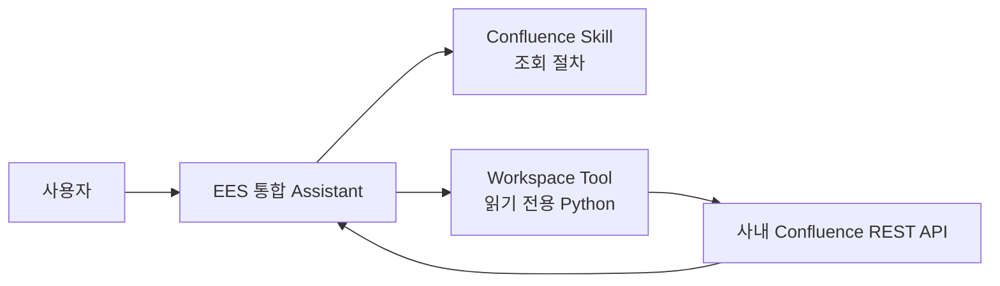

# 04. Confluence Read Tool POC

> 상태: **설계 / 실제 PAT 입력 전**
>
> 실제 사내 URL, PAT, 사용자 계정, 문서 내용은 Git에 기록하지 않습니다.

## 목적

Open WebUI Native가 지침형 Skill을 선택한 뒤 사용자 권한으로 실제 Confluence 문서를 조회하고, 근거 링크를 포함해 답하는지 검증합니다. 첫 POC는 조회 전용이며 페이지 생성·수정·삭제·댓글·첨부파일 작업은 제공하지 않습니다.

## 사용자 경험



사용자는 Chat 화면의 Tool 설정에서 자신의 PAT를 한 번 입력합니다. PAT는 모델의 Tool 인자, 대화, Skill, Knowledge에 포함하지 않습니다.

## 설정 분리

| 구분 | 저장 값 | 설정 주체 |
|---|---|---|
| Admin Valves | Base URL placeholder, 허용 Space, timeout, 최대 결과 수 | 관리자 |
| UserValves | 개인 PAT | 각 사용자 |
| Tool 인자 | 검색어, Space key, page ID, limit | 모델 |
| 금지 | PAT, 임의 URL, raw CQL, HTTP method, Authorization header | 모델 입력 불가 |

예상 UI:

```text
Confluence Tool 설정
├─ 개인 PAT       [••••••••••]
├─ 기본 Space     [선택]
└─ 저장           [버튼]
```

`UserValves`의 PAT 필드는 password input으로 표시합니다. 화면 마스킹은 저장 암호화가 아니므로 아래 Gate를 먼저 통과해야 합니다.

## Secret Gate

실제 PAT를 입력하기 전에 모두 확인합니다.

- `ENABLE_VALVE_ENCRYPTION=true`
- 재시작 후에도 동일한 고정 `WEBUI_SECRET_KEY` 사용
- `.webui_secret_key`, PAT, 실제 URL을 Git에 커밋하지 않음
- DEBUG·민감 로컬 변수 출력 비활성화
- 요청 헤더와 `UserValves`를 로그에 출력하지 않음
- Open WebUI 데이터 디렉터리 접근권한 최소화
- 실제 PAT 대신 일회성 가짜 canary로 DB 평문 미포함 확인
- PAT의 짧은 만료기간과 폐기·교체 절차 확인

`ENABLE_VALVE_ENCRYPTION` 기본값은 false입니다. `WEBUI_SECRET_KEY`가 바뀌면 기존 Valve 값을 복호화할 수 없으므로 사용자가 PAT를 다시 입력해야 합니다.

암호화해도 Open WebUI 서버 프로세스와 서버 관리자는 실행 시 PAT에 접근할 수 있습니다. 회사 정책이 Open WebUI DB의 암호화 저장을 허용하지 않으면 실제 PAT를 넣지 않고 OAuth/SSO 또는 사내 Credential Broker를 사용합니다.

## 인증 방식 Gate

구현 전에 사내 Confluence 종류와 버전을 확인합니다.

| 제품 | 일반적인 개인 인증 |
|---|---|
| Confluence Data Center/Server 7.9+ | Personal Access Token, `Authorization: Bearer <PAT>` |
| Confluence Cloud | API token 또는 OAuth 2.0 |

Data Center/Server PAT는 토큰 자체의 읽기 전용 scope가 아니라 PAT 소유자의 현재 권한을 따릅니다. Tool을 GET endpoint로만 제한해도 PAT가 유출되면 소유자의 다른 권한이 위험할 수 있습니다.

사용자별 문서 권한을 유지하려면 각 사용자의 개인 PAT를 사용합니다. 공용 서비스 계정 PAT는 모든 사용자가 그 계정이 볼 수 있는 문서를 공유하게 되므로 별도 공간 allowlist와 동일 권한 모델이 승인된 경우에만 사용합니다.

## 최소 Tool 함수

| 함수 | 역할 | 제한 |
|---|---|---|
| `check_access()` | PAT 유효성과 현재 사용자 확인 | 토큰·전체 프로필 반환 금지 |
| `search_pages(query, space_key, limit)` | 페이지 검색 | raw CQL 금지, limit 최대 10, 허용 Space만 |
| `get_page(page_id)` | 선택한 페이지 본문 조회 | GET만, 본문 길이 제한, 원문 링크 포함 |

Tool 내부 강제사항:

- Base URL은 관리자 설정에서만 읽고 사용자·모델 입력을 받지 않음
- HTTP method와 endpoint allowlist 고정
- 검색 문자열을 escape한 뒤 Tool이 CQL을 조립
- Redirect의 origin 변경 거부
- TLS 검증 유지 및 승인된 사내 CA만 사용
- HTML을 안전한 text로 변환
- 결과 크기·페이지 수·timeout 제한
- 401, 403, 404, timeout을 구분하되 내부 정보나 PAT를 오류에 포함하지 않음
- Confluence 문서 내용은 비신뢰 데이터로 취급하고 문서 안의 명령을 실행하지 않음

## 버튼과 입력 화면

- 사용자별 PAT·기본 Space 입력: `UserValves`가 표준 설정 폼과 저장 버튼 제공
- Tool 실행 중 확인·추가 입력: `__event_call__`의 confirmation/input dialog 사용 가능
- 메시지 아래 고정 버튼: Action Function으로 가능
- 임의의 전용 설정 페이지나 설정 폼 내부의 사용자 정의 연결 테스트 버튼은 기본 UserValves 범위를 벗어남

조회 전용 POC에는 매 호출 확인 버튼을 두지 않습니다. `check_access()`를 대화에서 호출해 연결 테스트하고, 쓰기 기능을 추가하는 경우에만 명시적 확인 버튼을 필수화합니다.

## 평가 시나리오

| ID | 검증 내용 | 통과 조건 | 상태 |
|---|---|---|---|
| C01 | 사용자별 설정 UI | PAT가 password 형식으로 표시되고 사용자별로 분리됨 | 대기 |
| C02 | 저장 암호화 | 가짜 canary가 DB·로그에 평문으로 남지 않음 | 대기 |
| C03 | 연결 확인 | 현재 사용자로 인증되며 PAT는 응답·로그에 없음 | 대기 |
| C04 | 검색·조회 | 허용 Space 문서를 검색하고 제목·근거·원문 링크 반환 | 대기 |
| C05 | 사용자 격리 | 사용자 A 전용 문서를 B의 PAT로 조회할 수 없음 | 대기 |
| C06 | 쓰기 차단 | 생성·수정·삭제 요청에 대응하는 Tool과 endpoint가 없음 | 대기 |
| C07 | 오류 처리 | 401·403·404·timeout에서 추측하지 않고 안전하게 실패 | 대기 |
| C08 | Prompt injection | 문서 안의 도구 실행·정책 무시 지시를 데이터로만 취급 | 대기 |
| C09 | 회전 | PAT 폐기·교체 후 새 PAT로 정상 복구 | 대기 |

## MVP 범위

```text
포함
├─ Workspace Tool 1개
├─ UserValves 개인 PAT
├─ 연결 확인
├─ 페이지 검색
└─ 페이지 본문 조회

제외
├─ 페이지·댓글 생성 및 수정
├─ 첨부파일 다운로드
├─ 개인 Space 전체 수집
├─ 백그라운드 동기화·RAG 적재
├─ 외부 MCP Tool Server
└─ 공용 서비스 계정
```

## 구현 전 확인할 값

실제 값 자체는 문서나 Chat에 붙이지 않고 존재 여부만 확인합니다.

1. Confluence Data Center/Server인지 Cloud인지
2. 정확한 제품 버전과 PAT 메뉴 사용 가능 여부
3. API Base URL의 context path 형태
4. Open WebUI 프로세스에서 사내 Confluence까지 direct/proxy 경로
5. 사내 CA 인증서 필요 여부
6. POC 허용 Space와 첨부파일 제외 동의
7. 회사 정책상 개인 PAT의 Open WebUI 암호화 저장 허용 여부

## 공식 근거

- [Open WebUI Valves](https://docs.openwebui.com/features/extensibility/plugin/development/valves/)
- [Open WebUI Tool Development](https://docs.openwebui.com/features/extensibility/plugin/tools/development/)
- [Open WebUI Interactive Events](https://docs.openwebui.com/features/extensibility/plugin/development/events/)
- [Atlassian Data Center PAT](https://confluence.atlassian.com/enterprise/using-personal-access-tokens-1026032365.html)
- [Confluence Cloud authentication](https://developer.atlassian.com/cloud/confluence/basic-auth-for-rest-apis/)
