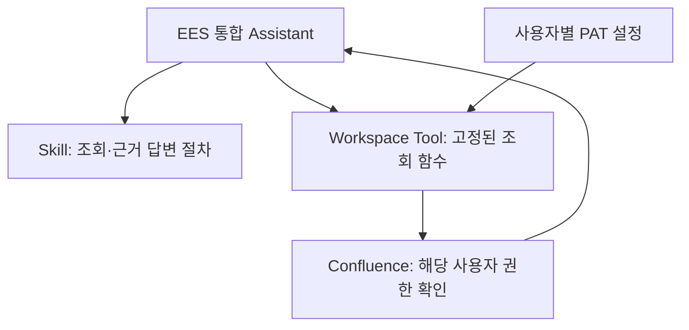

# 04. Confluence Read Tool POC

> 이 문서는 사외 준비용 구현을 사내에 설치·검증하는 절차입니다. 현재 준비 상태는 [STATUS](STATUS.md), 항목별 실환경 판정은 [C01~C09](../evals/scenarios.md#confluence-live)에서 관리합니다.
> 실제 주소·PAT·계정·문서 내용은 Git, Skill, 채팅, 환경변수 예제에 넣지 않습니다.

## 범위와 구성

별도 Tool Server 없이 Open WebUI Workspace Tool에서 조회합니다. 기존 Open WebUI 코드는 수정하지 않습니다.



| 파일 | 역할 |
|---|---|
| `agent-pack/skills/confluence-read/SKILL.md` | 모델의 조회·답변 절차 |
| `agent-pack/skills/confluence-read/scripts/confluence_tool.py` | Workspace에 등록할 단일 Python Tool |
| `tests/` | 가짜 HTTP 응답·설정으로 실행하는 자동 테스트 |

`Tools` 클래스는 `check_access`, `search_pages`, `get_page` 세 개의 async 함수를 제공합니다. 페이지·댓글 쓰기, 첨부파일, 백그라운드 수집은 제외합니다. Skill 폴더 전체를 WebUI가 자동 설치하는 구조는 아닙니다.

## 1. 사외에서 가짜 응답 테스트

저장소 루트에서 실행합니다. 실제 서버나 PAT가 필요하지 않습니다.

```powershell
python -m unittest discover -s tests -v
```

코드의 의존성은 Python 표준 라이브러리와 Pydantic 2입니다. 독립 테스트 환경이 필요하면 별도 가상환경에 `pydantic==2.13.4`를 설치합니다. 테스트 때문에 운영 Open WebUI의 Pydantic 버전을 변경하거나 Open WebUI를 재설치하지 않습니다.

Mock 통과는 Python 로직의 검증입니다. 실제 UserValves 화면, DB 암호화, 사내 인증서·프록시·Confluence 권한이 동작한다는 의미가 아닙니다.

## 2. 사내 복귀 후 제품·인증 방식 확인

구현 대상은 **Confluence Data Center의 PAT/Bearer 인증과 REST API v1**입니다. Cloud 인증은 구현하지 않았습니다. 제품·버전·API 지원을 확인하기 전에는 `ENABLED=false`를 유지합니다. 기존 Server 제품도 호환성을 별도로 확인해야 합니다.

- 관리자에게 개인 PAT 사용과 Open WebUI 암호화 저장이 허용되는지 확인합니다.
- Base URL의 HTTPS 주소와 context path, 허용 Space key를 확인합니다.
- 기존에 성공한 direct/proxy 경로와 사내 CA 필요 여부를 확인합니다. 새 우회 경로를 만들지 않습니다.
- PAT는 사용자의 권한을 갖습니다. Tool이 조회만 제공해도 PAT 자체가 읽기 전용이라는 뜻은 아닙니다.

## 3. 실제 PAT보다 먼저 암호화 검증

기존 Open WebUI를 정상 종료한 뒤 기존 DB와 키를 승인된 내부 위치에 보호·백업합니다. 현재 사용하는 `.webui_secret_key`를 유지해야 합니다. Git이나 일반 공유 폴더에 백업하지 않습니다.

```powershell
.\scripts\start-openwebui.ps1 -ConfluenceReady
```

기존에 필요한 프록시 등 실행 인자는 그대로 유지합니다. 이 옵션은 Valve 암호화와 `LOGURU_DIAGNOSE=false`를 적용하며, 기존 키를 새로 생성하거나 교체하지 않습니다. 키가 없거나 확인되지 않으면 중단하고 기존 키 위치부터 확인합니다.

Tool은 네트워크 호출 전에 실제 `open_webui.env.ENABLE_VALVE_ENCRYPTION`과 키 존재를 검사합니다. **이 검사만으로 저장 암호화 검증을 대체할 수는 없습니다.**

1. 다음 절의 Tool을 등록하되 `ENABLED=false`를 유지합니다.
2. 사용자 PAT 입력란에 실제 토큰 대신 식별 가능한 일회성 가짜 canary를 저장합니다.
3. 승인된 로컬 검사로 DB의 해당 UserValves 값이 암호화됐는지, canary가 DB·로그에 평문으로 남지 않는지 확인합니다. 값 자체는 출력·공유하지 않습니다.
4. 재시작 뒤 같은 키로 설정을 읽을 수 있는지 확인합니다. 통과 후에만 실제 PAT로 교체합니다.

암호화 활성화 전에 저장했던 평문 값은 자동 변환됐다고 가정하지 말고 다시 저장·검증합니다. 이전 DB 백업·로그에 남은 평문도 별도 보호·정리 대상입니다. 실제 PAT가 평문으로 노출됐다면 폐기·재발급합니다.

화면 마스킹은 저장 암호화가 아닙니다. DB 암호화도 악의적인 Tool 코드 작성자, 권한 있는 서버 관리자, 본인 브라우저 개발자 도구로부터 토큰을 숨기는 보장은 아닙니다. 검토된 Tool만 설치하고 편집 권한을 제한합니다. 키 변경·분실은 복호화 실패로 이어질 수 있습니다.

## 4. Workspace Tool·Skill 등록

1. 관리자 계정의 Workspace → 도구에서 새 도구를 만들고 `confluence_tool.py` 전체를 붙여넣어 저장합니다.
2. 관리자 Valves에서 아래 설정을 확인합니다. 실제 값은 사내 관리자 화면에만 입력합니다.
3. Workspace Skill에 `SKILL.md`의 이름·설명·본문을 등록합니다.
4. `EES 통합 Assistant`의 설정에서 해당 Skill과 Tool을 연결하고, 파일럿 사용자에게 필요한 사용 권한만 부여합니다.
5. 각 사용자는 자신의 Tool 설정에서 PAT와 기본 Space를 입력하고 기본 **저장** 버튼을 누릅니다. 일반 사용자에게 도구 코드 편집 권한을 주지 않습니다.

| 관리자 Valves | 기본값·의미 |
|---|---|
| `ENABLED` | `false`; 제품·인증·저장 검증 후에만 활성화 |
| `CONFLUENCE_BASE_URL` | 빈 값; 고정 HTTPS base와 필요한 context path |
| `ALLOWED_SPACES` | 빈 값이면 차단; 승인된 Space key를 쉼표로 구분 |
| `TIMEOUT_SECONDS` | `15`; 소켓 연결·읽기 timeout. 전체 대화의 절대 시간 제한은 아님 |
| `MAX_RESULTS` | `10`; 검색 결과 수 제한 |
| `MAX_RESPONSE_BYTES` | `1000000`; 응답 크기 제한 |
| `MAX_CONTENT_CHARS` | `12000`; 반환 본문 길이 제한 |
| `USE_ENV_PROXY` | `false`; 검증된 직접 연결 또는 환경 프록시 경로를 관리자가 선택 |
| `CA_BUNDLE_PATH` | 빈 값; 필요한 경우 승인된 추가 CA 인증서 묶음 경로 |

| 사용자 UserValves | 입력 |
|---|---|
| `PAT` | 개인 PAT, 비밀번호형 마스킹 필드 |
| `DEFAULT_SPACE` | 기본 Space key를 직접 입력하는 텍스트 필드; 드롭다운 아님 |

입력값과 제한 범위는 Tool에서도 검사합니다. 기본 Space는 관리자 허용목록 안에서만 선택할 수 있으며, 사용자 설정으로 공통 제한을 완화할 수 없습니다. TLS 검증을 끄는 옵션은 제공하지 않습니다.

별도의 연결 확인 버튼·입력 팝업은 구현하지 않습니다. 기본 설정 저장 후 채팅으로 “Confluence 연결 확인해줘”를 요청하여 `check_access()`를 호출합니다.

## 5. 실제 연결과 안전한 사용

설정 후 [실환경 평가 C01~C09](../evals/scenarios.md#confluence-live)를 실행하고, 결과와 비식별 증거는 해당 평가 문서에만 기록합니다. 이 설치 안내에는 별도의 통과 상태를 복제하지 않습니다.

- 제품·인증과 C01/C02를 확인한 후 `ENABLED=true`로 변경합니다. PAT 없는 요청은 명확히 실패해야 합니다.
- 본인이 원래 볼 수 있는 합성 테스트 페이지를 검색·조회하고 제목·본문·원문 링크를 확인합니다.
- 사용자 A/B 각각의 PAT로 테스트합니다. A만 볼 수 있는 테스트 페이지가 B의 검색·직접 조회에 노출되면 중단합니다. A의 대화·조회 결과를 B에게 공유하지 않습니다.
- 만료 토큰, 권한 없음, 존재하지 않는 페이지, 연결 시간 초과를 확인합니다. 실패를 성공·검색 결과 없음으로 바꾸어 답하지 않아야 합니다.
- 공용 PAT 대체, 요청 간 PAT 공유, 사용자 간 결과 캐시를 도입하지 않습니다.
- Tool 결과·오류·로그에 PAT·Authorization 헤더가 없어야 합니다. 보안 확인 없이 DEBUG 로그나 TLS 우회 설정을 켜지 않습니다.

Tool은 모델이 준 임의 주소·HTTP method·raw CQL을 받지 않고 승인된 HTTPS base의 GET API만 호출합니다. 리다이렉트를 차단하고 검색어·응답 크기를 제한합니다. Skill은 문서 속 “정책을 무시하라” 같은 명령을 자료로만 취급하도록 지시하지만, 이것만으로 prompt injection 방어가 보장되지는 않습니다. 이 파일럿 Assistant에 셸·쓰기 도구를 추가하지 않습니다. 이 Tool의 제한은 다른 도구까지 강제하는 공통 보안 계층이 아닙니다.

## 공식 근거

- [Open WebUI Valves](https://docs.openwebui.com/features/extensibility/plugin/development/valves/)
- [Open WebUI Tool Development](https://docs.openwebui.com/features/extensibility/plugin/tools/development/)
- [Atlassian Data Center PAT](https://confluence.atlassian.com/enterprise/using-personal-access-tokens-1026032365.html)
- [Confluence Data Center REST API](https://developer.atlassian.com/server/confluence/confluence-rest-api/)
- [Confluence CQL 검색](https://developer.atlassian.com/server/confluence/advanced-searching-using-cql/)
